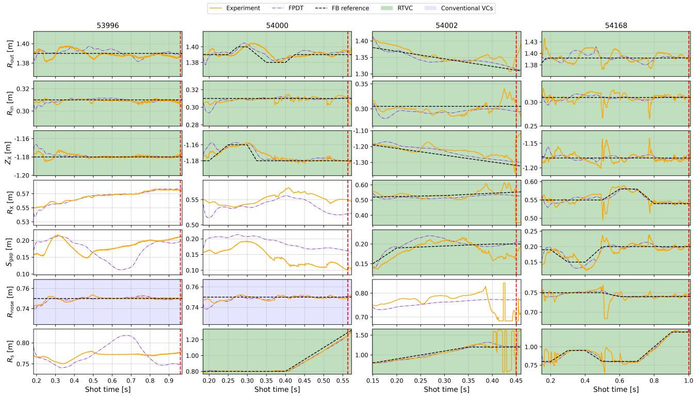
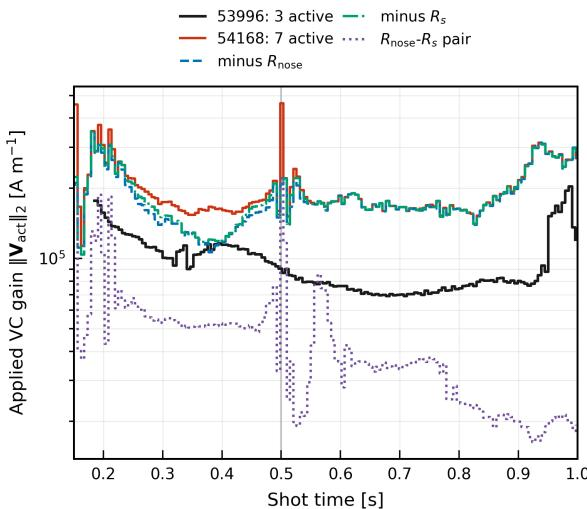

# Real-time virtual circuits for plasma shape control via neural network emulators: experimental demonstration on MAST Upgrade 笔记

## 0. 论文信息

- 作者：N. C. Amorisco；K. Pentland；A. Agnello；G. K. Holt；A. Ross；M. J. Marshall；E. Jones；G. McArdle；C. Vincent；T. Nunn；M. Kochan；P. Cavestany；A. Garrod；S. Pamela；J. Buchanan；MAST Upgrade Team
- 期刊/平台：arXiv preprint
- DOI：[10.48550/arXiv.2608.28468](https://doi.org/10.48550/arXiv.2608.28468)
- arXiv 提交：2026-08-28；稿件日期：2026-08-31
- 来源链接：[arXiv 摘要页](https://arxiv.org/abs/2608.28468)
- 本地 PDF：`daily/2026-09-01/pdfs/Amorisco et al. - 2026 - Real-time virtual circuits experimental demonstration on MAST-U.pdf`
- 正文处理：官方 arXiv PDF 经 MinerU 转为 Markdown，并以 `pdftotext -layout` 做独立复核。

## 1. 摘要与文章定位

本文报告 neural-network emulator 生成的 real-time virtual circuits（RTVC）首次在 MAST Upgrade（MAST-U）上主动闭环控制等离子体形状。它是 `10.48550/arXiv.2608.26216` 的实验续篇：前文完成服务器、PCS 集成、playback 和非驱动 piggyback；本文让 RTVC 实际生成 PF 线圈请求，覆盖常规形状、主动扰动、divertor-leg 扫描、强演化形状以及七参数压力测试。

同一组 emulator 未针对各炮次重新训练，既有 10 kHz 形状控制器、machine-safety limits 和 VC 解释框架保持不变。结果证明“可部署并能完成多种形状任务”，但文章没有做足够机器时间下的传统 VC 对照，因此不证明 RTVC 全面优于传统控制。

## 2. 从静态 VC 到实时局部线性化

在当前等离子体状态附近，形状参数向量 $\mathbf P$ 对主动 PF 线圈电流 $\mathbf I_{\rm act}$ 的局部响应写为

$$
S=\frac{\partial\mathbf P}{\partial\mathbf I_{\rm act}},
\qquad
\Delta\mathbf I_{\rm act}=S^+\Delta\mathbf P.
$$

**变量说明：** $S$ 是 shape-response Jacobian；$S^+$ 是 Moore–Penrose pseudoinverse；$\Delta\mathbf P$ 是形状误差/请求；$\Delta\mathbf I_{\rm act}$ 是对应线圈电流修正。

**推导与直觉：** 对局部响应作一阶展开 $\Delta\mathbf P\simeq S\Delta\mathbf I$；受控形状量与线圈通道往往不等维且相互耦合，因此用伪逆求最小二乘电流组合。传统方法在少数参考平衡处离线生成 $S^+$ 并按 pulse phase 切换；RTVC 用 NN 根据实时电流和规定的电流剖面参数预测形状，再通过有限差分获得当前 $S$。

模型输入包括 12 个主动 PF 线圈电流、总等离子体电流和少量电流密度剖面参数；输出 7 个控制量：$R_{\rm in}$、$R_{\rm out}$、$R_X$、$Z_X$、$S_{\rm gap}$、$R_s$ 和 $R_{\rm nose}$。本轮实验仍使用代表性历史炮次给出的规定剖面参数，也没有把 passive-structure induced currents 放入 emulator 状态。

## 3. PCS 部署与控制频率

RTVC server 接收实时状态并返回局部 Jacobian；PCS 侧求伪逆并替换选定 VC 条目，下游控制增益与保护逻辑保持不变。MAST-U 形状控制器以 `10 kHz` 运行，RTVC 每 `5–5.6 ms` 更新一次矩阵。自动微分尚未接入实时推理引擎，本文使用有限差分 Jacobian。

这一设计的关键是“学习局部正向响应、保留显式误差反馈”，不同于直接由目标形状预测线圈电流的 inverse GS neural controller。

## 4. 四组主动控制实验

**图 3.1 解读：** 橙色是 LEMUR 实时重建，黑虚线是参考，紫色点划线是预先 FPDT 模拟；绿色区间才是 RTVC 主动反馈。该图同时显示成功跟踪与偏离事件，不能只摘取贴近参考的部分。

### 4.1 Shot 53996：常规形状兼容性

基于 `750 kA`、双零、常规 divertor、双中性束的参考炮次。RTVC 在 `185 ms` 后控制 $R_{\rm out}$、$R_{\rm in}$、$Z_X$，而 $R_{\rm nose}$ 保留传统 VC；炮次达到计划时长，说明实时与传统 VC 可以混用。

### 4.2 Shot 54000：形状扰动与 divertor-leg 外扫

RTVC 跟踪 $R_{\rm out}$、$Z_X$ 的梯形扰动，并把 $R_s$ 参考从约 `0.8 m` 扫到 `1.4 m`。炮次在 `563 ms` 因 Langmuir probe protection trip 终止；作者未将终止归因于 RTVC，而认为与同一实验时段 Super-X 尝试中可能存在的 LEMUR $R_s$ 偏差一致。

### 4.3 Shot 54002：高伸长率与 near-Super-X 演化

RTVC 从 `150 ms` 起控制六个形状参数，完成高伸长率和 $R_s\le1.2\,\mathrm m$ 的 leg sweep。约 `380 ms` 与 nose 相互作用后失去形状控制，预先 FPDT 没有重现该事件；离线 EFIT++ 仍确认此前请求的三角度、伸长率和 leg 位置变化已经实现。

### 4.4 Shot 54168：七参数同时控制压力测试

七个形状量全部进入伪逆并主动反馈，炮次达到 `1 s` 计划 ramp-down，但 `0.50 s` 和 `0.77 s` 附近出现明显偏离，跟踪不如前三组平滑。这是强耦合参数下的探索性 stress test，不是正常 MAST-U 操作推荐模式。

## 5. 伪逆病态与当前限制

Shot 53996 中约 $(1–2)\times10^5\,\mathrm{A\,m^{-1}}$ 的 VC norm 与稳定控制相容；54168 的驱动显著更大，尤其 `0.50 s` 附近 $R_{\rm nose}$ 与 $R_s$ 两列接近共线，伪逆把小形状修正放大成较大线圈电流请求。作者只说这一放大“可能有贡献”，没有建立它与偏离事件的严格因果关系。

后续可在不重训 emulator 的情况下，将普通伪逆替换为 damped/Tikhonov-regularised inversion，并根据 $S$ 的条件数动态调阻尼。更长期还需加入 passive currents、实时剖面估计并扩展操作域验证。

## 6. 已验证内容与未验证内容

### 6.1 本文直接支持

- 同一 NN emulator/RTVC 实现可在四类 MAST-U 炮次上主动驱动形状控制，不需场景专用重训。
- 传统控制器、VC 可解释结构和保护层能够保留。
- 常规形状、规定扰动、divertor-leg motion 和强演化形状在相应时间窗内被实际执行。

### 6.2 不应外推

- 没有系统传统 VC 对照，不能声称 RTVC 已证明更高精度、更高可用率或更安全。
- 54000 的保护跳闸、54002 的 nose interaction 和 54168 的病态伪逆都是当前边界，而不是可忽略异常。
- 这是磁约束聚变形状控制实验，不是激光等离子体、PIC、加速束流或转换靶辐射结果。

## 7. 与本仓库方向的关系

- 主题关键词：machine learning；tokamak；MAST-U；real-time control；virtual circuits；neural-network emulator；plasma shape control。
- 相关性评分：4/5。
- 直接价值：提供从 surrogate、Jacobian、伪逆、实时服务器到真实执行器和机器保护的完整实验链；与昨日集成论文一起构成“上机前验证→主动炮次”的闭环证据。
- 证据边界：只在本文列出的 MAST-U 炮次和状态域内成立，不能升级为聚变堆级自主控制或跨装置泛化。

## 8. 复习用速记

这篇论文的增量不是新的 NN 架构，而是让 emulator-derived VC 真正驱动 MAST-U。四组炮次证明实时局部线性化可嵌入现有 PCS；七参数 stress test 同时暴露伪逆病态、状态缺失和操作域限制。
