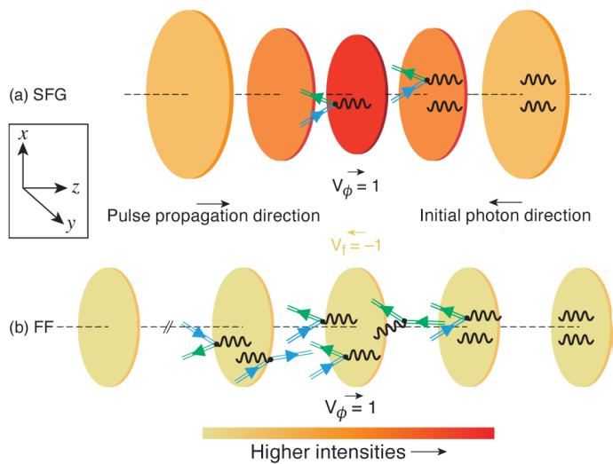
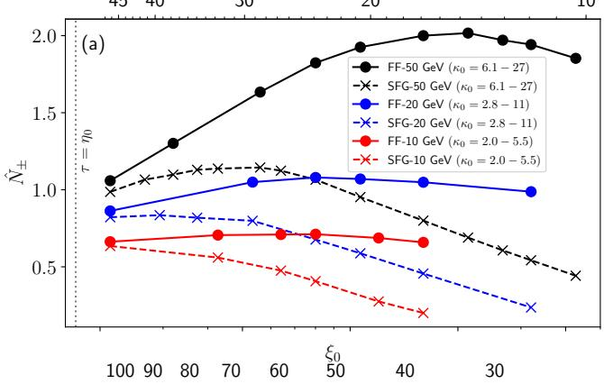
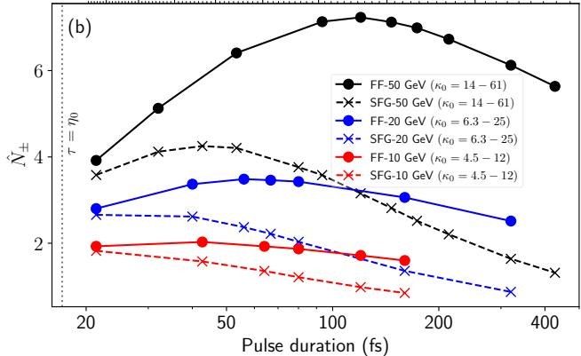

# Enhancement of nonlinear pair production in a flying-focus pulse 笔记

## 0. 论文信息

- 作者：Md Reshad Ur Rahman；Martin S. Formanek；Elias Gerstmayr；Dillon Ramsey；John P. Palastro；Antonino Di Piazza
- 期刊/平台：arXiv preprint v2
- DOI：[10.48550/arXiv.2608.26313](https://doi.org/10.48550/arXiv.2608.26313)
- 原始提交：2026-08-26；v2 修订：2026-08-28
- 来源链接：[arXiv 摘要页](https://arxiv.org/abs/2608.26313)
- 本地 PDF：`daily/2026-09-01/pdfs/Rahman et al. - 2026 - Enhancement of nonlinear pair production in a flying-focus pulse.pdf`
- 正文处理：官方 arXiv PDF 经 MinerU 转为 Markdown，并以 `pdftotext -layout` 做独立可提取性复核。

## 1. 摘要与文章定位

论文比较等能量 flying-focus（FF）脉冲与 stationary-focus Gaussian（SFG）脉冲驱动非线性 Breit–Wheeler pair production（NBWPP）的效率。核心想法不是继续抬高峰值强度，而是令 FF 焦点与迎面而来的高能光子同向、近光速移动，使光子及后续级联粒子在高场区停留更久。

Ptarmigan Monte Carlo/LCFA 数值结果表明：对 `1 J`、紧聚焦 FF 脉冲，10、20 和 50 GeV 单能光子对应的最大对产额相对等能量 SFG 分别提高 `12%`、`29%` 和 `76%`；`5 J` 情形分别提高 `11%`、`31%` 和 `70%`。这是理想化光子束与模型场中的数值比较，不是已经完成的对产生实验。

## 2. 物理机制：为什么长相互作用时间能补偿较低峰值场

### 2.1 强场参数与 LCFA

激光经典非线性参数和光子量子非线性参数分别为

$$
\xi_0=\frac{|e|E_0}{m\omega_0},
\qquad
\kappa=\frac{|e|\sqrt{-(F^{\mu\nu}k_\nu)^2}}{m^3}.
$$

**变量说明：** $E_0$、$\omega_0$ 是激光场幅与中心角频率；$F^{\mu\nu}$ 是场张量；$k^\nu$ 是入射光子四动量。$\xi_0\gg1$ 表示多光子、强场相互作用，$\kappa$ 衡量光子在背景场中对量子过程的敏感度。

在 $\xi_0\gg1$ 且 $\xi_0^3\gg\kappa_0$ 时，作者采用 locally constant field approximation（LCFA）。论文使用的 NBWPP 率近似为

$$
\frac{dP}{dt}\approx
\left(\frac{3}{8}\right)^{3/2}\frac{\alpha}{2}\frac{m^2}{\omega}
\kappa e^{-8/(3\kappa)}
\left[(1+C_1\kappa)^{-1/3}+(1+C_2\kappa)^{-1/3}\right],
$$

其中 $C_1=0.094$、$C_2=0.94$。$\kappa\ll1$ 时指数因子强烈压低产额；$\kappa\gg1$ 时标度转为近似 $\kappa^{2/3}$，此时增加相互作用时间比单纯增加场强更划算。

### 2.2 等能量条件下的时间标度

对焦点与光子共移的 FF 脉冲，积分大 $\kappa$ 渐近率得到

$$
P\approx0.39\frac{\tau[\mathrm{fs}]}{\omega[\mathrm{GeV}]}\kappa_0^{2/3}
=0.63\left(
\frac{U[\mathrm{J}]}{\omega[\mathrm{GeV}]}
\frac{\tau^2[\mathrm{fs}]}{\sigma_0^2[\mu\mathrm{m}]}
\right)^{1/3}.
$$

**推导要点：** 固定激光能量 $U$ 和腰斑 $\sigma_0$ 时，延长脉冲会降低峰值强度，但 FF 能在远长于 Rayleigh 长度的距离上维持近似恒定的场幅；因此 $P\propto\tau I_0^{1/3}$。SFG 光子离开焦区后 $\kappa$ 按衍射快速下降，不能获得同样的时间积分。

**图 1 解读：** SFG 焦点固定，FF 的相位仍向 $+z$ 传播，但焦点以 $v_f\simeq-c$ 沿入射光子方向移动。图中的长 FF 包络强调其脉冲长度可远大于 SFG 的 Rayleigh 长度，而不代表两者峰值强度相同。

## 3. 数值设置

- 代码：Ptarmigan；加入 FF 电磁场模块，以 LCFA Monte Carlo 处理 nonlinear Compton scattering（NCS）和 NBWPP。
- 入射束：每组 `10,000` 个单能光子，能量为 10、20 或 50 GeV；无空间和动量展宽，FF 情形与移动焦点中心共址。
- 激光：`0.8 μm` 中心波长；1 J 与 5 J；主扫描取 $\sigma_0=1.01\lambda_0$，FF/SFG 对应 Rayleigh 时间约 `17 fs`/`8.6 fs`。
- 场模型：SFG 包含至四阶旁轴修正；FF 使用单色极限下任意腰斑的解析场，再乘有限包络。
- 比较量：每个初级光子产生的电子—正电子对数 $\hat N_\pm$，并分解不同 NCS→NBWPP 代际。

这些设置刻意使用理想单能、零发散、精确对准的光子束；束流尺寸、能散、指向抖动、有限同步误差和探测背景尚未进入端到端实验模型。

## 4. 主要结果

**图 2 解读：** FF 的最优脉长明显超过自身 Rayleigh 时间，因此在较低峰值强度下仍积累更多对产生概率。激光能量升至 5 J 后，初级光子更早衰变，最优脉长向短脉冲移动，FF 与 SFG 的几何差异随之缩小。

对于 1 J、50 GeV 最优点，FF 产生的第一、第二、第三代对约占 `48%`、`49%`、`2.3%`；SFG 对应 `66%`、`33%`、`1.2%`。FF 的优势来自初级光子、第一代电子/正电子所发 NCS 光子都能更长时间跟随移动焦点，因而逐代累积，而不是某一代出现新的相干机制。

把腰斑放宽到 $1.5\lambda_0$ 后，1 J 条件下 10、20、50 GeV 的 FF 优势降为 `3%`、`16%`、`34%`，说明紧聚焦和“最优脉长远大于 Rayleigh 长度”是结果成立的重要条件。

## 5. 验证、限制与实验可行性

- 初级光子衰变概率与直接积分近似率在百分比量级一致；解析大 $\kappa$ 估计在 $\kappa_0$ 降到约 6 时会高估率约 `25%–100%`，只能用于标度判断。
- 1 J、50 GeV 最优点所需 FF 峰值强度约 `10^20 W/cm²`；论文指出这仍高于当时已经展示的 FF 强度约一个数量级。
- 需要 20–50 GeV 量级高能光子；可设想由同量级电子束经 inverse Compton scattering 产生，但本文没有模拟这一级的真实谱、角分布和输运损失。
- Ptarmigan 模型包含非相干 NCS/NBWPP 级联；结论不是观测到的强场 QED 产额，也不是完整 LUXE/SLAC/激光尾场束线方案。

## 6. 与本仓库方向的关系

- 主题关键词：strong-field QED；nonlinear Breit–Wheeler；flying focus；Ptarmigan；LCFA；pair cascade；high-energy photon beam。
- 相关性评分：5/5。
- 直接价值：给出“激光总能量—焦斑—脉长—光子能量”之间的清晰标度，并说明延长有效高场路径何时优于提升峰值强度。
- 证据边界：这是解析标度和 Monte Carlo 数值结果；没有实际 FF–γ 碰撞、对探测器计数、背景扣除或系统误差，也不能写成激光尾场电子束已实现 50 GeV γ 束。

## 7. 开放问题与个人理解

- 需要把真实 ICS/LWFA 光子谱、束斑、发散和时间抖动卷入 Ptarmigan，检验理想化 12%–76% 提升是否仍可分辨。
- FF 与高能光子束的横向重叠容差可能比脉长标度更先成为实验瓶颈，应扫描偏心、焦速误差和空间啁啾。
- 若 $\hat N_\pm>1$，探测器需要区分初级对与后续 shower；仅比较总计数可能掩盖模型中代际组成的差异。

## 8. 复习用速记

当 $\kappa\gg1$ 时，NBWPP 对相互作用时间的依赖比对峰值强度更有利。flying focus 让高能光子和少数级联粒子长时间停留在高场区，因此在等能量条件下可比固定焦点产生更多对；当前证据仍是理想束流上的 LCFA/Ptarmigan 模拟。
