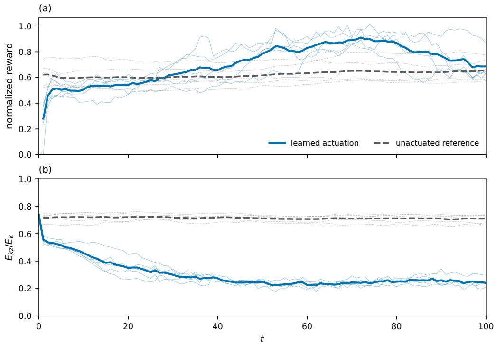

# Reinforcement-learning control of turbulence transition in the modified Hasegawa–Wakatani system 笔记

## 0. 论文信息

- 作者：Luning Sun；Ben Zhu；Xin-Yang Liu；Deepak Akhare；Jian-Xun Wang
- 期刊/平台：arXiv preprint
- DOI：[10.48550/arXiv.2608.27845](https://doi.org/10.48550/arXiv.2608.27845)
- arXiv 提交：2026-08-28；稿件日期：2026-08-31
- 来源链接：[arXiv 摘要页](https://arxiv.org/abs/2608.27845)
- 本地 PDF：`daily/2026-09-01/pdfs/Sun et al. - 2026 - Reinforcement-learning control of turbulence transition in modified Hasegawa-Wakatani system.pdf`
- 正文处理：官方 arXiv PDF 经 MinerU 转为 Markdown，并以 `pdftotext -layout` 做独立复核。

## 1. 摘要与文章定位

本文在改写的二维 modified Hasegawa–Wakatani（MHW）模型中，用强化学习双向控制 drift-wave turbulence 与 zonal flow 的转换：一项任务在固定控制预算下压低湍流输运，另一项任务破坏 zonal flow、恢复径向输运。

作者构建 GPU-native JAX 求解器 jaxHW，并用 SAC/TD3 agent 与四个高斯 actuator 在线交互。压制任务的 learned schedule 在五个未见初态上以相同预算优于常量和线性衰减基线；zonal-break 任务则需要物理引导 replay buffer，才能找到 up-down antisymmetric forcing。

这是简化、二维、周期边界、理想 actuator 下的探索性数值研究；不是托卡马克实机湍流控制，也不是 3D gyrokinetic/edge turbulence 的闭环验证。

## 2. 改写的 MHW 方程

论文使用密度 $n$、涡量 $\varpi=\nabla_\perp^2\phi$ 和静电势 $\phi$：

$$
\frac{\partial\varpi}{\partial t}+[\phi,\varpi]
=\alpha(\tilde\phi-\tilde n)+\alpha\phi_{\rm ext}
-\gamma_{\rm ZF}\bar\varpi-\mu\nabla_\perp^6\varpi,
$$

$$
\frac{\partial n}{\partial t}+[\phi,n]
=\alpha(\tilde\phi-\tilde n)-\kappa\frac{\partial\phi}{\partial y}
+\alpha\phi_{\rm ext}-\kappa\frac{\partial\phi_{\rm ext}}{\partial y}
-\mu\nabla_\perp^6 n.
$$

zonal/non-zonal 分解为

$$
\bar f=\frac{1}{L_y}\int f\,dy,
\qquad
\tilde f=f-\bar f.
$$

**物理含义：** $[f,g]=\hat z\cdot(\nabla f\times\nabla g)$ 表示非线性 $E\times B$ 对流；$\alpha$ 控制绝热电子响应；$\kappa$ 是背景密度梯度；六阶超扩散只负责网格尺度耗散。作者新增 $-\gamma_{\rm ZF}\bar\varpi$，让原模型中近乎吸收态的 zonal flow 具有有限寿命，才可能在有限 episode 中反复做正反转换。

外部势由四个 Laplacian-of-Gaussian actuator 组成：

$$
\phi_{\rm ext}=\sum_{i=1}^4 a_i\,2\left(1-\frac{r_i^2}{p^2}\right)
\exp\left(-\frac{r_i^2}{p^2}\right),
\qquad p=5.
$$

这只是规定的控制源，不是从 electrode/RF 系统响应推导的实验 actuator 模型。

## 3. 数值与 RL 实现

- 网格/区域：`256×256`、`64×64` 双周期域，$\kappa=1$，$\mu_n=\mu_\varpi=2\times10^{-5}$。
- 离散：Arakawa Poisson bracket、谱反演/超扩散、中心差分线性项，支持 leapfrog 与 RK4。
- 观测：$\phi$、剩余预算、zonal kinetic energy 及其累计量、剩余 episode 比例组成五通道场。
- 压制任务：$\alpha=0.1$、$\gamma_{\rm ZF}=0.02$、连续 $a_i\in[0,8]$、$\Delta t_c=0.1$、$T=150$、SAC。
- zonal-break：$\alpha=0.5$、$\gamma_{\rm ZF}=5\times10^{-3}$、离散 $|a_i|=3\ldots9$、仅两个长控制步、TD3。

jaxHW 在 Perlmutter A100 上的单步时间为 leapfrog `0.36 ms`、RK4 `0.62 ms`；GDB CPU 为 `4.16 ms`。论文明确这些是不同积分器/稳定步长下的 per-step 成本，不等于每物理时间吞吐的严格代码性能对比。与 GDB 的波包基准在线性阶段吻合，首次破裂峰值在 jaxHW/GDB 间约 `2%`，饱和态统计在单 realization 波动范围内一致。

## 4. 预算约束与输运奖励

径向粒子通量为

$$
\Gamma_n=-\kappa\left\langle n\frac{\partial\phi}{\partial y}\right\rangle.
$$

湍流压制任务的 reward 包含截断为非正的输运项、随时间加重的 actuator 成本以及超预算惩罚。总预算

$$
B_{\rm total}=\sum_i|a_i|\Delta t_c
$$

固定为约 `2400`，所以比较目标是“同样花费下的时间积分输运”，而不是某一时刻的最低通量。

## 5. 任务一：压制湍流

RL 策略先用强 forcing 尽快触发 turbulence→zonal-flow，再非线性衰减并保留足够后期预算。五个 held-out 初态上的平均 return 为 `−573`，好于线性衰减的 `−641` 和常量基线的 `−731`；三者实际预算在 `1%` 内相同。

独立结构诊断 $E_{kz}/E_k$ 显示：线性基线峰值可达 `0.98`，但末态跌到 `0.41`；RL 末态保持 `0.89`；常量基线保持 `0.96`，却因前期效率低而累计输运更大。RL 的优势是兼顾“早进入”和“后维持”。

不过四个 actuator 最终几乎使用相同的时间曲线，五个初态也得到近乎相同 schedule。作者据此明确指出，这更像稳健的 near-open-loop trajectory，而不是利用瞬时场状态的真正反馈律。

## 6. 任务二：破坏 zonal flow

直接最大化未归一化通量会被 agent 通过无限放大 $\phi$ 钻空子。作者改用尺度不变奖励

$$
r=10\max\left(
-\left\langle n\frac{\partial\phi}{\partial y}\right\rangle_\tau/C_\phi,
0
\right),
\qquad
C_\phi=\langle|\bar\phi|\rangle_x.
$$

物理上，top/bottom actuator 反号会沿 flux surface 建立电势差，产生径向 $E\times B$ 对流；对应的最优模式是 $[-9,-9,+9,+9]$。这一高奖励流形在四维 action space 中极窄，随机探索无法可靠找到，因此 replay buffer 预置 40 个反对称 episode 与 30 个随机 episode。

**图 10 解读：** 归一化 reward 因主动去除了幅值增长，末段与未控制状态差异不大；独立结构量更清楚。控制后 $E_{kz}/E_k$ 从约 `0.74` 降至 `0.24`，而未控制约保持 `0.71`；非归一化通量从未控制的 `−0.22` 变为 `−0.40`，约增强 `1.8×`。末态仍保留大尺度 zonal 分量，因此是“强扰动的 zonal flow”，不是充分发展的湍流。

## 7. 证据边界与可迁移性

- 每个任务只测一个预算、一个 zonal-drag 值和每算法一次训练；鲁棒性来自五个未见初态，不是大规模超参数/随机种子统计。
- zonal drag、周期域、四个直接势源和二维 MHW 都是为可训练问题设定的模型结构。
- physics-informed buffer 对成功至关重要；这说明 RL 没有从零发现全部物理，而是在物理选定的窄流形附近优化幅值。
- 迁移到 tokamak edge/core 需要 3D 几何、真实 biasing/RF actuator、观测噪声、时延、约束和安全层；本文未给出这些验证。

## 8. 与本仓库方向的关系

- 主题关键词：machine learning；reinforcement learning；plasma turbulence；modified Hasegawa–Wakatani；zonal flow；JAX；physics-informed control。
- 相关性评分：4/5。
- 直接价值：展示如何把输运积分、有限预算、reward hacking、结构独立诊断和物理 warm start 放入一个可审计的等离子体 RL 闭环。
- 证据边界：结论只针对本文改写的 MHW 数值环境，不能写成实际聚变装置已经直接控制微观湍流。

## 9. 复习用速记

压制任务学到的是“前强后缓”的近开环预算分配；破坏任务学到的是由 $E\times B$ 几何预示的上下反对称 forcing。真正重要的负结果是：原始 reward 会被幅值放大劫持，随机探索也找不到极窄的物理解，必须用归一化诊断和 physics-informed warm buffer。
