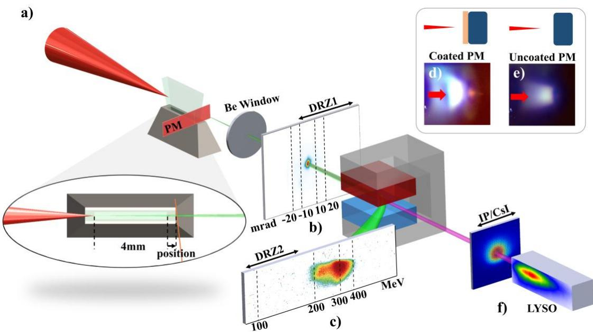
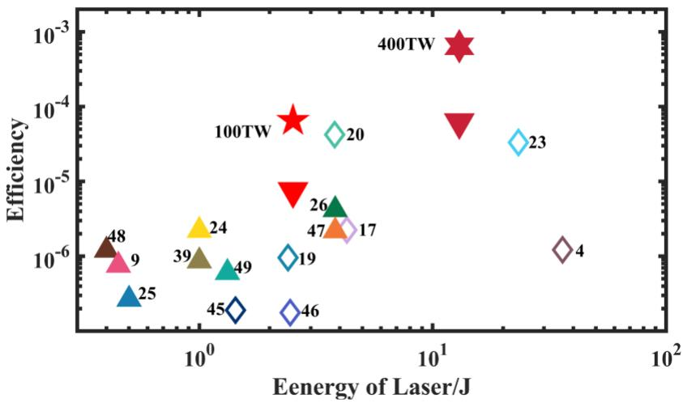

# 涂层等离子体镜自发聚焦增强逆康普顿散射 笔记

## 0. 论文信息

- 英文标题：Enhanced inverse Compton scattering via spontaneous focusing induced by a coated plasma mirror
- 作者：Xichen Hu；Mingyang Zhu；Pengpei Xie；Bingjun Li；Huitong Zhai；Bingzhan Shi；Hui Zeng；Tianbing Wang；Yifei Li；Jinguang Wang；Wenchao Yan；Jie Feng；Yanfei Li；Xin Lu；Liming Chen
- 期刊：Nature Photonics（2026-07-23 在线发表）
- DOI：[10.1038/s41566-026-01958-4](https://doi.org/10.1038/s41566-026-01958-4)
- 版本说明：本地全文为与期刊论文对应的 Research Square v1 作者公开手稿；Nature 期刊 PDF 在当前环境触发 `cookies_not_supported`。
- 本地 PDF：`daily/2026-09-03/pdfs/Hu et al. - 2026 - Enhanced inverse Compton scattering via coated plasma mirror.pdf`
- 正文处理：Research Square PDF 通过文件头、类型、19 页元数据、SHA-256 与非空文本提取校验，并成功完成 MinerU Markdown 转换。

## 1. 摘要与文章定位

论文解决单激光等离子体镜（plasma mirror, PM）逆康普顿散射中“电子束只采样到反射脉冲局部场、激光能量利用率低”的问题。作者在石英 PM 表面加入微米级光学涂层，使激光前沿电离出的临界面自发形成凹面，反射光在电子束附近再聚焦，从而增强强非线性、多光子 inverse Compton scattering（ICS）。

这是实验论文：100 TW 和 400 TW 两组实验都测量了电子束、辐射角分布、光子数与 LYSO calorimeter 响应；EPOCH PIC 与 Geant4/响应反演用于解释自发聚焦机制和重建能谱。实验测得的增强与模拟给出的场强演化必须分开理解。

## 2. 实验构型与诊断

- 100 TW 工况：`800 nm`、`28 fs`、焦斑能量 `2.52 J`，真空峰值 `a0≈2.14`；激光聚焦到 `4 mm` 长、`1% N₂ + 99% He` 气体靶，电子密度约 `4.5–5×10^18 cm⁻³`。
- LWFA 电子束：单发能量约 `200–400 MeV`，平均约 `256 MeV`，电荷 `22–40 pC`，实验 FWHM 发散约 `5.5 mrad`，指向抖动约 `20 mrad`。
- PM：`SiO₂` 基底；涂层样品含约微米级光学层，未涂层样品作为对照。激光离开气体后被 PM 反射并与同一束电子自对准迎头碰撞。
- 电子能谱用 `1.2 T` 偶极磁谱仪和 DRZ-HIGH/IP；辐射轮廓用 IP，能量由像素化 Ce:LYSO 电磁量能器结合 Geant4 响应矩阵反演。
- 作者通过移动 PM、降低激光能量和无 PM 背景测量区分 ICS、betatron 和 bremsstrahlung；但能谱仍是探测器响应与模型联合反演，不是逐光子直接谱仪。

## 3. 归一化场强与角度诊断

### 3.1 归一化矢势

$$
a_i=\frac{eE_i}{m_e\omega_L c}
$$

变量说明：`E_i` 是电子实际经历的局部反射场，`ω_L` 是激光角频率，`e` 和 `m_e` 分别是电子电荷量与质量。

推导思路：电子在一个光学周期内从电场获得的典型横向动量约为 `eE_i/ω_L`，再除以相对论动量尺度 `m_ec`，得到无量纲强度。`a_i` 接近或超过 1 时，电子横向运动进入相对论非线性区，谐波、多光子效应和辐射锥展宽都不可忽略。

### 3.2 从发散角估计 ICS 场强

$$
\theta_{\mathrm{ICS}}=\sqrt{\theta_i^2-\theta_e^2},
\qquad
\theta_{\mathrm{ICS}}\sim\frac{a_i}{\gamma}
$$

这里 `θ_i` 是测得辐射半宽，`θ_e` 是电子束发散，`γ` 是电子 Lorentz 因子。第一式把电子束本身的角展宽从总辐射锥中按方差去卷积；第二式给出非线性 ICS 中振荡角与 `a_i/γ` 的标度。该反演假设两类角展宽近似独立且分布可用宽度参数描述，因此是模型相关的场强估计。

## 4. 100 TW 实验结果与机制

- 未涂层 PM 靠近喷嘴出口时，IP 信号、发散与 LYSO 沉积长度同步增加，符合 ICS 随局部场增强的趋势；远离最佳位置的约 `100 a.u.` 信号被作为 bremsstrahlung 背景基线。
- 典型 `-500 μm` 位置，涂层 PM 得到约 `7.9×10^7` 个光子，未涂层约 `1.3×10^7`，光子数约增大 6 倍。
- 反演临界能量从未涂层的约 `26 MeV` 提高到涂层的约 `39 MeV`，截止能量从约 `100 MeV` 提高到约 `150 MeV`。
- 实验角度反演给出的 `a_i` 范围约由未涂层 `2.3–4.2` 提升到涂层 `2.8–5.5`；PIC 中电子束质心处峰值由约 `2.9` 提升到约 `4.5`。
- PIC 解释是：涂层前沿形成较低密度等离子体，激光中心受更强有质动力和辐射压力而更深穿透，临界面弯成凹面，反射波前随后聚焦。侧视自发光曲率与该图景一致，但“涂层材料—预等离子体—曲率—场增强”的因果链仍部分依赖 PIC。

## 5. 非线性多光子能量关系

$$
E_{\gamma,n}
=n\frac{2\gamma^2(1-\cos\phi)E_L}
{1+a_i^2/2+\gamma^2\theta^2}
$$

变量说明：`n` 是吸收的激光光子阶数，`φ` 是碰撞角，`θ` 是观测角，`E_L` 是单个激光光子能量。

推导思路：线性 Thomson/Compton 的双 Doppler 增频给出分子中的 `2γ²(1−cosφ)E_L`；强场中电子获得有效质量，产生 `a_i²/2` 红移项；离轴观测再引入 `γ²θ²`。高阶过程将基本频率乘以 `n`。作者据此指出，仅用线性散射预期约 `2 MeV`，无法解释几十到百 MeV 的实验谱；涂层/未涂层临界能量分别对应很高阶的有效谐波。

## 6. 400 TW 扩展与能量转换

- 100 TW 下，作者给出的激光到辐射能量转换效率从未涂层约 `7.4×10⁻⁶` 提高到涂层约 `6.5×10⁻⁵`。
- 400 TW、`12 J` 工况中，电子能量约到 `1 GeV`、电荷约 `200 pC`；涂层 PM 的临界/截止能量约 `60/400 MeV`，光子数约 `8×10^9`，未涂层光子数约 `8×10^8`。
- 涂层 PM 在 400 TW 下的转换效率约 `6×10⁻⁴`，接近 `10⁻³` 量级；PIC 给出的峰值相互作用强度约从 9 增至 13。

这些是特定激光、气体靶、PM 位置和诊断链下的实验结果，不构成任意 PW 系统或任意涂层都能达到同一效率的通用标度。

## 7. 与当前研究方向的相关性

- 主题关键词：laser wakefield acceleration；inverse Compton scattering；gamma ray；plasma mirror；EPOCH PIC；Geant4；experiment。
- 相关性评分：5/5。
- 直接价值：同时覆盖 LWFA 电子源、等离子体镜靶工程、高能 γ 诊断和场增强机制，是连接源端物理、数值解释与辐射应用的高相关实验。

## 8. 限制、应用边界与开放问题

- Nature Photonics 正文为正式发表记录；本地可复核全文是对应 Research Square 手稿，不能把手稿排版视为期刊 PDF。
- LYSO 能谱由 Geant4 响应和假设谱形迭代反演；系统误差、响应矩阵与谱形先验会影响临界/截止能量。
- 实验已经证明高能 γ 产额和能量转换增强，但没有测量 nuclear resonance fluorescence、transmutation、材料照相性能、剂量或屏蔽，因此这些仍是应用前景。
- PM 涂层的组成、厚度、预等离子体和 shot-to-shot 损伤容差需要进一步系统扫描；400 TW 结果也需要更完整的重复性统计。

复习速记：涂层 PM 通过自发形成凹形临界面把反射脉冲重新聚焦到 LWFA 电子束上；实验看到光子数和激光到辐射效率近一个数量级提升。100/400 TW 的测量是真实 γ 源结果，自发聚焦的微观因果解释主要由 EPOCH PIC 支撑，NRF/嬗变仍未实测。
