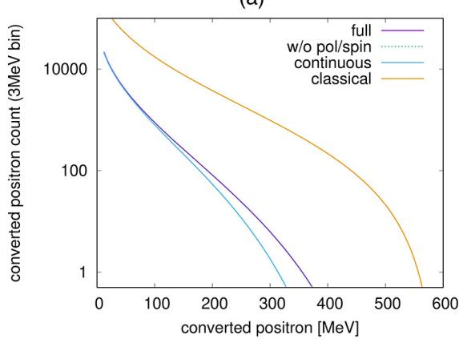
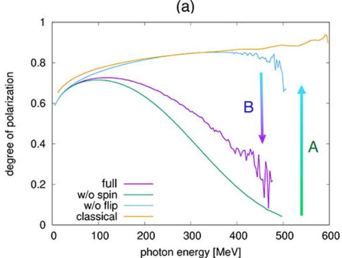
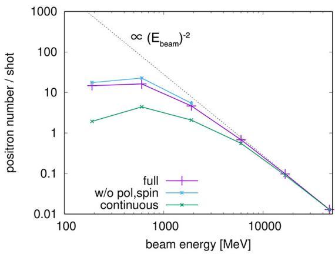

# 强激光—电子束可计数信号中的偏振量子效应 笔记

## 0. 论文信息

- 英文标题：Polarized quantum effects in countable signals from intense laser - electron beam interactions
- 作者：Toseo Moritaka；Kensuke Homma；Kazunori Itakura
- 平台：arXiv preprint
- DOI：[10.48550/arXiv.2609.01494](https://doi.org/10.48550/arXiv.2609.01494)
- 提交日期：2026-09-01；稿件日期：2026-09-02
- 来源：[arXiv 摘要页](https://arxiv.org/abs/2609.01494)
- 本地 PDF：`daily/2026-09-03/pdfs/Moritaka et al. - 2026 - Polarized quantum effects in countable laser-electron signals.pdf`
- 正文处理：官方 arXiv PDF 通过文件头、类型、15 页元数据、SHA-256 与非空文本提取校验，并成功完成 MinerU Markdown 转换。

## 1. 摘要与文章定位

论文开发自旋和光子偏振分辨的 Monte Carlo（MC）模型，目标是预测强激光—电子束碰撞中每束只有几个到几十个计数的高能光子、两步 Breit–Wheeler 正电子与自旋不对称。模型用 SLAC E-144 的光子谱边和正电子产额做历史实验基准，然后外推到拟议的 ELI-NP 工况。

这是数值方法与未来实验可观测量研究，不是新的 ELI-NP 实验结果。SLAC E-144 一致性属于对既有实验的回算验证；`360 MeV` 光子谱边、约 `10` 个正电子和大角度自旋差异都属于预测。

## 2. 两步强场 QED 过程

$$
e^-+N_{LC}\gamma_L\rightarrow e^-+\gamma_h
$$

$$
\gamma_h+N_{LB}\gamma_L\rightarrow e^-+e^+
$$

第一步是 nonlinear Compton emission，第二步是 nonlinear Breit–Wheeler pair production。`N_LC/N_LB` 表示参与过程的背景激光光子数。论文忽略 trident 虚光子通道，因为在所选参数下其概率典型低一个精细结构常数因子；也确认研究参数域内级联对产生可忽略。

局域常场近似中的量子参数写为

$$
\chi_e=\frac{\lambda_C}{m_ec^2}\frac{e}{m_ec}
\sqrt{-\left(F^{\mu\nu}p_{e\nu}\right)^2},
\qquad
\chi_\gamma=\frac{\lambda_C}{m_ec^2}\frac{e}{m_ec}
\sqrt{-\left(F^{\mu\nu}p_{\gamma\nu}\right)^2}
$$

变量说明：`λ_C` 是电子 Compton 波长，`F^{μν}` 是背景场张量，`p` 是种子电子或光子的四动量。

物理直觉：`χ` 衡量粒子静止系看到的场与 Schwinger 场之比；它取决于场强和种子粒子能量的乘积。因此 SLAC E-144 的高能电子/较弱激光和 ELI-NP 的亚 GeV 电子/超强激光都可达到约 `χ≈0.2`，但辐射损失、脉冲结构和可计数尾部并不等价。

## 3. 数值模型与稀有事件采样

- 粒子轨道用 leapfrog 离散；时间步随 laser envelope 自适应，基准显示步数约降到固定步长的 `1/5`，末态能量相对差约 `10⁻⁷`。
- MC 模型把高能光子发射视为离散随机事件：

$$
P_{\mathrm{emit}}=1-\exp(-w\Delta t)
$$

其中 `w` 是总发射率，`Δt` 是步长。事件发生后按微分率采样光子能量并从电子纵向动量中扣除反冲。
- Continuous-radiation（CN）模型则按平均辐射率连续减能。两者使用相同的量子微分率，差别正是是否保留离散发射的随机性。
- 每个切片使用 `1.28×10^8` 个计算电子，并用权重还原实验束团的约 `10^9` 个电子。光子先累积到位置—方向—能量四维网格，再按能区重采样成不同权重的 photon packets，使稀有高能尾和低产额正电子仍有足够统计量。
- 自旋量子化轴固定在激光磁场方向；MC 逐事件更新离散自旋，CN 演化自旋期望值。该简化忽略更一般焦区中的非线性偏振场分量和非共面碰撞效应。

## 4. 工况与 SLAC E-144 基准

- SLAC E-144：`46.6 GeV`、约 `5×10^9` 电子，激光波长 `0.527 μm`、强度 `5×10^17–1.5×10^18 W/cm²`，碰撞角约 `17°`。
- ELI-NP 参考：`600 MeV`、约 `10^9` 电子，`0.82 μm` 激光、峰值 `10^22 W/cm²`、约 `3.3 μm` 脉冲长度、`5.6 μm` 焦斑；扫描扩展到更宽能量/强度范围。
- 在 E-144 条件下，MC/CN 回算的转换后高能光子谱与历史数据总体一致，正电子谱集中在约 `5–25 GeV`；模拟正电子产额由平均强度附近约 `10⁻³/shot` 增到最高强度附近约 `0.2/shot`。
- 局域常场近似没有再现 E-144 高能谱中的离散阶梯结构，作者认为 ELI-NP 的多光子数足够大时该差异不显著。

## 5. ELI-NP 谱边与发射随机性

- 经典连续模型不含量子反冲，光子谱可延伸到初始电子能量约 `600 MeV`；量子模型给出明显更低的谱边。
- MC 预测约 `360 MeV` 的“每束约一个计数”光子谱边，CN 约 `314 MeV`，差异约 `15%`。
- 机制是 straggling：部分电子在脉冲前沿没有随机发射，能以较高能量进入峰值场并产生最硬光子；CN 中每个电子都持续减能，进入脉冲中心前已经失去更多能量。
- 该谱边依赖束团电子数、探测阈值和 converter 响应；它不是独立于实验接受度的材料常数。

## 6. 光子偏振与正电子产额

- 自旋平均模型给出更强退偏振；加入自旋分辨发射后，高能尾光子偏振度约 `0.3–0.4`。
- 反平行于局部磁场的电子发射概率更高，导致某一半周期的发射占优；spin flip 又会削弱这一自旋—场相关，因此“有自旋、无 spin flip”与完整模型不同。
- `χ_peak≤1` 时 pair-production 吸收较弱，传播后偏振基本保留；更高 `χ` 时 π 偏振光更容易成对产生，剩余光子的偏振反而由选择性吸收主导。

- 在 `χ_peak=0.2` 扫描中，自旋/偏振效应使正电子产额降低约 `20–30%`，因为占优的 σ 偏振光对 pair production 的贡献较小。
- 固定脉冲长度且能损较小时，光子数和每光子转化概率都随束能升高而下降，作者得到正电子产额近似按电子束能量的平方反比衰减。
- ELI-NP 参考工况中，MC 预测约 `10` 个正电子，而 CN/TDR 只有几个；这说明稀有高能光子的随机尾对两步过程尤为重要。

## 7. 大角度正电子自旋不对称

ELI-NP 条件下，多数正电子近轴穿出，低能部分会在某个激光磁半周期内偏转并在约 `±10°` 形成肩部。MC 预测两个自旋态在该大角度区相差约 `12%`。这种相关随激光波长、束能和 gyroradius 改变；束能升到多 GeV 后角分布收窄，自旋差异反而更难在大角度看到。

这是低计数角分布的模型预测。真实实验还需纳入焦区纵向场、碰撞角、探测器接受度、converter 与背景误判，才能判断 `12%` 是否具备统计显著性。

## 8. 与当前研究方向的相关性

- 主题关键词：strong-field QED；nonlinear Compton scattering；Breit–Wheeler pair production；electron beam；gamma ray；Monte Carlo；polarization。
- 相关性评分：5/5。
- 直接价值：把强场 QED 的随机辐射、自旋、光子偏振和稀有正电子计数统一到可观测量层面，可直接服务未来激光—电子束实验的诊断设计。

## 9. 限制与开放问题

- 模型用 E-144 做历史基准，但 ELI-NP 的激光、束流和探测系统尚未在本文中运行；不能把 future conditions 写成测量结果。
- 采用 LCFA，聚焦场按简化偏振结构处理；低能光子、超短脉冲和非线性焦场可能需要非局域率或更完整三维模型。
- converter 只用于把预测光子谱映射成可计数正电子；本文不是固体转换靶产额、光核反应或中子源实验。
- 实验设计应联合优化谱边计数、γ polarimeter 和大角度正电子自旋分析，并给出背景、效率和统计误差预算。

复习速记：同样的量子发射率下，MC 的离散 straggling 让少数电子深入峰值场，因而把 ELI-NP 光子谱边从 CN 的约 `314 MeV` 推到约 `360 MeV`，并把两步正电子产额提高到约 10；偏振 `0.3–0.4` 和约 `12%` 大角度自旋差异都是未来实验预测，不是现有观测。
