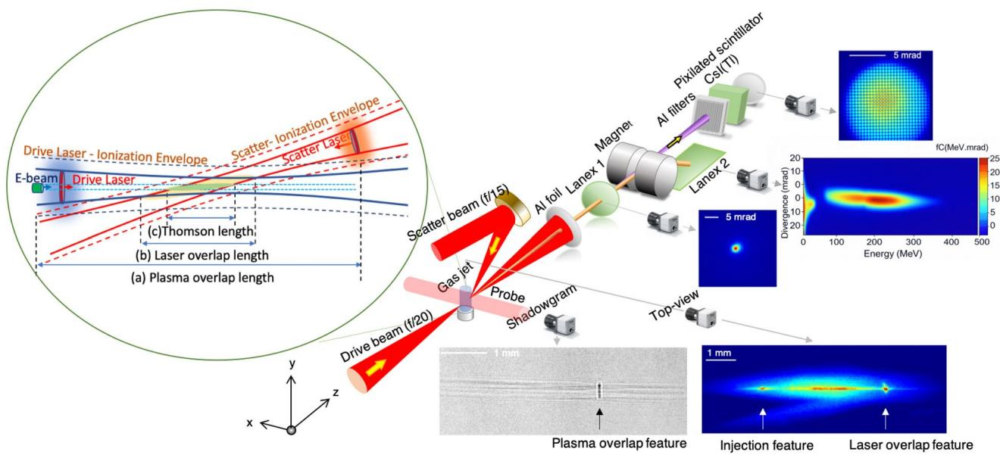
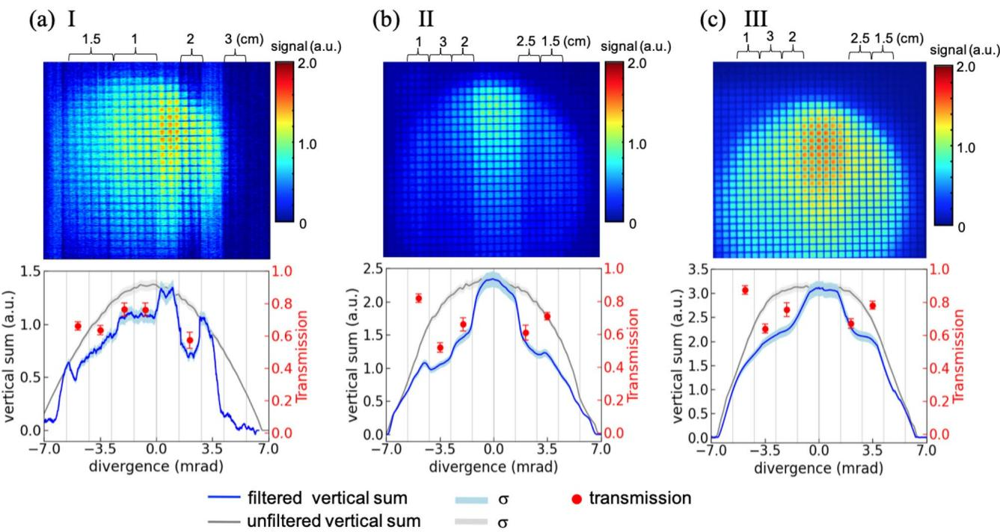

# 双激光逆汤姆孙散射的稳定可调 MeV γ 源 笔记

## 0. 论文信息

- 英文标题：Stable and tunable MeV γ-ray generation via dual-laser inverse Thomson scattering from a laser-plasma accelerator
- 作者：Hai-En Tsai；Tobias M. Ostermayr；Robert E. Jacob；Qiang Chen；Benjamin J. Greenwood；Robert Ettelbrick；Anthony J. Gonsalves；Kei Nakamura；Liona Fan-Chiang；Ocean Zhou；Sam K. Barber；Fumika Isono；Scott J. Thompson；James T. Johnson；Jay D. Hix；Edward Seabury；David L. Chichester；Carl B. Schroeder；Eric Esarey；Jeroen van Tilborg；Cameron G. R. Geddes
- 期刊：Scientific Reports（2026-06-16 在线发表）
- DOI：[10.1038/s41598-026-56639-7](https://doi.org/10.1038/s41598-026-56639-7)
- 来源：[Nature 正式开放论文](https://www.nature.com/articles/s41598-026-56639-7)
- 本地 PDF：`daily/2026-09-03/pdfs/Tsai et al. - 2026 - Stable and tunable MeV gamma-ray generation via dual-laser ITS.pdf`
- 正文处理：期刊 PDF 通过文件头、类型、15 页元数据、SHA-256 与非空文本提取校验，并成功完成 MinerU Markdown 转换。

## 1. 摘要与文章定位

论文在 Berkeley Lab BELLA 的 Hundred Terawatt Thomson 系统上演示双激光 inverse Thomson scattering（ITS）源。驱动激光产生 `122–204 MeV` 的 LWFA 电子束，独立散射脉冲以约 `160°` 角碰撞，产生 `276 keV–1.2 MeV` 可调 γ 光子，最高约 `2×10^7 photons/shot`。

工作重点不是把散射激光压到最高峰值，而是把交互位置与脉宽匹配到由有限碰撞角决定的 Thomson interaction length，在保持线性 Thomson 区的同时增加有效重叠。论文还给出三小时级稳定运行与标准像质卡放射成像，属于“束流—γ 源—应用表征”较完整的实验链。

## 2. 实验系统与电子束

- Ti:sapphire CPA 双臂系统：`800 nm`，驱动/散射臂最高约 `4/1 J`、最高 `5 Hz`；本实验常用驱动脉冲约 `2.5 J、38 fs`，散射脉冲在 `45–400 fs` 间调节。
- 驱动脉冲聚焦到 He + `0.5% N₂` 气体喷嘴，以电离注入建立三种稳定电子束工况。
- 三组平均电子能量约 `122±3`、`170±10`、`204±6 MeV`，电荷约 `20–33 pC`，FWHM 发散约 `3.2–5.5 mrad`，rms 指向约 `0.9–1.2 mrad`。
- 横向 shadowgraphy、顶视二次谐波自发光与 γ 闪烁体把重叠区域逐级约束为约 `1.31 mm` 的等离子体重叠、`0.20 mm` 的激光重叠和 `0.13 mm` 的 γ/Thomson 重叠。

## 3. 光子能量与线性/非线性边界

$$
\hbar\omega_\gamma=
\frac{2\gamma_e^2(1-\cos\phi)\hbar\omega_L}
{1+\gamma_e^2\theta^2+a_0^2/2}
$$

变量说明：`γ_e` 是电子 Lorentz 因子，`φ` 是电子—激光碰撞角，`θ` 是观测角，`ω_L` 是散射激光频率，`a_0` 是散射脉冲归一化矢势。

推导思路：入射光在电子静止系先发生一次 Doppler 增频，散射回实验室系再增频一次，形成约 `γ_e²` 标度；非正对碰撞由 `1−cosφ` 修正；离轴观测和相对论强场有效质量分别产生 `γ_e²θ²` 与 `a_0²/2` 的红移。因而提高电子能量可调谐 γ 能量，但提高 `a_0` 会同时展宽能谱和辐射锥。

## 4. 有限重叠与脉宽优化

局域散射率的时空积分为

$$
N_\gamma=\sigma_T\int v_{\mathrm{rel}}n_e(t,\mathbf r)n_L(t,\mathbf r)\,d^3\mathbf r\,dt
$$

对 Gaussian 横向分布，作者把它写成

$$
N_\gamma\simeq
\frac{\sigma_TN_eN_L}{2\pi(\sigma_e^2+\sigma_L^2)}\eta,
\qquad
\eta=\operatorname{erf}\!\left(\sqrt{\ln2}\frac{L_T}{c\tau_L}\right)
$$

变量说明：`σ_T` 是 Thomson 截面，`N_e/N_L` 是电子/激光光子总数，`σ_e/σ_L` 是横向尺寸，`η` 是纵向重叠效率，`L_T` 是 Thomson length，`τ_L` 是散射脉宽。

物理直觉：固定脉冲能量时，单纯拉长脉冲不会增加光子总数，却能让有限角度下更多激光包络覆盖电子轨迹；超过 `L_T/c` 后，峰值光子密度下降和 transverse walk-off 又会抵消收益。因此存在约 `200 fs` 的最优脉宽，而不是越短或越长越好。

## 5. γ 能谱、空间分布与稳定性

- CsI(Tl) 像素阵列测得 γ 束 FWHM 发散约 `7–9 mrad`。阻断电子或散射激光后信号降至背景，支持 Thomson 起源；束线截获产生的 bremsstrahlung 可比 Thomson 信号高 `10–20` 倍，因此低发散/低指向抖动是关键背景控制条件。
- 铝滤片透射结合 NIST 衰减系数给出约 `0.28±0.08`、`0.61±0.15`、`1.2±0.35 MeV` 三个中心能量，与 `122/170/204 MeV` 电子束的线性 Thomson 标度一致。
- 将散射脉冲从 `45 fs` 展宽到 `200 fs`，峰值 γ 产额约提高 `15%`；此时散射脉冲约 `600 mJ`、`a0≈0.39`，仍在线性区。`400 fs` 时 transverse walk-off 使峰值重叠下降。
- 最优条件给出约 `2×10^7 photons/shot`、估算峰值 brilliance 约 `10^19 photons s⁻¹ mm⁻² mrad⁻²/0.1%BW`。
- 三次、总计近千发的运行中，光子产额在超过三小时内约保持 `5.5% rms` 波动；`200 fs` 脉冲把有 γ 输出的炮次比例由约 `90%` 提升到接近 `98%`。

## 6. 交互位置与放射成像

- 横向 yield scan 与已知 `21±1 μm` 散射焦斑去卷积，给出距离喷嘴中心 `3.7/5.8 mm` 处约 `15.8±3/28.5±3 μm` 的电子束 FWHM 尺寸；这反映漂移后的束斑，不是注入源尺寸。
- 纵向扫描在喷嘴中心下游约 `3.7 mm` 处达到最大产额。简化薄透镜模型表明，靠近气体出口时 plasma-induced defocusing 会抵消更小电子束斑的优势。
- `200 fs`、最高能量工况下，10 m 处剂量分布约 `32 mR h⁻¹` 峰值、约 `7 mrad` 发散。
- 12 次、每次 `175 s` 的 `1 Hz` 曝光清楚分辨 `250 μm` 铜丝；另一组 duplex-wire IQI 在约 `1.7×` 放大下给出约 `0.13 mm` 空间分辨率，主要受探测器像素限制。

## 7. 与当前研究方向的相关性

- 主题关键词：laser wakefield accelerator；inverse Thomson scattering；gamma ray；radiography；experiment；diagnostic。
- 相关性评分：5/5。
- 直接价值：把可调谐 LWFA 电子束、独立散射脉冲、γ 谱/稳定性和 NDT 成像连成实验闭环，适合作为激光加速束流应用的现实基准。

## 8. 证据边界与应用含义

- 本文实测了电子束、γ 能量/角分布/稳定性和放射图像；因此可以称为 MeV γ 源及 NDT 成像实验，而不是仅有源端模拟。
- `1–2 MeV` NRF、核素识别、photofission 和核安全部署是后续目标；论文没有完成同位素选择性 NRF、裂变产额或现场屏蔽验证。
- 能谱由滤片透射的有效衰减系数反演，能量不确定度约到 `0.3 MeV`；当前宽谱仍未达到作者所述约 `2%` 的核素选择性要求。
- 文中把未来 `500 MeV`、`2%` 能散电子束代入得到的 `10^8 photons/shot` 和更高 brilliance 是投影，不是本次实测。

复习速记：双激光 ITS 通过把 `200 fs` 散射脉冲与约 `0.1 mm` Thomson length 匹配，在 `a0≈0.39` 线性区把产额提高约 15%，得到 `0.3–1.2 MeV`、最高 `2×10^7 photons/shot` 且三小时稳定的 γ 源；成像已实测，NRF/光裂变仍是应用前景。
