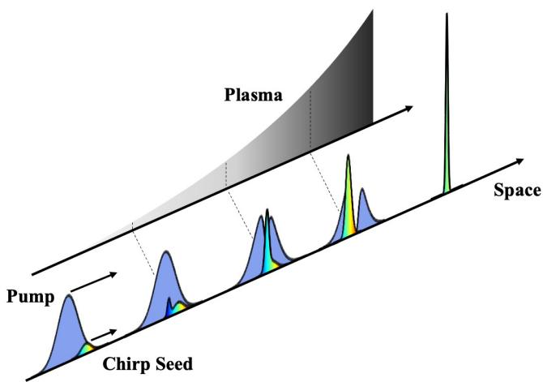
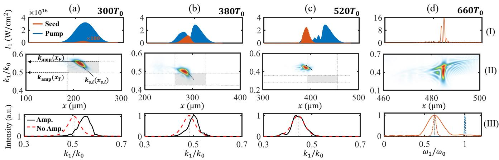
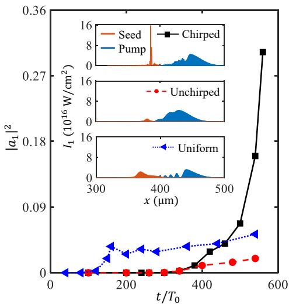

# 非均匀等离子体中的啁啾脉冲前向 Raman 放大 笔记

## 0. 论文信息

- 英文标题：Chirped-Pulse Forward Raman Amplification in Nonuniform Plasmas
- 作者：Zhi-Yu Lei；Zheng-Ming Sheng；Su-Ming Weng；Min Chen；Jie Zhang
- 平台：arXiv preprint
- DOI：[10.48550/arXiv.2609.02326](https://doi.org/10.48550/arXiv.2609.02326)
- 提交日期：2026-09-02；arXiv 新发布：2026-09-03；稿件日期：2026-09-03
- 来源：[arXiv 摘要页](https://arxiv.org/abs/2609.02326)
- 本地 PDF：daily/2026-09-04/pdfs/Lei et al. - 2026 - Chirped-Pulse Forward Raman Amplification in Nonuniform Plasmas.pdf
- 正文处理：官方 arXiv PDF 通过文件头、类型、7 页元数据、SHA-256 和非空文本提取校验，并成功完成 MinerU Markdown 转换。

## 1. 摘要与文章定位

论文提出 chirped-pulse forward Raman amplification（cFRA）：让正啁啾种子与 pump 同向传播，并故意使用随传播方向上升的等离子体密度。高频 seed 尾部先在低密度区满足局部共振，随后低频前沿在更高密度区依次得到放大；同时色散使高频尾部追赶低频前沿，完成压缩。

作者给出含 detuning 的三波耦合解析模型，并以 EPOCH 一维、二维及三维 PIC 数值验证。文中约 10⁷ 倍强度增益、近单周期 8–10 fs、多 PW 输出和“未见显著 filamentation”等全部是理论/PIC 结果，不是已经完成的激光放大实验。

## 2. cFRA 的时空图像

泵浦频率高于种子，因此群速度更高并逐渐追上种子。正啁啾使 seed 尾部频率高、前沿频率低：

1. 低密度处的较低 plasma frequency 先补偿高频 seed 分量的三波频率差。
2. pump 向密度更高处传播时，局部 plasma frequency 上升，依次选择更低频的 seed 分量。
3. seed 高频尾部群速度较高，传播中追赶前沿，放大与压缩同时发生。

与传统方案追求全程严格 phase matching 不同，cFRA 把密度梯度产生的 detuning 变成扫过 seed 带宽的选择器。

## 3. 含失谐的三波耦合

局部频率失谐定义为

$$
\delta\omega=
\omega_2-\omega_0+
\left(
\omega_1+\frac{d\phi_{\mathrm{ch}}}{dt}
\right),
$$

其中 0、1、2 分别代表 pump、seed 和 electron plasma wave，啁啾相位的时间导数给出 seed 的瞬时频移。冷等离子体近似下，作者令波矢始终满足

$$
k_2(x)=k_0(x)-k_1(x),
$$

因此主要讨论频率 detuning，而不再另加波矢失配项。

在线性、pump depletion 可忽略的近似下，每个 seed 频率分量的有效增长率为

$$
g(x)=
\sqrt{
c_1(x)c_2(x)-\frac{\delta\omega_n^2(x)}{4}
}.
$$

推导要点：

1. 将啁啾种子分解成独立的瞬时频率分量。
2. 对 seed 和 plasma-wave 的两条线性耦合方程再求一次时间导数。
3. 消去 plasma-wave 振幅后得到带有 detuning 的二阶增长方程；频率失配贡献负的平方项。

持续指数型放大的条件是

$$
|\delta\omega_n|<2g_{\mathrm{FRA}},
$$

此时有效增长率为实数，解包含双曲余弦增长；若失谐超过阈值，增长率变成虚数，seed 振幅只作余弦型交换而不持续增大。物理上，更强的理想 FRA 耦合允许更大的 detuning tolerance。

## 4. 密度梯度如何展开增益窗口

线性密度上坡写为

$$
n_e(x)=n_0\left(1+\frac{x-x_0}{L}\right),
$$

相应的 electron plasma frequency 为

$$
\omega_{\mathrm{pe}}(x)=
\sqrt{\frac{n_e(x)e^2}{\epsilon_0m_e}}.
$$

对每个 seed 频率分量，局部共振位置由

$$
\omega_{\mathrm{pe}}(x_{0,n})
=\omega_0-\omega_{1,n}
$$

决定。不同频率分量因此拥有不同的中心位置和有效放大区间；把这些区间叠加后，总增益窗口远宽于窄带、无啁啾 seed 在同一密度分布中的窗口。

作者给出的单分量有效长度近似为

$$
L_{\mathrm{eff},n}
=
\frac{8g_{\mathrm{FRA},n}L}
{\omega_{\mathrm{pr},n}}.
$$

该式说明密度标长、局部耦合强度与 pump–seed 频差共同决定可用相互作用长度。它是冷等离子体和局部线性化下的设计关系，真实温度、碰撞和横向结构仍需额外验证。

## 5. 一维 EPOCH PIC 验证

基准一维 PIC 使用 1.0 μm、3 × 10¹⁶ W cm⁻²、233 fs pump；seed 中心波长 1.6 μm、116 fs、初始强度 10¹² W cm⁻²，啁啾率 0.6 × 10²⁷ rad s⁻²、相对带宽约 5.91%。等离子体采用约 1.56 × 10²⁰ cm⁻³ 起始密度和 400 μm 线性标长。

时序图显示：

- 早期主要放大 seed 尾部的高频分量。
- 传播到更高密度后，增益逐步移向较低频分量。
- 离开 pump 重叠和线性放大区后，seed 又受非线性等离子体效应自压缩，中心频率大致保持。

数值对照中，cFRA 在小于 400 μm、约 1.8 ps 内把强度由 10¹⁰ W cm⁻² 提升到约 2 × 10¹⁷ W cm⁻²并压缩至近单周期；无啁啾 seed 在相同非均匀等离子体中很快饱和在约 10¹⁵ W cm⁻²。均匀等离子体无啁啾 FRA 起始增长更早，但 nonlinear energy reversal 更明显；cFRA 的变化 detuning 抑制了能量返流。

## 6. 二维/三维扩展与参数窗

End Matter 的二维示例把 80 GW seed 放大到约 4.0 PW：中心波长 1.6 μm、初始强度 10¹² W cm⁻²、133 fs、14% 带宽、1.6 mm 横向半径，输出强度约 1.8 × 10¹⁷ W cm⁻²、脉宽约 8 fs，输出有效半径收缩到约 900 μm。论文还报告二维/三维 PIC 中未见显著 splitting、filamentation、Landau damping、self-focusing 或 wave breaking。

充分放大的几何判据可写为

$$
x_{s,p}(t_{\mathrm{out}})
<
x_h^{\max},
$$

即 pump 与 seed 脱离前必须仍处于最宽 seed 分量的有效增益上界以内。密度梯度越陡，也就是 L 越小，所需 chirp rate 越高，因为 seed 带宽必须覆盖更快变化的 plasma frequency。

“未显著观察到不稳定性”只对论文给出的有限分辨率、传播长度和理想初始条件成立；它不能证明任意能量、任意口径或真实预等离子体下都稳定。

## 7. 与 Shaw 实验的互补关系

- Shaw 等正式论文是 counter-propagating Raman 实验，直接测得 64 fs、0.31 TW 和最高 8.7% 的重叠修正效率。
- 本文是 co-propagating forward Raman 理论/PIC 方案，用 chirp 与 density upramp 主动补偿 detuning，预测近单周期和 multi-PW 输出。
- 两者共同强调宽带、高强度 seed 的价值，但不能用 Shaw 的实验身份替本文的多 PW 数值预测背书。

## 8. 与当前研究方向的相关性

- 主题关键词：plasma optics；forward Raman amplification；chirped pulse；density gradient；EPOCH；particle-in-cell。
- 相关性评分：5/5。
- 直接价值：给出可由 chirp rate、density scale length 和频率失谐直接使用的 active plasma optics 设计框架，并提供 1D/2D/3D PIC 验证层级。

## 9. 限制与开放问题

- 冷等离子体、局部三波耦合和理想 chirp 是解析模型前提；温度、碰撞、电离历史和横向密度波动需在实验尺度重新评估。
- 10⁷ 强度增益、4 PW、8 fs 及稳定性均为数值结果，没有实验测量或 shot-to-shot 统计。
- 真实系统还需同时满足大口径啁啾 seed、毫米级横向均匀性、亚皮秒重叠、密度上坡可重复性和输出 focusability。
- 论文没有产生粒子束、γ 射线、强场 QED 或光核结果；它提供的是可能通往更高强度驱动器的上游光学方案。

## 10. 复习用速记

cFRA 用正啁啾 seed 把不同频率映射到密度上坡中的不同局部共振位置，使高频尾到低频前沿依次获得增益并同步压缩；解析阈值是失谐小于两倍理想增长率，但近单周期、多 PW 输出目前只是 EPOCH PIC 预测。
