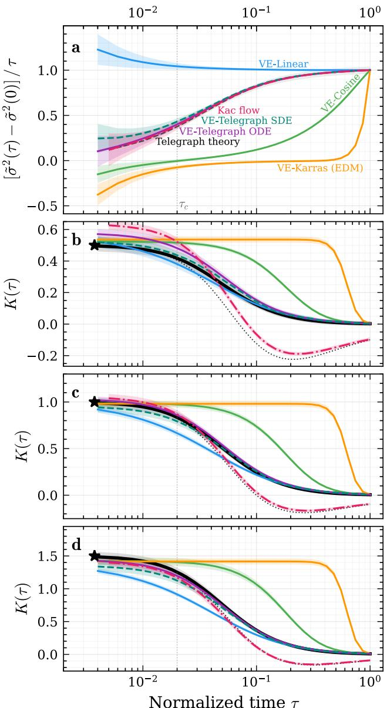
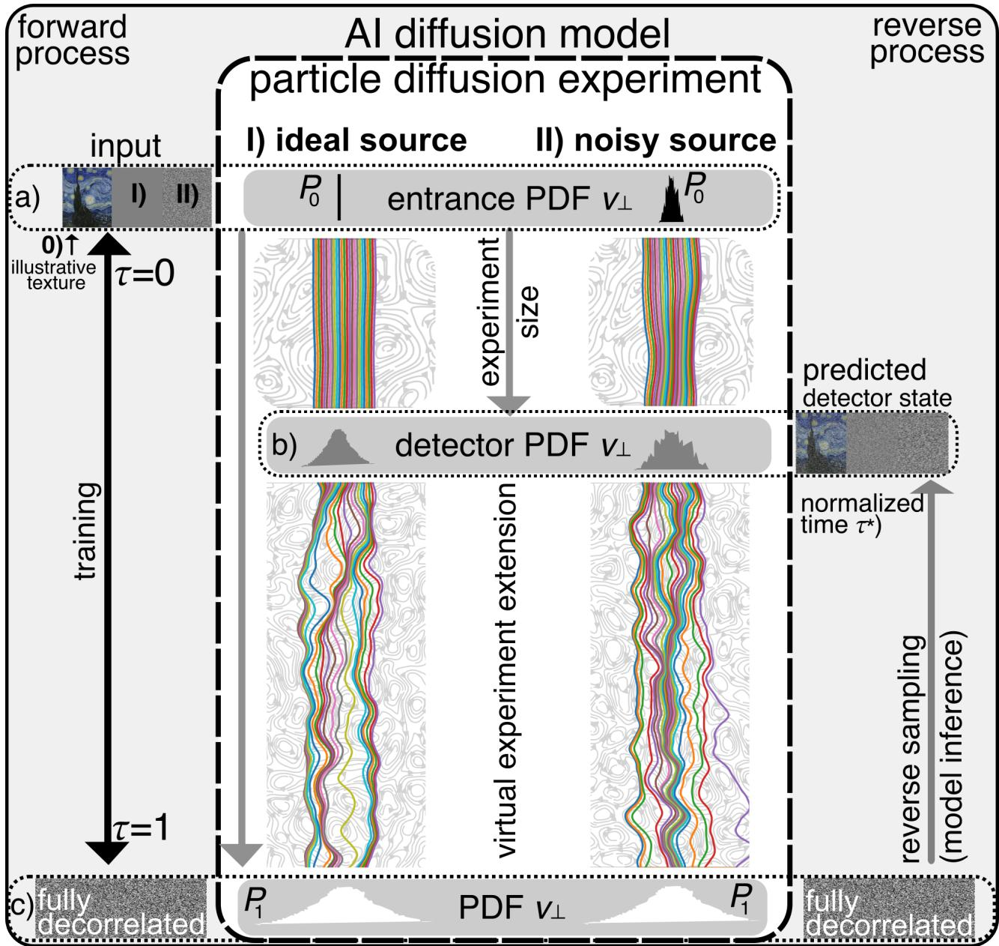
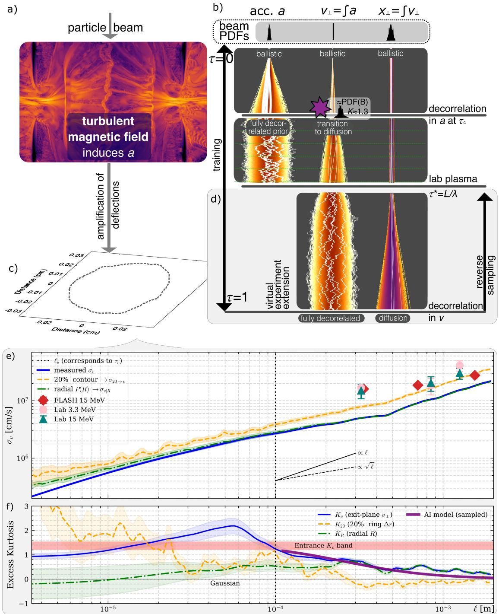

# 用解析方差路径校准生成式扩散代理模型 笔记

## 0. 论文信息

- 英文标题：Generative Diffusion Surrogates with Analytical Variance Schedule
- 作者：Patrick Reichherzer；Gianluca Gregori；David N. Hosking；Subir Sarkar
- 平台：arXiv preprint；作者注明已接收至 Nature Communications，但本轮未检得正式 DOI 页面
- DOI：[10.48550/arXiv.2609.01705](https://doi.org/10.48550/arXiv.2609.01705)
- 提交日期：2026-09-01；arXiv 新发布：2026-09-03
- 来源：[arXiv 摘要页](https://arxiv.org/abs/2609.01705)
- 本地 PDF：daily/2026-09-04/pdfs/Reichherzer et al. - 2026 - Generative Diffusion Surrogates with Analytical Variance Schedule.pdf
- 正文处理：官方 arXiv PDF 通过文件头、类型、16 页元数据、SHA-256 和非空文本提取校验，并成功完成 MinerU Markdown 转换。

## 1. 摘要与文章定位

论文把 stochastic transport 的宏观方差定律直接写进 variance-exploding diffusion model 的 noise schedule。这样，生成模型的时间参数不再是为图像质量调出的抽象“噪声时间”，而是在二阶矩层面与真实物理时间对齐；网络只学习入口分布中遗留的非 Gaussian 形状和 score field。

作者用 telegraph-type ballistic-to-diffusive variance law 构造 schedule，再把模型用于磁湍流中的带电粒子输运。结果结合 synthetic Student-t 基准、预计算 MHD 湍流场中的 test-particle simulation，以及既有 proton-radiography 实验数据。本文没有运行新的激光等离子体实验；“reproduces laboratory-measured variance scale”是对历史实验数据的比较，不是模型在线控制或新的实验发现。

## 2. 从物理方差到 VE 噪声日程

VE 正向过程写为

$$
d\mathbf{x}_{\tau}
=
\tilde g(\tau)\,d\mathbf{W}_{\tau},
$$

其中归一化时间满足 0 到 1，Wiener 增量负责合成 coarse-grained 随机位移。累计的 post-entrance 方差为

$$
\tilde{\sigma}^{2}(\tau)
=
\int_0^\tau \tilde g^2(u)\,du.
$$

因此只要物理理论或实验给出单调非减的方差路径，就能反向确定 schedule：

$$
\tilde g^2(\tau)
=
\frac{d\tilde{\sigma}^{2}(\tau)}{d\tau}.
$$

物理直觉：schedule 的平方就是“单位物理时间增加多少方差”。这把 scale evolution 解析地锁定，避免神经网络同时学习方差标度和分布形状。

## 3. Gaussian coarse-graining 与高阶矩边界

当粒子经过许多弱相关、有限方差的随机扰动时，central limit theorem 支持把 correlation length 以上的新增输运核近似为 Gaussian。给定入口分布 P₀，任意时刻的代理边缘分布为

$$
p_{\tau}(\mathbf{x})
=
\left[
P_0*
\mathcal{N}
\left(
0,\tilde{\sigma}^{2}(\tau)I
\right)
\right](\mathbf{x}).
$$

若入口方差为 σ₀²、入口 excess kurtosis 为 K₀，则 Gaussian 新增核不贡献四阶 cumulant，模型的 kurtosis 解析衰减为

$$
K_M(\tau)
=
K_0
\left[
\frac{\sigma_0^2}
{\sigma_0^2+\tilde{\sigma}^2(\tau)}
\right]^2.
$$

这条式子同时暴露适用边界：模型只传播入口分布携带的非 Gaussian 性；若真实输运核自身持续有重尾、有限传播速度或长记忆，残差必须用 kurtosis gap 或更复杂的 non-Brownian kernel 表示。

## 4. Telegraph 方差路径

ballistic-to-diffusive transport 可由 telegraph equation 描述：

$$
\frac{\partial^2 q}{\partial t^2}
+
\frac{1}{t_c}\frac{\partial q}{\partial t}
=
c^2\frac{\partial^2 q}{\partial x^2}.
$$

短时内速度尚相关，方差随时间平方增长；长时经过多次去相关后，方差转为线性增长。归一化后的累计方差写为

$$
\tilde{\sigma}^{2}(\tau)
=
\frac{
\tau-\tau_c
\left(
1-e^{-\tau/\tau_c}
\right)
}{
C
},
$$

其中

$$
C=
1-\tau_c
\left(
1-e^{-1/\tau_c}
\right)
$$

保证末端方差归一化为 1。由导数得到物理锚定 schedule：

$$
\tilde g^2(\tau)
=
\frac{1-e^{-\tau/\tau_c}}{C}.
$$

在短时极限，指数展开后方差近似正比于 τ²；长时极限中指数项消失，方差转为线性函数。模型只借用了 telegraph 的 mean-square displacement，没有把有限支撑的完整 Kac propagator 当作 VE kernel。

相同训练预算下，Telegraph PF-ODE 与 reverse-SDE 对锚定参考的 variance Q 分别约 0.34 和 1.6、kurtosis Q 约 1.5 和 1.1；linear、cosine、Karras/EDM 在相同物理时间轴上的偏差显著更大。这里比较的是 physical-time alignment，不是对所有生成任务的通用质量排名。

## 5. 只用入口数据的训练与反演

真实实验常只给入口和 detector snapshot，无法提供每个中间时刻的训练分布。作者从入口样本出发，按已知方差路径人工加 Gaussian noise，训练整个 0 到 1 的 score field；detector time 之后的区间是 virtual extension，用来把末端推到充分去相关状态，不需要额外实验数据。

概率流 ODE 为

$$
\frac{d\mathbf{x}}{d\tau}
=
-\frac{1}{2}
\tilde g^2(\tau)
\mathbf{s}_{\theta}(\mathbf{x},\tau).
$$

从末端边缘分布反向积分并停在指定 detector time，就得到该时刻的代理边缘分布。训练损失使用带 schedule 权重的 denoising score matching：

$$
\mathcal{L}(\theta)
=
\mathbb{E}
\left[
\tilde g^2(\tau)
\left\|
\mathbf{s}_{\theta}
\left(
\mathbf{x}_{\tau},\tau
\right)
-
\frac{\mathbf{x}_0-\mathbf{x}_{\tau}}
{\tilde{\sigma}^2(\tau)}
\right\|^2
\right].
$$

网络为约 1.16 × 10⁶ 参数的 10-block FiLM-MLP，使用 GroupNorm、64 维时间嵌入，并可用 32 维入口 kurtosis 嵌入；A100 40 GB 上每个模型约训练 10 分钟。所有 VE 对照共享结构和预算，主要变化是 scalar schedule。

## 6. 磁湍流中的带电粒子输运

高刚度极限满足 gyroradius 远大于磁湍流 correlation length。粒子穿过一个湍流单元时只获得小角度 kick：

$$
a_{\perp}(t)
\simeq
\frac{qv}{m}B_{\perp}(t).
$$

速度方差由加速度自相关决定：

$$
\sigma_{v_\perp}^{2}(t)
=
2\int_0^t
\left(
t-\Delta t
\right)
C_a(\Delta t)\,d\Delta t.
$$

因此

$$
\sigma_{v_\perp}^{2}(t)
\propto
\begin{cases}
t^2, & t\ll t_c,\\
t, & t\gg t_c,
\end{cases}
$$

这正对应前述 telegraph variance clock。多个独立磁单元 kick 的 excess kurtosis 则按中心极限定理近似以单元数的倒数衰减：

$$
K_N
\simeq
\frac{K_{\mathrm{cell}}}{N}.
$$

论文用 Johns Hopkins Turbulence Database 的 1024³ 周期磁场、CRPropa test particles 和 20 个独立数值运行构造输运基准，并与既有 proton-radiography 实验的 3.3 MeV/15 MeV 点比较。参考量级为约 100 kG RMS 磁场、50–90 μm correlation length。

模型按 telegraph schedule 固定 variance scale，并用入口单分量 excess kurtosis 1.4 ± 0.2 初始化重尾。它追踪 test-particle kurtosis 的总体下降趋势；diffusive regime 中经验残差约 0.20 ± 0.05。实验 20% flux contour 主要平均 beam core，接近 Gaussian；完整径向 profile 对重尾更敏感。选择哪个诊断量会直接改变“Gaussian surrogate 是否足够”的答案。

## 7. 可微 likelihood 与可辨识性

PF-ODE 的 instantaneous change of variables 给出

$$
\log p_{\tau^\star}
\left(
\mathbf{x}_{\tau^\star}
\right)
=
\log p_1(\mathbf{x}_1)
-
\int_{\tau^\star}^{1}
\frac{1}{2}
\tilde g^2(\tau)
\operatorname{div}
\mathbf{s}_{\theta}
\left(
\mathbf{x}_{\tau},\tau
\right)
d\tau.
$$

在 score 与 terminal density 精确时，这是边缘 likelihood；实际网络下则是可微估计。进入 variance law 的 correlation time 等参数可通过 likelihood 反演，但多参数联合识别通常需要多个时间快照或额外约束，不能仅凭单个 detector image 宣称唯一恢复微观输运。

## 8. 与当前研究方向的相关性

- 主题关键词：scientific machine learning；generative diffusion；surrogate；stochastic transport；magnetized turbulence；proton radiography。
- 相关性评分：4.5/5。
- 直接价值：提出一种只改 scalar noise schedule、保留现有 diffusion-model 架构的物理约束方式，适合把已知 transport scaling 与稀疏诊断快照组合起来。

## 9. 限制与开放问题

- 物理时间只在 variance 层面被校准；模型不是粒子逐轨道模拟，也不自动保留 finite speed、memory 或 trajectory correlation。
- plasma 应用依赖预计算 MHD 场、test-particle simulation 和历史实验数据，没有新的等离子体实验或闭环推断。
- Gaussian coarse-graining 对持续 non-Gaussian kernel、Lévy flight 或强相关输运可能不足；kurtosis gap 只能量化部分高阶偏差。
- 训练采用低维 scalar/component surrogate。迁移到完整二维探测图、异方差响应、非线性 detector 和多参数反演仍需独立验证。
- 作者已公开代码与 source data，但本轮只校验论文 PDF 与正文，没有复跑 A100 训练或 CRPropa/MHD 数值。

## 10. 复习用速记

核心思想是把已知物理方差的时间导数直接设为 VE diffusion 的噪声率，使模型时间在二阶矩上成为真实 transport clock；它能用入口样本和历史方差规律生成 detector-time 分布，但高阶矩、记忆与逐轨道动力学仍需额外模型或数据约束。
