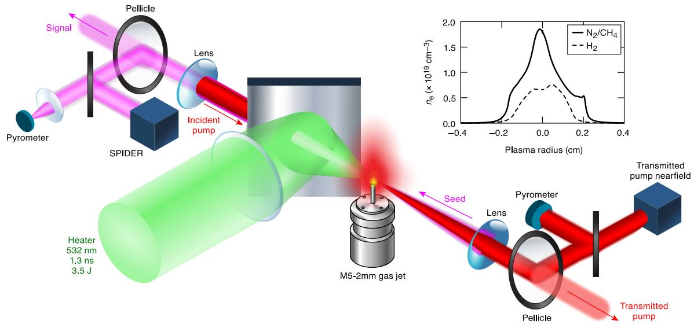
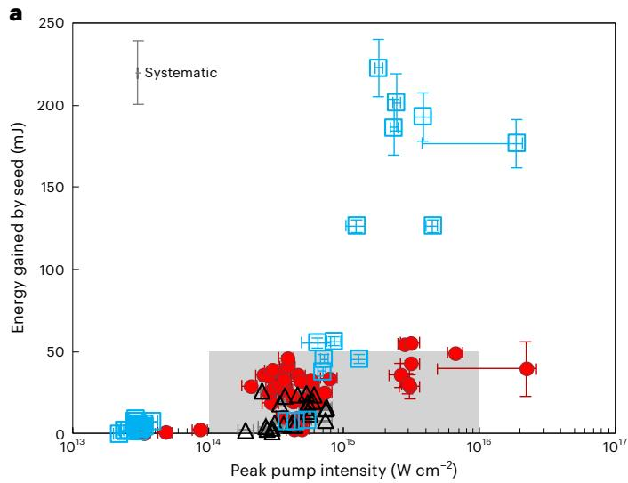
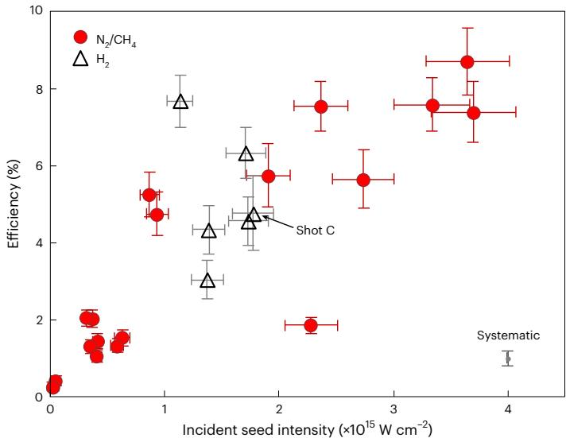

# 超宽带激光脉冲的等离子体 Raman 放大实验 笔记

## 0. 论文信息

- 英文标题：Laser–plasma amplification of an ultrabroadband laser pulse to 0.3 TW
- 作者：J. L. Shaw；M. V. Ambat；K. R. McMillen；J. J. Pigeon；S. Bucht；M. Almanza；S.-W. Bahk；I. A. Begishev；R. Boni；J. Bromage；C. Dorrer；D. Haberberger；J. Katz；I. A. LaBelle；C. Mileham；R. G. Roides；M. A. Romo-Gonzalez；I. A. Settle；M. Spilatro；D. P. Turnbull；J. P. Palastro；E. P. Alves；H. G. Rinderknecht；A. B. Sefkow；D. H. Froula
- 期刊：Nature Photonics，2026-08-03 在线发表，2026 年 9 月卷期收录
- DOI：[10.1038/s41566-026-01977-1](https://doi.org/10.1038/s41566-026-01977-1)
- 来源：[Nature Photonics 正式开放论文](https://www.nature.com/articles/s41566-026-01977-1)
- 本地 PDF：daily/2026-09-04/pdfs/Shaw et al. - 2026 - Laser-plasma amplification of an ultrabroadband pulse to 0.3 TW.pdf
- 正文处理：出版社 PDF 通过文件头、类型、10 页元数据、SHA-256 和非空文本提取校验，并成功完成 MinerU Markdown 转换。

## 1. 摘要与文章定位

论文在预形成气体等离子体中用 counter-propagating pump 和 ultrabroadband seed 实现 stimulated Raman amplification。实验直接测得最高 8.7% 的时间重叠修正能量转移效率，单发 SPIDER 给出种子从 130 fs 压缩到 64 fs、输出峰值功率 0.31 TW；另一个高能量转移炮次把 7.6 mJ 种子放大约 30 倍，净获得 222.8 ± 17.2 mJ。

这是正式实验论文，但高能量转移、最短脉宽和最高效率来自不同炮次，不能拼成单个“同时达到所有最好指标”的运行点。作者用二维 OSIRIS PIC 解释进入 nonlinear pump-depletion regime 和 electron-plasma-wave breaking 的限制机制；这些机制判读与未来 100 PW 外推不等于实验已经实现相应峰值强度。

## 2. Raman 放大的物理路线

Raman 放大利用 electron plasma wave 在长泵浦和短种子之间传能。理想三波共振满足

$$
\omega_0=\omega_1+\omega_{\mathrm{pe}},
\qquad
\mathbf{k}_0=\mathbf{k}_1+\mathbf{k}_{\mathrm{pe}} .
$$

变量说明：

- 下标 0、1 和 pe 分别表示 pump、seed 与 electron plasma wave。
- 频率关系保证能量匹配，波矢关系保证相位匹配。

推导思路：泵浦光子衰变为一个种子光子与一个等离子体波量子，因而能量和动量分别守恒。counter-propagating 几何使两束光的波矢差较大，可驱动高波数 electron plasma wave；高频电子波允许比 Brillouin amplification 更宽的增益带宽，但也更容易受到 wave breaking、Landau damping 和密度不均匀影响。

## 3. 实验构型与诊断

- 532 nm、1.3 ns、3.5 J heater 先把 Mach-5、2 mm 气体喷嘴中的 N₂/CH₄ 或 H₂ 预电离并加热。
- pump 中心波长 1053 nm、19.6–32.5 ps，靶上能量最高 8.5 J；seed 中心波长 1170 nm、带宽超过 60 nm、119–183 fs，靶上能量最高 11.7 mJ。
- pump 与 seed 以 180° 相向传播，均用 f/22 聚焦；pump 焦点可相对 target chamber centre 移动，以改变入射等离子体时是会聚还是发散。
- 输出端用 pyrometer 测能量，并用 single-shot SPIDER 同时恢复光谱相位和时间包络。输入端采用超过 100 发的 5 Hz 表征，而放大实验的 heater/pump 为每 3–20 分钟一发。

SPIDER 只采样约 1–3 mm 近场区域，不提供完整 spatiotemporal characterization；这正是作者把焦斑质量、Strehl ratio 和全口径时间对比度列为后续关键验证的原因。

## 4. 脉冲压缩与输出功率

三组有可用 SPIDER 的代表炮次均同时出现频谱展宽和脉宽缩短。最佳时间压缩炮次把 64 nm 的 seed 带宽扩展到 80 nm，脉宽从 130 ± 26 fs 降到 64 ± 26 fs；输出能量为 21.1 ± 1.2 mJ，对应约 0.31 TW。

峰值功率的基本换算为

$$
P_{\mathrm{peak}}\simeq C_{\mathrm{shape}}\frac{E}{\tau_{\mathrm{FWHM}}},
$$

其中形状因子由实测时间包络决定。对文中的归一化 SPIDER 波形，作者把归一化峰值乘以实测脉冲能量；因此 0.31 TW 是带单发时间诊断的结果，不是仅由总能量除以名义脉宽得到的投影。

高能量转移炮次没有可用 SPIDER。作者指出，若假定输出脉宽仍为输入的 119 fs，则功率可能超过 1.8 TW；这是一项条件性估算，不能与已直接测得的 0.31 TW 混写。

## 5. 能量转移、放大倍数与效率

把 pump 焦点放在 TCC 上游 5 mm、使其进入等离子体时发散，可减轻自聚焦并获得最高净能量转移。最佳记录使用 5.23 ± 0.28 J pump、约 1.80 × 10¹⁵ W cm⁻² 的等离子体内 pump 强度和约 2.0 × 10¹⁵ W cm⁻² 的 seed 强度，净传能 222.8 ± 17.2 mJ。

作者定义的放大倍数为

$$
G=
\frac{E_{\mathrm{signal}}-E_{\mathrm{backscatter}}}
{E_{\mathrm{seed}}}.
$$

推导思路：signal pyrometer 同时接收放大后的种子和少量 pump backscatter，先减去独立 blocking-shot 得到的 backscatter，再与入射种子能量比较。7.6 mJ 种子对应最高约 30 倍能量放大。

效率定义为

$$
\eta=
\frac{
E_{\mathrm{signal}}
-E_{\mathrm{backscatter}}
-E_{\mathrm{seed}}
}{
E_{\mathrm{pump}}^{*}
}.
$$

其中分子是净转移到种子的泵浦能量，分母是时空上真正与种子重叠的 pump 能量。时间重叠修正后的最高值为 8.7% ± 0.7%；若不用这项修正，最高 raw efficiency 为 5.3% ± 0.9%（随机）± 0.7%（系统）。不同论文若使用不同分母，效率数字不能直接横向排序。

固定 pump 参数下，效率总体随 seed intensity 单调上升，支持“高强度、亚皮秒 seed 迅速进入 nonlinear pump-depletion regime”的工作图景。N₂/CH₄ 与 H₂ 点落在相近趋势内，但散点也显示 shot-to-shot seed 能量、焦斑、时空抖动仍是重要工程误差源。

## 6. OSIRIS PIC 的机制解释

二维 OSIRIS 模拟采用理想化 pump/seed 包络、45 eV N⁴⁺ 等离子体、电子—离子 Monte Carlo 碰撞和与实验相近的强度。模拟显示：

- seed intensity 高于约 4.9 × 10¹⁴ W cm⁻² 后，系统快速进入 nonlinear pump-depletion regime，而不必长时间停留在低效率线性阶段。
- pump intensity 高于约 10¹³ W cm⁻² 时，electron plasma wave breaking 使 pump depletion 饱和；代表位置的有效传能区域只有约 20 μm，局部 pump depletion 上限约 35%。
- 热 Raman backscatter 和 inverse bremsstrahlung 造成的 pump 预损失不超过约 10%，并非当前首要限制。

这些结论解释实验趋势，但模拟没有包含真实的横向非理想光斑及全部时空抖动。它支持 wave breaking 为主限制机制，不等于实验直接测量了完整相空间中的 wave-breaking 饱和。

## 7. 与当前研究方向的相关性

- 主题关键词：laser-plasma amplifier；stimulated Raman scattering；ultrabroadband pulse；SPIDER；OSIRIS PIC；experiment。
- 相关性评分：5/5。
- 直接价值：给出从气体等离子体制备、三束激光时序、单发时间诊断到 PIC 机制解释的完整 active plasma optics 基准，可与当天的 cFRA 非均匀等离子体方案形成实验—理论对照。

## 8. 限制与开放问题

- 0.31 TW 是直接测得的最佳带 SPIDER 炮次；超过 1.8 TW 只是在另一高能量炮次上假设脉宽不变得到。
- 8.7% 是时间重叠修正效率，raw efficiency 较低；比较其它 Raman/Brillouin 实验时必须统一分母。
- 当前没有全口径 focusability、Strehl ratio、完整 temporal contrast 或高重复率稳定性证明，尚不能称为可部署的 petawatt afterburner。
- 论文没有产生强场 QED、粒子束、γ 射线、光核或中子实验结果；这些只是更高强度激光的潜在下游应用。

## 9. 复习用速记

这项实验把强、宽带、亚皮秒 seed 直接送入 nonlinear Raman pump-depletion regime，测得 64 fs、0.31 TW 和最高 8.7% 重叠修正效率；222.8 mJ 净传能是另一炮次，且高功率外推仍受 wave breaking、焦斑质量和时空抖动约束。
