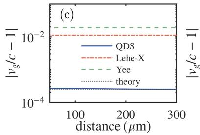
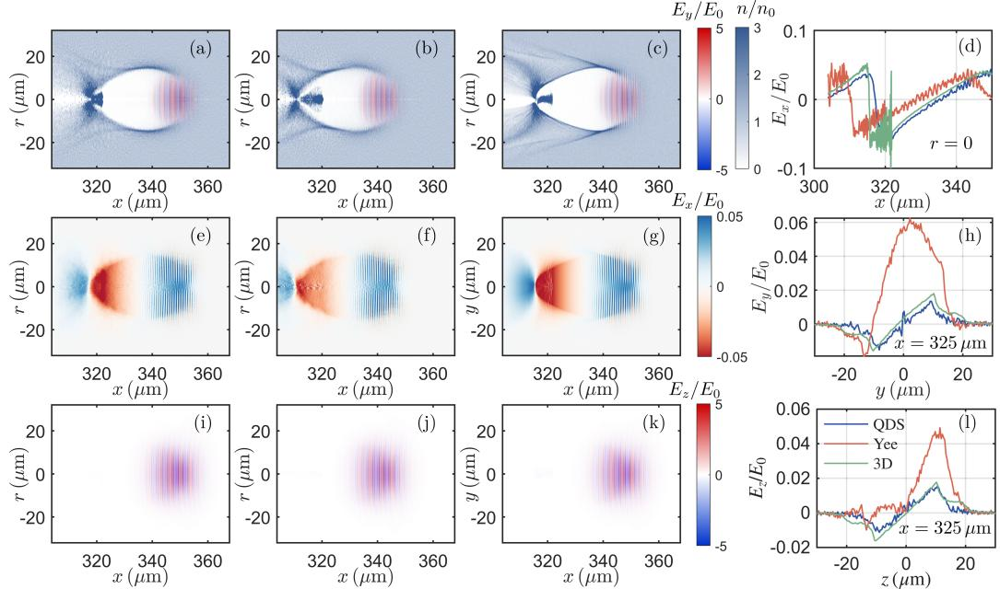
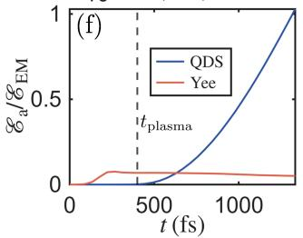

# 柱坐标 PIC 中的 X 向无色散电磁场与轴子场求解器 笔记

## 0. 论文信息

- 英文标题：X-dispersionless solver for electromagnetic and axion fields in a cylindrical particle-in-cell code
- 作者：Xiangyan An；Min Chen；Yipeng Wu；Jianglai Liu；Zhengming Sheng；Jie Zhang
- 平台：arXiv preprint
- DOI：[10.48550/arXiv.2609.03550](https://doi.org/10.48550/arXiv.2609.03550)
- 提交日期：2026-09-03；arXiv 新发布：2026-09-04
- 来源：[arXiv 摘要页](https://arxiv.org/abs/2609.03550)
- 本地 PDF：daily/2026-09-05/pdfs/An et al. - 2026 - X-dispersionless cylindrical PIC solver for electromagnetic and axion fields.pdf
- 正文处理：官方 arXiv PDF 通过文件头、类型、18 页元数据、SHA-256 和非空文本校验，并成功完成 MinerU Markdown/图片提取。

## 1. 摘要与文章定位

论文把 Pukhov 的 X-dispersionless / rhombi-in-plane 思路移植到 EPOCH 的 quasi-cylindrical PIC 分支：场量按方位角模数 $m$ 分解，而主要传播轴 $x$ 上用 direction splitting 精确平移横向输运变量。作者还在相同离散框架中加入 axion Klein–Gordon 场及 axion-regenerated electromagnetic（AREM）场更新。

本文的价值是数值算法和作者执行的 benchmark，不是轴子探测实验，也不是本地 EPOCH 源码审计。本轮保存了论文和图，未检查作者改动的代码、未编译 EPOCH、未复现实验算例。

## 2. QDS 的核心变量与无色散条件

柱坐标场先作方位角 Fourier 截断：

$$
F(x,r,\theta,t)=\operatorname{Re}\left\{\sum_{m=0}^{m_{\max}}F^{(m)}(x,r,t)e^{-im\theta}\right\}.
$$

每个 $m$ 模独立推进。将横向电磁场组合成沿 $x$ 正、反向传播的输运变量：

$$
T_r^{\pm}=E_r^{(m)}\pm cB_\theta^{(m)},\qquad
T_\theta^{\pm}=E_\theta^{(m)}\pm cB_r^{(m)}.
$$

它们满足带径向、方位角和电流源项的一维平流方程，例如

$$
\partial_tT_r^{\pm}\pm c\partial_xT_r^{\pm}=\Gamma_r\pm c\Phi_r.
$$

当网格满足

$$
c\Delta t=\Delta x,
$$

无源的 $T^+$ 或 $T^-$ 每个时间步恰好沿轴向移动一个网格，因此轴向数值相速度不再依赖波长。这里“无色散”专指主轴传播；径向有限差分、方位角截断、粒子沉积和源项仍有离散误差，不能推广成全三维、任意方向均无误差。

## 3. 真空群速度基准

对有限腰斑 Gaussian pulse，横向波矢本来就使轴向群速度略低于 $c$：

$$
\frac{v_g}{c}\simeq1-\frac{\langle k_\perp^2\rangle}{2k_0^2}
=1-\left(\frac{\lambda_0}{2\pi w_0}\right)^2.
$$

对 $w_0=10\lambda_0$，理论值为 $|v_g/c-1|=2.53\times10^{-4}$。作者用能量质心拟合群速度；在粗网格 $\Delta x=\lambda_0/10$ 上，QDS 得到 $2.61\times10^{-4}$，加密到 $\lambda_0/40$ 后趋于 $2.53\times10^{-4}$。这说明算法保留了有限腰斑的物理群速度修正，而非把所有激光都强制成 $v_g=c$。

## 4. LWFA 对照与计算成本

LWFA benchmark 使用 $n_0=0.001n_c\approx1.7\times10^{18}\,\mathrm{cm^{-3}}$、40 $\lambda_0$ 密度上升段。柱坐标算例保留 $m\le3$，QDS 与 Yee 都取 $\Delta x=\lambda_0/10$、$\Delta r=\lambda_0/2$；三维 Cartesian 对照取 $\Delta x=\lambda_0/20$。

三种计算给出相近 bubble 和尾场幅度，但 Yee 的激光及尾场因数值色散发生轴向滞后，固定位置的横向线切还混入了激光尾部。电子谱、能散和 emittance 大体相似，QDS 与三维结果并非逐点或谱形完全重合。

作者报告同用 80 CPU cores 时，QDS 约 10 min、柱坐标 Yee 约 20 min、全三维约 63.5 h。“orders of magnitude”主要来自 quasi-cylindrical 相对 full 3D 的维数和网格节省，不能只归因于 QDS 时间推进，也不是本轮独立计时。

## 5. 轴子两色激光算例

作者用 800 nm 基频与 400 nm 二次谐波、互相正交偏振的共传播激光产生 $\mathbf E\cdot\mathbf B$ 源，并选择 axion mass 满足 plasma 内 resonance。真空中物理源项应为零；Yee 对两频率给出不同数值相速度，导致非零伪源，而 QDS 保持零信号。进入等离子体后，QDS 保持相位匹配并给出转换比的预期二次增长，Yee 则快速失谐、提前饱和。

该算例使用人为可见的数值耦合来检验算法，不代表真实弱耦合轴子已被生成或探测；图中转换率也不是实验灵敏度预测。

## 6. 与现有 PIC 工作的连接

- 对长距离 LWFA、laser transport 和相位敏感多频耦合，轴向群速度误差会积累成显著 dephasing，QDS 直接针对该误差源。
- quasi-cylindrical 模式保留接近二维的成本，但仍可表达有限的三维角向结构；需要检查目标物理是否能由所选 $m_{\max}$ 收敛。
- 对 WarpX/PSATD 或其他谱求解器的比较应单列 stencil、Courant 条件、边界、current correction、NCI 控制和并行成本，不能仅凭“dispersionless”一词类比。

## 7. 限制与开放问题

- 必须满足 $c\Delta t=\Delta x$；这会把时间步与轴向网格强绑定，径向稳定性和粒子推进兼容性仍需具体检查。
- 论文 benchmark 有 vacuum、LWFA 与 axion phase matching，但未给出广泛 $m_{\max}$、高阶径向分辨率、边界和大规模并行收敛扫描。
- QDS 与 3D 的高能谱形、emittance 并不完全一致；“reasonable range”不能改写为严格等价。
- 本轮没有源码位置、commit、build log 或本地 A/B，因此不能声称 EPOCH 主线已经包含该实现或可以直接复现。

## 8. 复习用速记

QDS 将 $E_r\pm cB_\theta$、$E_\theta\pm cB_r$ 变成在 $c\Delta t=\Delta x$ 下每步移动一格的轴向输运变量；作者的 vacuum、LWFA 和两色轴子 benchmark 表明它能抑制累计相位误差，但证据仍是论文内数值验证，不是本地代码复现或轴子实验。
