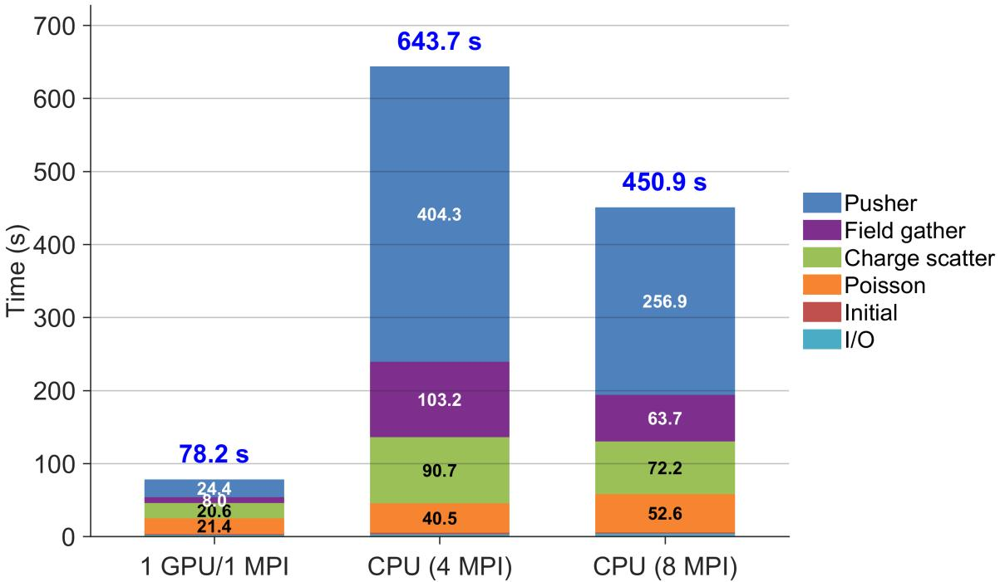
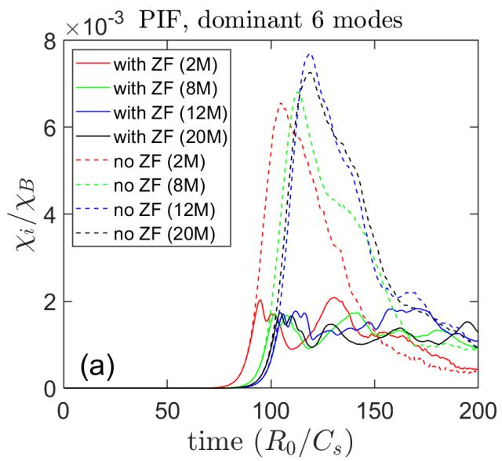
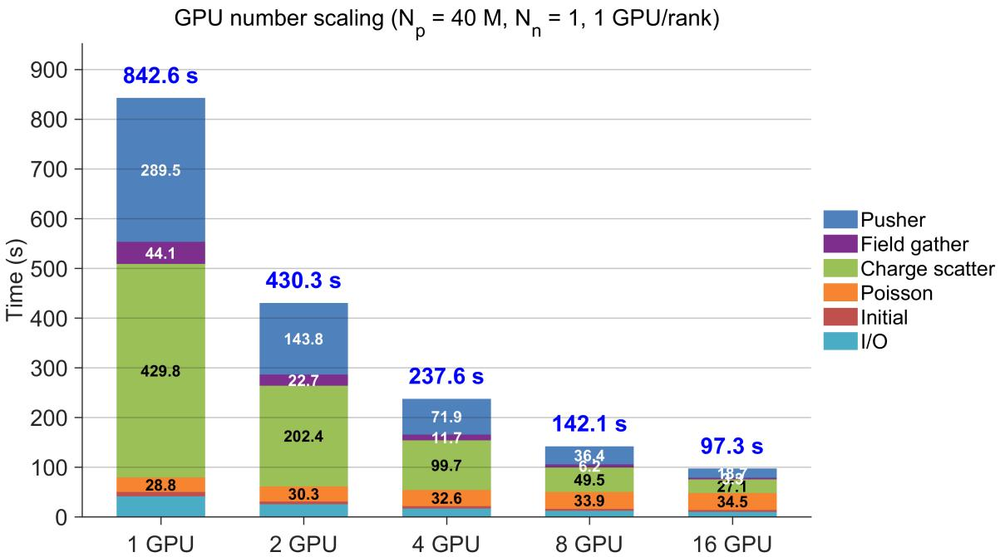

# 从笔记本到超算的分钟级高保真回旋动理学模拟 笔记

## 0. 论文信息

- 英文标题：Minute-Scale High-Fidelity Gyrokinetic Simulations with Portability from Laptop to Supercomputer
- 作者：Jian Bao；Huasheng Xie；Ming Yang；Zhixin Lu；Haotian Chen；Zhihong Lin；Feng Zhang
- 平台：arXiv preprint
- DOI：[10.48550/arXiv.2609.03354](https://doi.org/10.48550/arXiv.2609.03354)
- 提交日期：2026-09-03；稿件日期 / arXiv 新发布：2026-09-04
- 来源：[arXiv 摘要页](https://arxiv.org/abs/2609.03354)
- 本地 PDF：daily/2026-09-05/pdfs/Bao et al. - 2026 - Minute-scale high-fidelity gyrokinetic simulations.pdf
- 正文处理：官方 arXiv PDF 通过文件头、类型、19 页元数据、SHA-256 和非空文本校验，并成功完成 MinerU Markdown/图片提取。

## 1. 摘要与文章定位

论文在 GTC 的 electrostatic gyrokinetic 模型中实现 hybrid spectral particle-in-Fourier（PIF）方法。它不让粒子对每个 poloidal $m$ harmonic 逐一 scatter/gather，而是在二维 poloidal mesh 上完成粒子–网格耦合，再以径向有限差分和截断的 $m$ harmonics 解稀疏 Poisson 系统。

作者对 linear/multi-$n$ ITG、nonlinear transport、zonal-flow regulation 和 GPU scaling 做了数值 benchmark。标题中的“high-fidelity”指这些对照中的物理量保持，并不等于完整 electromagnetic gyrokinetics、kinetic-electron cancellation problem 或任意模式都已验证。

## 2. 计算表示如何降维

粒子仍按五维 gyrocenter phase space 演化，采用 $\delta f$ 权重；场表示则按

$$
\delta\phi(\psi,\theta,\zeta,t)
=\delta\phi_n(\psi,\theta,t)e^{in\zeta}
+\delta\phi_n^*(\psi,\theta,t)e^{-in\zeta}
$$

保留 toroidal Fourier coefficient。charge scatter 与 field gather 在二维 $(\psi,\theta)$ 平面进行；Poisson solver 再把场转到 radial–$m$ 表示，只保留物理相关的 $m$ 耦合。truncated spectral transform 在两种表示之间连接。

这种设计同时省去完整 toroidal grid 和每个 $m$ 的粒子循环，还消除了传统 toroidal domain decomposition 中 marker 跨域时的 particle-shift communication。代价是算法主动选择 toroidal modes 和 $m\sim nq$ 附近的结构，因此它是面向特定 gyrokinetic instability 的压缩表示，不是无损保存所有三维频谱。

## 3. 线性 ITG 物理验证与笔记本性能

作者比较 hybrid spectral PIF 与 conventional PIC 的 $n=10$ 模结构及 $n=10$–20 的 growth rate / real frequency，报告 ballooning pattern、FLR stabilization 趋势和 diamagnetic frequency 趋势一致。

单 $n$ 对照中，PIF 使用约 2 million markers；conventional PIC 因完整 toroidal grids 和更大的 poloidal grid 使用约 97 million markers，所以作者定义的 effective problem size 减小约 48 倍。

在 Intel i9-13900HX + laptop RTX 4090 上，2000 steps、约 2 million markers 的单 $n$ 算例报告：

- 1 GPU / 1 MPI：78.2 s；
- CPU 4 MPI：643.7 s；
- CPU 8 MPI：450.9 s。

论文的“超过两个数量级”是把较小 problem size 与 per-case timing 合并估计相对 conventional PIC 的总体收益，并非同一硬件、同一粒子数、同一完整物理内容的单一墙钟 A/B。

## 4. 多模与非线性输运

六个 toroidal harmonics $n=10,12,14,16,18,20$ 的 linear run 在相同笔记本 GPU 上用 272.9 s（约 4.5 min）完成 2000 steps。$n=12$ 弱信号中仍可见细径向噪声，作者指出增加 markers 可改善。

非线性算例保留 $n=13$–18。2、8、12、20 million markers 的结果显示相近的线性增长，并重现 zonal flow 降低饱和 transport 的趋势；2 million 曲线已接近 20 million。论文用约 640 million markers 的 conventional PIC 给出相近 transport level 作为参照。含 zonal flow 的 2 million、4000-step run 用一块 laptop GPU 报告 572.2 s。

这里的“相近”针对 $\chi_i/\chi_B$ 时间史和有限 retained modes；不能推出微观相空间结构、全频谱和所有统计量均等价。

## 5. A100 strong scaling 的真实边界

固定 40 million markers、单 $n$、2000 steps 时，1→16 A100 把总时间从 842.6 s 降到 97.3 s，即 8.66×，总体 parallel efficiency 约 54%，不是理想 16×。particle pusher、gather 和 scatter 三个分量近似按 $1/N_g$ 缩放；Poisson solver 因该测试只由一个 GPU/MPI rank 解，约 30 s 基本不变，成为强缩放瓶颈。

论文所说关键粒子环节接近 100% efficiency 不应误写成整个程序 100% strong scaling。多 $n$ 情形的进一步 MPI 分发优化也被作者列为 separate work。

## 6. 与当前计算工作的相关性

- 对需要大量参数扫描的 gyrokinetic ITG 任务，物理导向的 mode truncation 可把“高保真”从全空间逐点表示转为对目标 observables 的保持。
- 该工作给出一个很清楚的性能分析范式：同时报告 problem-size reduction、同机 wall time、各 kernel scaling 和串行瓶颈，不能只引用峰值 speedup。
- 对普通 electromagnetic PIC、laser–plasma 或 QED 粒子生成，模型并不直接适用；本文是 electrostatic gyrokinetic GTC，而非 EPOCH/WarpX/VLPL 的 Maxwell–particle PIC。

## 7. 限制与开放问题

- 当前实现限于 electrostatic、以 ITG 为主的验证；electromagnetic extension 与 kinetic-electron cancellation problem 仍是未来工作。
- $m$ harmonic 选择及 radial smoothing 可能滤除非预期高-$k$ 或非共振结构，需要按研究目标做收敛测试。
- 文中 benchmark 是作者报告，本轮未获得源代码 commit、输入文件或硬件复现日志。
- 超算扩展的 Poisson 串行部分已显著限制总体 strong scaling；大规模 multi-$n$ 的内存、通信与 all-reduce 仍需独立量化。

## 8. 复习用速记

这套 hybrid spectral PIF 把粒子耦合留在二维 poloidal mesh，把 Poisson 方程放到截断的 radial–$m$ 空间；作者在 ITG 指标上把 effective problem size 降低 48×，并报告 RTX 4090 laptop 上 78.2 s 的单模 run，但整体 1→16 A100 只有 8.66×，Poisson 串行解是当前清晰瓶颈。
