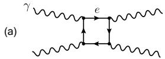
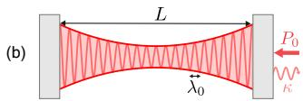

# 激光干涉仪中的量子真空非线性 笔记

## 0. 论文信息

- 英文标题：Quantum Vacuum Nonlinearities in Laser Interferometers
- 作者：Zain Mehdi；Joseph J. Hope；Simon A. Haine
- 平台：arXiv preprint
- DOI：[10.48550/arXiv.2609.03314](https://doi.org/10.48550/arXiv.2609.03314)
- 提交日期：2026-09-03；稿件日期 / arXiv 新发布：2026-09-04
- 来源：[arXiv 摘要页](https://arxiv.org/abs/2609.03314)
- 本地 PDF：daily/2026-09-05/pdfs/Mehdi et al. - 2026 - Quantum vacuum nonlinearities in laser interferometers.pdf
- 正文处理：官方 arXiv PDF 通过文件头、类型、11 页元数据、SHA-256 和非空文本校验，并成功完成 MinerU Markdown/图片提取。

## 1. 摘要与证据边界

论文提出在普通连续波 Fabry–Pérot standing-wave cavity 中测量 Euler–Heisenberg photon–photon forward scattering，不依赖外磁场或 PW laser。单模 Kerr-like phase shift 和双模 polarization cross-phase modulation 都被推导到 shot-noise sensitivity，并讨论用 modulation、differential polarization 和 squeezing 排除技术噪声。

这是理论 proposal：论文没有建造装置、没有测得真空双折射，也没有实验噪声谱。所有“一天可达”数字都建立在最小 cavity mode volume、高 finesse、高 circulating power、长期 shot-noise-limited readout 等假设上。

## 2. 站立波为何产生真空非线性

低能 QED 的 Euler–Heisenberg 相互作用写为

$$
\mathcal H_{\mathrm{int}}=-\frac{2\alpha^2\epsilon_0^2\hbar^3}{45m_e^4c^5}
\left(4\mathcal G_1^2+7\mathcal G_2^2\right),
$$

其中 $\mathcal G_1=(E^2-c^2B^2)/2$、$\mathcal G_2=c\mathbf E\cdot\mathbf B$。对单色平面波两者的组合使相互作用消失；standing wave 的空间结构则保留非零 quartic interaction。

单个宏观占据模式在 rotating-wave approximation 下得到 Kerr-like Hamiltonian：

$$
\hat H_{\mathrm{SM}}\propto-\left(1+\frac{3}{8}\mathcal V^2\right)
\frac{\lambda_e^3}{V}\frac{(\hbar\omega_0)^2}{m_ec^2}
\hat a^\dagger\hat a^\dagger\hat a\hat a,
$$

其中 $\mathcal V$ 是 circular Stokes parameter。大光子数下，它等效为与 intracavity photon number 成正比的微小 refractive-index shift，并编码进透射光相位。

## 3. 最小模体积与信噪比缩放

Gaussian beam diffraction 给出的腔体积为

$$
V=L\pi w_0^2+\frac{L^3\lambda^2}{12\pi w_0^2},
$$

对 $w_0$ 最小化后

$$
V_{\min}=\frac{\lambda L^2}{\sqrt3}.
$$

当腔确实工作在这个最小体积附近时，$\kappa\propto L^{-1}$ 抵消 $V_{\min}\propto L^2$，预测 phase shift 对 $L$ 不敏感。shot-noise-limited SNR 的主要缩放为

$$
\mathrm{SNR}\propto\mathcal F^2(\omega_0P_0)^{3/2}\sqrt T.
$$

作者代入 $\mathcal F=7\times10^5$、$P_0=1$ W、$\lambda_0=1\,\mu$m，得到约 700 kW circulating power，并预测一天积分时 SNR 约 1。这个估算的关键不是腔长，而是能否同时实现最小 mode volume、如此高 finesse/功率和有效 shot-noise limit。

## 4. 双模偏振差分方案

两个非简并 cavity modes 的 cross-phase interaction 写成 $\hat H_{\mathrm{TM}}=-\hbar\lambda\hat n_1\hat n_2$。偏振因子依赖两个 polarization vectors 的 overlap；平行与垂直分量的 per-photon birefringence 差为

$$
\delta=\lambda(\pi/2)-\lambda(0)
=\frac{48\alpha^2}{45}\frac{\lambda_e^3}{V_{\min}}
\frac{\hbar\omega_1\omega_2}{m_ec^2}.
$$

同一组 1 W、$\mathcal F=7\times10^5$ 参数下，作者估计 $\delta\approx2\times10^{-26}$ Hz；noise amplitude spectral density 约为 $10^{-23}\,\mathrm{Hz}/\sqrt{\mathrm{Hz}}$，加入 7 dB squeezing 后约 $6\times10^{-24}\,\mathrm{Hz}/\sqrt{\mathrm{Hz}}$。由此得到至少约 4 天（不压缩）或 1 天（7 dB）的理想积分时间；circulating power 提到 1 MW 时，时间按 $P^{-3}$ 缩短约 2.9×。

偏振的优势是能构造 null channels：改变两束偏振夹角、交换模式、比较 common-mode path noise，从而区分 QED 的 $4:7$ Lorentz-invariant 结构与 mirror birefringence 等背景。

## 5. 低频噪声与实验门槛

高功率干涉仪在低频往往由 radiation-pressure noise 而非 shot noise 主导。作者建议把输入功率调制到大约 100 Hz 以上，使 mechanical susceptibility 降低该噪声；相应 cavity bandwidth 需达到数百 Hz，论文认为米级最小体积腔可行。

真正实验还必须控制或标定：mirror coating thermal noise、thermoelastic deformation、residual gas Kerr/birefringence、偏振串扰、laser frequency/intensity noise、腔锁定漂移和 squeezing loss。论文提出差分判别路径，但没有把这些噪声做成完整 measured budget。

## 6. Beyond-Standard-Model 映射

不同 mediator 对 $\mathcal G_1$、$\mathcal G_2$ 的权重不同：scalar 偏向 parity-even $\mathcal G_1$，pseudoscalar/axion-like field 通过 parity-odd $\mathcal G_2$。因此完整 polarization dependence 可区分部分 microscopic structures。mediator mass 还会让局域 Euler–Heisenberg 近似失效，并可能引入 nonlocal response 或实粒子产生的 dichroism。

这只是理论参数映射；没有给出现有约束之上的完整 exclusion curve，也不能据此声称发现 BSM 粒子。

## 7. 与强场 QED 路线的互补关系

- 强激光/强核场实验追求大瞬时场和真实散射产物；本文追求低能 forward-scattering phase 长时间相干积累。
- 它与 laser–plasma 中电子辐射、Breit–Wheeler pairs 或 photon macroparticle 没有直接同一观测量。
- 若用于实验方案评估，应先把论文理想 SNR 转成可测 phase/noise budget，再按 cavity optics 的工程约束验证，不宜先从“一天可达”倒推成功概率。

## 8. 复习用速记

standing-wave cavity 让 Euler–Heisenberg quartic term 非零；在 $V=V_{\min}$ 的理想条件下 SNR 与腔长无关、按 $\mathcal F^2P_0^{3/2}\sqrt T$ 增长。作者预测 700 kW circulating power 下约一天可达，但这仍是 shot-noise-limited 理论提案，不是量子真空非线性已观测。
