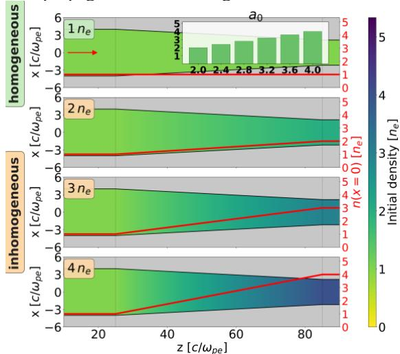
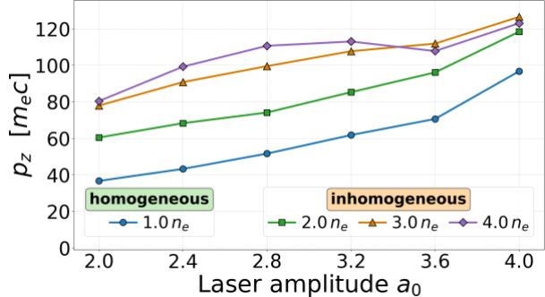
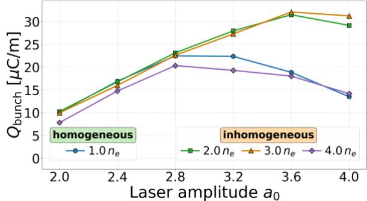

# 锥形等离子体通道中 LWFA 自注入束团参数扫描笔记

## 0. 论文信息

- 英文标题：Dependence of self-injected bunch parameters on the plasma density gradient and laser pulse amplitude at LWFA in a conical plasma channel
- 作者：D. S. Bondar；V. I. Maslov；I. N. Onishchenko
- 平台：arXiv preprint
- DOI：[10.48550/arXiv.2609.03479](https://doi.org/10.48550/arXiv.2609.03479)
- 提交日期：2026-09-03
- 来源：[arXiv 摘要页](https://arxiv.org/abs/2609.03479)
- 本地 PDF：daily/2026-09-06/pdfs/Bondar et al. - 2026 - Self-injected LWFA bunches in a conical plasma channel.pdf
- 正文处理：官方 arXiv PDF 通过 `%PDF-`、文件类型、7 页元数据、SHA-256、非空 `pdftotext -layout` 校验，并成功完成 MinerU Markdown / 图片提取。

## 1. 文章定位

作者用 WarpX 2D3V PIC 扫描锥形通道中的 laser amplitude $a_0$ 与轴向上升密度梯度，比较 self-injected electron bunch 的纵向动量、长度、截面积、二维线电荷和横向 emittance。结果提出一个有限扫描内的折中点：适度密度上升可让束团继续停留在 accelerating phase，过强梯度则使 bubble 过度收缩并损失束团。

这是二维数值参数扫描，不是 LWFA 实验，也不是本轮在本地运行 WarpX 的结果。文中的 μC/m 是二维线电荷，不能直接当作实际三维 bunch charge。

## 2. 几何与参数定义

- 几何：2D3V WarpX。
- 激光：$\lambda=800$ nm，$a_0=2.0$–4.0，步长 0.4。
- 初始电子密度：$n_e=2.61\times10^{19}\ \mathrm{cm^{-3}}$。
- 通道入口到 $z=25c/\omega_{pe}$ 的半径为 $4c/\omega_{pe}$，随后线性收缩，在 $z=85c/\omega_{pe}$ 处达到 $2.16c/\omega_{pe}$。
- 比较四种轴向密度：均匀 $n_e$，以及在出口线性增至 $2n_e$、$3n_e$、$4n_e$。
- 所有束团参数在 $t=238$ fs、bubble head 到达通道出口时读取。

论文把几何 taper 与密度 gradient 同时放在锥形通道中；因此结论是相对于同一锥形几何的四种密度演化比较，不能把全部收益独立归因于密度或通道收缩中的任一个因素。

## 3. 激光导引与 bubble 响应

在 $a_0=4$ 的比较中，作者报告锥形通道出口附近的轴上激光能量密度约为同半径圆柱通道的 2.1 倍。随密度增大，等离子体波长变短，wake bubble 沿传播方向收缩：

- 出口 $2n_e$ 和 $3n_e$ 的上升梯度仍可维持可用的 accelerating / focusing region；
- 出口 $4n_e$ 时收缩和形变过强，部分 self-injected bunch 被破坏，多个束团指标在大 $a_0$ 端反而下降。

这是一组同一读取时刻的场快照与参数趋势，而不是对稳定传播距离、shot-to-shot 统计或实验误差的测量。

## 4. 纵向动量趋势

均匀密度下，平均 $p_z$ 的最高值约 $96.7m_ec$。出口增至 $3n_e$ 时，$p_z$ 随 $a_0$ 从 2.0 到 4.0 由约 $78m_ec$ 增至 $126.5m_ec$。在超相对论近似下，这对应约 40–65 MeV 的能量尺度，但论文给出的是束团平均纵向动量，不是完整能谱、峰值能量或能散。

作者的物理解释是：适度上升密度缩短等离子体波长，使束团相对于 bubble 的位置重新进入更有利的加速相位；若上升过快，bubble 几何破坏会抵消相位收益。

## 5. 线电荷与“最佳点”

在 $2n_e$、$3n_e$ 两组中，二维束团线电荷随 $a_0$ 大体上升，并在 $a_0\simeq3.6$ 附近达到约 32 μC/m；$4n_e$ 组先上升后下降。所有组的横向 RMS emittance 均小于 $4.2\times10^{-2}$ mm·mrad。

作者选择 $a_0=3.6$、出口 $3n_e$ 作为扫描内的“optimal obtained bunch”，参数为：

- $Q_{bunch}=32.1\ \mu\mathrm{C/m}$；
- 平均 $p_z=111.9m_ec$，约 57 MeV 动量 / 能量尺度；
- 长度 5.10 μm；
- 二维截面积 5.3 μm²；
- 横向 emittance $1.6\times10^{-2}$ mm·mrad。

这里“最优”只表示论文给定 $a_0$、密度梯度、几何和单一读取时刻下的多指标折中。没有统一 objective function，也没有更广的 Bayesian / gradient optimization，因此不能称全局最优。

## 6. 对 WarpX / LWFA 建模的启示

- 同时扫描 laser matching、channel taper 与 density taper，才能区分导引增益和 phase-control 增益。
- 读取单个时刻的 bunch statistics 不足以证明稳定性；应追加随 $z/t$ 的 trapping、dephasing、energy spread、emittance 和 charge evolution。
- 2D3V 的线电荷需指定第三维映射或进行 full 3D / quasi-3D 校准，才能给出可与实验 pC/nC 比较的 bunch charge。
- 高密度 $2.61\times10^{19}\ \mathrm{cm^{-3}}$ 与亚百 MeV尺度意味着该窗口更偏短距离注入 / 加速；不能直接外推到低密度 centimeter-scale GeV LWFA。

## 7. 证据边界与复现缺口

- 论文正文没有给出足以完成独立复现的完整 grid spacing、particles per cell、boundary conditions、shape order、solver、moving window 与收敛扫描。
- 本轮只审读 PDF，没有定位 WarpX input deck、源码 commit、运行日志或开放数据，也没有本地编译 / 执行。
- 论文没有实验对照；“与既有实验趋势一致”只是文献层面的定性连接。
- 没有辐射反作用、betatron / bremsstrahlung / γ 生成、转换靶、光核反应、中子、剂量或屏蔽结果；不能从电子束参数推导已实现的次级辐射性能。

## 8. 复习用速记

适度的上升密度梯度可以通过收缩 wake、调整束团相位来提高平均纵向动量和二维线电荷；出口升至 $4n_e$ 时 bubble 过度收缩，收益反转。$a_0=3.6$、出口 $3n_e$ 是有限 2D3V WarpX 扫描中的折中点，不是实验结果、三维 bunch charge 或全局最优设计。
