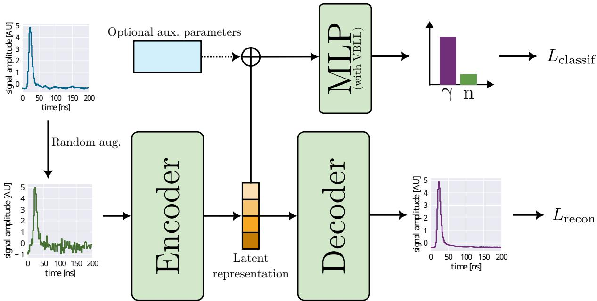
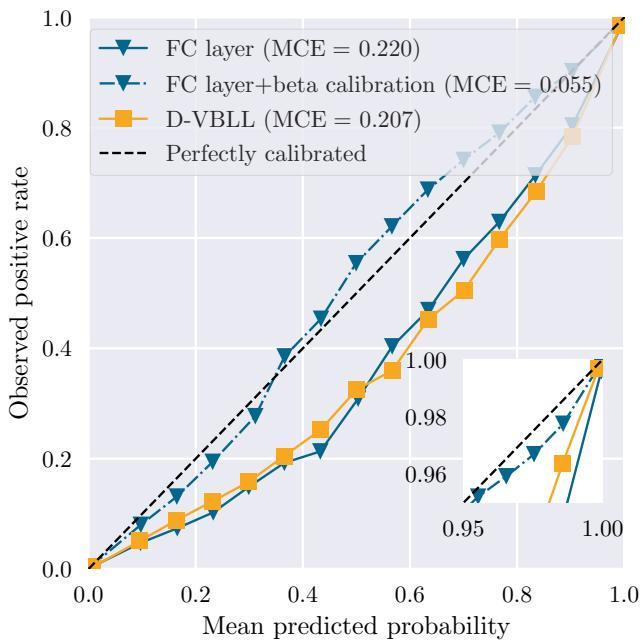
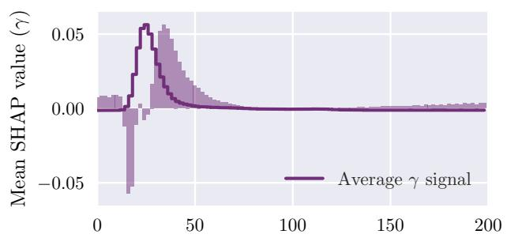
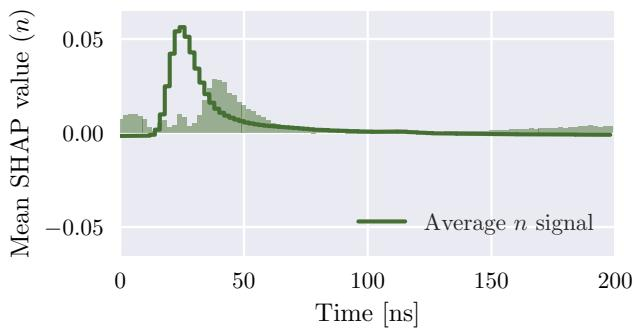

# SINAPSE 轻量、可解释的中子–γ 判别框架笔记

## 0. 论文信息

- 英文标题：SINAPSE: A lightweight deep learning framework for accurate and explainable neutron-γ discrimination
- 作者：Thomas Carreau；Adrien Matta；Owen Syrett；Benoît Mauss；David Etasse；Cyril Lenain；Pierre Morfouace；Julien Taieb；David Regnier；Patrick Copp；Matthew Devlin；Charlène Surault；Jason Surbrook
- 期刊状态：2026-09-05 被 Physical Review Research 接收
- 正式 DOI：[10.1103/qd3v-7j5p](https://doi.org/10.1103/qd3v-7j5p)
- 接收页：[APS accepted papers](https://journals.aps.org/prresearch/accepted/10.1103/qd3v-7j5p)
- 本地全文：[arXiv:2605.13627v2](https://arxiv.org/abs/2605.13627v2) author preprint，稿件日期 2026-06-02，并非 APS 排版版
- 本地 PDF：daily/2026-09-06/pdfs/Carreau et al. - 2026 - SINAPSE neutron-gamma discrimination.pdf
- 正文处理：官方 arXiv PDF 通过 `%PDF-`、文件类型、13 页元数据、SHA-256、非空 `pdftotext -layout` 校验，并成功完成 MinerU Markdown / 图片提取。

## 1. 问题与论文定位

有机液体闪烁体中的 neutron–γ pulse-shape discrimination（PSD）通常比较 prompt gate 与 total gate 的积分比。低 light output 时，信噪比下降，两类 band 重叠，手工 graphical cuts 不再稳定。SINAPSE 用一维卷积自编码器同时做 waveform denoising 和 classification，并把离散切线替换成可调置信度的概率输出。

论文的优势是大规模真实探测器波形、独立 prompt-γ 子集、校准分析和可部署模型；关键限制是低电荷区缺少可靠真值，因此很多“分类正确率”本质上是对传统 PSD 标签的一致性，而不是全能区的独立 ground truth。

## 2. 数据来源与标签结构

- 探测器：VENDETA 阵列，72 个 EJ-309 liquid scintillator cells。
- 数据：$^{240}$Pu spontaneous fission 与 LANSCE/WNR 测量，波形采样率 500 MS/s；每条波形 100 点、200 ns。
- 总计 2,484,531 条信号，其中 1,117,702 条有 ToF / PSD 组合标签；已标注样本中 23.6% 为中子。
- 训练集：100,000 条、200–510 keVee、类平衡；验证集：60,000 条、100–200 keVee、类平衡。
- 主测试集：293,821 条、0–200 keVee；独立 prompt-γ 子集：78,596 条、0–100 keVee。

训练波形要求 SNR 至少 10 dB，然后加入 ±4 ns 随机时间平移和 Gaussian noise，合成低信噪比条件。增强前后训练分布的 PSD figure of merit 约 1.8，而真实测试分布约 1.6；这说明 domain gap 被缩小但没有消失。

## 3. SINAPSE 架构

输入波形先经两层 1D CNN encoder，特征数依次为 16 和 32，压缩成 8 维 latent vector，压缩比约 12.5。随后分成两支：

- decoder 用 mean-squared error 重建去噪波形；
- classifier 用两层 MLP 输出 neutron probability，可选普通 fully connected（FC）末层或 variational Bayesian last layer（VBLL）。

总损失为

$$
\mathcal L=\lambda_{rec}\mathcal L_{MSE}+\lambda_{cls}\mathcal L_{cls},
$$

其中分类项对 FC 为 binary cross entropy，对 VBLL 为 ELBO。作者最多训练 3000 epochs，batch size 2048，AdamW 学习率 $3\times10^{-4}$、weight decay $10^{-4}$，前 50 epochs warm-up，early stopping patience 为 300。一次含预处理的训练在单张 NVIDIA RTX A1000 上约 2 h；这不是在线推理延迟。

## 4. 分类结果应怎样读

最优 `cnn_vbll_100k` 在主测试集的已标注部分相对 PSD 标签取得 precision = recall = 0.981。由于 0–100 keVee 区域正是传统标签不可靠区，这个数不能当作独立真值下的普适 1.9% error rate。

更强的独立检查来自 ToF 选择的高纯 prompt-γ 子集：校准后的 FC 模型准确率 92.3%，在 0.5 阈值下有 7.7% 被预测成中子。把置信阈值提高到 0.999 后，76% prompt γ 被正确识别，0.5% 被错判为中子，另 23.5% 保持不判定。这清楚展示了“coverage–contamination”权衡：概率模型的价值不是强制给每个弱信号贴标签，而是允许分析者选择污染率。

在 $<100$ keVee 的主测试集上：

- 99.9% 置信水平下，模型给出类别的信号占 63.1%，graphical cuts 为 55.5%；
- 99% 置信水平下，模型覆盖 74.4%。

这些比例说明模型在同一 VENDETA 数据域中扩大了可用样本，不等于对其他闪烁体、电子学链、增益或辐射场无需重标定即可泛化。

## 5. 校准比 Bayesian 标签更重要

普通 FC、VBLL 与 beta-calibrated FC 的 maximum calibration error（MCE）分别约 0.220、0.207 和 0.055。VBLL 在这套数据上没有显示校准优势；而 post-hoc beta calibration 明显改善概率可信度且不损伤分类性能。

工程上还有一个反直觉结论：自定义 VBLL 阻碍 framework-agnostic ONNX export，所以最终公开的可部署权重采用校准 FC 版本。选择模型时不能只看 Bayesian 名称或 precision / recall，还要同时看概率校准和部署链。

## 6. SHAP 解释到什么程度

平均 SHAP attribution 集中在约 25–75 ns 的早期衰减尾部，正是传统 PSD 区分 fast / delayed scintillation components 的物理时间窗。这个结果支持模型利用了可解释的 pulse-shape feature，而非明显的孤立噪声点。

但 SHAP 只描述当前模型、背景分布和输入域中的 attribution；它不能证明因果机制，也不能替代跨探测器、跨增益、跨辐射场的 robustness test。中子与 γ 是二分类互补概率，两类 SHAP 符号也天然互补，不能把这一对称性误当作额外的物理发现。

## 7. 去噪、部署与复现资产

- 作者在合成 Gaussian-noise benchmark 上报告 median reconstruction MSE 从 $3.9\times10^{-3}$（方差 0.05）到 $1.1\times10^{-2}$（方差 0.2）。这是对已知高 SNR 波形的合成污染闭环，不是全部真实低光输出的无真值去噪误差。
- 校准 FC 模型已导出 ONNX，并通过 `npsinapse` 接入 nptool / ONNX Runtime，可做 CPU event-by-event inference。
- 训练代码、预处理后的 VENDETA 数据集和模型权重公开，为独立 benchmark 提供了入口。

## 8. 对中子诊断与辐射防护的意义

SINAPSE 可直接服务于裂变中子、延迟中子与混合 neutron–γ 场的低阈值分析，也适合把“强制切线”升级为带置信度和 abstention 的事件筛选。对 laser-driven neutron、photonuclear 或 radiation-protection 场景，迁移前仍必须重新检查 scintillator type、digitizer sampling、gain、pile-up、energy calibration 和本底组成；本文没有激光源、光核转换靶、剂量或屏蔽实验。

## 9. 复习用速记

SINAPSE 的关键贡献不是一个孤立的 98.1% 数字，而是“共享 denoising encoder + 可校准概率 + 低电荷 abstention + ONNX 部署”。最可信的独立检验是 prompt-γ 子集的 92.3% accuracy；低电荷区的大部分评价仍受传统 PSD 标签质量限制，跨仪器泛化尚未验证。
