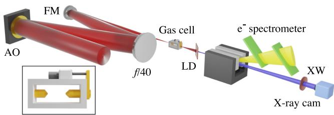
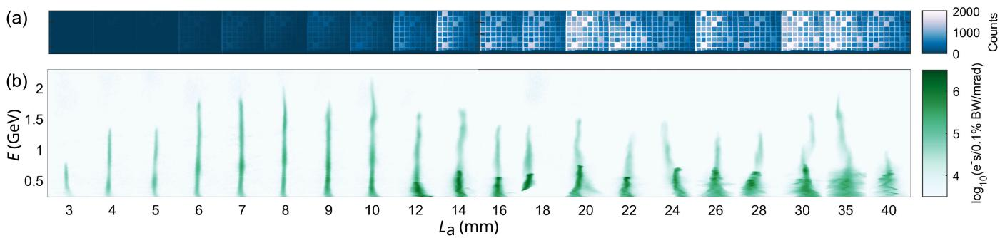
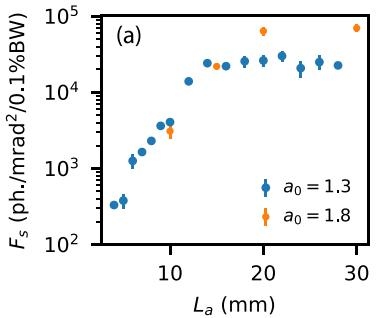
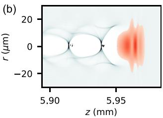
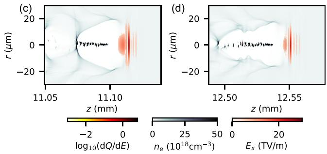

# 超过耗尽长度后的 LWFA 高通量 X 射线发射笔记

## 0. 论文信息

- 英文标题：High-Flux X-Ray Emission due to Injection into a Laser-Wakefield Accelerator beyond Its Depletion Length
- 作者：J. C. Wood；K. Põder；N. C. Lopes；J. M. Cole；S. Alatabi；A. J. Hughes；P. Foster；C. Kamperidis；O. Kononenko；S. P. D. Mangles；D. Neely；C. A. J. Palmer；D. R. Rusby；G. Sarri；M. J. V. Streeter；D. R. Symes；J. R. Warwick；Z. Najmudin
- 期刊：Physical Review Letters 137, 105001 (2026)
- DOI：[10.1103/krsl-322s](https://doi.org/10.1103/krsl-322s)
- 接收 / 发表日期：2026-07-09 / 2026-09-03
- 来源：[APS 论文页](https://journals.aps.org/prl/abstract/10.1103/krsl-322s)
- 本地 PDF：daily/2026-09-06/pdfs/Wood et al. - 2026 - High-flux X-ray emission beyond LWFA depletion length.pdf
- 正文处理：APS 官方开放全文通过 `%PDF-`、文件类型、7 页元数据、SHA-256、非空 `pdftotext -layout` 校验，并成功完成 MinerU Markdown / 图片提取。

## 1. 一句话定位

作者用可变长度气室同时扫描 LWFA 电子谱和 betatron X 射线，发现激光传播超过耗尽长度后会再注入一个低能但高电荷、大横向振幅的电子束团；第二束团使峰值谱通量提升约一个数量级。这里的 X 射线增强是实验观测，第二注入的形成机制则由实验反演与 FBPIC 模拟共同支持，不能把两类证据写成同一层级。

## 2. 实验布局与诊断链

- 驱动激光约 110 TW、800 nm、能量 $(5.6\pm0.3)$ J，初始焦斑大于 matched spot size。
- 气室加速长度 $L_a$ 可在 3–42 mm 范围变化，从而在相同密度平台上扫描 wake 演化。
- 电子由偶极磁谱仪测量，低能截止约 230 MeV；电荷通过 imaging plate 交叉标定。
- X 射线空间分布由真空内 CsI 闪烁体记录，谱由滤片透过反演得到；因此临界能量 $E_c$ 和光子数仍依赖探测器响应、谱形模型与标定。

对 betatron 辐射，作者采用 synchrotron-like 近似谱：

$$
S(E;E_c)\propto \gamma^2\left(\frac{E}{E_c}\right)^2K_{2/3}^2\left(\frac{E}{2E_c}\right),
$$

并使用

$$
E_c=\frac{3\hbar}{4c}\gamma^2\omega_p^2r_\beta
$$

把电子能量、等离子体频率和 betatron 振幅 $r_\beta$ 连接起来。这个关系使联合电子 / X 射线谱可以反演 $r_\beta$，但它不是逐粒子轨迹的直接测量。

## 3. 两阶段电子束与 X 射线演化

第一束团在较短传播距离内自注入并加速到 $>2$ GeV，产生 $E_c>20$ keV 的较硬 X 射线。论文给出的 pump-depletion 长度估计为

$$
L_{pd}=\frac{\omega_0^2}{\omega_p^2}c\tau\simeq10.2\ \mathrm{mm}.
$$

当 $L_a$ 超过这一尺度，第一束团开始 dephase；同时出现第二个约 140–360 pC、能量不超过约 0.7 GeV 的高电荷束团。$L_a=9$–20 mm 区间的平均 X 射线计数增加约 6–10 倍。第二束团能量更低、对应 $E_c$ 约 12–17 keV，却因电荷和横向运动更强而主导总光子产额。

## 4. 光子通量、亮度与量值边界

- 峰值谱通量达到 $(7.0\pm0.8)\times10^4$ photons/mrad²/0.1%BW。
- 单发 $>1$ keV 光子数最大为 $5.6\times10^{10}$，正文概括为第二束团贡献 $>5\times10^{10}$ photons/shot。
- 作者用模拟给出的 42 fs X 射线脉宽与 $r_\beta=2\ \mu$m 估算峰值亮度为 $1.3\times10^{23}$ photons/s/mm²/mrad²/0.1%BW。

前两项来自校准诊断和谱反演；亮度还引入了模拟脉宽与源尺寸假设，因而应写成“推算亮度”，不能写成直接测得的时间分辨亮度。

## 5. 为什么低能第二束团反而更亮

联合电子谱与 X 射线谱拟合给出：第一束团的 $r_\beta$ 约 0.6–1 μm，第二束团约 2–3 μm。后者更大的 betatron 振幅和更高电荷补偿了较低的 $\gamma$，解释了光子数增加但 $E_c$ 没有同步变硬的现象。

作者的 quasi-cylindrical 3D FBPIC 模拟采用两个方位角模式。模拟中耗尽长度约 9.8 mm；传播过程中激光压缩使峰值 $a_0$ 从 5.6 增至 8.2，bubble 半径从 14.9 μm 增至 19 μm，较晚注入的 sheath electrons 因 canonical momentum 与 bubble 几何获得更大的横向动量。作者报告第二束团归一化发射度约 $2.7\times1.6\ \mu$m，而第一束团约 $0.6\times0.7\ \mu$m。

模拟的第一束团最高能量约 2.6 GeV，高于实验；其目的主要是定位演化机制，并非对每个实验 shot 的精确复现。论文也比较并排除了“高能电子与激光直接相互作用”或 hosing 作为主要解释：那些机制通常应使谱变硬，而实验在通量增长时没有看到相应 $E_c$ 上升。

## 6. 对诊断与应用的意义

- 对 phase-contrast imaging、Laue diffraction 和 X-ray absorption spectroscopy，关键增益是 10–20 keV 附近的谱通量，而不是单纯追求最高电子能量。
- 通过“故意不匹配焦斑 + 传播至耗尽长度之后”形成第二注入，可能比只优化第一束团能量更适合高光子数 betatron 源。
- 设计实验时需同时保留电子分束诊断、绝对电荷、X 射线角分布、谱响应和传播长度扫描；仅凭 X 射线总计数无法区分电荷、$r_\beta$ 与 $\gamma$ 的贡献。
- 该源是 keV betatron X 射线，不是 MeV bremsstrahlung / inverse Compton γ 源；论文没有转换靶、光核反应、中子产额、活化、剂量或屏蔽实测。

## 7. 证据边界与待验证问题

- 已验证的是论文内的实验长度扫描、电子 / X 射线联合诊断及作者模拟；本轮没有在本地运行 FBPIC，也没有复算滤片反演。
- $r_\beta$、42 fs 脉宽和峰值亮度含模型依赖；应与直接测量的电荷、谱图和 CCD 信号分开报告。
- 模拟仅保留两个 azimuthal modes，且第一束团能量高于实验；更严格复现仍需网格 / 粒子数 / 模式数收敛和 shot-to-shot 不确定度。
- “超过耗尽长度”不等于所有装置都会增亮；该结果依赖初始 oversized spot、密度、脉宽、气室几何与第二次注入窗口。

## 8. 复习用速记

这篇 PRL 的核心不是“更高电子能量”，而是耗尽长度附近的激光压缩和 bubble 扩张触发了第二个高电荷、大 $r_\beta$ 束团。实验直接看到 X 射线计数和谱通量跃升；$r_\beta$ 与第二注入机制分别来自联合反演和 FBPIC 支撑，峰值亮度还包含模拟脉宽假设。
