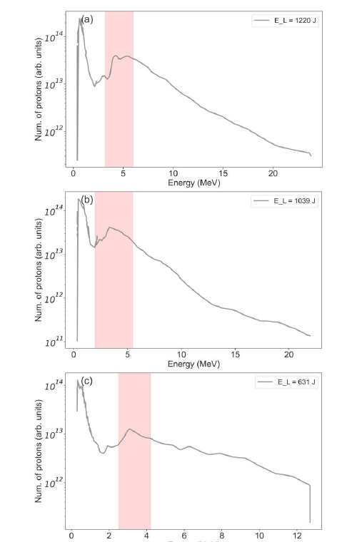
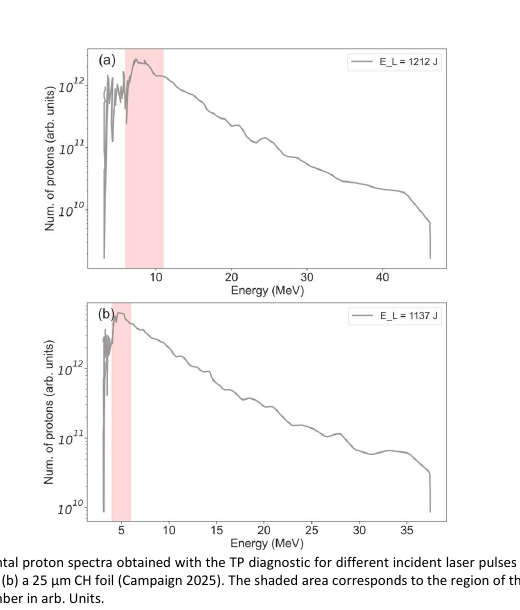
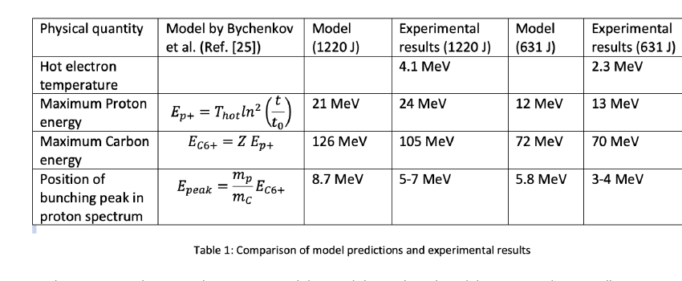

# 塑料箔靶中激光驱动质子束团化实验笔记

## 0. 论文信息

- 英文标题：Experimental Investigation of laser driven proton bunching with plastic foil targets
- 作者：D. Batani；A. Milani；G. Malka；D. Mancelli；H. Larreur 等
- 期刊：High Power Laser Science and Engineering（开放获取 accepted manuscript）
- DOI：[10.1017/hpl.2026.10184](https://doi.org/10.1017/hpl.2026.10184)
- 在线日期：2026-07-22
- 来源：[Cambridge Core 论文页](https://www.cambridge.org/core/product/314E4B697ED3C4331A35C84B7E479AE8)
- 本地 PDF：daily/2026-09-07/pdfs/Batani et al. - 2026 - Laser-driven proton bunching with plastic foils.pdf
- 正文处理：Cambridge 开放 accepted manuscript 通过 `%PDF-`、文件类型、16 页元数据、SHA-256 和非空 `pdftotext -layout` 校验。当前环境缺少 `MINERU_TOKEN`；图像来自本地 PDF 页面渲染并经人工查看。

## 1. 文章定位

论文报告 2024 与 2025 年在大阪大学 LFEX 上完成的两轮实验，重点不是刷新质子截止能量，而是解释 TNSA 质子谱中出现的中能峰。作者把该峰归因于同时加速的高电荷碳离子，尤其 $\mathrm{C}^{6+}$，对快质子形成 Coulomb-piston 式调制。

这是质子峰结构的实验观测，机制判断还结合简化解析标度与一维 SMILEI PIC。峰位置与碳离子能量的一致性支持该解释，但不等于已经直接测量质子—碳前沿之间的瞬态电场。

## 2. 激光、靶与诊断

- LFEX：四束 Nd:glass 激光，波长 1.05 μm，生成能量最高约 1.2 kJ，压缩后脉宽约 1.5 ps。
- 论文估计生成 1200 J 时约 360 J 到靶，约一半到靶能量落在直径约 50 μm 焦斑内，对应峰值强度约 $1.4\times10^{19}$ W/cm²。文中的 shot 标签使用生成能量，不是实际到靶能量。
- 两轮合计 6 发：2024 年 3 发 6 μm CH 箔；2025 年比较 6 μm 与 25 μm CH 箔。
- 主要诊断：Thomson parabola + image plate 取得质子和碳离子谱，磁谱仪取得热电子谱。
- ASE 预脉冲会把 6 μm CH 靶烧蚀至剩余约 1.5 μm 固态层，并形成长预等离子体；该轮廓由 MULTI 计算，不是靶上直接密度测量。

## 3. 2024 年质子峰

6 μm CH 箔的三发数据均出现明显的中能峰，峰位置随生成激光能量近似上移：

- 1220 J：峰约 5 MeV，质子截止能量约 24 MeV；
- 1039 J：峰约 4 MeV；
- 631 J：峰约 2.7 MeV，截止能量约 13 MeV。

对应热电子温度约为 4.1、3.0 和 2.3 MeV。碳谱本身近指数衰减，没有同样的峰；在高、低能量发次中推断的 $\mathrm{C}^{6+}$ 最高总能量分别约 105 与 70 MeV。

## 4. 2025 年靶厚比较与诊断阈值

2025 年 6 μm 靶的质子截止能量约 47 MeV、峰约 8 MeV，均高于 2024 年相近生成能量发次。作者认为四束 LFEX beamlet 的时间重叠改善、有效强度提高是主要原因。

25 μm 靶的截止能量降到约 37 MeV，峰也向低能移动。较厚靶会增加热电子传输损失、扩大后表面电子斑并削弱 recirculation，从而降低 sheath field、碳离子能量和电荷态。

必须注意 2025 年 TP 对约 3 MeV 以下质子不敏感，因此不能直接用“低能增强消失”证明物理上不存在低能峰。

## 5. Coulomb-piston 解释

简化模型认为碳离子前沿移动较慢，在其附近形成局域电荷分离场；较快的质子追上该前沿后获得额外调制，于是谱中形成峰。模型使用测得的碳能量估算峰位置：

- 1220 J：实验 $\mathrm{C}^{6+}$ 最高能量约 105 MeV，对应质子峰 5–7 MeV；
- 631 J：实验 $\mathrm{C}^{6+}$ 最高能量约 70 MeV，对应质子峰 3–4 MeV。

高强度和约 1.5 ps 长脉冲有利于更高碳电荷态、更强电子 recirculation 与更长耦合时间；多个碳电荷态则会把单一前沿的场结构抹宽。

## 6. SMILEI 支撑计算

作者进行一维 SMILEI PIC：质子与 $\mathrm{C}^{6+}$ 等量，最高电子密度 50 $n_c$，200 particles/cell，$dx=0.005$ μm，$dt=0.016$ fs，域长 160 μm，初始温度 1 keV，$a_0=4.5$。在 $t=4.2$ ps 时，质子谱出现约 10–15 MeV 峰，而在后表面刚诊断时没有该峰，支持“传播中被碳离子前沿调制”的图景。

论文明确指出该一维计算只用于支持模型，不能替代或验证模型；它无法表达约 50 μm 焦斑、干涉结构、二维/三维发散、碰撞与完整电离动力学。

## 7. 应用含义与边界

- 对 proton fast ignition、医用放射性同位素、$p{}^{11}\mathrm{B}$ 和质子照相而言，峰位置与能宽常比最大能量更重要。
- 当前工作只观测了束流能谱，没有把束团化后的质子打到 catcher 靶并测量同位素、聚变或剂量增益。
- 峰的纵向时间结构、束团持续时间、发散角和总电荷没有被完整闭合；“energy bunch”首先是能谱峰，不应自动理解成时间上很短的束团。
- 仅 6 发且跨两轮实验，不能给出稳健的 shot-to-shot 统计或装置级重复性。
- 到靶能量和有效强度包含传输与 beamlet-overlap 估计；跨年度比较不能只用生成激光能量归一化。

## 8. 复习用速记

LFEX 的 1.5 ps、百焦耳到靶脉冲在薄 CH 箔上产生随激光能量移动的质子谱峰；碳谱、电荷态、解析标度和一维 SMILEI 都与 $\mathrm{C}^{6+}$ Coulomb piston 相容。直接证据是 6 发质子/碳/电子谱，核应用收益、时间束团和机制唯一性仍未闭合。
