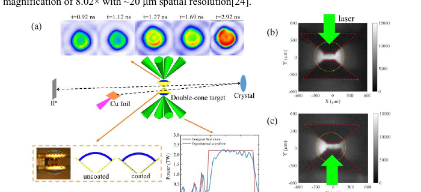
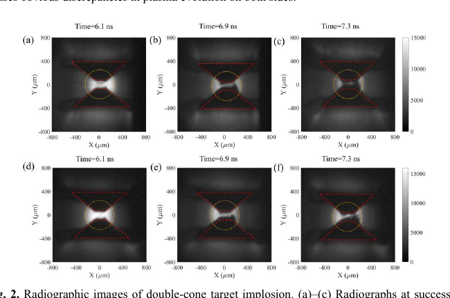
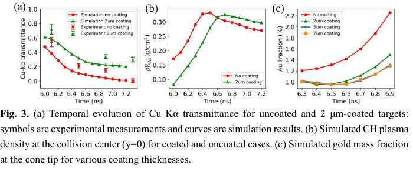

# 双锥点火中 Kelvin–Helmholtz 金污染及 CH 涂层缓解笔记

## 0. 论文信息

- 英文标题：Observation and Mitigation of Kelvin–Helmholtz Instability-Driven Gold Contamination in Double-Cone Ignition
- 作者：Chenglong Zhang；Yihang Zhang；Ke Fang；Yu Dai；Haochen Gu 等
- 期刊：High Power Laser Science and Engineering（开放获取 accepted manuscript）
- DOI：[10.1017/hpl.2026.10181](https://doi.org/10.1017/hpl.2026.10181)
- 在线日期：2026-07-23
- 来源：[Cambridge Core 论文页](https://www.cambridge.org/core/product/4E355E2AFD8D14131309D4485CF3E91C)
- 本地 PDF：daily/2026-09-07/pdfs/Zhang et al. - 2026 - Kelvin-Helmholtz gold contamination in DCI.pdf
- 正文处理：Cambridge 开放 accepted manuscript 通过 `%PDF-`、文件类型、14 页元数据、SHA-256 和非空 `pdftotext -layout` 校验。当前环境缺少 `MINERU_TOKEN`；图像来自本地 PDF 页面渲染并经人工查看。

## 1. 文章定位

论文研究 double-cone ignition（DCI）中高 $Z$ 金锥材料污染 CH 燃料的问题。SG-II Upgrade 的 Cu K$\alpha$ 时间分辨背光图像显示锥尖边缘的 spike 结构；三维 FLASH radiation-hydrodynamics 把它解释为两阶段过程：X 射线先烧蚀金锥内壁形成 Au pre-plasma，随后 CH 流与 Au 之间的切向速度差驱动 Kelvin–Helmholtz instability（KHI），把金卷吸到锥尖。

作者进一步在金锥内壁加入 2 μm CH 涂层，并在实验中观察到更高 Cu K$\alpha$ 透射率。实验直接支持涂层减少高 $Z$ 吸收；KHI 增长率、Au 质量分数和辐射冷却损失的定量解释主要来自 FLASH 与 opacity 后处理。

## 2. 实验构型

- 两个金锥：壁厚 20 μm，开口角 100°，锥尖间距 100 μm。
- CH 壳：内半径 500 μm，厚度 50 μm，初始密度 1.1 g/cm³。
- 压缩驱动：8 束 351 nm Nd:glass 激光，总能量 14 kJ，每束脉宽 4.94 ns，并有 3 个 picket。
- 背光：500 J、10 ps 激光打 Cu 箔，产生约 50 ps 的 Cu K$\alpha$ 源；quartz (2131) 晶体给出 8.02 倍放大和约 20 μm 空间分辨率。
- 比较无涂层金锥与内壁 2 μm CH 涂层金锥。

## 3. 直接观测

单侧驱动时，未受激光一侧保持完整，受驱动一侧锥尖出现扩展和约 160 μm 间距的 spike。双侧驱动的时间序列中，两锥间距随时间缩小、碰撞区透射率下降；带 CH 涂层的目标在同一阶段持续显示更高透射率。

这些图像是实验测量。把 spike 唯一归因于 KHI、把透射率变化分解成 CH 与 Au 各自面密度，需要后续模拟和 opacity 模型。

## 4. 透射率与污染量分解

图 3 中：

- 符号是实验 Cu K$\alpha$ 透射率，曲线是模拟；
- 模拟显示带/不带涂层的 CH 面密度接近，因此作者把透射率提升归因于 Au 抑制；
- Au 质量分数随时间和涂层厚度的曲线完全来自模拟，不是实验直接化学定量。

透射计算采用

$$
T=\exp\left(-\kappa_{\mathrm{Au}}\rho R_{\mathrm{Au}}-\kappa_{\mathrm{CH}}\rho R_{\mathrm{CH}}\right),
$$

其中 opacity 由 PROSPACEOS 的稳态 non-LTE 条件给出。作者用图像曝光窗口仅几十皮秒、宏观演化在纳秒尺度来论证稳态原子动力学近似。

## 5. 两阶段机制与涂层作用

三维 FLASH 域为 $750\times750\times900$ μm³，使用 three-temperature 模型和六群辐射扩散：

1. $t<4.0$ ns：激光驱动辐射，尤其模拟中的 2.4–2.8 keV Au M-band，烧蚀金锥内壁；约 5 ns 时内壁等效辐射温度约 68 eV。
2. $t>4.0$ ns：高速 CH 到达 Au pre-plasma，切向速度差触发 KHI，Au 出现卷曲并向锥尖输运。

CH 涂层一方面优先承受辐射烧蚀、降低界面 Au 密度，另一方面把直接 CH–Au 剪切改成 CH–CH–Au 分层，降低内层速度差。模拟给出 KHI onset 从约 4.1 ns 延迟到 4.6 ns；这个 500 ps 延迟是数值诊断，不是背光图像直接测得的线性增长率。

## 6. 对点火性能的含义

作者用

$$
P_{\mathrm{brem,Au}}/P_{\mathrm{brem,DT}}\approx f_{\mathrm{Au}}Z_{\mathrm{Au}}^2
$$

估算高 $Z$ 污染的辐射惩罚。若 keV 条件下 $Z_{\mathrm{Au}}\approx60$，即使 $f_{\mathrm{Au}}\sim0.1\%$ 也对应约 3.6 倍的 Au/DT bremsstrahlung 功率比量级。该关系说明小量 Au 很危险，但并不等于实验直接测出了总辐射损失或点火阈值。

论文的工程启示是：内壁涂层降低 Au pre-plasma，表面更平滑则减小初始扰动波数；两者作用于 KHI 增长率的不同因子，可联合优化。

## 7. 证据边界与未闭合问题

- 已直接验证：锥尖背光结构、透射率时间演化，以及 2 μm CH 涂层相对无涂层的改善。
- 模型辅助：Au/CH 面密度分解、Au 质量分数、KHI onset、增长率、M-band 辐射场与 bremsstrahlung 惩罚。
- 论文没有直接测量 DT 燃料增益、点火阈值、快电子沉积或中子产额；“bringing plasma purity closer”不能改写成已经改善点火或实现高增益。
- 图像右侧非对称被归因于驱动能量不均匀，提示 coated/uncoated 比较仍需 shot-to-shot 与照明不均匀误差预算。
- 实验空间分辨率约 20 μm，而 KHI 初始扰动与 5 μm 数值网格有关；增长率对真实内壁粗糙度谱的依赖仍待专门实验。

## 8. 复习用速记

SG-II Upgrade 背光实验显示 DCI 金锥内壁污染并验证 2 μm CH 涂层能提高透射率；三维 FLASH 将其解释为“辐射预烧蚀 + KHI 卷吸”两阶段过程。污染减少有实验支撑，但 Au 分数、500 ps KHI 延迟和点火辐射惩罚仍是模型量，尚无 DT 增益或中子产额闭环。
