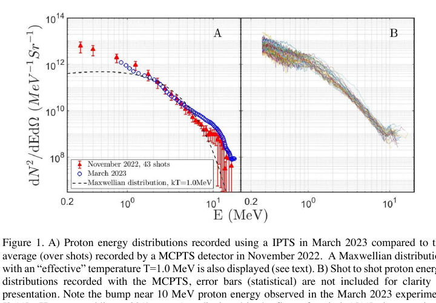
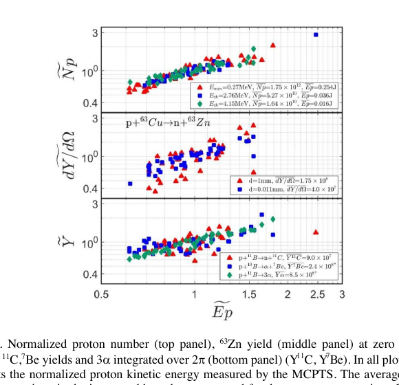
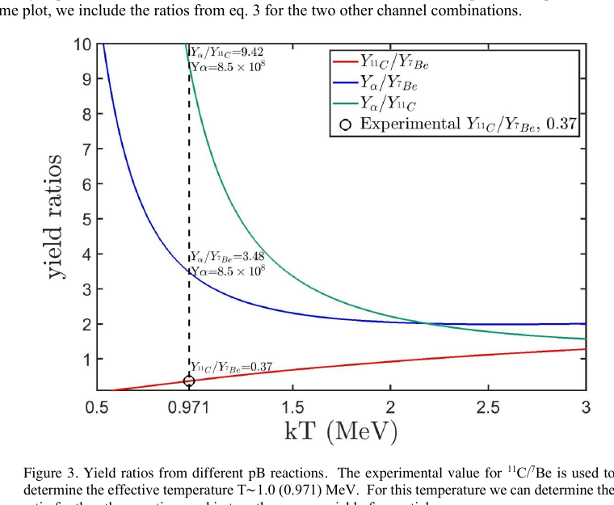

# 准中性 TNSA 等离子体非平衡特性与核反应产额笔记

## 0. 论文信息

- 英文标题：Detailed study of non-equilibrium characteristics of quasi-neutral TNSA plasmas
- 作者：Zhe Zhu；A. Bonasera；Dimitri Batani；M. R. D. Rodrigues；Katarzyna L. Batani 等
- 期刊：High Power Laser Science and Engineering（开放获取 accepted manuscript）
- DOI：[10.1017/hpl.2026.10188](https://doi.org/10.1017/hpl.2026.10188)
- 在线日期：2026-08-03
- 来源：[Cambridge Core 论文页](https://www.cambridge.org/core/product/EB854A90AE81D74E778949520030BE9E)
- 本地 PDF：daily/2026-09-07/pdfs/Zhu et al. - 2026 - Non-equilibrium quasi-neutral TNSA plasmas.pdf
- 正文处理：Cambridge 开放 accepted manuscript 通过 `%PDF-`、文件类型、23 页元数据、SHA-256 和非空 `pdftotext -layout` 校验。当前环境缺少 `MINERU_TOKEN`，因此本轮没有声称完成 MinerU 转换；图像来自本地 PDF 页面渲染并经人工查看。

## 1. 文章定位

本文重新分析 2022 年 11 月 VEGA III 的激光 TNSA 实验及 2023 年 3 月的后续实验，把逐发质子能谱与先前通过 HPGe 衰变测量得到的放射性同位素产额连接起来。核心链条是：

1. 用逐发质子谱、反应截面和 SRIM 射程重新分配单发核反应率；
2. 用实验的 $^{11}\mathrm{C}/{}^{7}\mathrm{Be}$ 产额比定义等效温度；
3. 由该温度推算 $p+{}^{11}\mathrm{B}\rightarrow3\alpha$ 的平均与最大产额；
4. 比较质子平均能量与理想气体关系，并用 KdV 孤子形式对偏离进行现象学拟合。

它是少见的“激光加速质子束 → catcher 靶核反应 → 放射性核素诊断”实证链，但本文新增的单发产额与 $\alpha$ 产额包含反应模型和分配假设；不能把全部数字都写成逐发直接测量。

## 2. 实验与诊断链

- 主实验：CLPU VEGA III，名义激光能量约 30 J，经过压缩器与聚焦光学后约 7 J 到靶，脉宽约 200 fs。
- pitcher：6 μm Al 薄靶，产生 TNSA 质子和杂质离子。
- catcher：天然 B 厚靶，距离 Al 靶约 2 cm；另用不同厚度天然 Cu 靶研究 $^{63}\mathrm{Zn}$。
- 2022 年 MCPTS 在靶法线方向给出 43 发平均谱和逐发谱；论文后续 EoS 图使用其中 41 发。2023 年 IPTS 给出 20 发累积谱，并在约 10 MeV 附近显示 bump。
- HPGe 测的是多发累积后的同位素衰变。逐发核产额不是逐发 HPGe 计数，而是以逐发质子谱对累积产额重新加权。

论文假设安装 catcher 时朝向 catcher 的质子谱可由无 catcher 时的 0° 谱代表。不同方向、不同轮次的重复结果为该假设提供支持，但它仍是系统误差来源。

## 3. 四个反应通道

论文处理：

- $^{63}\mathrm{Cu}(p,n){}^{63}\mathrm{Zn}$，$Q=-4.15$ MeV；
- $^{10}\mathrm{B}(p,\alpha){}^{7}\mathrm{Be}$，$Q=1.14$ MeV；
- $^{11}\mathrm{B}(p,n){}^{11}\mathrm{C}$，$Q=-2.76$ MeV；
- $^{11}\mathrm{B}(p,\alpha)2\alpha$，总释放能约 8.6 MeV，对应末态 3 个 $\alpha$。

高阈值、负 $Q$ 反应对高能尾部更加敏感，因此逐发质子谱涨落会显著放大 $^{63}\mathrm{Zn}$ 等通道的产额涨落。图 2 中 $^{11}\mathrm{C}$、$^{7}\mathrm{Be}$ 是基于既有 HPGe 实验总产额进行逐发分配；$3\alpha$ 通道则进一步由产额比推断。

## 4. 等效温度与 alpha 产额

实验给出的 $Y_{^{11}\mathrm{C}}/Y_{^{7}\mathrm{Be}}=0.37$ 对应等效温度 $kT=0.971$ MeV。这里“等效”是指：一个 Maxwellian 分布在给定截面、靶厚和射程模型下产生同样的产额比；它不是局域热平衡温度的直接测量。

作者由 $\alpha/{}^{11}\mathrm{C}$ 与 $\alpha/{}^{7}\mathrm{Be}$ 两组比值得到一致的平均 $\alpha$ 数约 $8.5\times10^8$。逐发重建给出的最大值为 $(1.6\pm0.5)\times10^9$ 个 $\alpha$（前向 $2\pi$）。需要严格区分：

- $^{11}\mathrm{C}$、$^{7}\mathrm{Be}$ 和 $^{63}\mathrm{Zn}$ 有 HPGe 衰变测量基础；
- $\alpha$ 难以从厚 B catcher 中直接逸出并从强质子背景中分辨，本文数值主要由已测同位素比、截面与 SRIM 射程反演；
- 论文估计若后向再放一块 B catcher，几何上可能再获得约一倍产额，但这不是已完成实验。

## 5. “TNSA-EoS”与孤子解释

作者将逐发平均质子能量与等效温度的关系称为 TNSA equation of state。与带探测阈值的理想 Maxwellian 关系相比，实验点在不同能量截断下可高于或低于理想值，单点误差估计最多约 20%。

论文把偏差解释为电子先行引起的电荷分离与恢复准中性的瞬态电场，并用 Korteweg–de Vries 孤子解拟合。由 6 μm 靶厚与零偏离时刻估得典型扰动传播速度约 $2\times10^9$ cm/s；但参数组合不能唯一给出孤子速度，作者也明确将 KdV 解释称为“purely speculative”。

因此较稳妥的结论是：实验显示非平衡偏离和瞬态电荷分离的证据，KdV 孤子只是一个能描述曲线的候选现象学模型，并未被唯一验证。

## 6. 对激光核应用的意义

- 同位素比可作为对质子谱低维压缩后的核反应诊断量，并提供独立于单一能谱拟合的等效温度。
- 负 $Q$ 通道强调高能尾部，$p{}^{11}\mathrm{B}$ 则更依赖低能质子数；优化应用时不能只看质子截止能量。
- 逐发谱涨落会传递到活化和同位素产额，平均谱不足以描述可重复性。
- pitcher–catcher 的角分布、几何接受度、截止阈值与 SRIM/截面不确定度应进入产额误差预算。

## 7. 证据边界与复现缺口

- 本文主要复用和再分析 2022/2023 的实验数据，不是 2026 年新进行的一轮束流实验。
- $\alpha$ 产额是反演值，不是 $\alpha$ 探测器的直接计数；“最大 $1.6\times10^9$”不能写成直接测得。
- 等效温度不是证明 TNSA 等离子体达到全局 Maxwell–Boltzmann 平衡。
- KdV 拟合不是对孤子动力学的唯一识别，作者要求后续改变靶厚、材料、脉宽和能量做系统实验。
- 论文没有给出束流到患者剂量、工程化同位素产率、重复频率、辐射防护或临床可用性闭环。

## 8. 复习用速记

VEGA III 的逐发 TNSA 质子谱与 HPGe 同位素产额共同约束 $kT\approx0.97$ MeV 的等效温度；作者据此推断平均 $8.5\times10^8$、最高约 $(1.6\pm0.5)\times10^9$ 个 $\alpha$。实验直接支撑的是质子谱与放射性核素衰变，$\alpha$ 产额和 KdV 孤子解释分别是反演和现象学模型。
