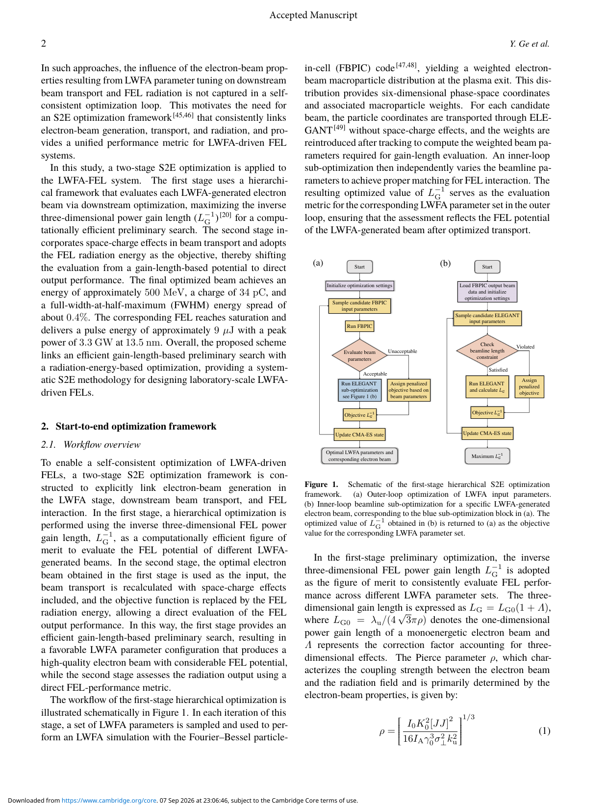
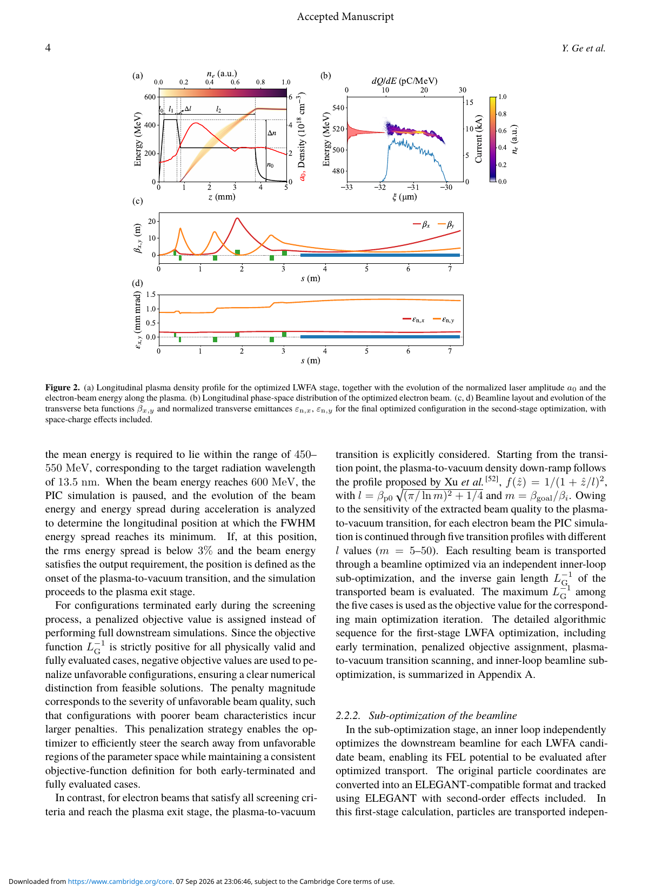
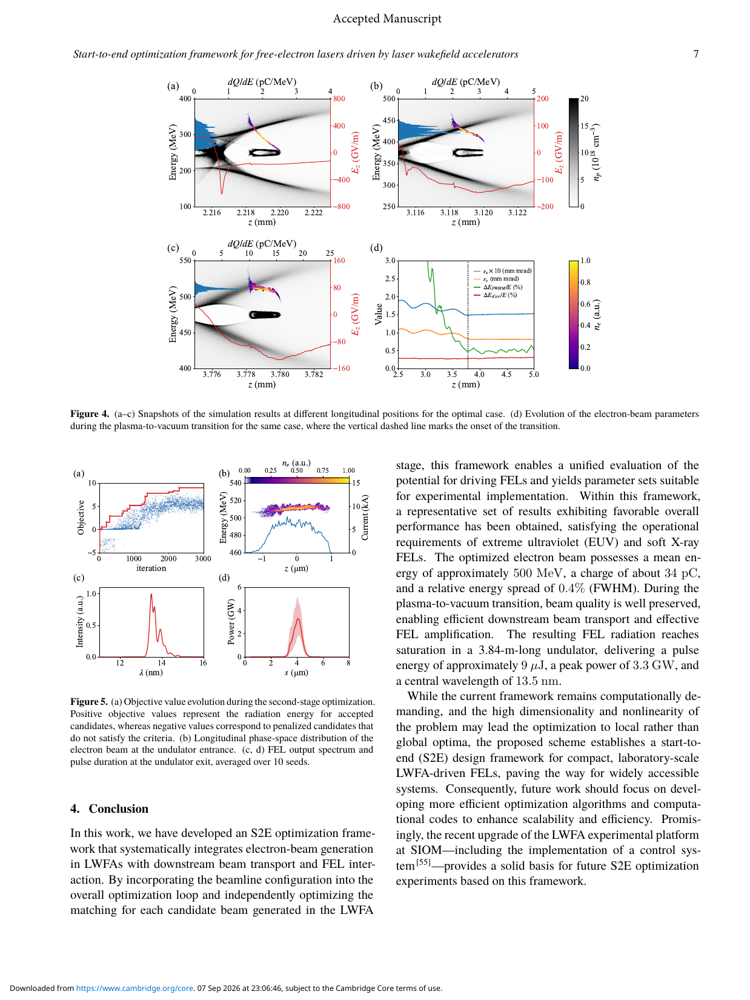

# LWFA 驱动 FEL 的端到端双阶段优化笔记

## 0. 论文信息

- 英文标题：Start-to-end optimization framework for free-electron lasers driven by laser wakefield accelerators
- 作者：Yanjie Ge；Ke Feng；Hai Jiang；Kangnan Jiang；Runshu Hu；Xizhuan Chen；Shixia Luan；Wentao Wang；Ruxin Li
- 期刊：High Power Laser Science and Engineering（开放获取 accepted manuscript）
- DOI：[10.1017/hpl.2026.10191](https://doi.org/10.1017/hpl.2026.10191)
- 在线日期：2026-07-30
- 来源：[Cambridge Core 论文页](https://www.cambridge.org/core/product/6C0FD5325CF26134016413B750D7C3CC)
- 主题关键词：LWFA；FEL；start-to-end optimization；FBPIC；beam transport；GENESIS
- 本地 PDF：`daily/2026-09-08/pdfs/Ge et al. - 2026 - LWFA-driven FEL start-to-end optimization.pdf`
- 正文处理：Cambridge 开放 accepted manuscript 通过 `%PDF-`、文件类型、13 页元数据、SHA-256 和非空 `pdftotext -layout` 校验。当前环境缺少 `MINERU_TOKEN`，因此未声称完成 MinerU 转换；图像来自本地 PDF 页面渲染并已人工查看。

## 1. 摘要与文章定位

### 1.1 核心结论

- 作者把 FBPIC 激光尾场加速、ELEGANT/OCELOT 束线输运和 GENESIS FEL 辐射接进同一优化链，不再只优化等离子体出口电子束。
- 第一阶段用三维 FEL 功率增益长度的倒数筛选 LWFA 参数，并为每个合格电子束单独优化束线；第二阶段加入空间电荷，以多随机种子的 FEL 辐射能量为目标继续优化。
- 代表性数值解给出约 `500 MeV`、`34 pC`、`0.4%` FWHM 相对能散的电子束，并在 `3.84 m` 波荡器中得到 `13.5 nm`、约 `9 μJ`、峰值约 `3.3 GW` 的饱和 FEL 输出。
- 全文是作者运行的 start-to-end 数值设计与优化，不是 SIOM 平台已经产生上述 FEL 脉冲的实验报告。

### 1.2 研究问题

LWFA 的激光、密度坡度、注入与束流品质彼此强耦合；即使等离子体出口束流看似优秀，漂移、强聚焦、空间电荷和 FEL 匹配仍可能放大能散或发射度。论文的关键贡献不是某一个“最优参数”，而是把下游可用性反向纳入上游 LWFA 选择。

## 2. 双阶段端到端框架

### 2.1 第一阶段：增益长度代理目标

外环由 CMA-ES/Optuna 采样 LWFA 参数并运行 FBPIC；电子束未通过电荷、能量、能散或持续加速检查时提前终止并赋负惩罚。通过筛选的六维加权宏粒子分布送入 ELEGANT，内环在束线长度约束内搜索四极磁铁与漂移长度，使 FEL 三维功率增益长度最短。内环最优的增益长度倒数再返回外环，作为该组激光—等离子体参数的评分。

#### FEL 增益长度与 Pierce 参数

$$
L_G=L_{G0}(1+\Lambda),\qquad L_{G0}=\frac{\lambda_u}{4\sqrt{3}\pi\rho}
$$

$$
\rho=\left[\frac{I_0K_0^2[JJ]^2}{16I_A\gamma_0^3\sigma_\perp^2k_u^2}\right]^{1/3}
$$

**变量说明：**

- $L_G$：含三维修正的 FEL 功率增益长度；$\Lambda$ 汇总衍射、能散和发射度等三维惩罚。
- $\lambda_u$、$k_u=2\pi/\lambda_u$：波荡器周期与波数；$K_0$ 为波荡器参数。
- $I_0$：电子束峰值电流；$I_A=17\,\mathrm{kA}$ 为 Alfvén 电流。
- $\gamma_0$：电子束 Lorentz 因子；$\sigma_\perp$ 为 rms 横向束斑。
- $[JJ]=J_0(\xi)-J_1(\xi)$：平面波荡器耦合因子。

**推导思路：** 一维高增益 FEL 中，辐射场与电子密度调制的耦合强度由 $\rho$ 控制，线性不稳定性的增长率正比于 $\rho$，因此 $L_{G0}\propto1/\rho$。三维束流的有限横向尺寸、发射度与能散降低有效耦合，以乘法修正 $1+\Lambda$ 延长增益长度。

**物理直觉：** 更高电流、更强波荡器耦合和更小束斑会增大 $\rho$；更高电子能量通过 $\gamma_0^3$ 显著减小 $\rho$。因此不能只追求高能量，必须同时保持高峰值电流、低能散和可匹配的横向相空间。

### 2.2 第二阶段：直接优化辐射能量

作者对第一阶段最优束流做局部切空间 up-sampling，用 OCELOT 重新计算含二阶输运和空间电荷的束线，再把束流送入 GENESIS。若预测 $L_G>2\,\mathrm{m}$，则跳过昂贵辐射计算；其余候选各运行 10 个随机种子，以平均 FEL 辐射能量作为目标。

这一阶段把“具有 FEL 潜力”升级为“在指定束线中确实得到较高的模拟辐射能量”，但仍取决于模型、宏粒子重采样、随机噪声注入和局部优化结果。

## 3. LWFA 与束线参数化

### 3.1 LWFA 数值设置

- 激光：`800 nm`、`25 fs` FWHM、束腰 `26 μm`；优化 $a_0=1.20$–`1.60` 和焦点位置。
- 等离子体：基准密度 $n_0=1.5$–`3.5×10^18 cm^-3`，密度增量 `1.0`–`3.0×10^18 cm^-3`，并扫描平台长度和注入 down-ramp 宽度。
- FBPIC moving window：纵向 `45 μm`、横向 `100 μm`；分辨率 `30 nm × 100 nm`，每格 16 个宏粒子。
- 快速筛选：电荷须位于 `10–100 pC`；最终平均能量须位于 `450–550 MeV`；能量到 `600 MeV` 时寻找 FWHM 能散最小点，并要求 rms 能散低于 `3%`。

#### 等离子体—真空匹配轮廓

$$
f(\hat z)=\frac{1}{(1+\hat z/l)^2}
$$

**变量说明：** $\hat z$ 是从抽取段起点计的坐标，$l$ 是密度下降尺度。

**推导思路：** 让等离子体聚焦强度随传播逐渐减弱，可以把强聚焦的 plasma beta function 平滑变换到真空束线所需的较大 $\beta$。作者没有对单一 $l$ 做先验固定，而是对每个电子束扫描五个 $m=\beta_{goal}/\beta_i$ 对应的轮廓。

**物理直觉：** 突然切断等离子体相当于把束流从强透镜骤然释放，容易增长发射度；缓慢下降的密度更像绝热卸载。

### 3.2 束线约束

束线由漂移段、六个四极磁铁和 `240` 周期平面波荡器组成。前两块 PMQ 固定为 `250 T/m`、`5 cm`，后四块电磁四极磁铁在 `±80 T/m` 内优化；波荡器周期 `16 mm`、$K_0=1.17$，总长 `3.84 m`。第三四极磁铁距气靶 `1.2 m`，且从它到波荡器入口不超过 `2.7 m`，这些约束使方案至少对应一个明确的布局包络，而非无限长度的理想匹配。

## 4. 优化结果与物理机制

### 4.1 能量啁啾补偿

早期注入束团在强非线性 wake 中形成明显纵向能量啁啾。随后激光演化使尾场转向较弱非线性区，beam loading 改写纵向加速场，产生反向梯度，逐步抵消原有啁啾。FWHM 能散在等离子体出口附近降到约 `0.4%`，并在设计的 plasma-to-vacuum 过渡中基本保持。

这是一条 FBPIC 数值轨迹支持的机制解释；论文未用实验纵向相空间诊断验证啁啾反转。

### 4.2 FEL 输出

- 电子束：约 `500 MeV`、`34 pC`、`0.4%` FWHM 能散。
- 波荡器：`3.84 m` 后达到模拟饱和。
- 辐射：中心波长 `13.5 nm`、脉冲能量约 `9 μJ`、峰值功率约 `3.3 GW`。

主优化的 `9 μJ` 是 10 个随机种子平均的模拟目标。附录进一步以 500 个种子检查 shot noise 时报告平均脉冲能量约 `5.8 μJ`、相对 rms 波动约 `42.8%–45.9%`；正文没有充分解释它与主结果的数值差异，因此不宜只引用 `9 μJ` 而省略噪声统计敏感性。

### 4.3 宏粒子 up-sampling 与噪声

对权重为 $w_i$ 的输入宏粒子，作者定义目标权重 $w_0$，期望生成粒子数为

$$
n_i^{\mathrm{exp}}=\frac{w_i}{w_0}.
$$

整数部分直接生成，小数部分用随机舍入决定是否多生成一个子粒子。这样在期望意义上保持总电荷，再沿局部相空间主方向施加小扰动以提高采样密度。作者比较多个 up-sampling ratio，并用 500 个独立种子检查 `13.5 nm` bunching factor；主束团区相对理论 shot-noise 水平的 rms 偏差约 `2.3%`。

该检查说明重采样没有明显改变所展示的低阶相空间和噪声幅度，但不是对真实束流微观噪声或实验 jitter 的验证。

## 5. 证据边界与复现缺口

- 全文没有报告 FEL 实验输出；SIOM 平台升级和控制系统只是未来实验基础。
- `500 MeV / 34 pC / 0.4% / 9 μJ / 3.3 GW` 均来自作者的 FBPIC–ELEGANT/OCELOT–GENESIS 链，不是实测指标。
- 第一阶段忽略空间电荷，只在第二阶段对一个最优束流加入；这降低了全局搜索成本，也可能错过在更完整模型中表现更好的其他候选。
- CMA-ES 面对高维非线性问题可能落入局部最优，论文也没有给出独立算法或多起点的全局最优保证。
- 数值成本很高：约 1000 次外环、每个合格候选 20000 次束线内环，第二阶段约 3000 次评估并需约 2.5 天 wall time；这不是已经可以实时实验闭环的证据。
- shot-noise 扩展检查的 `5.8 μJ` 与主结果 `9 μJ` 需要进一步对齐配置与统计口径。

## 6. 开放问题与个人理解

- 最有价值的思想是把下游辐射性能当作上游束流优化的判据，而不是把“低能散出口束”当成终点。
- 若要向实验迁移，应把激光能量、焦点、等离子体密度、磁铁强度与对准 jitter 一起纳入鲁棒目标，并报告输出分布而不只是单个 optimum。
- 下一步可比较 surrogate-assisted Bayesian optimization、multi-fidelity PIC 和 differentiable transport，以减少 FBPIC 高成本样本数。
- 对应用而言，这篇是 LWFA 驱动 EUV FEL 的设计方法论文，不提供转换靶 γ、光核、中子、剂量或屏蔽结果。

## 7. 复习用速记

作者用“FBPIC 外环 + 每束独立束线内环”先按 FEL 增益长度筛选，再用含空间电荷的 OCELOT 和 GENESIS 直接优化辐射能量。代表性 `13.5 nm`、`9 μJ`、`3.3 GW` 是 start-to-end 数值结果；实验实现、鲁棒性和 `5.8/9 μJ` 噪声口径仍待闭合。
