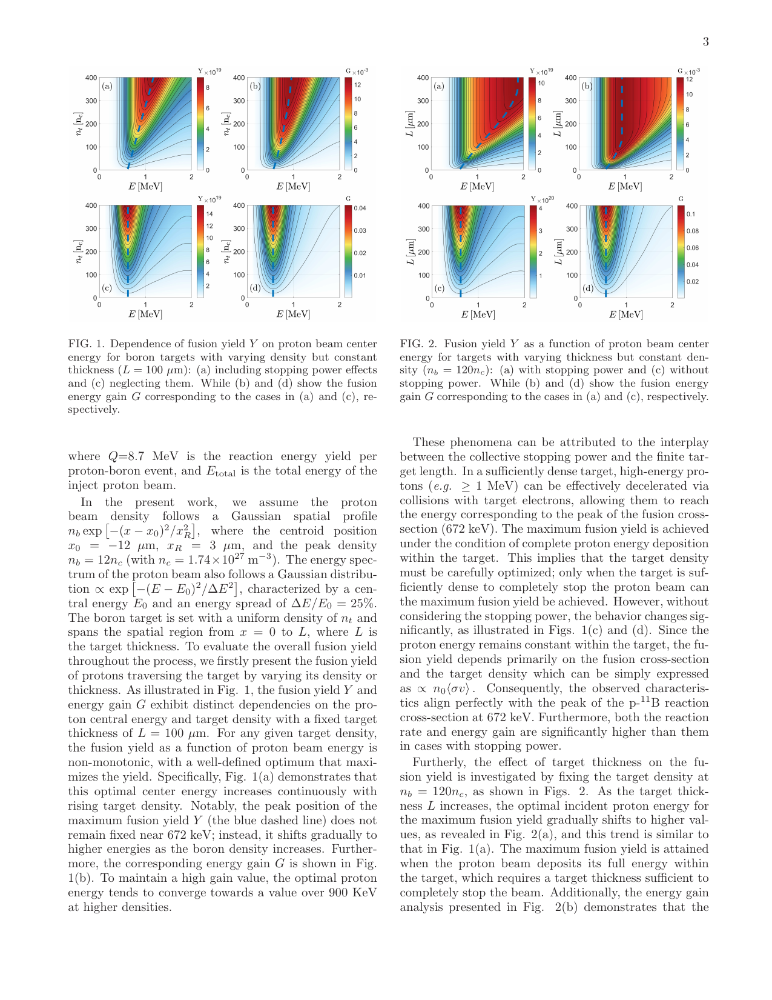
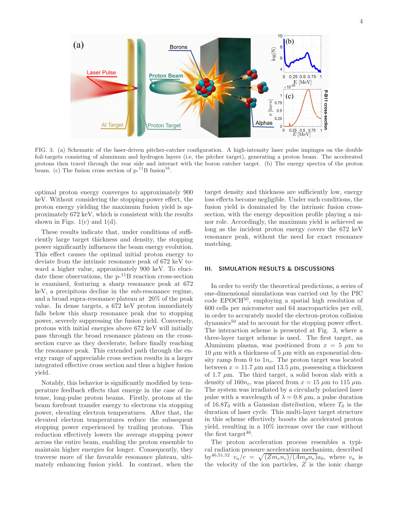
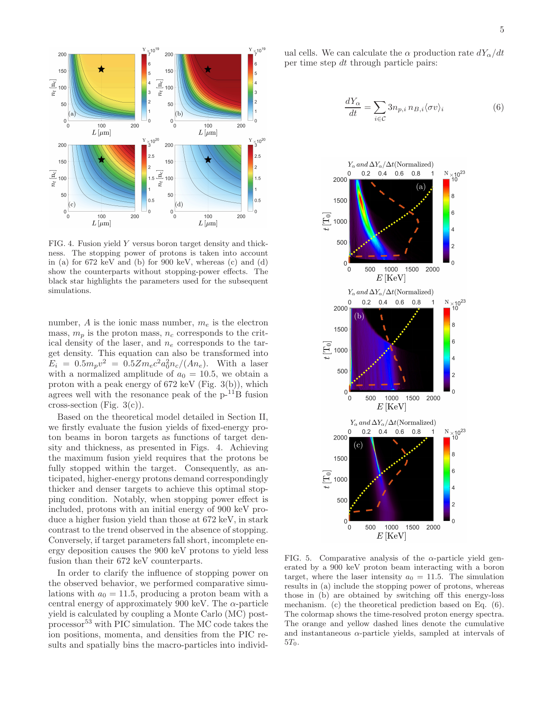

# 阻止本领反馈改变 pitcher–catcher 质子–硼聚变最优能量笔记

## 0. 论文信息

- 英文标题：Impact of ion-beam stopping power on proton-boron fusion yield in the pitcher-catcher scheme driven by ultra-intense laser
- 作者：J. Y. Hua；X. F. Li；J. X. Wang；Y. X. Leng；Y. Tian；R. X. Li
- 平台：arXiv 预印本
- DOI：[10.48550/arXiv.2609.04987](https://doi.org/10.48550/arXiv.2609.04987)
- arXiv v1 日期：2026-09-04；稿件首页日期：2026-09-07
- 来源：[arXiv 摘要页](https://arxiv.org/abs/2609.04987)
- 主题关键词：laser-driven proton；proton-boron fusion；stopping power；Fokker-Planck；particle-in-cell；Monte Carlo
- 本地 PDF：`daily/2026-09-08/pdfs/Hua et al. - 2026 - Stopping power in proton-boron pitcher-catcher fusion.pdf`
- 正文处理：官方 arXiv PDF 通过 `%PDF-`、文件类型、8 页元数据、SHA-256 和非空 `pdftotext -layout` 校验。当前环境缺少 `MINERU_TOKEN`，因此未声称完成 MinerU 转换；图像来自本地 PDF 页面渲染并已人工查看。

## 1. 摘要与文章定位

### 1.1 核心结论

- 论文讨论激光驱动 pitcher–catcher 中强质子束进入高密度硼等离子体后的 collective stopping 与电子预热反馈。
- 若忽略能损，最优入射能量自然贴近 $p+{}^{11}\mathrm B$ 截面的 `672 keV` 窄共振；考虑阻止本领后，质子从更高能量减速并穿过较宽的 supra-resonance 区，所研究密度/厚度下的最优中心能量移到约 `900 keV`。
- 束流前沿先加热电子，升高的 $T_e$ 又减弱后续质子的阻止本领，使尾部质子在有利能区传播更久。作者用一维 Fokker–Planck 模型、1D EPOCH PIC 和 Monte Carlo 后处理相互支撑这一机制。
- 这是一篇理论 + PIC/MC 预印本，没有新增 $alpha$ 实验计数；`900 keV` 是给定束流谱和 catcher 参数下的数值最优，不是普适常数，也不意味着达到能量增益或反应堆条件。

## 2. 研究背景与问题边界

热平衡 $p{}^{11}\mathrm B$ 需要数百 keV 温度，同时承受强 bremsstrahlung 损失，因此论文关注非热 pitcher–catcher：激光照射 proton-rich pitcher，质子束飞向独立的 boron catcher。历史实验的 $alpha$ 产额仍比作者引用的临界增益阈值 `2×10^12 α/J` 低多个数量级，说明本文的目标是改进束—靶能量匹配，而不是宣告净能量增益。

作者指出既有工作多把 stopping power 当作单粒子能损，较少把强束流沉积能量后反过来改变等离子体温度、再改变后续能损的反馈自洽加入产额计算。

## 3. 阻止本领—温度—聚变产额模型

### 3.1 自由电子阻止本领

论文采用的自由电子贡献可概括为

$$
\left(\frac{dE}{dx}\right)_{\mathrm{free}}
=\frac{\omega_p^2 Z_{1,\mathrm{eff}}^2}{c^2\beta^2}
G(y_e)\ln\Lambda_{\mathrm{free}},
$$

其中

$$
G(y_e)=\operatorname{erf}(\sqrt{y_e})-
2\sqrt{\frac{y_e}{\pi}}e^{-y_e},\qquad
y_e=\frac{m_ec^2\beta^2}{2T_e}.
$$

**变量说明：** $\beta=v/c$ 是质子归一化速度，$T_e$ 是电子温度，$\omega_p$ 是等离子体频率，$Z_{1,\mathrm{eff}}$ 是 projectile 有效电荷，$\ln\Lambda_{\mathrm{free}}$ 是自由电子碰撞对数。

**推导思路：** 从带电 projectile 与电子库仑散射造成的平均能量转移出发，对 Maxwellian 电子速度分布积分，得到 $G(y_e)$ 的误差函数形式；有效电荷与最小冲量参数修正有限速度和量子/经典短程截断。

**物理直觉：** 当前沿质子把电子加热后，$T_e$ 上升、$y_e$ 下降，电子与质子的相对速度匹配改变，平均阻止本领减小；因此同一束团的尾部不会经历与前沿相同的冷靶能损。

### 3.2 质子输运与电子加热

质子相空间分布 $f_p(x,v,t)$ 用一维 Fokker–Planck 型方程推进：

$$
\frac{\partial f_p}{\partial t}+v\frac{\partial f_p}{\partial x}
=-\frac{\partial}{\partial v}
\left[\left(\frac{dE}{dx}\right)_{\mathrm{free}}f_p\right].
$$

能量守恒把质子损失写入电子温升：

$$
\frac{\partial T_e(x,t)}{\partial t}
=\frac{1}{n_0}\int_0^\infty
\left(\frac{dE}{dx}\right)_{\mathrm{free}}
m_pv f_p(x,v,t)\,dv.
$$

**推导思路：** 左式是相空间平流；右式把连续能损转换成速度空间漂移。质子单位时间沉积的能量密度再除以电子数密度，给出温度演化。论文忽略了复杂横向输运、辐射损失、电子热传导和 catcher 的非均匀电离历史，因此这是反馈的最低维模型。

### 3.3 聚变产额与增益

$$
Y=\iiint f_p(x,v,t)n_0\langle\sigma v\rangle\,dx\,dv\,dt,
$$

$$
G=\frac{YQ}{E_{\mathrm{total}}},\qquad Q=8.7\,\mathrm{MeV}.
$$

**变量说明：** $\sigma(E)$ 是 $p{}^{11}\mathrm B$ 反应截面；$Y$ 为反应事件数；每个事件产生 3 个 $\alpha$，释放约 `8.7 MeV`；$E_{total}$ 是注入质子束总能量。

**物理直觉：** 最大产额不只取决于入射时截面，而取决于质子减速路径沿能量轴与截面曲线的“积分重叠”。略高于窄峰的质子可在减速过程中先经过宽平台，再扫过 `672 keV` 共振；如果靶足够厚且密，积分产额可能高于一开始就在共振上的质子。

## 4. 参数扫描：为什么最优能量移动

模型把质子束设为高斯空间分布与 `25%` 相对能散的高斯能谱，峰值束密度 `12 n_c`。对固定 `100 μm` 厚度扫描硼密度，或对固定约 `120 n_c` 密度扫描厚度时：

- 含 stopping power：随着靶更密或更厚，完全停住更高能质子成为可能，最大产额对应的初始中心能量向上移动，增益最优值趋近 `900 keV` 以上。
- 不含 stopping power：质子能量在靶中不变，产额主要随 $n_0\langle\sigma v\rangle$，最优点固定在 `672 keV` 附近，且会给出不现实的更高产额/增益。
- 靶过薄或过稀时，`900 keV` 质子不能充分沉积能量，反而可能不如 `672 keV`；因此“900 keV 更优”必须附带 catcher 条件。

## 5. Pitcher–catcher PIC/MC 验证

### 5.1 1D EPOCH 设置

- 网格：每微米 `600` 个 cell，即约 `1.67 nm`；每格 `64` 个宏粒子，用于解析碰撞/能损。
- pitcher：`x=5–10 μm` 的 `5 μm` Al 密度坡度层，加 `x=11.7–13.5 μm` 的 `1.7 μm` proton layer。
- catcher：`x=15–115 μm`、密度 `160 n_c` 的 `100 μm` boron slab。
- 激光：圆偏振、`0.8 μm`、脉宽 `16.8 T_0`。作者用辐射压加速标度关联 $a_0$ 与质子峰值能量。

正文参数存在一个需要复核的内部不一致：介绍 Fig. 3 时称 $a_0=10.5$ 得到 `672 keV`；后文 Fig. 7 比较又称 $a_0=9.5$ 对应 `672 keV`。因此复现实验或模拟不能只依据摘要/图注，应向作者或输入文件核对。

### 5.2 PIC 后处理的 $\alpha$ 率

Monte Carlo 后处理按网格配对 proton 与 boron 宏粒子：

$$
\frac{dY_\alpha}{dt}
=\sum_{i\in C}3n_{p,i}n_{B,i}\langle\sigma v\rangle_i,
$$

$$
\langle\sigma v\rangle_i=
\frac{\sum_{j\in P_i}\sum_{k\in B_i}
w_{p,i,j}w_{B,i,k}\sigma(v_{rel})v_{rel}}
{\sum_{j\in P_i}\sum_{k\in B_i}w_{p,i,j}w_{B,i,k}}.
$$

因每次反应生成 3 个 $\alpha$，第一式含因子 3。PIC 提供位置、动量和密度，MC 只计算反应概率与累计产额；它不是在 PIC 中显式推进所有核反应产物，更不是探测器响应模拟。

### 5.3 数值结果

对约 `900 keV` 质子束，含 stopping power 的产额高于关闭能损的对照，瞬时反应率在束流中心能量减速到 `672 keV` 附近时达到峰值；电子相空间显示传播区域被明显加热。对约 `672 keV` 束流，能损会使其迅速跌到共振以下，产额低于无 stopping 对照。综合目标尺度与温度反馈，作者得到 `900 keV` 优于 `672 keV` 的次序反转。

图 5–7 中产额与速率经过归一化；论文没有给出对应实验装置可直接比较的绝对单发 $alpha$ 数、误差条或探测效率。

## 6. 证据边界与复现缺口

- 没有新的 pitcher–catcher 实验、$alpha$ 探测或能谱测量；结论来自理论、1D PIC 与 MC 后处理。
- catcher 预电离、热电子到达、横向扩散、热传导、流体膨胀和三维束流发散被大幅简化；实际温度反馈可能不同。
- `900 keV` 最优值依赖 `25%` 能散、束长、密度、厚度和完全停束条件，不应推广为所有 $p{}^{11}\mathrm B$ 实验的固定注入能量。
- 文中“10% proton yield 提升”来自引用的多层靶模拟机制，不是本轮实验效率测量。
- 论文没有达到或证明净能量增益；也未闭合重复频率、激光 wall-plug efficiency、靶更新、$alpha$ 收集、bremsstrahlung、屏蔽或工程成本。
- $a_0$–`672 keV` 的 `10.5` 与 `9.5` 两种口径、部分 $n_b/n_t$ 记号混用，均应在复现前消歧。

## 7. 开放问题与个人理解

- 下一步应把模型推广到二维/三维，并把 hot-electron precursor、真实 TNSA 谱、角发散和 catcher 电离过程纳入同一能量守恒闭环。
- 更有实验价值的输出不是“900 keV”单点，而是给定实测 proton spectrum 和 target areal density 下的最优能谱形状及不确定度。
- 可与 2026-09-07 入库的 Zhu 等 TNSA—同位素反演工作结合：用活化通道约束真实 proton spectrum，再用本模型预测 stopping-feedback 对 $3\alpha$ 产额的影响。

## 8. 复习用速记

强质子束的前沿加热 catcher 电子，降低尾部阻止本领；因此最佳入射能量由“截面峰值”变为“沿减速路径积分截面”的问题。在本文 1D 理论/PIC 条件下最优约 `900 keV`，但没有直接 $alpha$ 实验、没有净增益，也不是普适最优能量。
