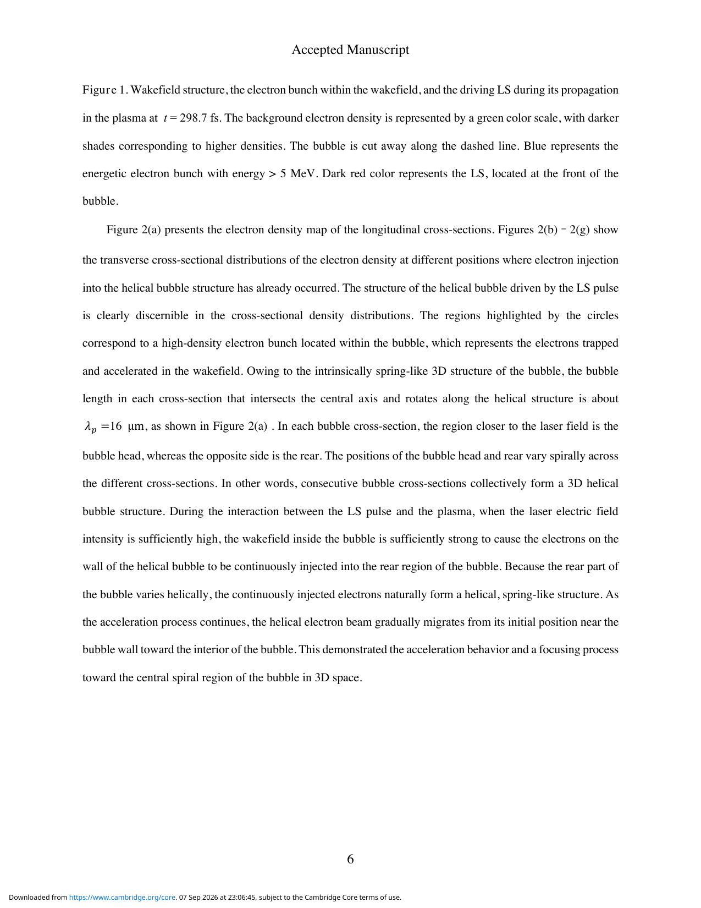
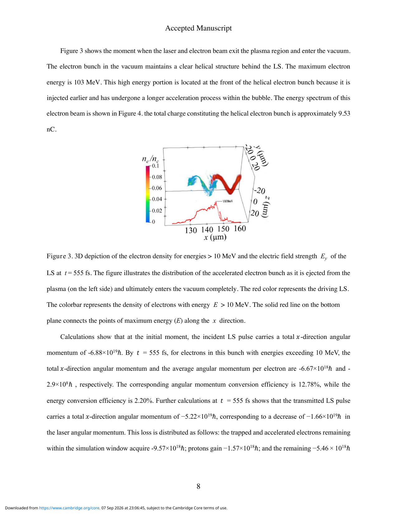
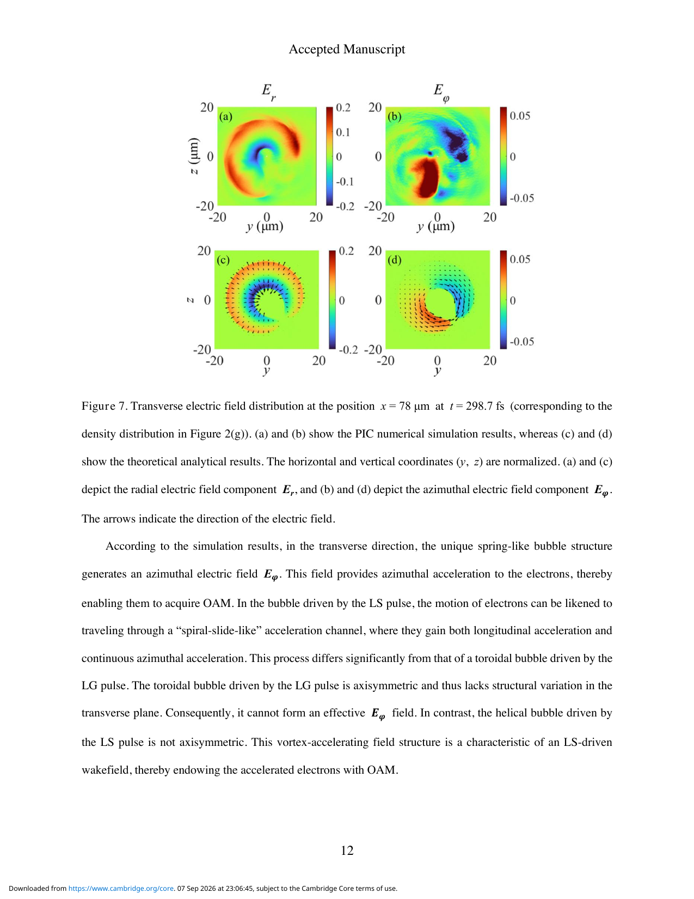

# Light spring 尾场产生螺旋 OAM 电子束笔记

## 0. 论文信息

- 英文标题：Energetic helical electron-bunch generation driven by a light spring wakefield
- 作者：Rongxuan Liu；Xiaomei Zhang；Yuanxin Chang；Jicheng Liu；Baifei Shen；Zhangli Xu
- 期刊：High Power Laser Science and Engineering（开放获取 accepted manuscript）
- DOI：[10.1017/hpl.2026.10192](https://doi.org/10.1017/hpl.2026.10192)
- 在线日期：2026-07-30
- 来源：[Cambridge Core 论文页](https://www.cambridge.org/core/product/6A6B7447A1D44D743B4D93CD64E0A57E)
- 主题关键词：light spring；wakefield；orbital angular momentum；3D particle-in-cell；EPOCH
- 本地 PDF：`daily/2026-09-08/pdfs/Liu et al. - 2026 - Light-spring helical electron bunch.pdf`
- 正文处理：Cambridge 开放 accepted manuscript 通过 `%PDF-`、文件类型、18 页元数据、SHA-256 和非空 `pdftotext -layout` 校验。当前环境缺少 `MINERU_TOKEN`，因此未声称完成 MinerU 转换；图像来自本地 PDF 页面渲染并已人工查看。

## 1. 摘要与文章定位

### 1.1 核心结论

- 作者用 7 个频率与拓扑荷相关联的 Laguerre–Gaussian（LG）子脉冲合成 light spring（LS），在 3D EPOCH PIC 中驱动非轴对称、弹簧状的 plasma bubble。
- bubble 内的纵向场负责加速，径向场负责聚焦，方位角场与相应磁力共同给电子角向动量，使捕获电子形成携带 orbital angular momentum（OAM）的三维螺旋束团。
- 数值结果报告约 `9.53 nC` 电荷、`103 MeV` 最大能量、`2.20%` 激光—电子能量转换效率和 `12.78%` OAM 转换效率；束团离开等离子体后在所模拟的真空传播段中保持螺旋结构。
- 这些指标全部来自一组理想化 3D PIC 参数，不是已经产生或测量的 OAM 电子束，也没有实际计算文中展望的 OAM betatron 辐射。

### 1.2 与已有 wakefield 的区别

Gaussian 激光通常产生近球形 bubble；单一 LG 涡旋束常产生带中心电子柱的 donut wake。LS 同时具有螺旋相位和沿传播方向旋转的强度包络，因此 ponderomotive force 本身沿螺旋轨迹排空电子，构造出非轴对称的“spring-like”加速通道。

## 2. Light spring 的构造与模拟参数

### 2.1 多频 LG 叠加

作者写出的 LS 复振幅为

$$
A_{\mathrm{LS}}(r,\varphi,t)=\sum_{n=1}^{N}a_0
\left(\frac{\sqrt{2}r}{W_{zn}}\right)^{|l_n|}
\exp\left(-\frac{r^2}{W_{zn}^2}\right)
\exp\left[i(l_n\varphi-\omega_nt)\right].
$$

**变量说明：**

- $N=7$：LG 子束数；径向节点数取 $p=0$。
- $l_n=1,2,\ldots,7$：拓扑荷；$\omega_n$ 从 $0.85\omega_0$ 到 $1.15\omega_0$ 等间隔变化。
- $W_{zn}$：传播到 $z$ 处的束腰尺度；通过 $W_{0n}=W_{01}\sqrt{l_1/l_n}$ 使不同 $l_n$ 的强度峰径向重合。
- $a_0=1.2$：合成光场的归一化峰值振幅。

**推导思路：** 相邻子束的相位差包含 $\Delta l\,\varphi-\Delta\omega\,t$。固定强度峰对应固定相位差，因此相位峰随时间绕轴旋转；同时脉冲沿 $x$ 传播，把时间周期映射为空间螺距。

#### Light spring 螺距

$$
\Delta x=c\Delta t=\frac{2\pi c}{\Delta\omega}
=\frac{2\pi c}{\alpha\omega_0}.
$$

取 $\alpha=\Delta\omega/\omega_0=0.05$、中心波长 `0.8 μm`，得到 $\Delta x=16\,\mu\mathrm{m}$。

**物理直觉：** 越大的频率间隔意味着强度包络旋转越快、螺距越短；拓扑荷与频率的线性关联把光学频谱自由度转换成三维空间拓扑。

### 2.2 3D EPOCH 设置

- LS：中心波长 `0.8 μm`、脉宽 `66.7 fs`、峰值强度 `1.5×10^20 W/cm²`、总功率 `71 TW`、能量 `4.74 J`。
- 等离子体：预电离电子—质子气体，密度 `0.008 n_c`，位于 `40 < x < 130 μm`；中心波长对应 $n_c\approx1.7\times10^{21}\,\mathrm{cm}^{-3}$。
- moving window：`50 × 80 × 80 μm³`，网格 `600 × 400 × 400`，每格 1 个宏粒子。
- 作者称额外高分辨率计算验证了收敛，但正文没有给出完整 resolution scan；每格 1 粒子的噪声与宏粒子统计仍是复核重点。

## 3. 螺旋 bubble 与电子注入

LS 的非轴对称 ponderomotive force 沿传播轴螺旋排空电子，而较重的质子近似不动，于是 bubble 的头部与尾部随方位角旋转。来自 bubble 壁的电子连续注入旋转的尾部，在加速过程中从壁附近向螺旋中心聚焦，最终形成空间上与 wake 拓扑对应的电子束。

文中的 `16 μm` bubble/helix 尺度来自设定的 LS 螺距，说明结构在很大程度上由驱动光场编码；它不是从随机自组织中独立出现的长度标度。

## 4. 能量与角动量转移

在 `t=555 fs` 的快照中，能量大于 `10 MeV` 的电子保持明显螺旋结构，最高能量约 `103 MeV`，束团总电荷约 `9.53 nC`。高能端位于束团前部，作者归因于更早注入和更长加速距离。

### 4.1 轨道角动量定义

传播轴取 $x$ 时，单电子绕轴 OAM 可写为

$$
L_x=(\mathbf r\times\mathbf p)_x=yp_z-zp_y.
$$

**变量说明：** $y,z$ 是横向位置，$p_y,p_z$ 是横向动量。

**推导过程：** 角动量定义为 $\mathbf L=\mathbf r\times\mathbf p$；对叉乘取 $x$ 分量即得 $yp_z-zp_y$。只有径向偏离与方位角动量同时存在时，$L_x$ 才非零。

**物理直觉：** 普通轴对称聚焦只让电子向中心振荡，正负角向运动容易相消；LS bubble 的方位角场为旋转选择固定手性，使许多电子的 $L_x$ 同号累积。

### 4.2 论文报告的转移预算

- 初始 LS 的轴向 OAM 量级约 `6.88×10^19 ħ`。
- 能量大于 `10 MeV` 的束团总 OAM 量级约 `6.67×10^18 ħ`，平均每电子约 `2.9×10^8 ħ`。
- 作者报告 OAM 转换效率 `12.78%`，能量转换效率 `2.20%`；对激光损失的预算中，仍在窗口内的捕获电子约占 OAM 损失的 `57.6%`，其余进入质子和已离开 moving window 的电子。

这里采用幅值描述，避免 OCR 对正文正负号的混淆。转换效率依赖论文对窗口内/外粒子与激光 OAM 的具体统计口径，不应直接当成实验装置效率。

## 5. 螺旋场的加速机制

### 5.1 三个场方向的分工

- $E_x$：在 bubble 尾部形成螺旋分布的负加速区，持续提高电子纵向能量。
- $E_r$：把捕获电子聚焦到 bubble 的螺旋中心附近。
- $E_\varphi$：为电子提供有手性的方位角加速，从而增加 $L_x$。

作者以沿螺旋轨迹积分圆柱 bubble 横截面场元的简化模型重建 $E_r$ 和 $E_\varphi$，与 PIC 展示的场形状一致。这支持“非轴对称 bubble 场产生 OAM”的机制，但不是对场幅值和完整粒子分布的严格解析解。

### 5.2 磁场贡献

相对论电子满足 $v\approx c$，Lorentz 力为

$$
\mathbf F=-e(\mathbf E+\mathbf v\times\mathbf B).
$$

论文指出方位角方向的 $E_\varphi$ 与相应 $-(\mathbf v\times\mathbf B)_\varphi$ 同量级，径向聚焦中的电、磁项也可比。因此只画电场分量有助于看拓扑，却不能据此声称 OAM 完全由电场贡献。

延长等离子体到 `300 μm` 的轨迹计算显示，所选电子一边沿 $x$ 前进，一边绕螺旋中心旋转；不同注入位置产生略不同的回旋周期。作者由此预期可产生携带 OAM 的 betatron 辐射，但没有运行辐射后处理或给出光子谱、通量、偏振与 OAM 纯度。

## 6. 证据边界与复现缺口

- 全部结果是 3D EPOCH PIC 与简化场模型，没有激光整形、气靶或电子 OAM 的实验验证。
- 单一参数组不能证明 `12.78%` OAM 效率对激光 jitter、相位误差、频谱误差和等离子体密度涨落鲁棒。
- 每格 1 个宏粒子可能影响注入、电荷与相空间噪声；正文仅口头说明高分辨率收敛，没有展示系统扫描。
- `9.53 nC` 是模拟捕获电荷，不等于可传输、可聚焦或可用于应用的净荷。
- “真空中保持稳定”只覆盖有限模拟距离，不是长距离束运稳定性或发射度保持证明。
- 材料角动量探测、先进辐射源和 OAM betatron 都是应用设想；论文没有给出光子产额、转换靶、核反应、剂量或屏蔽结果。

## 7. 开放问题与个人理解

- 最值得验证的是光场相位/频率误差如何改变 bubble 手性和电子 OAM 纯度；这比只重复理想参数下的峰值能量更接近实验可行性。
- 应报告归一化发射度、能散、角向相干性、OAM 模态分布和离开等离子体后的可传输性，才能判断它是否优于普通高电荷 LWFA 束。
- 可将轨迹送入辐射模块，检查 betatron 光子的 OAM、偏振、谱与角分布是否保留电子束拓扑。

## 8. 复习用速记

7 个拓扑荷—频率相关的 LG 子束合成 `16 μm` 螺距 LS，在 3D EPOCH 中产生非轴对称 helical bubble；$E_x$ 加速、$E_r$ 聚焦、$E_\varphi$ 与磁力赋予 OAM。`103 MeV / 9.53 nC / 12.78%` 均是理想 PIC 输出，尚无实验或辐射端闭环。
