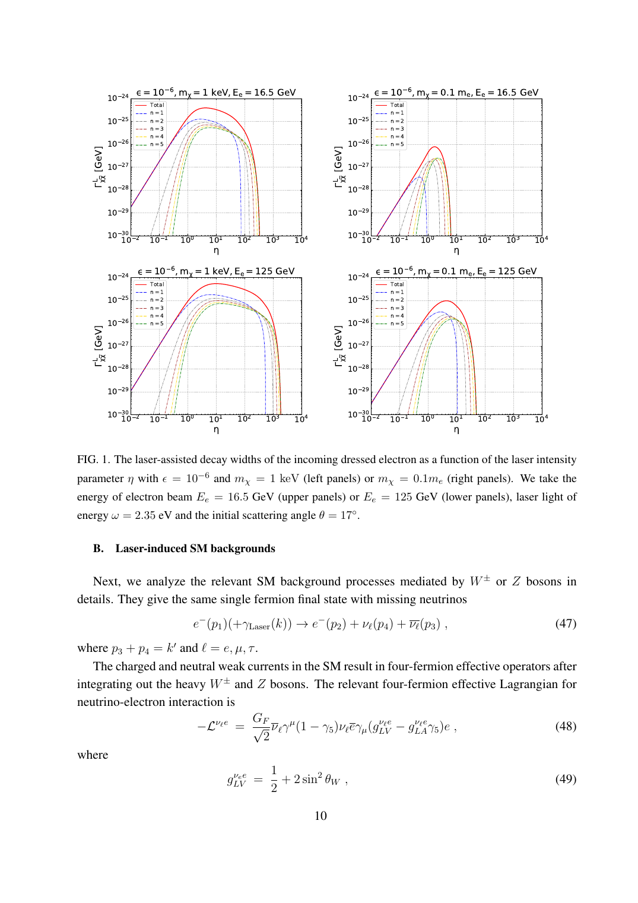
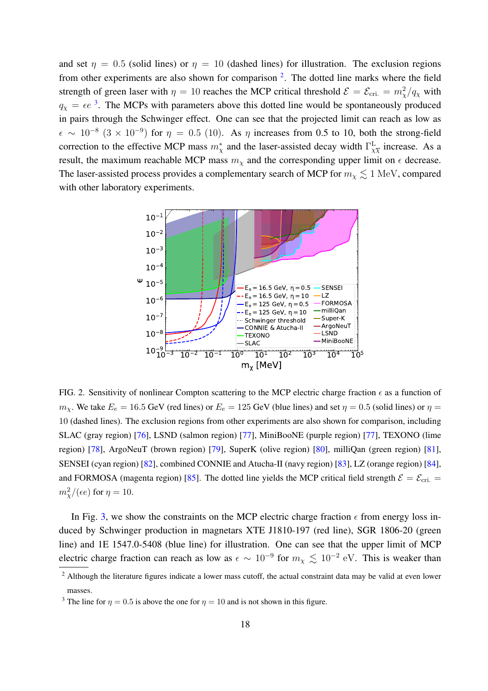
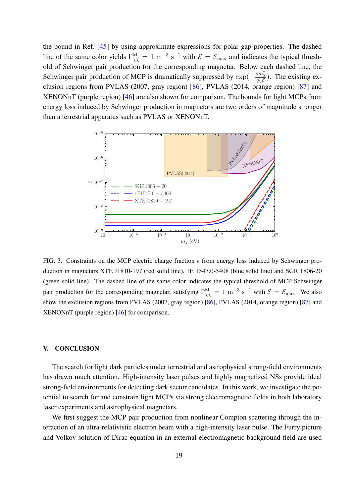

# 强场中毫电荷粒子的实验室投影与磁星能损约束笔记

## 0. 论文信息

- 英文标题：Exploring millicharged particles in laboratory and astrophysical strong-field regimes
- 作者：Cheng-Rui Jiang；Tong Li；Kai Ma；Haolong Wang
- 平台：arXiv 预印本（hep-ph）
- DOI：[10.48550/arXiv.2609.03399](https://doi.org/10.48550/arXiv.2609.03399)
- arXiv v1 日期：2026-09-03
- 来源：[arXiv 摘要页](https://arxiv.org/abs/2609.03399)
- 主题关键词：millicharged particle；strong-field QED；nonlinear Compton scattering；Volkov state；Schwinger production；magnetar
- 本地 PDF：`daily/2026-09-09/pdfs/Jiang et al. - 2026 - Millicharged particles in strong-field regimes.pdf`
- 正文处理：官方 arXiv PDF 为 23 页，已核对文件类型、`pdfinfo`、非空抽取文本和 SHA-256；本文笔记依据本地全文与 Fig. 1–3 页面裁图。

## 1. 摘要与文章定位
### 1.1 核心结论

- 作者提出用相对论电子束与强激光的 laser-assisted nonlinear Compton / trident 过程产生毫电荷粒子（MCP）对，并计算不可约的单电子加缺失能标准模型中微子背景。
- 在 LUXE-like 参数下，论文投影电荷分数灵敏度可到约 `1×10^-8`（激光强度参数 `η=0.5`）或 `3×10^-9`（`η=10`），主要覆盖 `mχ ≲ 1 MeV` 的轻 MCP 区域。
- 作者还用 Ruderman–Sutherland（RS）polar-gap 模型重算三颗磁星中 MCP 的 Schwinger 产生与加速能损；模型上限在 `mχ ≲ 10^-2 eV` 时可到 `ε ~ 10^-9`。
- 两条路径互补：激光散射探测临界场以下的微扰/多光子过程，磁星约束临界场以上的非微扰真空对产生。
- 这是现象学理论与灵敏度投影，不是作者已经运行的 LUXE 实验，也不是 MCP 的观测或发现；磁星结果同样是依赖 gap 与能量预算假设的间接约束。

## 2. 引言：为什么把实验室激光与磁星放在一起

Schwinger 临界场约为 `1.32×10^18 V/m`。普通 QED 以小精细结构常数展开，但外场足够强时，多光子吸收、真空极化和对产生不能只按最低阶弱场过程理解。实验室激光能精确控制碰撞几何，磁星则提供远高于地面装置的天然场强，两者对应不同参数区。
MCP 记为 $χ$，电荷取为 $q_χ=εe$，其中 $ε\ll1$。其与普通光子的最小耦合为

$$
\mathcal L_{\chi\gamma}=\epsilon e A_\mu\bar\chi\gamma^\mu\chi.
$$
这类有效小电荷可由 hidden-sector 的额外 $U(1)$ 与普通光子 kinetic mixing 产生。本文不建立具体暗物质丰度模型，而把 $m_χ$ 与 $ε$ 当作待约束的现象学参数。
实验室主过程是

$$
e^-+n\gamma_{\rm Laser}\rightarrow e^-+\gamma^*\rightarrow e^-+\chi\bar\chi,
$$
其可观测拓扑为一个末态电子加缺失能；磁星主过程则是 polar gap 中的平行电场把真空涨落转为真实 MCP 对，再继续加速并带走能量。

## 3. 激光辅助非线性 Compton 产生

### 3.1 圆偏振平面波与 Volkov dressed state

作者把激光近似为圆偏振、单色平面波：

$$
A^\mu(x)=a\left(\varepsilon_1^\mu\cos k\!\cdot\!x+\varepsilon_2^\mu\sin k\!\cdot\!x\right),\qquad
\eta=\frac{ea}{m_e}=\frac{eE}{\omega m_e}.
$$
**变量说明：** $a=E/\omega$ 是势振幅，$E$ 与 $ω$ 是激光电场和光子能量，$k^2=0$，$ε_{1,2}$ 是正交偏振矢量，$η$ 是以电子质量归一化的无量纲强度参数。论文采用自然单位；给定绿光 `ω=2.35 eV` 时，`η=1` 对应约 `6.1×10^12 V/m` 和 `7.8×10^17 W/cm²`。
**推导思路：** 在外场精确、量子辐射场微扰处理的 Furry picture 中，Dirac 方程可用 Volkov 解求解。平面波相位只依赖 $k\cdot x$，因此外场与带电粒子的反复相互作用被重求和进 dressed wavefunction。
Volkov 四动量与有效质量满足

$$
q^\mu=p^\mu+\frac{Q^2e^2a^2}{2k\cdot p}k^\mu,\qquad
q^2=m_*^2=m^2+Q^2e^2a^2.
$$
**变量说明：** $p^μ$ 是入场前自由动量，$q^μ$ 是准动量，$Q=-1$ 对电子而 $Q=ε$ 对 MCP。故电子有 $m_{e,*}^2=m_e^2(1+η^2)$，MCP 有 $m_{χ,*}^2=m_χ^2+ε^2η^2m_e^2$。
**推导过程：** 对 $q^μ$ 平方，利用 $p^2=m^2$、$k^2=0$，交叉项恰给 $Q^2e^2a^2$。这不是裸质量改变，而是周期外场中传播关系的准粒子修正。
**物理直觉与边界：** 增大激光强度一方面增强多光子耦合，另一方面抬高 dressed-state 的运动学代价；因此信号不会随 $η$ 无限单调增加。单色无限平面波忽略真实焦斑、有限脉宽和空间包络，作者只说明可用 Gaussian pulse Fourier transform 推广，并未在灵敏度图中实施该推广。

### 3.2 多光子谐波与三体衰变宽度

周期 Volkov 相位经 Jacobi–Anger 展开为

$$
e^{-iz\sin(\phi-\phi_0)}=\sum_{n=-\infty}^{\infty}J_n(z)e^{-in(\phi-\phi_0)}.
$$
**推导与物理直觉：** 对一个激光周期做 Fourier 投影得到 Bessel 系数 $J_n$；整数 $n$ 因而对应电子从相干背景净吸收的激光光子数。作者保留 $n>0$ 并对 MCP 顶角取领先的 $r=0$，所以结果包含电子端的多谐波吸收，但不是所有可能外场阶次的无截断数值模拟。
引入虚光子 helicity density matrices 后，三体宽度写成

$$
\Gamma^L_{\chi\bar\chi}=\sum_{n=1}^{\infty}\frac{1}{2Q_e}\int d\Pi_{P,n}\,d\Pi_D\,\frac{dm_{k'}^2}{2\pi}
\left(\frac{\epsilon e^2}{m_{k'}^2}\right)^2
\sum_{\lambda,\lambda'}\eta_\lambda\eta_{\lambda'}P_{\lambda\lambda',n}D_{\lambda\lambda',0}.
$$
**变量说明：** $Q_e$ 是入射 dressed electron 的实验室能量，$k'$ 与 $m_{k'}$ 是虚光子四动量和不变质量，$dΠ_{P,n}$、$dΠ_D$ 是产生与衰变二体相空间，$P$、$D$ 分别编码电子端和 MCP 端的 helicity density matrix。
**推导思路：** 三体相空间按虚光子不变质量分解为“电子发射 $γ^*$”与“$γ^*$ 衰变成 MCP 对”，再对中间态 polarization 求和。显式 $ε^2$ 源于 MCP–photon 顶角的振幅平方，Bessel 函数则携带强场谐波权重。

### 3.3 Fig. 1：强度增强与有效质量抑制的竞争

四个面板共同固定 `ε=10^-6`、`ω=2.35 eV`、初始夹角 `θ=17°`；上排 `Ee=16.5 GeV`、下排 `Ee=125 GeV`，左列 `mχ=1 keV`、右列 `mχ=0.1me≈51.1 keV`。红线是总宽度，彩色点划线分解 `n=1–5`。
弱场端由 `n=1` 主导；当 `η≳1` 时高次谐波变得重要，尤其对较重 MCP。每个分支最终因相空间关闭而下降，其估算上限为

$$
\eta_{n,\max}\simeq\left[\left(\frac{2n\omega(E_e+p_e\cos\theta)-4m_\chi^2}{4m_em_\chi}\right)^2-1\right]^{1/2},\qquad
p_e=\sqrt{E_e^2-m_e^2}.
$$
**物理直觉与边界：** 更高 $n$ 或 $E_e$ 可提供更多不变质量，但增大的 $η$ 同时增大有效质量，最终压缩三体末态相空间。图示宽度约处于 `10^-30–10^-24 GeV` 纵轴范围；它是平面波模型计算的单电子宽度，不是已测得的事件率。

### 3.4 标准模型背景

不可约背景为 $e^-+nγ_{\rm Laser}\to e^-+ν_\ell\barν_\ell$。作者积分掉 $W^±/Z$ 后用四费米有效作用计算三种中微子味；Table I 给出 `η=0.5/10/100` 时，`Ee=16.5 GeV` 的宽度 `8.64×10^-38 / 2.56×10^-38 / 2.57×10^-40 GeV`，`Ee=125 GeV` 时为 `3.83×10^-36 / 2.85×10^-36 / 1.49×10^-38 GeV`。
作者认为这些数值远小于信号。光子漏检的 nonlinear Compton 与 $e^-\to e^-e^+e^-$ 的误识别属于可约背景，只被定性讨论，没有探测器级 cut、接受度、误识别率或系统误差模拟；这是 Fig. 2 不能视为实验可达性的关键边界。

## 4. 磁星 polar gap 中的 Schwinger 产生

### 4.1 临界场与对产生率

MCP 临界场和在平行电磁场中的领先对产生率为

$$
E_{\rm cri}=\frac{m_\chi^2}{q_\chi},\qquad
\Gamma^M_{\chi\bar\chi}=\frac{q_\chi^2EB}{(2\pi)^2}\coth\!\left(\frac{\pi B}{E}\right)
\exp\!\left(-\frac{\pi m_\chi^2}{q_\chi E}\right).
$$
**变量说明：** $q_χ=εe$，$E$ 与 $B$ 是能使两场平行的局域参考系中的场强，$Γ^M$ 是单位体积、单位时间的 MCP 对产生率。
**推导过程：** Schwinger 一圈有效作用的虚部给出真空衰变率；取其瞬子级数的 `n=1` 项得到上式。指数项是跨越质量能隙的隧穿作用量，$πB/E$ 的双曲余切修正平行磁场中的 Landau 态密度。
**物理直觉与边界：** 当 $E<E_{\rm cri}$ 时，指数因子强烈压低产生率；轻质量、大 $ε$ 或强 $E$ 会迅速解除抑制。该局域常场率被应用到随高度变化的 gap 场，未显式求解 MCP 产生对 gap 放电、电荷屏蔽和时变 pair cascade 的反作用。

### 4.2 RS polar-gap 标度与选定磁星

RS 模型针对需要正 Goldreich–Julian 电流而表面重离子又难以逸出的区域：正电荷亏空让 $E_\parallel$ 在 polar gap 累积。作者采用 aligned rotator 的环形 gap 体积作为保守估计，并取磁星半径 `RM≈10 km`。

$$
h\simeq5\times10^3{\rm cm}\left(\frac{\rho}{10^6{\rm cm}}\right)^{2/7}\left(\frac{P}{1{\rm s}}\right)^{3/7}\left(\frac{B}{10^{12}{\rm G}}\right)^{-4/7},\qquad
E_{\max}\simeq\frac{2\Delta V}{h},\qquad E(z)=E_{\max}\left(1-\frac zh\right).
$$
**变量说明：** $P$ 是自转周期，$B$ 是表面径向磁场，$ρ$ 是磁力线曲率半径，$h$ 是 gap 高度，$z$ 从表面向上计。电场在 gap 底部最大、顶部归零。
Table II 中用于 Fig. 3 的三颗磁星参数为：XTE J1810-197：`P=5.5403537 s`、`B=2.1×10^14 G`、`LX=4.3×10^31 erg/s`、`h=22.7 m`、`Emax=1.10×10^12 V/m`；1E 1547.0-5408：`2.0721255 s`、`3.2×10^14 G`、`1.3×10^33 erg/s`、`10.2 m`、`2.01×10^12 V/m`；SGR 1806-20：`7.54773 s`、`2.0×10^15 G`、`1.63×10^35 erg/s`、`7.46 m`、`2.53×10^12 V/m`。

### 4.3 MCP 能损与磁场能量预算

在高度 $z$ 产生的一只 MCP 到 gap 顶部获得的能量为

$$
\mathcal E(z)=\int_z^h q_\chi E(z')\,dz'=\frac{q_\chi E_{\max}(h-z)^2}{2h},\qquad
\frac{d^2E_{\rm MCP}}{dt\,dV}=\Gamma^M_{\chi\bar\chi}(E(z))\left[2m_\chi+\mathcal E(z)\right].
$$
第一项是造对静质能，第二项是电场继续加速外流 MCP 的功。作者再要求持续 X 射线辐射与 MCP 能损在活动寿命 `T≈10^4 yr` 内不超过磁星内部加邻近磁层的偶极磁能储库，并采用 McGill catalog 的 quiescent `LX`。
这一约束把“未观察到异常快速能量耗尽”转成 $ε$ 上限，但依赖 `T`、偶极场外推、积分体积、persistent luminosity、gap 几何和稳态平均化；它不是直接测量 MCP 通量，也没有拟合单个磁星的完整年龄演化。

## 5. 投影灵敏度与模型约束

### 5.1 LUXE-like 计数假设

作者取 `Ee=16.5 GeV`、`ω=2.35 eV`、`θ=17°`、每束团 `Ne=1.5×10^9`、`Nb=2700` 个束团、`f=1 Hz`、作用长度 `ℓ≈50 μm`、有效采数时间 `t=5×10^6 s`；并另设 `Ee=125 GeV` 的未来束流基准，假定积分亮度不变。由激光光子密度计算得到 `η=0.5` 时 `L≈1.75 ab^-1`，`η=10` 时 `L≈700 ab^-1`。

$$
N_s=\frac{\Gamma^L_{\chi\bar\chi}}{2\rho_\omega}\mathcal L,\qquad
\mathcal L=N_e\rho_\omega\ell N_{\rm bunch}ft,\qquad
Z=\frac{N_s}{\sqrt{N_s+N_b}}=3.
$$
**变量说明与推导：** $ρ_ω=a^2ω/(4π)$ 是激光光子密度，$Γ/(2ρ_ω)$ 被解释为截面；截面乘积分亮度给信号数。$N_b$ 在显著性式中是中微子背景事件数，勿与正文曾用作束团数的同名符号混淆。
**边界：** 采用简单 Gaussian-counting `3σ` 公式，没有 profile likelihood、look-elsewhere effect、系统误差、有限效率或能谱形状信息；125 GeV 情景也只是代表性假设，不是已批准装置。

### 5.2 Fig. 2：实验室灵敏度投影

红线对应 `16.5 GeV`，蓝线对应 `125 GeV`；实线是 `η=0.5`，虚线是 `η=10`。最低投影约为 `ε≈10^-8` 与 `3×10^-9`。更高束流能量把可达质量扩到约 MeV；更高 $η$ 改善低质量电荷灵敏度，却因 MCP 有效质量修正与运动学关闭使最大可达质量向低处移动。
黑色点线只画 `η=10` 的 $E=E_{\rm cri}$ 边界；`η=0.5` 的边界在其上方而未绘出。其余阴影是既有 SLAC、LSND、MiniBooNE、TEXONO、ArgoNeuT、Super-K、milliQan、SENSEI、CONNIE+Atucha-II、LZ 与 FORMOSA 排除区，不是本研究重新分析的数据。

### 5.3 Fig. 3：磁星能损约束

红、蓝、绿实线分别来自 XTE J1810-197、1E 1547.0-5408 和 SGR 1806-20 的能量预算。低质量平台约在数 `10^-9`，作者概括为 `mχ≲10^-2 eV` 时可到 `ε~10^-9`；随后质量增大，Schwinger 指数抑制使上限迅速变弱。
同色虚线定义 `Γχχ^M=1 m^-3 s^-1` 且 `E=Emax` 的典型开启阈值，而不是置信区间。图中还叠加 PVLAS 2007、PVLAS 2014 和 XENONnT 既有排除区；“强约两个数量级”是相对于这些曲线、在本文 RS 能损模型内的比较，不能写成比所有地面 MCP 搜索普遍强两阶。

## 6. 结论、证据边界与复现缺口

- 论文的实质贡献是把同一 MCP 参数平面上的 laser-assisted trident 投影与 magnetar Schwinger 能损约束并列计算，而不是报告一次强激光或天文新观测。
- 激光侧使用理想圆偏振单色平面波、领先 MCP 端谐波 `r=0` 和仅不可约中微子背景；缺有限脉冲/焦斑、束流分布、探测器接受度、QED 可约背景抑制和系统误差。
- Fig. 1 的宽度、Fig. 2 的 `3σ` 曲线均为解析/数值积分产物；`ε≈3×10^-9` 是输入亮度和计数准则下的 projected reach，不是 exclusion limit，更不是发现。
- 磁星侧把 RS gap 的静态平均模型、aligned geometry、`RM≈10 km`、`T≈10^4 yr`、偶极能库与 catalog `LX` 组合；真实 gap 的间歇放电、等离子体屏蔽、MCP 反作用和磁场演化会改变约束。
- Fig. 3 是“不允许 MCP 长期耗尽过多磁能”的间接上限；论文没有检测 MCP、没有给出到地球的 MCP flux，也没有完成 magnetar population likelihood。
- 公式混用自然单位与 SI 数值标度；独立复算时需恢复 $c$、$\hbar$、$\epsilon_0/\mu_0$ 并逐项检查体积与能量率单位，不能直接把自然单位 Schwinger 率代入 SI gap。

## 7. 开放问题与个人理解

- 实验端最关键的问题不是中微子背景，而是普通 nonlinear Compton 光子漏检、trident $e^+e^-$ 误识别和束流/激光 shot-to-shot 波动能否把理想缺失能灵敏度保留下来。
- 理论端应在有限时空脉冲中复算 Volkov/LMA 结果，并检查只取 MCP 顶角 `r=0` 对 `η=10`、较大 $εm_e/m_χ$ 区域是否仍充分。
- 磁星端需要把 MCP 电流纳入 gap 的 Maxwell–Boltzmann/kinetic closure；若 MCP 本身部分屏蔽 $E_\parallel$，固定背景场上的能损积分可能不再自洽。
- 三颗磁星并非按单一 `B` 排序给出约束强弱，因为 `P`、gap 体积、`Emax`、`LX` 与磁能库共同作用；这正是本文相对只用近似 gap 尺度的改进，也是模型依赖所在。

## 8. 复习用速记

激光侧用 Volkov dressed electron 的多光子谐波产生 $χ\barχ$，强度增强与有效质量抬升相互竞争；磁星侧用 Schwinger 指数与 RS polar-gap 能量预算限制超轻 MCP。论文给出约 `10^-8–3×10^-9` 的实验室投影和超轻区约 `10^-9` 的磁星模型上限，但两者都不是新的实验或天文发现。
