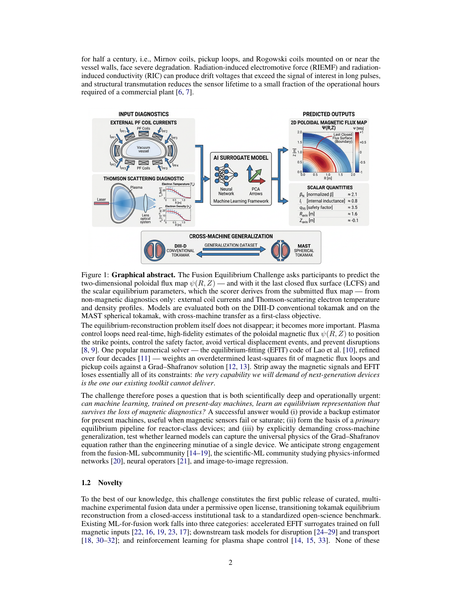
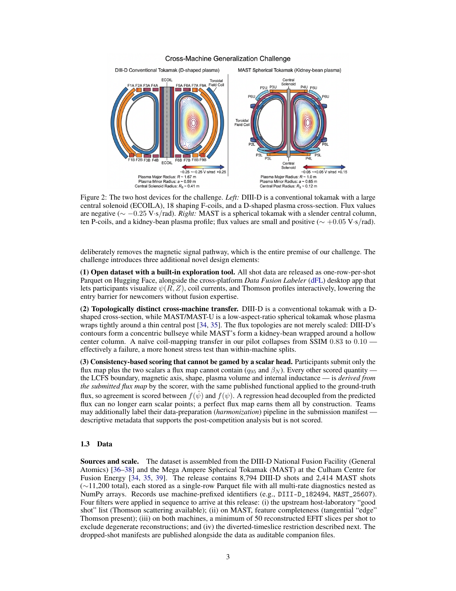
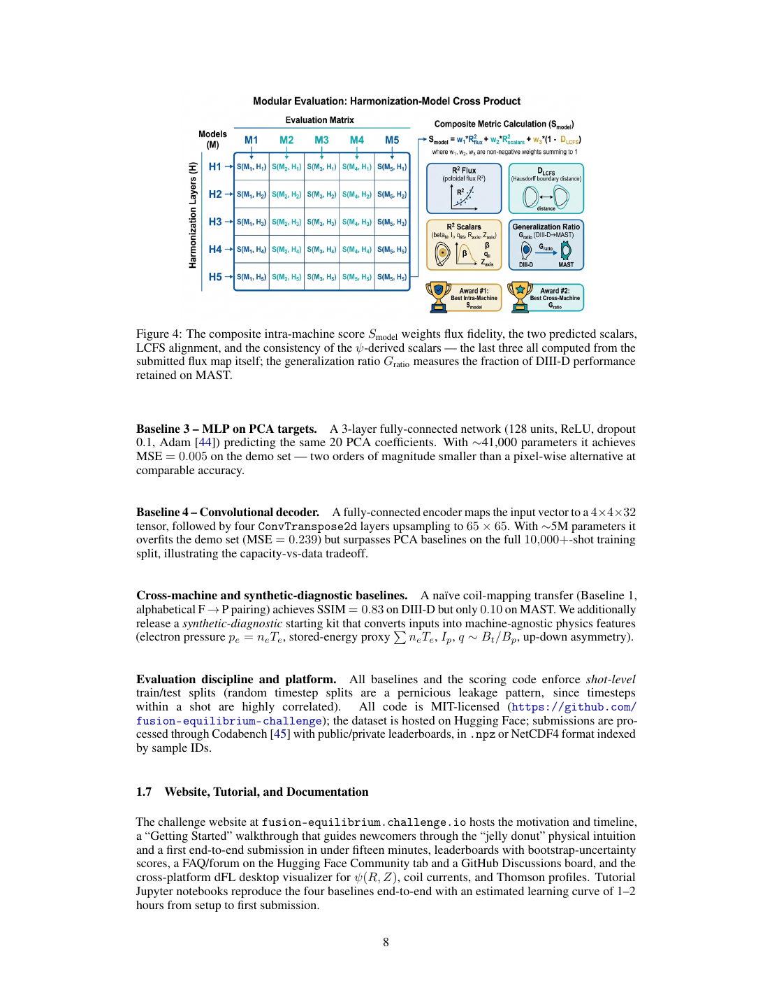

# 无磁诊断聚变平衡重建挑战笔记

## 0. 论文信息

- 英文标题：The Fusion Equilibrium Challenge: Inferring Magnetic Geometry Without Magnetic Diagnostics
- 作者：Tapan Ganatma Nakkina；Matthew Waller；Craig Michoski；Brian Sammuli；David R. Hatch；William Boyes；Mitchell Clark；Raffi Nazikian；Sterling Smith
- 类型：arXiv 预印本 / NeurIPS 2026 Competition Track 挑战方案
- arXiv：[2609.01750v1](https://arxiv.org/abs/2609.01750)，2026-09-01
- 主题关键词：tokamak equilibrium；non-magnetic diagnostics；DIII-D；MAST；cross-machine generalization；scientific machine learning
- 本地 PDF：`daily/2026-09-09/pdfs/Nakkina et al. - 2026 - Fusion Equilibrium Challenge.pdf`
- 正文处理：arXiv PDF 已核对为 16 页、约 5.66 MB，PDF magic、`pdfinfo` 与非空文本抽取有效；SHA-256 为 `6b86102fa38ef83a83ca4ff25ef83c3fbd0da0a9139e475533b68c64f7a70b80`。图像取自本地 PDF 页面并已人工查看。

## 1. 摘要与文章定位

### 1.1 摘要的论证顺序

作者先从反应堆级装置的诊断风险出发：更强中子环境会使 Mirnov 线圈、pickup loop 和 Rogowski 线圈受到辐射诱导电动势、辐射诱导电导及材料嬗变影响，而实时控制仍需要可靠的二维极向磁通、磁面和安全因子信息。

挑战把问题改写为一个严格的逆问题：只输入外部极向场线圈电流与 Thomson 散射电子温度/密度剖面，预测二维极向磁通图 `ψ(R,Z)`，并补充磁通图本身不能唯一决定的 `q95` 与归一化 beta。

两项主目标分别是在 DIII-D 上保持装置内重建质量，以及把同一端到端流程零样本迁移到拓扑明显不同的 MAST 球形托卡马克。这里的“reactor-ready”是挑战愿景和压力测试方向，不是已经在反应堆控制系统上线的性能结论。

### 1.2 必须区分的数据规模口径

- 摘要写的是 `9,113` 个 DIII-D shots 与 `2,416` 个 MAST shots，共 `11,529` shots。
- 正文 1.3 “Sources and scale”明确把**发布数据**写成 `8,794` 个 DIII-D shots 与 `2,414` 个 MAST shots，共 `11,208` shots。
- 两种口径相差 DIII-D `319` shots、MAST `2` shots，总计 `321` shots。结合正文所述的 good-shot、MAST 特征完整性、每 shot 至少 50 个 EFIT slices、仅保留 diverted timeslices 等过滤，后一个数字应作为实际 release 口径；但论文没有逐级给出从摘要数字到发布数字的完整计数表，因此不能自行断言每一条删除原因。
- 完整 Parquet 数据约 `133 GB`；Hugging Face `datasets` 支持 streaming，所以参与者不必一次下载全部归档。

### 1.3 文章性质

这是**比赛、公开数据集与评测协议论文**。作者发布了数据、四个参考基线、评分程序和可视化工具，但没有报告获胜模型、真实装置闭环测试或已部署控制器；“备用估计器”“亚毫秒控制”等均是应用场景或未来可能性。

## 2. 背景：为什么要从非磁诊断反推磁几何

图 1 在首次提出任务处给出完整链路：外部 PF 线圈电流和 Thomson 散射剖面进入 ML surrogate，输出二维磁通图、LCFS 与平衡标量；下方箭头强调 DIII-D 到 MAST 的跨装置迁移。图是任务示意，不是实时系统架构或运行结果。

传统 EFIT 通过磁通环和拾取线圈等磁信号约束 Grad–Shafranov 平衡。移除这些信号后，经典拟合失去主要观测约束，因此本挑战是在问：模型能否从线圈驱动与动理学剖面中学到足以恢复平衡的规律，而不只是记住单一机器的工程布局。

如果成功，模型可能为现有装置的传感器故障提供冗余，也可能为未来反应堆建立新的状态估计路径；然而高保真、实时性、不确定性校准和失效保护仍须单独验证。

## 3. 新意：开放数据、拓扑迁移与一致性评分

图 2 显示 DIII-D 的 D 形磁面、大中央螺线管和 18 个 shaping F-coils，以及 MAST 围绕细中央柱的 kidney-bean 磁面与 10 个 P-coils。两者磁通符号、幅值、几何和线圈表示均不同，跨装置问题并非简单缩放。

作者强调三点新意：其一，一 shot 一行的 Parquet 开放数据配套 dFL 桌面浏览器；其二，把 DIII-D 到 MAST 的零样本迁移列为一等目标；其三，除 `q95` 和归一化 beta 外，几何标量都由评分器从参赛者提交的磁通图重新导出，避免独立 scalar head 用互不一致的数值“刷分”。

先导的朴素线圈映射在 DIII-D 上得到 `SSIM=0.83`，迁移到 MAST 后仅 `0.10`。这约等于保留 `0.12` 的 SSIM，但只是视觉相似度代理，不是正式复合分数的跨装置比值，也不能代表所有 ML 方法必然如此退化。

## 4. 数据构造与泄漏边界

每个 shot 是一个单行 Parquet 记录，列中嵌套多速率 NumPy 数组。DIII-D 几何按 19 个带匝数的 lumped rectangles 表示，MAST 则保留 812 个导体元件；DIII-D 的 Thomson chord 还随 campaign 改变，共有 11 种布局和 59–138 个通道。

诊断时间基准高度异构：DIII-D 磁信号每 shot 约 `49,152` 点、MAST 约 `15,482` 点，而 EFIT 磁通图约为 `313` 与 `77` 个时刻。摘要另给每 shot 约 `260/80` 幅磁通图，说明过滤后有效帧数会随 shot 和统计口径变化；建模前的时间对齐本身就是挑战的一部分。

MAST 原生磁通网格为 `65×129`，中央柱对应区域约一半为 NaN；公共建模材料另提供有效列的 `65×65` 视图。参赛者不能把 NaN 当普通零值，也不能让中央柱掩膜泄漏测试标签。

只保留 diverted frames 是为了让 LCFS 能由磁通图定义。DIII-D 用 `DSEP` 符号筛选，保留 `87.9%` frames；MAST 用 EFIT++ 是否报告 x-point 作为代理，保留 `66.4%` frames，并在 `184,396` frames 上与磁通边界交叉核对，符合率 `97.3%`、中位归一化偏差约 `6×10^-4`。

训练/验证/测试必须按 **shot-level split** 划分。一个 shot 内相邻 timestep 强相关，若随机拆 timestep，会让几乎相同的放电轨迹同时进入训练与测试，产生严重信息泄漏；因此这条约束既适用于官方基线，也适用于参赛者自建验证集。

## 5. 预测任务与评分量

主任务对 held-out shot 的每个 EFIT 时刻预测 `65×65` 极向磁通图，以及 `q95` 和归一化 beta。LCFS、磁轴、伸长率、上下三角度、体积和内感由统一评分代码从磁通图导出。

图 4 把不同数据 harmonization 层与模型组成交叉矩阵，并把装置内复合分数和跨装置保留率并列。它强调数据对齐方法也是可分析因素，但 submission manifest 中的 harmonization 标签只用于赛后分析，不直接计分。

### 5.1 磁通重建的 pooled R²

$$
R_{\psi}^{2}=1-\frac{\sum_k\left(\psi_k-\hat{\psi}_k\right)^2}{\sum_k\left(\psi_k-\bar{\psi}\right)^2}
$$

**变量说明：** `k` 汇总测试集中所有 shots、EFIT timesteps 与网格点；真值、预测和真值总体均值分别为 `ψ_k`、`ψ̂_k` 与 `ψ̄`。

**推导过程：** 分子是预测残差平方和，分母是用单一总体均值预测时的总离差平方和；用 1 减去二者之比，就得到模型相对均值基线解释的方差比例。

**物理直觉：** 它直接奖励整幅磁通场的数值保真度，并让所有时空点共享同一评价池。

**边界：** R² 可为负；复合分数中把负值裁到 0，但未裁剪值仍单独报告。pooled 值也可能被长 shot 或易预测区域主导，所以官方另报 per-shot mean 作为稳健性诊断。

### 5.2 LCFS 对齐

$$
D_{\mathrm{LCFS}}=\frac{d_{\mathrm{Haus}}\left(C,\hat{C}\right)}{\left\langle R_{\mathrm{LCFS,true}}\right\rangle}
$$

**变量说明：** `C` 与 `Ĉ` 是真值和预测 LCFS；分子为对称 Hausdorff 距离；分母是真值 LCFS 平均大半径。

**推导过程：** 先取两条轮廓彼此最坏点的最近距离，再除以装置尺度，使 DIII-D 与 MAST 的边界误差可无量纲比较。

**物理直觉：** 少量局部越界也会被“最坏点”捕捉；完美磁通图应导出完全相同的 LCFS，因此该量为 0。

**边界：** 越小越好，进入复合分数前上限裁到 1；预测图上导出失败的帧会被惩罚而不是跳过。

### 5.3 独立标量、派生量一致性与复合分数

$$
R_{q95,\beta_N}^{2}=\frac{1}{2}\left(R_{q95}^{2}+R_{\beta_N}^{2}\right)
$$

**变量说明：** 两个分量分别是提交的 edge safety factor `q95` 和归一化 beta 相对 EFIT stored values 的 pooled R²。

**推导过程：** 先对两类标量独立计算与磁通相同形式的 R²，再等权平均，避免量纲较大的标量支配分数。

**物理直觉：** 这两项需要磁通图未包含的 toroidal-field function 与 pressure profile，因此允许单独提交。

**边界：** 高标量分不保证磁通图自洽；负 R² 在进入复合分数时裁到 0，原值仍应查看。

$$
R_{\mathrm{cons},j}^{2}=1-\frac{\sum_k\left[f_j(\hat{\psi}_k)-f_j(\psi_k)\right]^2}{\sum_k\left[f_j(\psi_k)-\overline{f_j(\psi)}\right]^2},\qquad
\mathrm{Consistency}=\frac{1}{|J|}\sum_{j\in J}\max\left(0,R_{\mathrm{cons},j}^{2}\right)
$$

**变量说明：** `f_j` 是从磁通图导出磁轴、形状、体积或内感的同一公开函数；`J` 含 7 个派生标量。

**推导过程：** 对预测图和真值图应用完全相同的函数，再逐标量计算 pooled R²，负值裁零后求平均；因此量纲和归一化惯例在两侧一致。

**物理直觉：** 一张像素误差较小但给出错误磁轴或形状的图会在此失分，迫使磁通场与控制室关心的几何量自洽。

**边界：** 一致性只检验相对于 EFIT target 的内部一致，不证明 EFIT 真值无偏，也不证明模型满足完整 MHD 或能安全控制等离子体。

$$
S_{\mathrm{model}}=0.55R_{\psi}^{2}+0.15R_{q95,\beta_N}^{2}+0.10\left(1-D_{\mathrm{LCFS}}\right)+0.20\,\mathrm{Consistency}
$$

**变量说明：** 第二项是提交的 `q95` 与归一化 beta 两个 pooled R² 的平均；其他三项均直接或间接由提交磁通图决定。

**推导过程：** 四个裁剪后的无量纲分量按组织者权重加权，权重和为 1，因此复合分数位于 0–1；磁通保真占主导，边界与内部几何合计占 0.30。

**物理直觉：** 分数不让模型用少数标量掩盖一张错误的磁通图，同时仍承认 `q95` 和归一化 beta 需要磁通图之外的剖面信息。

**边界：** 权重是竞赛设计选择，不是普适控制代价函数；不同故障模式在真实装置上的安全代价未由该加权和表达。

$$
G_{\mathrm{ratio}}=\frac{S_{\mathrm{model}}^{\mathrm{MAST}}}{S_{\mathrm{model}}^{\mathrm{DIII-D}}}
$$

**变量说明：** 分子、分母是同一端到端 pipeline 在 MAST 与 DIII-D 上的正式复合分数。

**推导过程：** 用目标域分数除以源域分数，量化迁移后保留的性能比例；参赛资格要求 DIII-D 磁通 R² 大于 0.6，使分母复合分数大于 0.33，避免比值被近零分母放大到无定义。

**物理直觉：** 接近 1 表示大体保留源域性能，小于 1 表示退化；理论上也可大于 1，所以它不是天然截断在 1 的“百分比”。

**边界：** 该指标依赖两个装置测试集的难度与 EFIT target 质量；`0.83→0.10` 是 SSIM 先导代理，不能直接当成正式的 `G_ratio`。

## 6. 基线、协议与可复现性

四个参考基线依次为 PCA+Ridge、PCA+梯度提升树、预测 PCA 系数的三层 MLP，以及约 500 万参数的卷积解码器。demo 数字只用于直觉：Ridge 在 3-shot、约 264 样本上 `SSIM=0.84`；MLP demo `MSE=0.005`；卷积解码器在 demo 上过拟合，却在一万 shots 以上的完整训练划分中超过 PCA 基线。

正式榜单始终使用上述复合指标，而不是 demo 的 SSIM/MSE。公开与私有测试阶段、每日/总提交上限、隐藏 EFIT 真值、获奖者代码与 pinned environment 重建，旨在减少 leaderboard probing 和不可复现结果。

“compute-light”只是一枚标识：端到端训练少于 2 小时、单 GPU 或 CPU 的方案仍与大型模型在同一榜单竞争。CPU-only 完整评分可在平台 90 分钟时限内完成，但训练和线上实时推理延迟仍是另一问题。

## 7. 开放问题与个人理解

- 首先需要版本化数据清单解释 `9,113/2,416` 与 `8,794/2,414` 的差异，并给出四道过滤器逐步计数；否则引用“数据集规模”时容易混用口径。
- 真正跨机器的表示可能需要显式编码线圈几何、物理坐标、掩膜与无量纲量，而不是按字母把 F-coils 映射到 P-coils。
- 只用电子温度/密度和线圈电流反演磁平衡可能存在不可辨识性；bootstrap 区间是起点，但部署前仍需 OOD 检测、校准误差、故障注入与安全回退。
- EFIT 是训练 target 而非绝对实验真理。模型可能高分复现 EFIT，却继承其平衡假设、诊断偏差和重建误差。
- 最重要的科学产物目前是一个可审计 benchmark：它能衡量无磁输入下的重建与迁移，但尚未证明任何模型可以取代磁诊断或参与真实反馈控制。

## 8. 复习用速记

该挑战用线圈电流和 Thomson 剖面预测 `65×65` 极向磁通图，并以 DIII-D 装置内复合分数和 DIII-D→MAST 零样本保留率评价。实际发布口径应按正文的 `8,794+2,414` shots、约 `133 GB` 理解；严格 shot-level split、从磁通图派生几何量和跨拓扑迁移是核心，部署控制器仍属未来验证。
