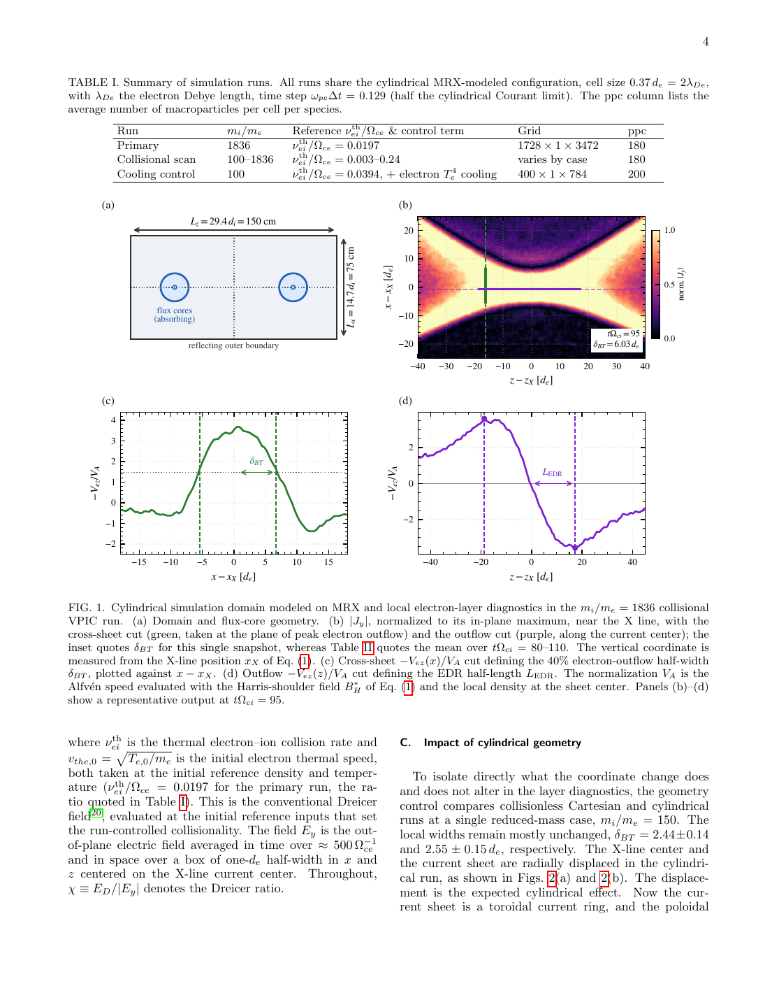
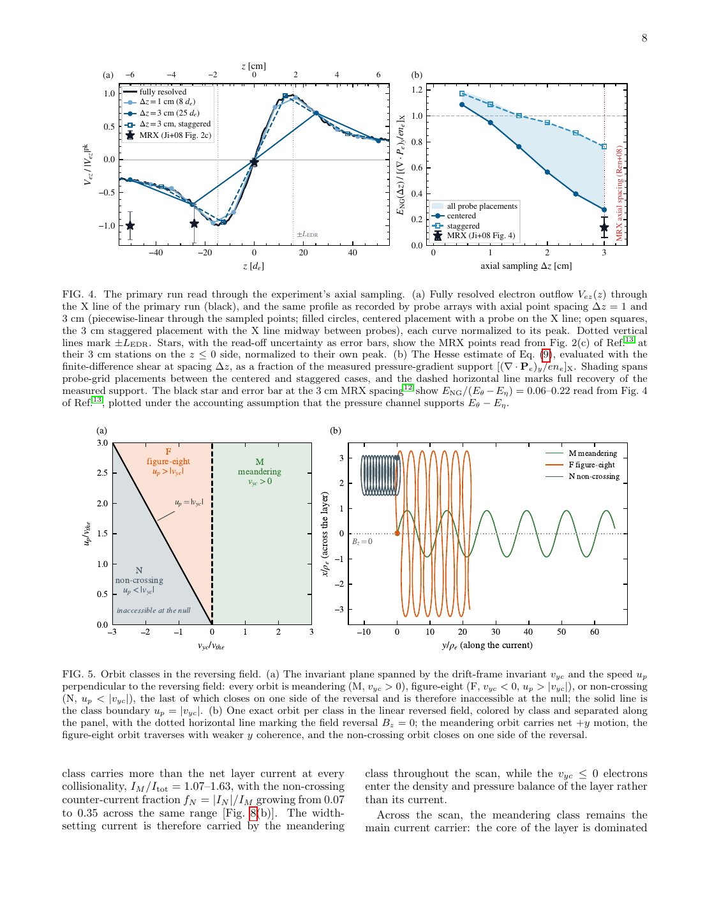
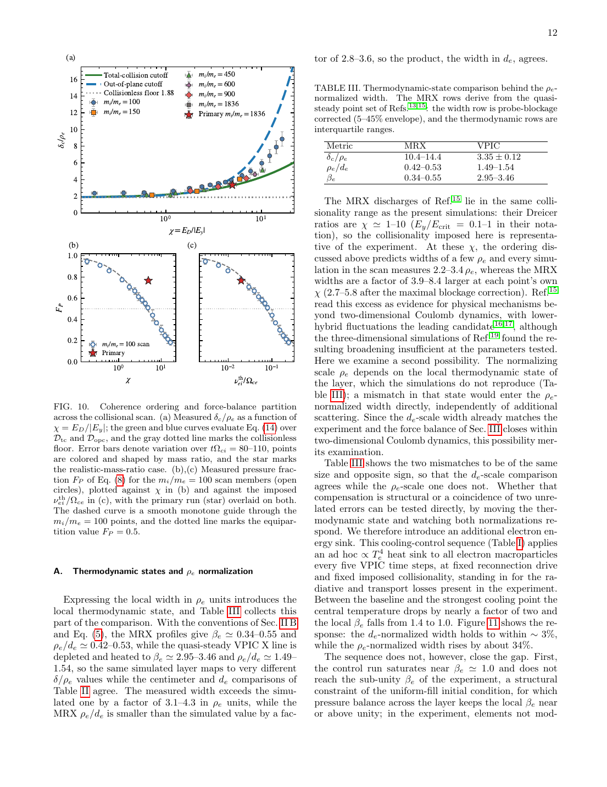

# 真实质量比半碰撞动力学重访 MRX 电子电流片宽度笔记

## 0. 论文信息

- 英文标题：Revisiting the MRX Electron Current Sheet Width with Semi-Collisional Kinetic Simulations at Hydrogen Mass Ratio
- 作者：Sung Hyun Son；Adam Stanier；William Daughton；Jongsoo Yoo；Tongnyeol Rhee；Hantao Ji
- 平台：arXiv 预印本
- DOI：[10.48550/arXiv.2609.01793](https://doi.org/10.48550/arXiv.2609.01793)
- arXiv v1 日期：2026-09-01；稿件日期：2026-09-03
- 来源：[arXiv 摘要页](https://arxiv.org/abs/2609.01793)
- 主题关键词：magnetic reconnection；MRX；electron diffusion region；VPIC；semi-collisional；meandering orbit；Dreicer field
- 本地 PDF：`daily/2026-09-09/pdfs/Son et al. - 2026 - MRX electron current sheet width.pdf`
- 正文处理：官方 arXiv PDF 已下载，文件为 16 页且可非空提取文本；本笔记依据本地 PDF、TXT 与已人工查看的页面图。论文没有报告一轮新的 MRX 实验，而是把既有 MRX 测量同新的二维 VPIC 模拟比较。

## 1. 摘要与文章定位

### 1.1 核心结论

- MRX 历史测得的电子电流片半宽，经探针阻塞修正后为 `5.5–7.5 d_e`；此前约化质量比二维动理学模拟仅得 `1.5–3 d_e`。
- 作者在 MRX 型柱坐标几何、二元 Coulomb 碰撞和真实氢质量比 `m_i/m_e=1836` 下得到 `δ_BT=0.744±0.054 cm=6.26±0.45 d_e`，首次在这两个单位中同时落入实验范围。
- 完全分辨的模拟中，非回旋压力张量散度承担约 `76%` 的非理想电场，其余由碰撞通道承担；把模拟剖面降采样到 MRX 的 `3 cm` 轴向探针间隔后，旧实验中的力平衡“亏缺”重新出现。
- 轨道分析表明 meandering electrons 始终承载核心电流；作者用 Dreicer 比 `χ=E_D/|E_y|` 筛选碰撞下仍保持相干的轨道，并以两种相干条件夹住宽度扫描结果。
- 尚未解决的是回旋半径归一化宽度：MRX 的 `δ_c/ρ_e=10.4–14.4`，而主模拟为 `3.35±0.12`。人为电子冷却只解释了热力学状态为何会移动该归一化，未闭合全部差距。

### 1.2 证据性质

本文是数值 + 解析模型研究。MRX 数值来自 Ji、Ren 等人 2008 年前后的历史实验剖面；新贡献是 2D VPIC 重现实验尺度、观测分辨率前向处理和轨道相干模型。不能把模拟中的力平衡闭合写成新的实验闭合，也不能据此排除所有三维异常输运。

## 2. 引言：两个持续十八年的差异

电子扩散区（EDR）中电子与磁力线解耦，压力张量的非对角/非回旋部分可在 X 线附近支撑 reconnection electric field；微观上，反转磁场内的 Speiser/meandering 轨道产生这种张量贡献。

MRX 半碰撞实验留下两项问题：其一，电子片比约化质量比模拟宽 `2–5` 倍；其二，Hesse 非回旋压力估计加 Spitzer 摩擦只解释测得环向电场的 `30–45%`。弱碰撞与 lower-hybrid 三维涨落都曾被提出，但既有碰撞模拟使用约化质量比，既有三维模拟即使达到或超过测得涨落幅度也仅把环向平均宽度拓宽约 `25%`。

作者因此把问题收缩为：在二维、反平行、半碰撞且装置几何可信的条件下，经典机制本身究竟能否给出 MRX 宽度和力平衡？控制参数不是单独的碰撞频率，而是碰撞阻止 runaway tail 的 Dreicer 场相对 reconnection field 的比值。

## 3. VPIC 设置与宽度诊断

### 3.1 模拟设置及其边界

主模拟在实验的 `(R,Z)` 平面推进粒子和场，对应文中的入流/跨片方向 `x`、流出方向 `z` 和环向电流方向 `y`。计算域为 `14.7×29.4 d_i=75×150 cm`，外边界导体/反射，flux core 粒子区吸收；Takizuka–Abe 二元碰撞算符每五个 VPIC 时间步作用于 `e-e`、`e-i`、`i-i` 对。

主算例网格为 `1728×1×3472`，每种粒子平均每格 `180` 个宏粒子，网格间距 `0.37 d_e=2λ_De`，时间步 `ω_peΔt=0.129`。映射采用 `n_0=2×10^13 cm^-3`、`T_e=T_i=5 eV`，给出 `d_e=0.119 cm` 与参考碰撞率 `ν_ei^th/Ω_ce=0.0197`；作者沿用 MRX 模拟惯例，把 `ω_pe/Ω_ce` 从实验约 `70` 降到 `1`，这是明确的数值缩放而非逐参数复制实验。

模拟只建模 MRX 的 pull phase；准稳态统计窗口为 `tΩ_ci=80–110`，误差条是该时间窗标准差，不是实验误差或数值收敛误差。

图 1 首次给出计算域和两类局域宽度。`δ_BT` 是电子流出速度横向剖面降到峰值 `40%` 处的半宽，取在流出峰值所在下游截面，与 MRX 历史测量定义一致；`δ_c` 则由 X 线处的磁场反转拟合得到。两者位置和定义不同，主算例相差约 `20%`，扫描中最多相差 `31%`，不能把它们逐点等同。

磁场拟合和两个归一化尺度为

$$
B_z(x)=B_H^*\tanh\!\left(\frac{x-x_X}{\delta_c}\right)+C(x-x_X)+B_{\mathrm{bg}},\qquad
d_e=\frac{c}{\omega_{pe}(n_0)},\qquad \rho_e=\frac{v_{the}}{\Omega_{ce}(B_H^*)}.
$$

**变量与推导思路：** `x_X` 是反转中心，`B_H^*` 是 Harris shoulder field，线性项表示驱动重联的背景场；`d_e` 由参考密度决定，`ρ_e` 用片中心电子热速和肩部磁场决定，因为 X 线磁场本身为零。由 `ω_pe^2=4πn_0e^2/m_e`、`Ω_ce=eB_H^*/m_ec` 和 `β_e=8πp_e/(B_H^*)^2` 可得

$$
\frac{\rho_e}{d_e}=\left(\frac{\beta_e}{2}\right)^{1/2}\left(\frac{n_0}{n_e}\right)^{1/2}.
$$

**物理直觉与边界：** `d_e` 主要记录参考密度的电子惯性尺度；`ρ_e` 同时混合片中心温度/密度和上游肩场。于是厘米宽和 `d_e` 宽相同，并不保证 `ρ_e` 归一化也相同。主模拟 X 线耗空到 `n_e≈0.7n_0`、加热至 `β_e≈3.2`，得到 `ρ_e/d_e≈1.51`。

### 3.2 柱坐标控制

在 `m_i/m_e=150` 的无碰撞 Cartesian/柱坐标对照中，`δ_BT` 分别约为 `2.44` 与 `2.55 d_e`。柱坐标 hoop force 及外加均匀 `B_z` 主要移动电流片径向位置；在控制扫描中 `δ_BT`、`δ_c` 和 `L_EDR` 仅小幅变化。因此柱坐标几何提高装置对应性，但真实质量比与碰撞标度才是后文宽度匹配的关键。

## 4. 重现 MRX 局域宽度与电子力平衡

探针玻璃管阻塞会把 MRX 表观半宽放大 `6–44%`；作者采用历史论文给出的反校正，因此实验比较范围为 `0.4–1.1 cm` 或 `5.5–7.5 d_e`。主 VPIC 的 `0.744±0.054 cm`、`6.26±0.45 d_e` 位于两者内部。这是对历史数据的重新比较，不是当前论文新增实验点。

X 线处电子动量方程的环向分量写成力密度：

$$
n_ee\left(\mathbf E+\frac{\mathbf V_e\times\mathbf B}{c}\right)_y
=-(\nabla\!\cdot\!\mathbf P_e)_y
-m_en_e\left(\partial_tV_{ey}+\mathbf V_e\!\cdot\!\nabla V_{ey}\right)+R_y.
$$

**变量与推导思路：** 从电子动量矩取 `y` 分量，左边是非理想 Lorentz force density；右边依次为压力张量散度、非定常/流动惯性和残余 `R_y`。主模拟惯性项仅数个百分点；压力支持分数定义为

$$
F_P=\frac{|(\nabla\cdot\mathbf P_e)_y|}{|(\nabla\cdot\mathbf P_e)_y|+|R_y|}.
$$

主算例得到 `F_P≈0.76`、残余约 `0.24`。`R_y` 在此作为碰撞通道并给碰撞拖曳上界，因为它也吸收所有未解析贡献；局域 Spitzer 估计约为 `0.20|E_y|`，与残余份额相符，但不应把 `R_y` 定义成严格纯电阻项。

实验使用的 Hesse 近似把非回旋压力贡献与 X 线电子流出剪切联系起来：

$$
E_{NG}\equiv-\left(\frac{\nabla\cdot\mathbf P_e}{en_e}\right)_y
\approx\frac{1}{e}\frac{\partial V_{ez}}{\partial z}\sqrt{2m_eT_e}.
$$

**物理直觉与适用边界：** 剪切越陡，穿越 X 线的 meandering electrons 越能建立非对角压力。用完全分辨的模拟剪切代入得 `E_NG≈0.78|E_y|`，与直接压力张量的 `0.72–0.76|E_y|` 一致；但该估计依赖局域导数，最容易被粗轴向采样压低。

MRX 探针跨片分辨率为 `2.5 mm`，但沿流出方向各站相隔 `3 cm`，相当于约 `25–50 d_e`；模拟中的流出斜坡只有几个 `d_e`，`L_EDR≈16.3±2.1 d_e`。因此 `3 cm` 差分跨过整个陡坡，只保留真实 X 线剪切的 `20–70%`，而 `T_e`、`n_e` 和 `δ_BT` 只改变几个百分点。

经过同样观测滤波，模拟得到 `E_NG+E_η≈0.35–0.75|E_y|`，覆盖 MRX 历史报告的 `0.30–0.45|E_y|`；图 4(b) 中 Hesse 支持在 `3 cm` 处降至完全压力支持的 `0.28–0.76`。这说明有限轴向分辨率足以产生类似亏缺，但它是“可解释”的模拟证据，不是对异常耗散或三维物理的普遍否定。

## 5. 轨道层起源与相干宽度模型

在反转场中，以规范动量不变量 `v_yc=v_y-(e/m_ec)A_y(x)` 和垂直于反转场的速度 `u_p=(v_x^2+v_y^2)^{1/2}` 分类：`v_yc>0` 为 meandering；`v_yc<0` 且 `u_p>|v_yc|` 为 figure-eight；`u_p<|v_yc|` 为不跨越反转面的 non-crossing。后者在 X 线处不可达，却在外翼形成抗磁反电流。

粒子扫描显示，随 `χ` 从 `0` 增至 `3.5`，片内 meandering 数目份额从 `66%` 降到 `41%`，但它始终承载主要核心电流，积分电流甚至为净电流的 `1.07–1.63` 倍；其余轨道的反电流抵消超额。因此“宽度由 meandering population 设置”有逐粒子分类支持，而不只是从压力矩反推。

局域线性反转场给出 bounce frequency 和单轨道半宽：

$$
\omega_b=\left(\frac{\Omega_{ce}v_y}{\Delta}\right)^{1/2},\qquad
\frac{\delta_m}{\rho_e}=\left(\frac{\Delta}{\rho_e}\right)^{1/2}\frac{|u_x|}{\sqrt{u_y}},\qquad u_y>0.
$$

**推导与直觉：** 磁场随 `x/Δ` 线性增长，电子跨片速度与环向速度耦合成 bounce；以 `δ_m=|v_x|/ω_b` 代入 `u=v/v_the` 和 `ρ_e=v_the/Ω_ce` 即得第二式。较大的跨片速度拓宽轨道，较大的顺电流速度提高 bounce frequency、缩窄单次摆动。线性场、局域定常场及 `u_y>0` 是适用条件。

Coulomb 散射率随速度按 `ν_ei(v)=ν_ei^th(v_the/v)^3` 下降。令

$$
\chi=\frac{E_D}{|E_y|},\qquad \xi=\sqrt{\chi},
$$

作者得到嵌套相干域：全动量保持要求 `D_tc={u_y>0,u>ξ}`；仅环向电流分量保持要求 `D_opc={u_y>0,u^3>ξ^2u_y}`。前者更严格，后者允许横向/流出运动被散射而 `y` 动量仍相干。

把单轨道宽度对无漂移各向同性 Maxwellian 在选定域 `D` 上平均，并令层宽自洽等于平均轨道宽，得到

$$
\frac{\Delta_{pred}}{\rho_e}=W_D^2(\xi),\qquad
W_D(\xi)=\frac{\int_Dd^3u\,f_M(\mathbf u)|u_x|/\sqrt{u_y}}{\int_Dd^3u\,f_M(\mathbf u)}.
$$

无碰撞极限两域共同给出 `Δ/ρ_e≈1.88`；强碰撞时全动量域为 `Δ_tc/ρ_e≈1.24ξ`，仅环向域为 `Δ_opc/ρ_e≈0.833ξ^2`。后者恢复宽度随碰撞性近线性增加的流体标度。模型忽略实际分布的 bulk drift 和非 Maxwellian 形状，因此低 `χ` 点略高于两曲线并不意外。

跨 `m_i/m_e=100–1836` 的扫描中，`δ_c/ρ_e` 由 `χ` 组织并位于两条相干曲线之间。主真实质量比点为 `χ=4.96±0.52`：模型下/上界 `4.96±0.19 d_e` 与 `6.36±0.25 d_e` 夹住实测模拟宽 `δ_c=5.07±0.24 d_e`。

力平衡分配却由外加 `ν_ei^th/Ω_ce` 更好组织。因为近似有 `χ∝(ν_ei^th/Ω_ce)√(m_i/m_e)`，约化质量比算例不能同时匹配实验的 `χ` 和碰撞率：匹配前者会把压力支持推向碰撞主导，匹配后者又会令层宽过于接近无碰撞下限。只有 `1836` 才把两种约束同时对齐，这解释了真实质量比为何不是装饰性参数。

## 6. 仍存的 `ρ_e` 归一化差异

MRX 历史剖面给出 `β_e=0.34–0.55`、`ρ_e/d_e=0.42–0.53`；主 VPIC 的 X 线则为 `β_e=2.95–3.46`、`ρ_e/d_e=1.49–1.54`。因此相同数量级的 `d_e` 宽被映射成 MRX `δ_c/ρ_e=10.4–14.4` 与 VPIC `3.35±0.12`，直接差 `3.1–4.3` 倍。按每个 MRX 点自身 `χ` 与模型比较，未修正差为 `3.9–8.4`，采用最大探针阻塞修正后仍为 `2.7–5.8`；论文概括为约 `3–6` 倍残余。

作者在 `m_i/m_e=100` 控制序列中每五步施加人为 `T_e^4` 热沉：中心温度约降一半、`β_e` 从 `1.4` 到 `1.0`，`δ_c/d_e` 在约 `3%` 内不变，而 `δ_c/ρ_e` 增加约 `34%`。这证明两种归一化可以解耦，却没有达到实验的亚单位 `β_e`，也没有识别真实损失机制；冷却还会通过 `ν∝T_e^{-3/2}` 同时改变局域碰撞性。

待建模项包括三维/随机磁场上的电子热输运、电子—中性粒子碰撞、辐射、受限流出造成的下游压力堆积，以及当前模拟没有覆盖的 push-phase 初态。实验端同样需要比 `3 cm` 更细且扰动更小的轴向诊断；有限分辨率可能同时把真实短斜坡测成更长 `L_EDR` 并压低局域剪切。

## 7. 结论、开放问题与复习速记

- 已验证于模拟：二维柱坐标、二元 Coulomb 碰撞、`m_i/m_e=1836` 的 VPIC 在 MRX 相关参考碰撞率下重现厘米和 `d_e` 归一化半宽，完全分辨的经典力平衡闭合。
- 对历史实验的解释：`3 cm` 轴向采样可把本来闭合的模拟数据处理成与 MRX 类似的压力支持亏缺；这是强有力的分辨率假说，仍需更细实验诊断直接检验。
- 解析贡献：碰撞按速度选择仍相干的 meandering electrons，`E_D/|E_y|` 组织宽度，而参考碰撞率组织压力/摩擦分配；真实质量比使两者能够同时匹配。
- 未完成边界：`ρ_e` 归一化残差和 MRX/VPIC 热力学状态差异仍然存在，人为冷却不是实验级物理模型，也不能排除三维输运或涨落。

复习时记住一条证据链：真实质量比半碰撞 VPIC 给出 `6.26 d_e` → 经典压力张量 + 碰撞项闭合 → `3 cm` 降采样复现旧亏缺 → meandering 轨道的 Dreicer 相干域解释宽度扫描 → `ρ_e` 因热力学状态不同仍差约 `3–6` 倍。
