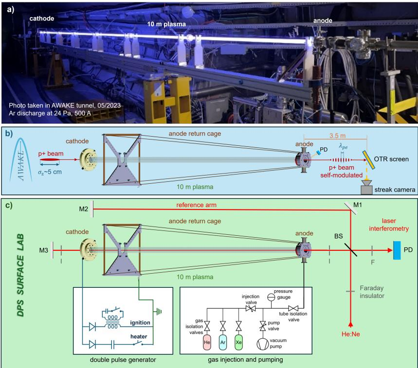
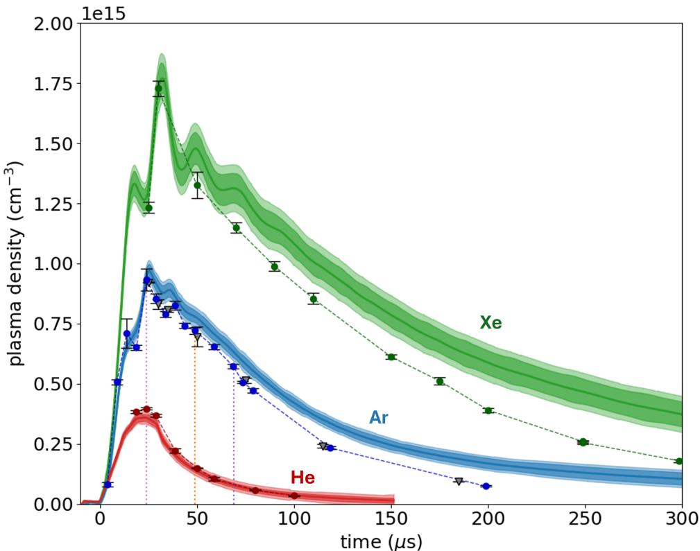
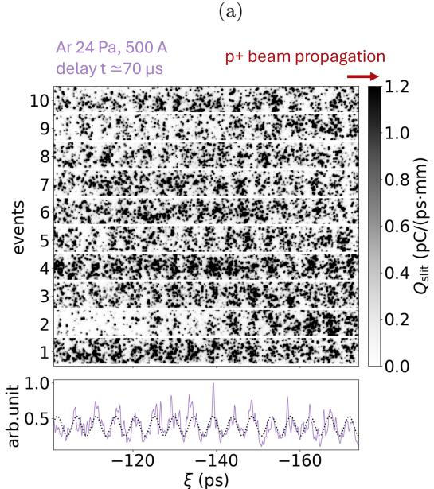
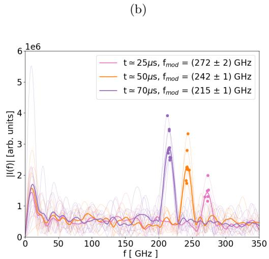

# AWAKE 十米脉冲放电等离子体源实验笔记

## 0. 论文信息

- 英文标题：Demonstration of a 10-metre-long discharge plasma source for plasma wakefield acceleration
- 作者：C. Amoedo；N. Lopes；N. E. Torrado；F. Silva；P. Muggli；L. Verra；M. Turner；G. Zevi Della Porta；M. Bergamaschi；A. Clairembaud；J. Mezger；F. Pannell；N. Z. van Gils；E. Gschwendtner；A. Sublet；AWAKE Collaboration
- 平台：arXiv 预印本
- DOI：[10.48550/arXiv.2609.08551](https://doi.org/10.48550/arXiv.2609.08551)
- arXiv v1：2026-09-08
- 来源：[arXiv 摘要页](https://arxiv.org/abs/2609.08551)
- 主题关键词：AWAKE；plasma wakefield acceleration；discharge plasma source；proton bunch self-modulation；interferometry；long plasma
- 本地 PDF：`daily/2026-09-10/pdfs/Amoedo et al. - 2026 - 10-metre discharge plasma source for AWAKE.pdf`
- 正文处理：官方 arXiv PDF 为 10 页，已完成文件头、页数、哈希和非空文本校验，并完成 MinerU Markdown / 图件提取。本文报告真实装置、干涉测量和质子束自调制实验，但没有在该放电源中报告 witness-electron 加速。

## 1. 摘要与文章定位

AWAKE 过去依赖激光电离的铷蒸气源（VPS）提供约 10 m 等离子体。本文展示一种脉冲直流放电源（DPS）：在内径 `26 mm` 的玻璃管中用双脉冲电源击穿并加热 He、Ar 或 Xe，随后用 Michelson 干涉仪测线积分密度，并用 `400 GeV` SPS 质子束通过后的自调制频率做束流中心区域的独立密度诊断。

贡献有三层：第一，装置能够形成覆盖约 $10^{14}$ 到 $10^{15}\,\mathrm{cm^{-3}}$ 的 10 m 等离子体；第二，干涉测量给出放电时序、峰值密度和长期重复性；第三，质子束确实在 DPS 中发生 self-modulation，其频率与密度随延迟变化一致。这里的“demonstration for wakefield acceleration”是源与驱动束适用性验证，不等于已经用该源加速电子。

## 2. 十米 DPS 结构与诊断链

图 1(a) 是安装在 AWAKE 隧道内的 10 m 放电管；阴极与阳极位于两端，图示工况为 Ar `24 Pa`、`500 A`。图 1(b) 表示 `400 GeV` 质子束穿过等离子体后，在下游 `3.5 m` 的 OTR 屏上用 streak camera 读取纵向微束团结构。图 1(c) 是 Michelson 干涉仪：He:Ne 探针在管内往返一次，得到约 `20 m` 的光程积分。

放电分两步：`15–25 kV` ignition pulse 先击穿气体，随后约 `30 μs`、约 `6 kV` 的 heater pulse 把电流推到最高约 `500 A`。作者给出的气压分别为 Xe `16 Pa`、Ar `24 Pa`、He `45 Pa`。在 `0.1 Hz`、200 个放电的重复性测试中，电流峰值的相对变化小于 `1%`。

干涉相移近似满足

$$
\Delta\phi(t)=r_e\lambda_{\rm L}\int n_e(s,t)\,ds,
$$

其中 $r_e=e^2/(4\pi\varepsilon_0m_ec^2)$ 是经典电子半径，$\lambda_{\rm L}$ 是 He:Ne 探针波长，$n_e$ 单位为 $\mathrm{m^{-3}}$ 或 $\mathrm{cm^{-3}}$，积分沿双程光路。若再假定横向/纵向密度足够均匀，才能把线积分除以光程得到代表性密度；这是后续系统差异的主要来源之一。

## 3. 三种气体的密度与时间窗

图 3 给出电流与密度时序。峰值密度约为：Xe $1.78\times10^{15}\,\mathrm{cm^{-3}}$，Ar $0.87\times10^{15}\,\mathrm{cm^{-3}}$，He $0.36\times10^{15}\,\mathrm{cm^{-3}}$。质量更大、击穿与复合动力学不同的气体提供不同可用时间窗。

图中叠加的束流诊断点并不是干涉测量的重复绘图，而是从质子自调制频率反演的轴心附近密度。晚时 Ar/Xe 中两者可相差约 `9%`；作者讨论的可能原因包括复合阶段的径向密度梯度、干涉仪约 `2 mm` 光束与质子束约 `200 μm` 横向采样尺度不同，以及从微束团相位提取频率的累积效应。

因此本文验证了“沿全长存在可驱动 self-modulation 的等离子体”，但单台横向干涉仪不能解析沿 10 m 的纵向均匀性。平均密度稳定与纵向均匀是不同指标。

## 4. 质子束自调制如何测密度

入射 SPS 质子束能量 `400 GeV`，典型质子数约 $3\times10^{11}$，rms bunch duration 约 `190 ps`（长度约 `5 cm`），横向 rms 尺寸约 `200 μm`。长束进入等离子体后被自身激发的 wake 周期性聚焦/散焦，演化成以等离子体频率排列的微束团。

电子等离子体频率为

$$
f_{pe}=\frac{1}{2\pi}\sqrt{\frac{n_{pe}e^2}{m_e\varepsilon_0}},
$$

其中 $n_{pe}$ 是等离子体电子密度，$e$ 是元电荷，$m_e$ 是电子质量，$\varepsilon_0$ 是真空介电常数。反演关系为

$$
n_{pe}=\frac{4\pi^2m_e\varepsilon_0}{e^2}f_{pe}^2.
$$

因此频率的相对不确定度会放大为密度的约两倍：$\delta n/n\simeq2\delta f/f$。把 streak-camera 纵向强度做 DFT 得到的 modulation peak 当成 $f_{pe}$，就能测量驱动束实际采样到的密度。

图 4(a) 是放电后 `25、50、70 μs` 的 streak 图。延迟增加时等离子体复合、密度下降，微束团间距相应增加。相机记录窗为约 `73 ps / 512 px`，时间分辨约 `1 ps`。

图 4(b) 的 DFT 峰依次为 `272±2 GHz`、`242±1 GHz`、`215±1 GHz`，换算密度为 $(9.33\pm0.14)\times10^{14}$、$(7.21\pm0.06)\times10^{14}$、$(5.72\pm0.05)\times10^{14}\,\mathrm{cm^{-3}}$。这条链是“OTR 时间结构 → modulation frequency → $n\propto f^2$”，并不是直接成像等离子体密度。

## 5. 稳定性数字与 AWAKE 相位要求

在固定 Ar 工况、约 $7\times10^{14}\,\mathrm{cm^{-3}}$ 下，48 个连续事件得到

$$
f_{\rm mod}=235.1\pm1.5\ \mathrm{GHz},\qquad
\frac{\sigma_f}{\bar f}=0.63\%.
$$

VPS 的已报告 unseeded/seeded modulation-frequency 相对散布约为 `0.72%/0.51%`，所以 DPS 的束流可见稳定性处于相近水平。但 VPS 有独立密度诊断显示源本身重复性不大于约 `0.2%`，说明这类 `0.5–0.7%` 频率散布可能主要由束流与提取方法决定。不能把 `0.63%` 直接写成 DPS 的内禀密度均匀性；若机械换算，密度散布约是其两倍。

对相位稳定的定性要求可从等离子体波长

$$
\lambda_{pe}=\frac{c}{f_{pe}}\propto n_{pe}^{-1/2}
$$

得到。若沿传播距离累积的波长变化要小于约 $\lambda_{pe}/8$，AWAKE 设计常用的纵向相对密度变化目标约为 `0.25%`。本文没有沿 10 m 分段测得这一指标，因此作者把纵向均匀性诊断列为后续关键工作，而不是宣称已满足。

## 6. 长期运行证据

作者在超过 `20,000` 次放电后重新测量选定延迟的密度，结果在不确定度内与早期数据一致。这支持电极/玻璃管在当前运行周期内没有明显导致密度漂移。它仍不是寿命终点测试，也没有覆盖更高 repetition rate、长模块串联或未来 AWAKE 全工况的维护周期。

## 7. 与激光电离铷源的差别

DPS 的潜在优势是气体选择灵活、密度可通过压力/电流/延迟调节，不需要一束沿 10 m 传播的高功率电离激光，因而更易设想更长或多模块系统。VPS 的优势则是蒸气温度可以精确控制密度并形成锐利边界，且已有 AWAKE acceleration 运行经验。

本文只证明 DPS 在当前长度和 repetition rate 上能够产生自调制所需等离子体，并以两种诊断交叉核对平均/轴心密度。真正替代 VPS 仍需：沿全长亚百分比密度测量与控制、模块接口、电子注入和加速验证、对 wake phase/gradient 的直接诊断。

## 8. 局限与证据边界

- 这是等离子体源和 proton self-modulation 实验，不是 witness-electron energy-gain 实验。
- Michelson 给出双程线积分，不能单独分辨 10 m 纵向均匀性。
- 质子束方法采样约 `200 μm` 轴心区域；干涉探针约 `2 mm`，二者并非同一空间平均。
- `0.63%` 是 modulation frequency 的事件散布，不是直接密度散布或纵向不均匀度。
- `0.25%` 是稳定 wake phase 的目标量级，本文没有直接达到/测得该全长指标。
- `20,000` 次运行支持当前装置耐久性，但不是高 repetition rate 工业寿命认证。
- 尚未展示多模块耦合、电子注入、电子能增益、能散或发射度保持。

## 9. 对实验与 PIC 建模的启示

对 AWAKE/PWFA 模拟，最值得吸收的是不要只输入一个均匀 $n_0$：应把可测的径向 profile、随放电延迟变化的密度、长程纵向梯度及 shot-to-shot 变化分别参数化。因为 wake phase 对 $n_e^{1/2}$ 敏感，即使平均密度正确，微小纵向结构也可能在 10 m 上累积相位误差。

诊断比较也应前向建模：对干涉仪积分到 `2 mm` 光束和双程路径，对 proton method 生成微束团时间结构并用与实验相同的 DFT 窗取峰。只有这样，模拟“密度”和实验反演“密度”才是同一个 observable。

## 10. 结论与阅读建议

本文最强的实验事实是：10 m noble-gas DPS 在真实 AWAKE 质子束下产生了可解析的 self-modulation，频率随放电后密度衰减按 $f\propto\sqrt n$ 移动，并在 48 个事件与超过 20,000 次放电的时间尺度上表现稳定。最大未闭合项是全长纵向均匀性和电子加速。

建议先看图 1 建立两套诊断的空间采样差异，再看图 3 的干涉/束流密度偏差，最后用图 4 自己核对 `272→215 GHz` 如何对应密度下降。引用时应写“DPS + self-modulation demonstration”，不要简称为“AWAKE 已用 DPS 加速电子”。
