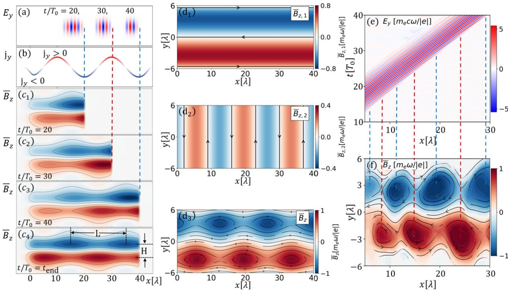
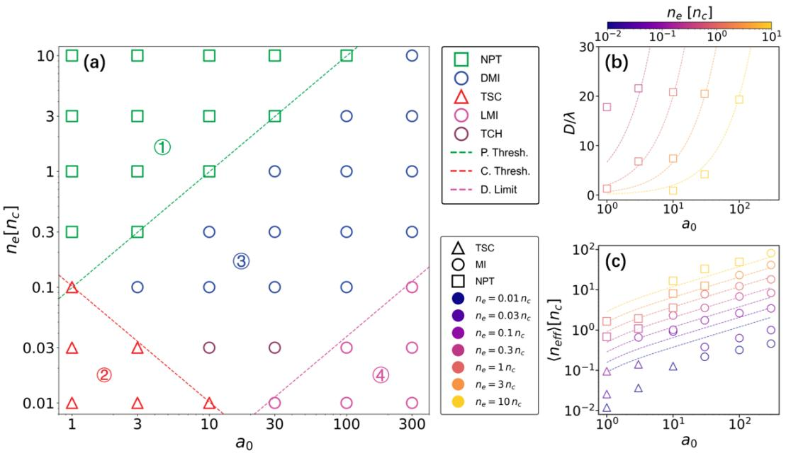
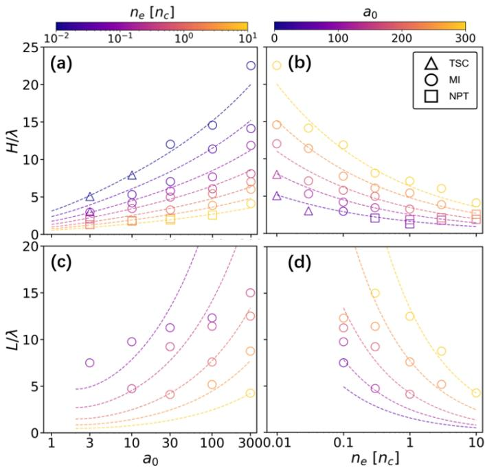

# 相对论激光等离子体通道磁岛结构笔记

## 0. 论文信息

- 英文标题：Magnetic island structures in relativistic laser-driven plasma channels
- 作者：Dongchi Cai；Zheng Gong；Guanqi Qiu；Deji Liu；Yinren Shou；Xueqing Yan
- 平台：arXiv 预印本
- DOI：[10.48550/arXiv.2609.06562](https://doi.org/10.48550/arXiv.2609.06562)
- arXiv v1：2026-09-06；稿件日期：2026-09-09
- 来源：[arXiv 摘要页](https://arxiv.org/abs/2609.06562)
- 主题关键词：relativistic laser channel；magnetic island；current filament；similarity parameter；EPOCH PIC；radiation reaction
- 本地 PDF：`daily/2026-09-10/pdfs/Cai et al. - 2026 - Magnetic islands in relativistic laser-driven plasma channels.pdf`
- 正文处理：官方 arXiv PDF 为 12 页，已完成文件、页数、哈希、文本与 MinerU 图件检查。本文是解析理论 + 作者运行的二维 EPOCH 参数扫描，不是磁岛的实验观测。

## 1. 摘要与文章定位

强激光在低密度等离子体中挖空电子并形成纵向电流，通常会产生准静态方位磁场。本文讨论一种更细的结构：纵向电流产生的横向反对称 $\bar B_{z,1}$ 与激光波前驱动的周期横向电流产生的 $\bar B_{z,2}$ 叠加，形成沿通道排列、相位锁定于激光载波包络相位（CEP）的二维 magnetic islands。

这里的“magnetic island”不是传统 tearing mode 通过磁重联长出的岛，也不等同于三维磁涡管。它是在二维 $x$–$y$ 平面中，$B_z$ 的背景反转与轴向周期调制叠加后形成的闭合磁力线/流线拓扑。作者用约 4 个数量级的 $a_0$–$n_e$ 扫描把通道分为 NPT、TSC、DMI、LMI、TCH 等区域，并推导 island 横向宽度 $H$、纵向长度 $L$ 的相似标度。

## 2. 参考 PIC 设置

参考算例使用二维 EPOCH：激光波长 $\lambda_0=1\,\mu\mathrm m$，归一化振幅 $a_0=30$，对应强度约 $1.23\times10^{21}\,\mathrm{W\,cm^{-2}}$；线偏振电场为 $E_y$，焦斑 $w_0=3\,\mu\mathrm m$，脉宽 `15 T0`，约 `50 fs`，时间包络为 $\sin^2$。

碳等离子体靶长 $l=40\,\mu\mathrm m$，初始电子密度 $n_e=0.3n_c$。计算域为 $50\lambda_0\times30\lambda_0$，网格 `2000×1000`，每格 40 个电子和 20 个 C 宏粒子。模拟启用 radiation-reaction force，但没有推进或统计 emitted photons；因此文中不能提供同步/非线性 Compton 光子谱或产额。

归一化量为 $\hat x=x/\lambda_0$、$\hat n_e=n_e/n_c$，其中 $n_c=m_e\varepsilon_0\omega_0^2/e^2$。二维几何把第三方向设为均匀，因而所得结构对应无限延伸的片状磁拓扑，不是已验证的三维有限宽岛。

## 3. 两类电流如何合成磁岛

图 1 左列显示激光 $E_y$ 与波前横向电流 $j_y$ 的相位关系，及总平均 $\bar B_z$ 随传播形成周期结构；中列把纵向通道电流产生的 $\bar B_{z,1}$ 和横向电流产生的 $\bar B_{z,2}$ 分开，再叠加成闭合岛；右列说明 $\bar B_{z,2}$ 的周期条纹与 $E_y$ 波前保持相位关系。

物理上，轴向快电子电流 $j_x$ 及回流使通道上下两侧出现异号背景 $B_z$。与此同时，激光横向摆动驱动 $j_y$，通过 Faraday/Ampère 耦合在 $x$ 方向生成交替符号的 $B_z$ 调制。当调制足够强且通道已形成，背景反转面被周期性弯曲并闭合为 island。

作者强调 CEP 决定周期调制相位，因此不同 CEP 可平移 island 序列。这个结论来自给定二维模拟与相位扫描；尚未有实验磁场成像验证。

## 4. 激光能否穿透靶：第一条边界

相对论电子因子取

$$
\gamma\simeq\sqrt{1+\frac{a_0^2}{2}}.
$$

有效等离子体频率因相对论质量增加而降低，群速度与相速度的差使脉冲在有限持续时间内只有一定 penetration depth。作者估算

$$
D\simeq\frac{\gamma}{\hat n_e}c\tau_d
\simeq\frac{a_0}{\sqrt2\,\hat n_e}c\tau_d,
$$

其中 $D$ 和 $c\tau_d$ 都是长度，$\tau_d$ 是激光有效作用时间。要穿透厚度 $l$，需要

$$
\frac{a_0}{\hat n_e}\gtrsim\frac{\sqrt2\,l}{c\tau_d}.
$$

在参数图中，考虑实际包络平均振幅约为峰值一半，经验边界接近 $a_0/\hat n_e\sim10$。低于它进入 no penetration（NPT）；这条线不是普适常数，会随脉宽、靶厚和包络改变。

## 5. 通道宽度与电子排空

电子被横向 ponderomotive force 推出，离子背景形成回复电场。用横向力平衡，作者得到初始密度近似下的通道宽度

$$
\hat H\simeq\kappa_1
\sqrt{\frac{8\left(\sqrt{1+a_0^2/2}-1\right)}{\hat n_e(0)}},
\qquad \kappa_1\simeq0.7.
$$

$\hat H=H/\lambda_0$，$\hat n_e(0)$ 是初始归一化密度，$\kappa_1$ 是从 PIC 对齐的拟合系数。推导相当于把电子平均动能密度同离子柱电势能配平；忽略电子热压、有限离子运动和非均匀密度。

若通道不足以完全排空，会形成 transient skin current（TSC）而不是稳定 island。作者给出的 TSC–DMI 解析条件为

$$
\hat n_e\gtrsim
\frac{\kappa_1^2\left(\sqrt{1+a_0^2/2}-1\right)}{2a_0^2},
$$

在大 $a_0$ 下，模拟中的实用经验线可写成 $a_0\hat n_e\gtrsim0.1$。它表示激光驱动与可供形成稳定通道电流的等离子体密度必须同时足够。

## 6. 参数区域图

图 4 把 $a_0=1$ 到 `300`、$\hat n_e=0.01$ 到 `10` 的二维 EPOCH 结果分类。NPT 表示激光未穿透；TSC 是瞬态表面/皮层电流；DMI 与 LMI 分别是离散和纵向延展磁岛；TCH 是通道主导的拓扑。曲线是解析标度乘以经验校正，点是作者的 PIC 分类。

这张图最有用之处是把形成条件拆成三个问题：脉冲是否穿透、是否能挖出通道、岛的纵向尺度是否超过靶长。它不是实验 phase diagram，也没有给出每个分类的统计不确定度或三维稳定性。

## 7. pile-up 后的有效密度与岛尺寸

通道边缘存在电子 pile-up，若仍使用初始密度会低估回复场。作者以 ponderomotive pressure 与 electrostatic pressure 平衡得到

$$
\hat n_{\rm eff}\simeq
\sqrt{\frac{a_0^2\hat n_e}{\gamma}}.
$$

把 $\hat n_{\rm eff}$ 代回横向平衡，岛宽修正为

$$
\hat H\simeq\kappa_1
\sqrt{\frac{8(\gamma-1)}{a_0\sqrt{\hat n_e/\gamma}}}.
$$

在 $a_0\gg1$ 极限，$\gamma\propto a_0$，所以

$$
H\propto\left(\frac{a_0}{\hat n_e}\right)^{1/4}.
$$

纵向尺度来自群速/相速失配使相位锁定图案随传播拉长。作者写成

$$
\hat L\simeq\kappa_2
\frac{\gamma\sqrt\gamma}{a_0\sqrt{\hat n_e}},
\qquad \kappa_2\simeq1.3,
$$

大 $a_0$ 下有

$$
L\propto\sqrt{\frac{a_0}{\hat n_e}}.
$$

于是横向宽只按 similarity variable 的四分之一次幂增长，纵向长度按平方根增长。$\kappa_{1,2}$ 是对当前二维扫描的拟合系数，不是从第一性原理唯一确定的常数。

图 5 中三角形、圆形和方形分别标出 TSC、MI 与 NPT；虚线是解析/拟合标度。宽度 $H$ 的数据覆盖面较完整，纵向 $L$ 只在形成可辨认 island 的区域定义。接近边界时拓扑分类本身会影响长度测量，不能把虚线外推到 NPT 或无 island 区。

## 8. DMI 到 LMI 的靶长条件

若 $L$ 大于靶长 $l$，相邻 island 在有限靶内表现为纵向延展结构。令 $L\gtrsim l$，在大 $a_0$ 极限得到

$$
\frac{a_0}{\hat n_e}gtrsim
2^{3/2}\left(\frac{l}{\kappa_2}\right)^2.
$$

对本文 $l=40\lambda_0$，右侧约为几千，模拟边界约 $a_0/\hat n_e\sim3\times10^3$。由于它显式依赖 $l^2$，换成不同靶厚时不能照搬数值 `3000`。

作者据此指出 $H$ 与 $L$ 主要由相似参数

$$
S=\frac{n_e}{a_0n_c}=\frac{\hat n_e}{a_0}
$$

组织。小 $S$ 对应更强的相对论驱动/更低密度，通道和岛尺度更大。

## 9. 对粒子与次级辐射应用的真实含义

磁岛可能改变电子束缚、横向动量、辐射反作用和 ion acceleration，因此作者把它视为可控 laser-channel topology。但本文没有输出可用于应用闭环的电子能谱/电荷/发射度，也没有给出 photon spectrum/yield、质子/离子谱、转换效率、光核反应或剂量。

因而合理的后续问题是：在同一参数图上叠加 DLA electron observable 和辐射 observable，看 DMI/LMI 边界是否对应束流或 photon 性能转折；而不是直接把磁岛写成已经优化的电子/γ/离子源。

## 10. 局限与未验证边界

- 二维 EPOCH 把结构视为第三方向均匀，三维 filamentation、kink 和有限焦斑拓扑未验证。
- 论文没有新实验，磁岛和 phase diagram 均来自作者模拟/理论。
- 扫描启用 radiation-reaction force，但忽略 emitted photons，不能报告辐射源性能。
- 解析式采用 immobile-ion、无热压、近似完全电子排空和简单相位失配等假设。
- $\kappa_1\simeq0.7$、$\kappa_2\simeq1.3$ 是拟合系数；边界随靶厚、脉宽和包络改变。
- “magnetic island”不是 tearing-mode 重联岛，不能把术语相同当成机制相同。
- CEP locking 在实验的 shot-to-shot CEP/靶波动下是否可控尚未证明。
- 本轮没有运行 EPOCH 或做独立参数扫描，只完成全文与图件审读。

## 11. 结论与阅读建议

本文建立了一个可复查的形成链：纵向通道电流给出横向反转背景场，波前横向电流给出轴向周期调制，两者叠加形成 CEP 锁定的二维 island；穿透、排空和有限靶长又把 $a_0$–$n_e$ 空间分成不同区域。$H\propto(a_0/\hat n_e)^{1/4}$、$L\propto(a_0/\hat n_e)^{1/2}$ 是其最简洁的相似性结果。

建议先看图 1 区分两种电流与两种 $B_z$，再看图 4 理解区域边界，最后用图 5 判断解析式在哪些点有效。应用层面应把它作为电子/辐射源优化的候选中间机制，而不是已经验证的 source-performance 结论。
