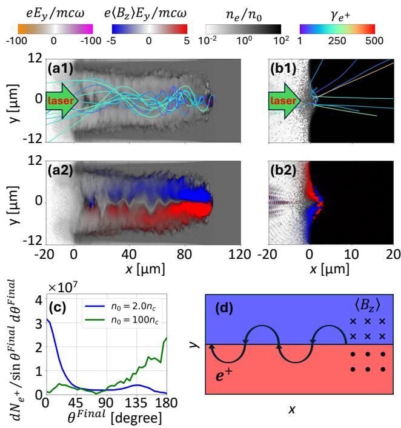
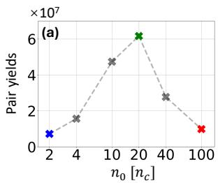
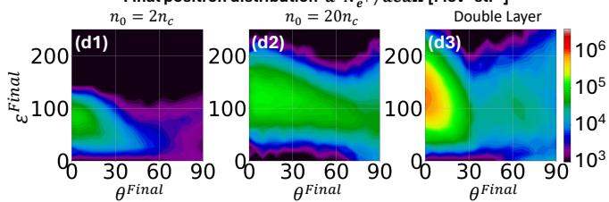

# 线性 Breit–Wheeler 正电子自组织转向与压缩机制笔记

## 0. 论文信息

- 英文标题：Self-organized positron reorienting and pinching mechanism for the experimental detection of the linear Breit-Wheeler process
- 作者：Yutong He；Alexey Arefiev；Mario Manuel；Hui Chen；Christopher Ridgers
- 平台：arXiv 预印本
- DOI：[10.48550/arXiv.2609.07584](https://doi.org/10.48550/arXiv.2609.07584)
- arXiv v1：2026-09-07；稿件日期：2026-09-09
- 来源：[arXiv 摘要页](https://arxiv.org/abs/2609.07584)
- 主题关键词：linear Breit–Wheeler；gamma–gamma collision；positron beam；relativistic transparency；QED-PIC；self-generated magnetic field
- 本地 PDF：`daily/2026-09-10/pdfs/He et al. - 2026 - Self-organized positron reorienting for linear Breit-Wheeler.pdf`
- 正文处理：官方 arXiv PDF 为 8 页，已完成文件、页数、哈希、文本与 MinerU 图件检查。本文是解析机制 + 作者运行的 3D3V EPOCH QED-PIC 研究，不是线性 Breit–Wheeler 实验观测；题名中的“experimental detection”指建议的可探测方案。

## 1. 摘要与文章定位

线性 Breit–Wheeler（LBW）过程是两个实光子直接产生电子–正电子对：

$$
\gamma+\gamma\rightarrow e^-+e^+.
$$

它与强激光场中的 nonlinear Breit–Wheeler 不同：后者通常写成高能光子吸收多个背景场光子。LBW 的实验困难不只在总产额，还在新生正电子容易被强烈 plasma/BH backgrounds 淹没。本文提出利用相对论透明低密等离子体通道的自生方位磁场，把原本前向运动的一部分 LBW 正电子转向后方并逐次压缩角振幅，从而在后向方向形成作者预计更干净的信号。

作者用七组 3D3V EPOCH QED-PIC 算例扫描密度并设计双层靶。最优双层模拟报告总对产额 $5.5\times10^7$，后向约 $15^\circ$ 内的谱强度可到约 $10^6\,\mathrm{MeV^{-1}\,sr^{-1}}$。这些数字来自计算宏粒子/权重统计，不是探测器计数，也没有完整材料输运与背景模拟。

## 2. 激光、靶与 QED-PIC 设置

激光波长 $\lambda_0=800\,\mathrm{nm}$，峰值强度 $I_0=3\times10^{22}\,\mathrm{W\,cm^{-2}}$，对应归一化场强约 $a_0=120$；强度 FWHM 为 `25 fs`，焦斑半径 `5 μm`。完全电离 CH 靶横向尺寸为 `24×24 μm²`，网格在 $x,y,z$ 三方向均为 `20 cells/μm`；每格使用 5 个电子、2 个 C 离子和 2 个 H 离子宏粒子。

均匀靶密度为 $n_0=2,4,10,20,40,100\,n_c$，相应轴向长度为 `120, 100, 55, 40, 40, 40 μm`。双层靶为前段 $1n_c$、`0–40 μm`，后段 $20n_c$、`40–70 μm`。$n_c=m_e\varepsilon_0\omega_0^2/e^2$ 是对应激光频率的临界密度。

EPOCH 中启用 Monte Carlo quantum-synchrotron photon emission，并加入作者实现的 LBW 模块，让已产生的实光子彼此碰撞生成对。论文没有给出与独立 LBW 实现的代码级交叉验证，也没有报告本轮之外的实验校准。

## 3. 透明与不透明靶产生不同信号几何

图 1 对比 $2n_c$（U2）与 $100n_c$（U100）。U2 在相对论透明后形成激光通道和强 $B_\phi$；正电子先向前产生，随后被转向 $-x$ 并在通道内横向束缚。U100 对激光不透明，配对区和电流结构不同，正电子主要保持前向。

作者的角度定义需要特别小心：$\theta=0$ 指后向 $-x$，$\theta=\pi$ 才是前向 $+x$，并采用

$$
\theta=\arctan\left(-\frac{|p_\perp|}{p_x}\right)
$$

映射到所画半平面。若沿用通常把 $+x$ 当 $0^\circ$ 的习惯，会把“后向压缩”读反。

U2 与 U100 总产额分别约 $7.2\times10^6$ 与 $9.9\times10^6$，数值相近但方向分布完全不同。这正是作者强调的点：检测价值不能只看总对数，还要看相对于背景的角相空间重排。

## 4. 自生方位磁场从何而来

透明通道中，快电子沿 $+x$ 传播，回流和漏斗状横向电流组成 $j_x$ 与 $j_r$。轴对称近似下主要产生 $B_\phi$，且沿 $x$ 改变。取矢势只有 $A_x$ 分量，有

$$
B_\phi=-\frac{\partial A_x}{\partial r},
\qquad
A_x(r,x)=-\int_0^rB_\phi(r',x)\,dr'.
$$

轴线上由对称性 $A_x=0$ 且 $\partial_xA_x=0$。Ampère 关系给出文中的符号链

$$
\frac{\partial}{\partial r}\left(\frac{\partial A_x}{\partial x}\right)
=\frac{4\pi}{c}j_r>0,
$$

所以离轴区域 $\partial_xA_x>0$。这里使用 Gaussian 单位；$j_r$ 是径向电流密度，$c$ 是光速。

## 5. 为什么后向正电子会越过轴越“窄”

忽略时间变化和标量势后，单粒子 Hamiltonian 为

$$
H=c\sqrt{(\mathbf P-e\mathbf A)^2+m_e^2c^2},
$$

其中正电子电荷为 $+e$，canonical momentum $\mathbf P=\mathbf p+e\mathbf A$，kinetic momentum 为 $\mathbf p=\gamma m_e\mathbf v$。由 Hamilton 方程可得

$$
\frac{d}{dt}(p_x+eA_x)
=\frac{e}{\gamma m_e}p_x\frac{\partial A_x}{\partial x}.
$$

对后向运动正电子 $p_x<0$，而离轴 $\partial_xA_x>0$，右端非正。因此每次离轴传播再穿越轴线时，canonical longitudinal momentum 进一步向负方向移动；在总能量近似保持时，横向动量占比下降，角振幅缩小。这个过程既完成 forward-to-backward reorientation，也形成逐次 axis-crossing 的 angular pinching。

作者还把

$$
\frac{d\theta}{dt}
$$

按 $E_x$、$E_r$、$B_\phi$ 等场分量分解，并对 Boris pusher 每一步的动量增量做归因。在 U2 算例中，$B_\phi$ 对后向角收缩占主导；这比只看末态相关性更接近动力学因果证据。分解仍依赖离散推进和场插值，不能取代独立数值收敛测试。

## 6. 密度扫描与双层靶折中

图 3(a) 显示总 LBW 对产额从 $2n_c$ 的约 $7.2\times10^6$ 上升到 $20n_c$ 的约 $6.2\times10^7$，随后在更高密度下降。低密靶让激光传播和磁通道形成得更好，但 target photons / synchrotron photons 数量有限；中等密度提高光子碰撞；过高密度又阻止激光穿透和后向压缩。

双层靶把两种功能拆开：前段 $1n_c$ 负责形成透明通道和磁场，后段 $20n_c$ 提供更高 photon density。作者得到总产额约 $5.5\times10^7$，同时保留强后向分量。

图 3(d1–d3) 横轴是作者定义的末态角度，纵轴是正电子能量（MeV），颜色为对数谱密度。双层靶在 $\theta\approx0$ 的后向方向形成更强、更集中的高能分量；论文引用的约 $10^6\,\mathrm{MeV^{-1}\,sr^{-1}}$、约 `15°` 信号来自这一模拟分布。

## 7. “可实验探测”还缺哪些环节

作者把后向方向称为预期安静背景区，并与以往 laser–plasma Bethe–Heitler 正电子实验的可探测强度比较，认为信号提高 2–3 个数量级后进入可测范围。但当前计算没有同时推进靶内 Bethe–Heitler、Trident、Compton electrons、pair annihilation、材料次级粒子、探测器响应和遮挡几何。

因此“quiet background”是物理设计假设，不是完整 background budget。实际实验至少需要：在同一靶/激光参数下联合模拟 LBW 与 material backgrounds；给出角谱仪接受度和 energy resolution；把宏粒子权重转化为每发计数及统计显著性；扫描焦点、预等离子体、密度梯度、靶厚和指向抖动。

## 8. 与既有正电子条目的去重边界

仓库已有多篇 nonlinear Breit–Wheeler、Bethe–Heitler 或自组织 photon-collider 工作。本文的新点不是一般的“激光产生正电子”，而是实光子–实光子的 linear Breit–Wheeler 事件在自身等离子体磁场中发生后向重定向与角压缩。历史上以超强场吸收多光子产生对、或以高 Z 物质场产生 Bethe–Heitler 对的条目，反应通道和可观测量都不同。

## 9. 局限与未验证边界

- 全部核心产额与角谱来自作者 3D3V EPOCH QED-PIC，不是实验数据。
- `3×10^22 W/cm²`、`5 μm`、`25 fs` 是挑战性激光条件；论文未做完整设施容差预算。
- LBW 模块没有在本文中与第二代码或解析基准做系统独立验证。
- 每格粒子数较低，稀有过程宏粒子统计、网格和 box-size 收敛需要额外检查。
- 背景只作定性/文献量级讨论，没有端到端靶输运和探测器模拟。
- 角度零点与常规约定相反，复用图表时必须保留定义。
- 双层靶密度、界面陡峭度与预等离子体在实验中的可实现性尚未验证。
- 本轮没有运行 EPOCH 或复现 LBW 模块，只审读作者全文与图件。

## 10. 结论与阅读建议

这篇工作的价值在于把“产额最大化”改写成“信号相空间工程”：透明通道的 $B_\phi$ 能把一部分 LBW 正电子转向后方，并通过空间变化的 $A_x$ 在多次过轴中减小角振幅；双层靶再把磁场形成与 photon target density 分工。机制链有 3D QED-PIC 粒子轨迹和场分解支持，但实验可探测性尚未被完整背景与探测器链闭合。

建议先核对图 1 的角度定义，再读 Hamiltonian 推导，最后用图 3 区分“总产额峰值”和“后向可检测谱”。引用时宜写“作者预测/模拟”，不要写成已观测 linear Breit–Wheeler 或已实现背景自由探测。
