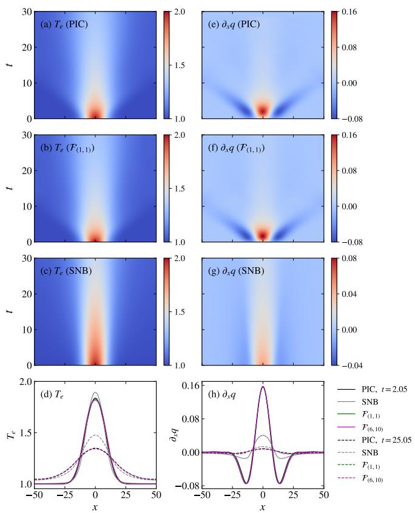
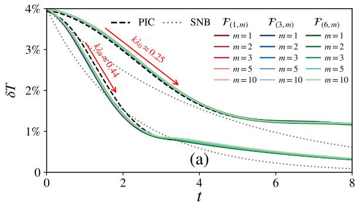
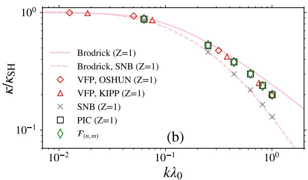

# 分辨率鲁棒的 ICF 非局域热流机器学习闭合笔记

## 0. 论文信息

- 正式题名：Resolution-Robust Machine Learning Heat Flux Closure for Inertial Confinement Fusion Plasmas
- 作者：M. Luo；A. R. Bell；F. Miniati；S. M. Vinko；G. Gregori
- 期刊：PRX Intelligence 1, 013017 (2026)
- DOI：[10.1103/9l4n-mnz6](https://doi.org/10.1103/9l4n-mnz6)
- 正式发表日期：2026-09-03
- 正式来源：[APS 论文页](https://journals.aps.org/prxintelligence/abstract/10.1103/9l4n-mnz6)
- 对应作者预印本：[arXiv:2604.03439](https://arxiv.org/abs/2604.03439)，题名为 *Resolution-Independent Machine Learning Heat Flux Closure for ICF Plasmas*
- 主题关键词：inertial confinement fusion；nonlocal electron heat transport；Fourier neural operator；PIC；resolution invariance；implicit solver
- 本地 PDF：`daily/2026-09-10/pdfs/Luo et al. - 2026 - Resolution-robust ML heat flux closure.pdf`
- 正文版本边界：APS 排版 PDF 下载路径返回 `HTTP 403`，本地全文是与正式论文对应的 arXiv v1 作者预印本，不是 APS 排版版。正式题名、卷页和发表日期以 APS 元数据为准；技术细节依据本地作者稿核对。

## 1. 摘要与文章定位

本文要解决的并不是“用神经网络拟合一条热流曲线”，而是如何把高保真 kinetic/PIC 数据压缩成可嵌入宏观能量方程的非局域闭合，并使同一个模型在训练网格之外仍可工作。作者以 Fourier neural operator（FNO）学习一维电子温度场 $T_e(x)$ 到热流散度 $\partial_x q(x)$ 的算子映射，再把该闭合放入隐式电子能量方程中推进温度。

核心结果包括：模型能在未见过的热点宽度、不同网格降采样和时间外推区间保持较小温度误差；在一个作者给出的单 CPU 对比算例中，FNO 推进约 `20 min`，SNB 非局域模型约 `800 min`，即接近 `40×`。这个加速数是特定一维测试、硬件和实现上的作者 benchmark，不是对 ICF radiation-hydrodynamics 生产代码的通用加速保证。

证据性质必须说清：训练和验证数据来自作者运行的 1D electrostatic OSIRIS PIC；正文没有新的 ICF 实验，也没有三维 implosion、磁场、辐射流体力学或多材料界面。本文验证的是理想化非局域电子热输运闭合及其数值分辨率迁移，不是整套 ICF 模拟已被机器学习替代。

## 2. 为什么局域 Spitzer–Härm 热流会失效

局域碰撞输运通常把热流写成

$$
q_{\mathrm{SH}}=-\kappa_{\mathrm{SH}}(T_e,n_e,Z)\,\frac{\partial T_e}{\partial x}.
$$

其中 $q$ 的单位是能量通量，$\kappa_{\mathrm{SH}}$ 是 Spitzer–Härm 热导率，$T_e$ 是电子温度，$n_e$ 是电子数密度，$Z$ 是离子电荷态。这个关系假定电子平均自由程相对温度梯度尺度很小；当

$$
K_n=\frac{\lambda_{ei}}{L_T},\qquad
L_T=\left|\frac{T_e}{\partial_xT_e}\right|
$$

不再远小于 1 时，来自较远位置的快电子携带能量，热流不再只由局域梯度决定。作者训练集覆盖的非局域程度最高约 $K_n\simeq0.17$。FNO 的角色正是让输出点能通过 Fourier modes 感受整个输入场，而不是把非局域效应硬塞进一个局域 flux limiter。

## 3. PIC 数据与两类基准问题

### 3.1 数值设置

OSIRIS 数据使用一维空间、三维速度的静电 PIC。归一化域长为 $L=100\lambda_0$，模拟持续 $\tau=30$ 个参考碰撞时间；原始空间分辨率为 $\Delta x=\lambda_{De,0}/2$，归一化后数据间隔约 `0.06`，数据时间步为 `0.01`。等离子体是氢，电子和离子各使用约 $6.4\times10^4$ 个宏粒子/格以压低热流矩噪声。

$\lambda_0$ 是参考电子平均自由程，$\lambda_{De,0}$ 是参考 Debye 长度。如此高的每格粒子数说明作者在生产“闭合训练标签”，并不代表常规大尺度 PIC 都会使用这一采样成本。

### 3.2 热点组

热点初始温度写成

$$
T_e(x,0)=1+\exp\left[-\frac{x^2}{(\alpha\ell)^2}\right],\qquad \ell=8.44,
$$

训练使用 $\alpha=1,1.25,1.5,1.75,2$，验证重点包括这些宽度之间未直接出现的中间值。$\alpha\ell$ 控制温度梯度尺度：热点越窄，$L_T$ 越小、非局域性越强。

图 1 把输入温度、PIC 标签、FNO 输出和 SNB 结果放在一起。上排温度曲线视觉上几乎重合，真正更敏感的是下排热流散度：它直接进入能量方程，局部误差会随时间累积。图中支持的是模型在这族平滑、周期的一维热点剖面上的插值与动力学保持，不足以证明对激波、材料界面或强非 Maxwell 分布的外推。

### 3.3 Epperlein–Short 正弦衰减组

第二类基准采用小振幅温度扰动

$$
T_e(x,0)=1+\delta T_0\cos(\beta k_0x),
\qquad \delta T_0=0.04,
$$

其中 $\beta=1,4,7,10,13,16$，对应 $k\lambda_0\simeq0.063$ 到 $1$。小振幅使温度模的指数衰减率能转化为有效热导率，便于同解析/半解析非局域模型比较。

图 5(a) 表明 FNO 能跟随不同 $k\lambda_0$ 下 PIC 温度模的衰减；横坐标按碰撞时间归一，纵坐标是温度扰动振幅。高波数代表更短梯度尺度，也更偏离局域输运。

图 5(b) 将衰减率转换为相对 Spitzer–Härm 的有效热导率。随着 $k\lambda_0$ 增大，热导受到更强抑制；FNO、PIC 与 Epperlein–Short 趋势一致。这里的“热导率”来自单个正弦模的衰减响应，不应直接等同于任意非线性 ICF 温度场中的局域材料系数。

## 4. FNO 闭合与分辨率迁移

模型学习的映射是

$$
\mathcal F_{\theta}:T_e(x)\longmapsto \frac{\partial q}{\partial x}(x),
$$

而不是直接回归 $q$。选择热流散度的好处是它正好进入电子内能方程，且周期域内积分应为零，可对能量守恒做直接检查。FNO 在 Fourier 空间保留有限模态，再在物理空间叠加 pointwise linear transform 与非线性；共享的谱权重使模型不依赖某一个固定网格索引。

作者把基础数据按空间和时间降采样：空间因子 $n\in\{1,3,6\}$，时间因子 $m\in\{1,2,3,5,10\}$，形成 15 组训练/测试组合，并额外考察到 $m=20$。关键问题是：粗网格训练的 $\mathcal F(n,m)$ 能否在更细的求解器网格上调用。

“分辨率独立/鲁棒”在本文中的实际含义是同一连续算子结构可在这些预设降采样网格间迁移，且作者测试的温度演化误差较小；它不是对任意网格拓扑、任意缩放范围或 AMR 的数学保证。尤其 FNO 的 Fourier 表示仍受保留模态、周期边界和采样 Nyquist 限制。

## 5. 嵌入隐式温度求解器

归一化电子能量方程写成

$$
\frac{3}{2}\frac{\partial T_e}{\partial t}
+\mathcal F_{\theta}[T_e]=0.
$$

这里假设密度不随时间变化，$3T_e/2$ 是每电子内能（温度已采用能量单位或归一化），$\mathcal F_\theta$ 给出热流散度。离散到 $t^{n+1}$ 后，因为闭合依赖未知的 $T_e^{n+1}$，作者用迭代隐式方案求解。这样可以使用比显式热扩散稳定性限制更大的步长，但网络推断误差也会进入非线性迭代。

作者报告，即使只保留原始 profile 的 `2.3%`（$m=10$）或 `1.1%`（$m=20$）用于训练，温度推进仍能保持良好；在训练时间窗 `0–20` 之外推进到 `20–30`，误差仍未明显发散。多数展示算例温度相对误差低于 `1%`。这说明模型对平滑温度动力学有时间外推能力，但不能据此推断对新物理分布的 OOD 泛化。

## 6. 性能数字应如何理解

作者在单 CPU 上比较同一测试问题：SNB 约 `800 min`，FNO 约 `20 min`，接近 `40×`。这个比较说明神经算子推理可替代迭代求解一个较昂贵的非局域闭合；它没有计入 OSIRIS 训练数据生成、模型训练、超参数选择与部署验证成本，也没有与生产级 radiation-hydrodynamics 中通信、EOS、辐射输运等总成本相比较。

因此可写成“作者的一维闭合测试中约 40 倍”，不能写成“ICF 模拟整体加速 40 倍”。本轮也没有在本地运行 OSIRIS、训练 FNO 或复现计时。

## 7. 泛化失败比成功更重要的地方

热点族内的未见宽度属于参数插值，ES 组则改变了温度场的谱结构。作者指出：只用热点训练的模型不能可靠预测 ES 正弦扰动，反过来也不能把一个窄分布训练集视为通用闭合。这揭示了 operator learning 的核心边界：网格分辨率迁移不等于物理分布迁移。

真实 ICF 会同时改变密度、电离态、材料、几何、磁化、碰撞性与非 Maxwell tail。若训练集没有覆盖这些自由度，连续算子架构本身不会自动补全缺失物理。下一步需要把 OOD 检测、守恒约束和 kinetic 回退机制与 surrogate 一起设计。

## 8. 对 PIC / HEDP 工作流的价值

这篇论文给出一条清晰的 producer–consumer 链：高粒子数 OSIRIS 生成 $T_e\mapsto\partial_xq$ 标签；FNO 学习闭合；隐式宏观方程消费闭合并输出温度演化；ES benchmark 将演化再映射为有效热导率。它比只报告点对点回归误差更接近实际多尺度耦合。

对 WarpX/VLPL 等 PIC 工作，更可迁移的思想是：先确定宏观求解器真正消费的 observable，再设计数据标签和守恒检查。若目标是 radiation-hydrodynamics，除了温度误差，还应验证总能量、热前沿位置、烧蚀压力和对网格/时间步的联合收敛。

## 9. 局限与未完成验证

- 一维、周期、固定密度、氢等离子体；没有球/柱几何 implosion。
- 没有外磁场、辐射输运、多材料 EOS、电离和流体压缩耦合。
- PIC 标签本身受碰撞算符、宏粒子噪声、归一化和有限域影响。
- 分辨率鲁棒性只在作者构造的降采样族内测试，不是任意 AMR 保证。
- OOD 物理分布泛化仍失败；热点模型不能可靠覆盖 ES 波形。
- 约 `40×` 是单一 CPU 测试的在线求解对比，不含数据/训练成本。
- 训练数据未公开下载；文中说明可向作者申请。
- 本轮只完成全文、公式和图件审读，没有运行作者代码或独立 PIC/ML 回归。

## 10. 结论与阅读建议

本文最值得保留的不是一个孤立加速比，而是“网格迁移”和“物理分布泛化”被明确区分：FNO 确实能让一个闭合跨训练分辨率调用，并在理想化热点/ES 测试中稳定嵌入温度求解器；但未覆盖的温度场族仍会失效。对 ICF surrogate，这比宣称 resolution independent 更具方法论价值。

建议先看图 1 理解闭合输出为何比温度曲线更敏感，再看图 5 判断它是否捕捉非局域热导随 $k\lambda_0$ 的变化，最后阅读 OOD 失败段落。引用性能时应写明“一维作者 benchmark、约 40×、不含训练成本”。
