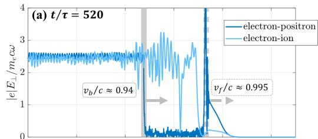
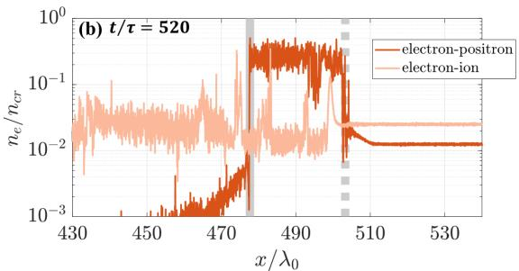
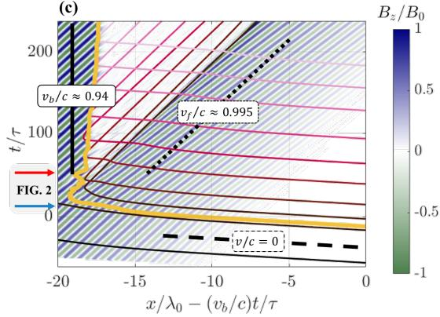
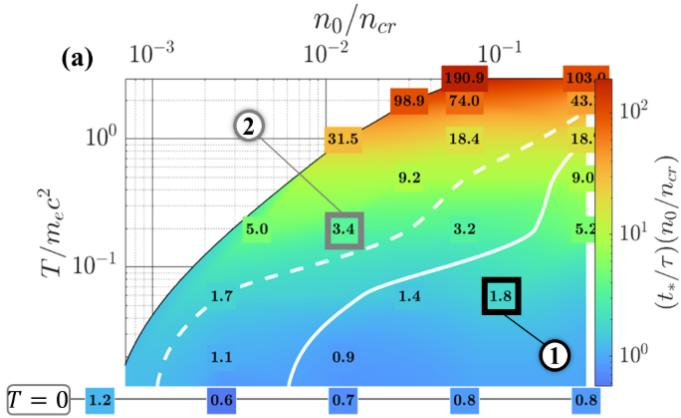
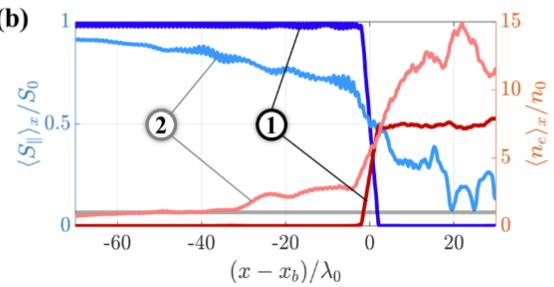

# 欠密对等离子体中动态 Bragg 栅格完全反射笔记

## 0. 论文信息

- 英文标题：Complete reflection of nonlinear electromagnetic waves in underdense pair plasmas enabled by dynamically formed Bragg-like structures
- 作者：Kavin Tangtartharakul；Alexey Arefiev；Maxim Lyutikov
- 期刊状态：Physical Review Letters，accepted paper
- 正式 DOI：[10.1103/g27z-2kd3](https://doi.org/10.1103/g27z-2kd3)
- 接收日期：2026-09-08
- 正式来源：[APS accepted paper](https://journals.aps.org/prl/accepted/10.1103/g27z-2kd3)
- 对应作者预印本：[arXiv:2509.06230](https://arxiv.org/abs/2509.06230)
- 主题关键词：pair plasma；relativistic transparency；nonlinear electromagnetic wave；Bragg grating；reflection front；EPOCH PIC；fast radio burst
- 本地 PDF：`daily/2026-09-10/pdfs/Tangtartharakul et al. - 2026 - Complete reflection in underdense pair plasma.pdf`
- 正文版本边界：APS accepted 页面可读取但正式排版 PDF 尚未开放；本地全文为对应 arXiv 作者预印本，不是 PRL 排版版。本文是理论 + 作者运行的 1D3V EPOCH PIC，没有新实验或 FRB 观测。

## 1. 摘要与反直觉结果

electron–ion plasma 中熟悉的 relativistically induced transparency（RIT）是：强电磁波让电子的有效惯性增大，原本高于线性 cutoff 的等离子体变得透明。本文发现 electron–positron pair plasma 可出现相反过程：一个在线性意义上本来欠密、透明的 pair plasma，被 $a_0>1$ 的波压缩后形成移动 density plug 和周期 density spikes，最终对入射波完全反射。

关键不是单个 spike 超过临界密度；作者的示例中 spike 仍只有约 $0.26n_{cr}$。真正增强反射的是多个 spike 在等离子体共动系中构成 Bragg-like grating，同时反射提高辐射压力、进一步加速/压缩前沿，形成自增强反馈。

证据是解析单粒子压缩、两波 pinching、transfer-matrix Bragg 反射与 1D PIC 的一致性。它是 pair-plasma 波传播机制，不是已在实验室产生对等离子体并观测完全反射，也不能直接解释某个具体 FRB light curve。

## 2. 线性 cutoff 与 RIT 基线

归一化波幅为

$$
a_0=\frac{|e|E_0}{m_ec\omega},
$$

其中 $E_0$ 是电场峰值，$\omega$ 是波角频率。Gaussian 单位下单一电子组分的临界密度

$$
n_{cr}=\frac{m_e\omega^2}{4\pi e^2}.
$$

在 pair plasma 中，电子和正电子都贡献 transverse current，所以线性 cutoff density 是 $n_{cr}/2$（这里 $n_0$ 指每个物种的密度）。直觉上若 $\gamma\sim a_0$，人们可能预期 cutoff 再提高到约 $a_0n_{cr}/2$。本文指出，这忽略了波本身造成的 pair-plasma 压缩。

## 3. 为什么质量对称性会加强压缩

强波的磁场部分给电子和正电子同方向 longitudinal ponderomotive push。由于二者质量相同、运动镜像，纵向上不会像 electron–ion plasma 那样留下静止重离子背景并建立 charge-separation electric field。因此缺少一个抵抗电子堆积的静电回复力。

平面波单粒子解给出

$$
\frac{p_\perp}{m_ec}=-\frac{q}{|e|}a_\perp,
\qquad
\frac{p_\parallel}{m_ec}=\frac{a_\perp^2}{2},
\qquad
\gamma=1+\frac{a_\perp^2}{2}.
$$

由粒子数守恒 $n\,dx=n_0\,dx_0$，以及 Lagrangian 映射 $\partial x/\partial x_0=\gamma^{-1}$，得到

$$
n=\gamma n_0.
$$

把压缩后的 $n$ 代入 pair-plasma 波动方程

$$
\frac{1}{c^2}\frac{\partial^2a_{y,z}}{\partial t^2}
-\frac{\partial^2a_{y,z}}{\partial x^2}
=-\frac{2\omega_p^2}{c^2\gamma}a_{y,z},
$$

其中 $\omega_p^2=4\pi ne^2/m_e$，则 $n=\gamma n_0$ 正好抵消分母中的相对论 $\gamma$：

$$
\omega^2=k^2c^2+2\omega_{p0}^2.
$$

这意味着在理想均匀压缩阶段，RIT 的相对论质量效应并不会继续提高透明度。进一步的 spike/plug 才把系统推向强反射。

## 4. 参考 PIC 算例

作者使用 1D3V EPOCH。参考 circularly polarized wave 有 $\lambda_0=1\,\mu\mathrm m$、周期 $\tau=3.33\,\mathrm{fs}$、$a_0=2.5$、$E_0=8.0\times10^{12}\,\mathrm{V/m}$、$B_0=2.7\times10^4\,\mathrm T$，前沿在 `18τ` 内线性上升。

pair plasma 每物种密度 $n_0=0.0125n_{cr}$，初温为 0，空间分辨率 `100 cells/λ0`，电子/正电子各 `100 particles/cell`，box 为 `[-60,590] μm`。对照 electron–proton plasma 的电子密度加倍到 $0.025n_{cr}$，使两者线性 plasma response 可比。

图 1(a) 在 $t=520\tau$ 对比横向场：pair-plasma 前沿约以 $v_b\simeq0.94c$ 移动，后方场几乎被截断；electron–ion 对照的波前约 $0.995c$ 继续传播。

图 1(b) 显示 pair plasma 在移动边界后形成比初值高一个数量级以上的宽 density plug；这不是固定靶表面的 skin layer，而是被波推动的相对论运动结构。

图 1(c) 把 $B_z/B_0$ 与粒子轨迹放进前沿共动坐标。反射建立后，部分粒子在边界处被折回，形成 counterstream 并进一步提高有效密度；场自由“blank wedge”随时间扩展。

## 5. 极弱反射如何长成 Bragg-like spikes

单一 circular wave 没有周期平均 longitudinal pinching；只要存在一个很弱的反向波，两波干涉就给出

$$
\frac{dp_x}{dt}=-2a_0^2m_ec\omega\sin(2kx),
$$

使粒子在间距 $\lambda/2=\pi/k$ 的位置聚集。作者的 prescribed-wave test 中，反向波幅只有主波的 `1%`，密度 spike 仍能在约 20 个周期内长到初始密度的约 10 倍。

pair plasma 随主波以

$$
\beta_\parallel\simeq\frac{a_0^2}{2+a_0^2}
$$

向前运动。在其共动系，入射频率红移为

$$
\omega'\simeq\omega\sqrt{\frac{1-\beta_\parallel}{1+\beta_\parallel}}.
$$

共动系 spike 间距为 $\lambda'/2$，变换回实验室后

$$
\Delta x=\frac{\lambda'}{2\gamma_\parallel}
=\frac{\lambda_0(1+\beta_\parallel)}{2},
$$

所以间距会大于静止 grating 的 $\lambda_0/2$。移动结构看到更低频率，少数几个亚临界 spike 就能满足强 Bragg reflection。

## 6. transfer matrix 给出的强反射直觉

把每个周期建模为 dielectric constants $\varepsilon_1,\varepsilon_2$、厚度 $l_1,l_2$ 的两层，单元 transfer matrix 是

$$
M_{cell}=M(k_2,l_2)M(k_1,l_1).
$$

Bloch multiplier $\mu=e^{i\kappa d}$ 满足

$$
\mu^2-\mathrm{Tr}(M_{cell})\mu+1=0.
$$

当 $|\mathrm{Tr}(M_{cell})|>2$ 时，$\kappa$ 为复数，场沿 grating 指数衰减。作者的示例取一半粒子压缩 5 倍，$a_0=2.5$、$n_0=0.0125n_{cr}$、$\beta_\parallel\simeq0.76$，每个 cell 把场幅降到 $e^{-0.15}\simeq0.86$；约 5 个 spike 即可让幅度减半，而 spike 的实验室密度仍约 $0.26n_{cr}$。

这说明“亚临界密度”并不排除 photonic stop band；反射由周期结构和共动频率共同决定。

## 7. 反射前沿阈值

反射把更多电磁动量传给 plasma，使边界加速并产生对向流。作者在边界共动系平衡电磁与粒子 momentum flux，引入

$$
\psi=\frac{2n_0}{a_0^2n_{cr}},
$$

得到

$$
\beta_b=\frac{1}{1+\sqrt\psi}.
$$

边界共动系的 effective opacity 参数 $N_b>1$ 时可维持反射；在 $\psi\ll1$ 极限，阈值约为

$$
\frac{n_0}{n_{cr}}>\frac{1}{32a_0^2}.
$$

参考算例 $\psi\simeq4\times10^{-3}$，于是 $\beta_b\simeq0.94$、$\gamma_b\simeq3$、$N_b\simeq1.6$，与 PIC 观察到的移动前沿相符。公式假定圆偏振、稳态前沿、完整反射和 $\gamma_b\gtrsim a_0$；不能不加检验地用于短脉冲、多维或强磁化 pair plasma。

## 8. 温度会削弱但不必消灭反射

图 4(a) 扫描 $n_0/n_{cr}=5\times10^{-4}$ 到 `0.3125`，Maxwell–Jüttner 温度 $T/m_ec^2=0.06$ 到 `3`。颜色是滑动平均 longitudinal Poynting flux 降到 $0.1S_0$ 所需时间，实/虚线分别标出约 `5%/20%` plasma leakage。升温使粒子更容易穿过压缩区，完全反射阈值向更高密度移动，但即使 $T\sim m_ec^2$，阈值仍可能远低于常规 RIT 标度。

图 4(b) 对比两点：$n_0=0.1n_{cr},T=0.06m_ec^2$ 的高密点形成近完全反射 plug；$n_0=0.0125n_{cr},T=0.2m_ec^2$ 时，密度仍堆高约 `15×`，Poynting flux 降到约 $0.1S_0$，但约 `20%` 被扫粒子泄漏。因而 below-threshold 不等于不相互作用，而是“leaky plug”。

## 9. FRB 与实验室含义

对 FRB，结果提示不能直接拿 electron–ion RIT 直觉判断 magnetar 周围 pair plasma 的透明度：质量对称性、共动频率和自生周期结构会改变 cutoff。但本文是一维局部平面波模型，没有磁层几何、超强背景磁场、pair creation/annihilation、频谱、辐射冷却和传播不均匀性；它提供候选微观机制，不是 FRB 传播的完整解释。

对实验室，$1\,\mu\mathrm m$、$a_0=2.5$ 本身可达到，但制备宏观、冷且近电中性的 electron–positron slab 是主要障碍。普通 electron–ion laser target 不会自动复现该质量对称机制。论文也没有提出已就绪的 pair-plasma 反射实验端到端方案。

## 10. 局限与未验证边界

- 核心结果来自 1D3V EPOCH 与解析模型，没有新实验或天文观测。
- 参考 plasma 是半无限、冷、理想 electron–positron slab；真实 pair plasma 制备和保持未闭合。
- 多维 filamentation、transverse escape、有限焦斑和斜入射未系统研究。
- FRB 环境中的强 guide field、频谱、pair kinetics 和曲率未纳入。
- 阈值式依赖完整反射、稳态前沿与低密极限；温度修正主要靠参数扫描。
- 线偏振只报告额外模拟同样出现效应，细节不如圆偏振展开充分。
- PRL 正式排版版尚未用于本地全文核对；本地是作者预印本。
- 本轮没有运行 EPOCH 或独立复现反射阈值。

## 11. 结论与阅读建议

本文最重要的逻辑链是：mass symmetry 消除 charge-separation restoring field → 强波把 pair plasma 压缩到 $n=\gamma n_0$ → 微弱反射同入射波产生 $\lambda/2$ pinching → 移动 spikes 构成共动 Bragg grating → 反射增强 momentum transfer → density plug/反射前沿进入自维持完全反射。它解释了为何欠密与 spike 亚临界都不妨碍强反射。

建议先看图 1 的 pair/electron-ion 对照，再读 $n=\gamma n_0$ 与阈值 $n_0/n_{cr}>1/(32a_0^2)$，最后用图 4 检查温度如何把“完全反射”变成“leaky plug”。引用时应写成作者理论/PIC 预测，不要写成实验或 FRB 观测已确认。
