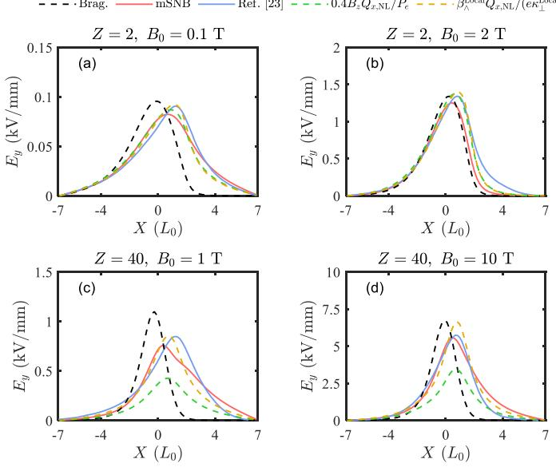
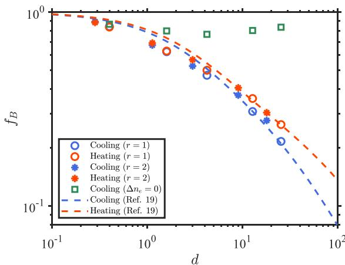
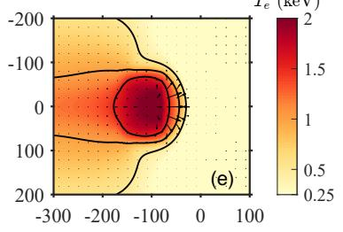
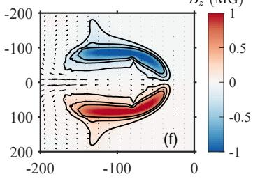

# 磁化等离子体改进型非局域电子热输运模型笔记

## 0. 论文信息

- 英文标题：An improved nonlocal electron heat transport model for magnetized plasmas
- 作者：Z. H. Chen；Z. Q. Zhao；X. H. Yang；L. R. Li；B. Zeng；Z. Li；B. H. Xu；G. B. Zhang；H. H. Ma；M. Tang；Y. Y. Ma；H. Xu；F. Q. Shao；J. Zhang
- 状态：Physical Review E 于 2026-09-10 接收；本地全文是对应作者预印本 arXiv:2508.17309，不是 APS 排版版
- DOI：[10.1103/mwjc-s21x](https://doi.org/10.1103/mwjc-s21x)
- 正式来源：[APS accepted manuscripts](https://journals.aps.org/pre/accepted/10.1103/mwjc-s21x)；[arXiv 全文](https://arxiv.org/abs/2508.17309)
- 主题关键词：nonlocal electron transport；magnetized SNB；Biermann battery；Nernst effect；Righi–Leduc heat flux；ICF
- 本地 PDF：`daily/2026-09-11/pdfs/Chen et al. - 2026 - Improved nonlocal electron heat transport in magnetized plasmas.pdf`
- 正文处理：作者预印本 26 页；已完成 PDF 头、页数、SHA-256、文本与 MinerU 图件检查

## 1. 文章要解决什么

激光驱动 ICF 等离子体中，电子平均自由程可能与温度梯度尺度相当。此时电子分布函数偏离局域 Maxwellian，经典 Braginskii 输运会同时错估热流和磁场演化。直接求 Vlasov–Fokker–Planck（VFP）方程代价高，而常用 flux limiter 又难以描述预热、非局域 Biermann 抑制和 pre-Nernst 位移。

本文改进 magnetized Schurtz–Nicolaï–Busquet（mSNB）多群扩散模型，核心不是增加一个常数修正，而是同时处理三条链：热流源项、包含密度扰动的 Biermann 电场、以及由非局域热流导出的 Nernst 速度。作者还分析横向 Righi–Leduc 项在有限差分中的稳定性，并在 FLASH 框架中给出三组作者运行的数值测试。

## 2. 从 VFP 到多群扩散模型

磁化电子的起点是

$$
\frac{\partial f_e}{\partial t}+\mathbf v\cdot\nabla f_e
-\frac{e}{m_e}\left(\mathbf E+\frac{\mathbf v}{c}\times\mathbf B\right)
\cdot\frac{\partial f_e}{\partial\mathbf v}=C_{ee}+C_{ei}.
$$

其中 $f_e$ 的单位是速度空间中的相空间密度，$C_{ee}$ 和 $C_{ei}$ 分别表示电子–电子与电子–离子碰撞。作者采用一阶球谐截断

$$
f_e(\mathbf x,\mathbf v,t)\approx\frac{f_0}{4\pi}
+\frac{3}{4\pi}\,\boldsymbol\Omega\cdot\mathbf f_1,
$$

$f_0$ 是近各向同性部分，$\mathbf f_1$ 承担热流和电流等一阶各向异性。再用简化碰撞算符和能群离散，把完整速度空间动力学约化为多个能群 $H_g$ 的空间扩散问题。

这个约化的物理直觉是：不同能量电子有不同碰撞长度和磁化程度，因而必须分别传播；最终把各能群修正叠加回局域 Braginskii 基线。它比单一 flux limiter 多保留一维能量信息，却仍远便宜于全 VFP。

## 3. 热流公式与磁化方向

改进模型的总热流可以概括为

$$
\mathbf Q=\mathbf Q_B-
\sum_g\frac{\lambda_{ei,g}^{*}}{3(1+\chi_g^2)}
\left(\nabla H_g+\chi_g\,\mathbf b\times\nabla H_g\right).
$$

- $\mathbf Q_B$ 是局域 Braginskii 热流，单位通常为 $\mathrm{W\,m^{-2}}$；
- $\lambda_{ei,g}^{*}$ 是第 $g$ 个能群的有效电子–离子平均自由程，单位为长度；
- $\chi_g=\omega_{ce}\tau_g$ 是 Hall 参数，无量纲；
- $\mathbf b=\mathbf B/|\mathbf B|$ 是磁场单位向量；
- $H_g$ 是该能群对非局域扰动的响应量。

$1/(1+\chi_g^2)$ 抑制垂直于磁场的传播，$\chi_g\mathbf b\times\nabla H_g$ 则给出 Righi–Leduc 横向热流。作者修订源项，使垂直与横向分量的权重随磁化程度改变；这比把无磁 SNB 结果事后旋转更接近原始动理学结构。

## 4. 非局域 Nernst 电场

图 3 比较 He（$Z=2$）与 Zr（$Z=40$）在不同外磁场下的横向电场。Braginskii 结果峰值较靠热区；mSNB 与参考 K2 VFP 结果出现向冷区延伸的 pre-Nernst 尾部。低 $Z$ 时经验近似

$$
\mathbf v_N\simeq0.4\,\frac{\mathbf Q_{\mathrm{NL}}}{P_e}
$$

能较好估计 Nernst 速度；$P_e$ 是电子压强，$\mathbf Q_{\mathrm{NL}}$ 是非局域热流。高 $Z$ 情况下该比例会低估位移，因此作者使用从模型电场直接构造的修正。这里的“pre-Nernst”指磁通搬运速度峰值先于局域温度梯度峰进入冷区，并非新磁场源项。

## 5. 为什么 Biermann 修正必须包含密度扰动

经典 Biermann battery 来自电子压强梯度与密度梯度不共线：

$$
\frac{\partial\mathbf B}{\partial t}\propto
\frac{\nabla n_e\times\nabla T_e}{n_e}.
$$

非局域电子改变的不只是等效温度分布，也改变与 $f_0$ 相关的密度矩。本文在产生 Biermann 项的电场表达式中同时保留 $\Delta f_0$ 与 $\Delta n_e$。若丢掉密度扰动，curl 后的电场不能正确还原强非局域极限。

图 4 用

$$
f_B=\frac{\max|\left(\partial B/\partial t\right)_{\mathrm{nonlocal}}|}
{\max|\left(\partial B/\partial t\right)_{\mathrm{classical}}|}
$$

量化抑制。$d=k_Tl_d$ 越大，梯度尺度相对碰撞长度越短，非局域性越强，$f_B$ 越低。包含 $\Delta n_e$ 的结果跟随 Davies 的 K2 拟合；忽略它时，结果出现非单调回升并长期高于约 0.75。该比较支持模型结构，但仍是对既有 VFP 数值拟合的复核，不是实验验证。

## 6. 三组测试告诉了什么

第一组是一维 He 与 Zr 温度坡面。He 取 $n_e=5\times10^{20}\,\mathrm{cm^{-3}}$、$T_e$ 从 1 keV 降到 150 eV、$L_0=50\,\mu\mathrm m$；Zr 使用 $L_0=17.3\,\mu\mathrm m$。作者分别扫描 0.1/2 T 和 1/10 T。mSNB 能再现热流峰值降低、冷区约 $2$–$4L_0$ 的预热，以及 Righi–Leduc 分量更强的非局域修正；高 $Z$ 误差更明显，经验校正因子 $r$ 仍需按离化度调节。

第二组即前述 $Z=1$ Biermann 抑制测试，温度梯度尺度覆盖 2、3.98、12、31.8 和 127 µm。结果主要验证密度扰动项能否恢复已发表的 K2 趋势。

第三组是简化 Be 激光–固体算例：初温 250 eV，电子密度从 $10^{23}$ 降到 $4.2\times10^{20}\,\mathrm{cm^{-3}}$，351 nm 激光强度 $5\times10^{14}\,\mathrm{W\,cm^{-2}}$，焦斑约 150 µm，网格 2 µm。

Braginskii 算例峰值温度约 1.8 keV，非局域热输运算例约 2.1 keV；三种模型的峰值磁场都在约 1.3–1.4 MG，但非局域模型改变了磁场空间分布。因此不能只比较峰值 $B$ 来判断模型差异，场的拓扑、冷区延伸和 Nernst 速度同样是 observable。

## 7. 数值稳定性

在二维 $x$–$y$、$B_z$ 几何中，Righi–Leduc 项把两个方向的梯度交叉耦合。作者对离散放大因子 $G$ 做 von Neumann 分析，以

$$
\max_{k_x,k_y}|G|\leq1
$$

作为线性稳定条件。常规 minmod limiter 在某些局部温度/磁化组合下会得到 $|G|^2>1$，甚至使热流逆梯度。作者加入稳定性约束，使相关离散系数保持非正并限制交叉项。这个修补验证的是给定离散格式的稳定区间，不等同于模型物理精度或全 FLASH 多物理收敛。

## 8. 与仓库既有条目的差异

仓库已有 flux limiter、VFP、ICF surrogate 和 ML heat-flux closure 条目。本文独特之处是把 magnetized multigroup model 延伸到 Biermann 与 Nernst 的自洽修正，并给出 Righi–Leduc 离散稳定性分析。它不是一个新的 PIC 算法，也不是训练数据驱动闭包；其计算层级位于局域 MHD 与全 VFP 之间。

## 9. 局限与未验证边界

- 正式状态是 PRE 已接收，但本地保存的是 2025 年作者预印本；最终排版、公式编号和文字可能变化。
- 三组核心结果来自作者的 FLASH/mSNB 或历史 K2 VFP 对比，没有实验数据。
- 本轮没有获得作者代码、编译 FLASH、复现网格或运行任何输运算例。
- 球谐一阶截断、简化碰撞算符和经验校正因子限制了强各向异性与高 $Z$ 的普适性。
- 横向 Nernst、磁扩散及更完整电场项仍被作者列为后续工作。
- 激光–固体测试是简化模型，不能直接当作完整 ICF capsule 预测。
- PDF、哈希、MinerU 和图像检查只证明本地资料完整，不构成物理复现。

## 10. 结论与阅读建议

最值得保留的机制链是：能群扩散重构非局域热流；同一分布函数扰动同时修改 Biermann 电场和 Nernst 搬运；密度扰动决定强非局域 Biermann 抑制能否合理；Righi–Leduc 项又要求额外数值稳定性约束。引用结果时宜写“作者模型与 K2 趋势相符”或“作者 FLASH 测试预测”，不应写成实验已证实或本地已复现。
