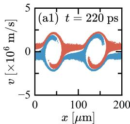
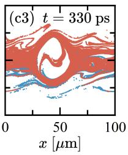
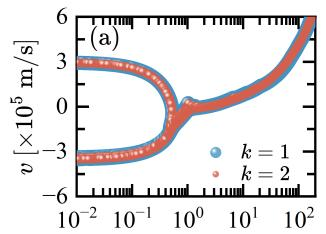
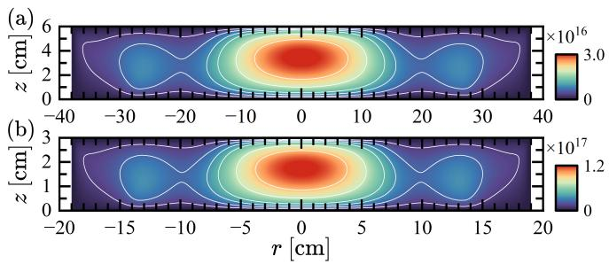
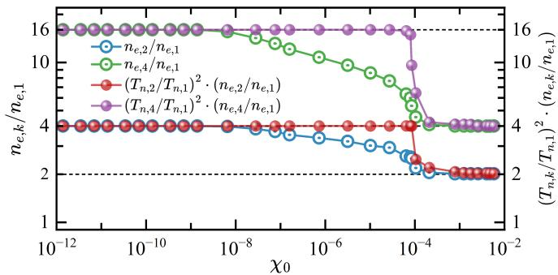

# 等离子体广义相似理论笔记

## 0. 论文信息

- 英文标题：Generalized Similarity Theory for Plasmas
- 作者：Yangyang Fu
- 平台：arXiv 预印本
- DOI：[10.48550/arXiv.2609.08413](https://doi.org/10.48550/arXiv.2609.08413)
- arXiv v1 / 稿件日期：2026-09-08 / 2026-09-09
- 来源：[arXiv 摘要页](https://arxiv.org/abs/2609.08413)
- 主题关键词：similarity law；Boltzmann–Maxwell；PIC；two-stream instability；relativistic diode；RF plasma；microdischarge
- 本地 PDF：`daily/2026-09-11/pdfs/Fu - 2026 - Generalized similarity theory for plasmas.pdf`
- 正文处理：官方 arXiv PDF 6 页，已完成文件、页数、哈希、文本与 MinerU 图件检查

## 1. 文章主张的范围

传统气体放电相似律常以 $pd$ 与 $E/p$ 不变表述，容易让人误以为它只适用于局域、静电、弱电离放电。本文从 Boltzmann 方程与完整 Maxwell 方程的尺度对称性出发，构造一个同时覆盖 collisionless、electromagnetic、relativistic 和从弱到高电离区间的统一框架。

“广义”并不意味着任意真实等离子体缩放后都相同。相似要求初始条件、边界条件、碰撞截面、组分与驱动也按相同无量纲关系改变。论文用作者的 PIC 或 fluid 模拟展示四类受控系统中的一致性，没有声称材料、化学、辐射或诊断尺度可以自动保持。

## 2. 无碰撞 Boltzmann–Maxwell 缩放

物种 $j$ 的分布函数满足

$$
\frac{\partial f_j}{\partial t}+\mathbf v\cdot\nabla_{\mathbf r}f_j
+\frac{q_j}{m_j}(\mathbf E+\mathbf v\times\mathbf B)
\cdot\nabla_{\mathbf v}f_j
=\left(\frac{\partial f_j}{\partial t}\right)_{\rm coll}.
$$

先取无碰撞极限。若 prototype 记作下标 1、缩放系统记作下标 $k$，论文用

$$
G(\mathbf r_1,t_1)=k^{\alpha[G]}G(\mathbf r_k,t_k)
$$

概括变换，并给出

$$
\alpha[\mathbf r]=\alpha[t]=1,\quad
\alpha[\mathbf v]=0,\quad
\alpha[\mathbf E]=\alpha[\mathbf B]=-1,\quad
\alpha[f_j]=-2.
$$

按作者的 prototype/downscaled 记号，即

$$
\mathbf r_1=k\mathbf r_k,\quad t_1=kt_k,\quad
\mathbf v_1=\mathbf v_k,
$$

$$
\mathbf E_1=k^{-1}\mathbf E_k,\quad
\mathbf B_1=k^{-1}\mathbf B_k,\quad
f_{j,1}=k^{-2}f_{j,k}.
$$

所以线性尺寸和特征时间同缩放，速度不变；缩小系统中的场强和密度需要相应升高。把这些关系同时代入 Vlasov 与 Maxwell 方程，各项得到同一整体因子，方程形式不变。由于速度不变，$\gamma=(1-v^2/c^2)^{-1/2}$ 也不变，作者据此把缩放延伸到相对论 Lorentz 动力学。

这里的方向很容易写反：当 $k>1$ 表示 downscaled system 尺寸为 prototype 的 $1/k$ 时，$E_k=kE_1$、$B_k=kB_1$，无碰撞密度随 $k^2$ 增大。引用时最好先说明两套下标定义。

## 3. 两流不稳定性的非稳态检验

作者用 PIC 把间隙和时间按 $k=2$ 缩放。两束电子形成 phase-space holes；对应缩放时刻的涡旋位置与形状相近。普通随机宏粒子初态使两套结果不完全重合，这不是缩放方程失效，而是统计系统没有严格共享同一初始微观状态。

使用相同初态采样后，对应 phase space 进一步重合。这项测试强调 similarity comparison 必须约束初态噪声；在 PIC 中，仅匹配宏观密度和温度不保证不稳定性进入非线性阶段后逐点相同。

## 4. 从非相对论到相对论电子二极管

纯电子二极管避免复杂化学过程。作者扫描施加电场，使电子从 $v\ll c$ 进入 $v\sim c$，并比较 $k=1$ 与 $k=2$ 的 $v$–scaled-position 分布及 cathode surface field。缩放相空间重合，$k^{-1}E_s$ 对 $kt$ 的振荡也重合。

相对论扩展成立的关键是速度和 $\gamma$ 保持不变，而不是把粒子能量另行缩放。它适合设计几何相似、边界电势和注入条件可共同调整的二极管；若 cathode emission law、材料场发射或外电路含固定尺度，则需要重新检查无量纲组。

## 5. 完整 Maxwell 方程与驻波 RF 等离子体

Poisson-only 模型在反应器尺寸接近电磁波长时不够。作者把同一变换代入 Faraday 与 Ampère–Maxwell 方程，空间导数和时间导数取得一致尺度，因此位移电流不会破坏相似性。

二维电磁 PIC 比较

$$
[p,z,r,f]=[40\ \mathrm{mTorr},6\ \mathrm{cm},38\ \mathrm{cm},106\ \mathrm{MHz}]
$$

与

$$
[80\ \mathrm{mTorr},3\ \mathrm{cm},19\ \mathrm{cm},212\ \mathrm{MHz}].
$$

两套系统保留相同径向多峰驻波结构；峰值电子密度约从 $3.0\times10^{16}$ 增到 $1.2\times10^{17}\,\mathrm{m^{-3}}$，符合 $k^2$。作者模型包含三种电子–中性碰撞和两种离子–中性碰撞。这个结果支持“强电磁效应不必破坏缩放”，前提是频率、压力、几何和碰撞条件全部一起缩放。

## 6. 碰撞区间如何改变密度指数

弱电离时，电子主要与中性粒子碰撞。为保持碰撞项和输运项同尺度，中性密度约按 $k$、带电粒子分布约按 $k^2$ 缩放，这与经典 $pd$ 不变一致。接近完全电离后，charge–charge 碰撞占主导，带电密度尺度转为约 $k$。

图 4 用统一 fluid model 跨越 Townsend–glow–arc 区间。弱电离极限 $n_{e,k}/n_{e,1}\to k^2$，高电离极限趋向 $k$；中间区因 neutral depletion、gas heating 和 chemistry 显著偏离简单幂律。作者提出

$$
\left(\frac{T_{n,k}}{T_{n,1}}\right)^2
\left(\frac{n_{e,k}}{n_{e,1}}\right)
$$

作为带 neutral-temperature correction 的组合量，能减小过渡区偏差。该修正是作者数值总结出的广义化关系，数学严格性低于无碰撞 Boltzmann–Maxwell 对称性。

## 7. 对 PIC 缩比设计的实际意义

对大尺度 PIC 问题，缩小几何而保持所有物理并非简单把 box 除以 $k$。至少应同步检查：

1. 时间、驱动频率和边界波形是否随 $k$ 变化；
2. 场强与密度究竟落在 $k$ 还是 $k^2$ 区间；
3. Debye length、skin depth、collision mean free path 与网格是否保持相同无量纲比例；
4. 粒子采样噪声和初态扰动是否可比；
5. 原子碰撞、材料、辐射和量子过程是否引入没有缩放的固定能量或长度尺度。

因此这篇论文更适合作为“构造受控相似算例的检查表”，而不是任意减少计算量的许可证。若某一未缩放过程决定 observable，缩比结果可能保持宏观形状却失去定量预测能力。

## 8. 与既有相似律和 PIC 条目的差异

仓库已有 PIC 数值方法、wakefield scaling 与实验缩比论文。本文的独特贡献是从 Boltzmann 加完整 Maxwell 方程统一给出指数，并把同一结构串到两流、相对论二极管、驻波 RF 与高电离微放电。它并未针对激光尾场或 HEDP 单一装置给出新的实验标度，而是通用方法论文。

## 9. 局限与未验证边界

- 四类核心证据是作者的 PIC/fluid 模拟与解析缩放，不是新实验。
- 本轮没有获得或运行作者代码，也没有复现任何 $k=2/4$ 算例。
- 严格相似依赖初始、边界、碰撞和驱动同时缩放；真实装置常有固定材料与诊断尺度。
- 复杂化学、辐射输运、强场 QED、量子简并、表面发射和湍流耗散可能引入额外无量纲参数。
- 过渡电离区的温度修正主要由 fluid-model 结果支持，不具有与 Vlasov–Maxwell 对称性相同的普适证明强度。
- 两流“完全一致”依赖相同统计初态，不能推广为独立随机 PIC 运行逐点相同。
- PDF、文本和图件验证只证明本地资料完整，不构成相似律复现。

## 10. 结论与阅读建议

论文最有用的结果是把相似律写成明确变量映射，并展示何时密度指数从 $k^2$ 过渡到 $k$。先读缩放指数和下标方向，再看两流测试理解初态噪声，最后看图 4 区分严格对称性与经验温度修正。引用“广义”时必须附带“在指定初始、边界和碰撞缩放条件下”，不宜写成所有等离子体无条件尺度不变。
