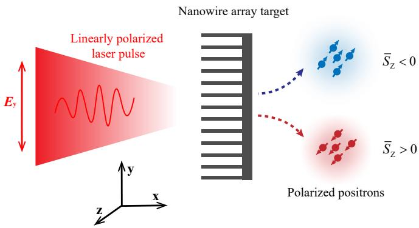
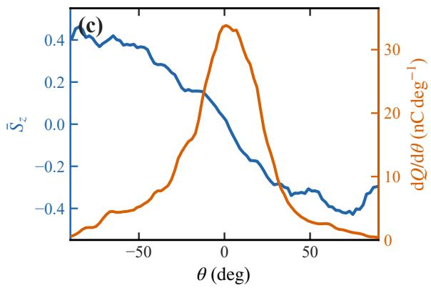
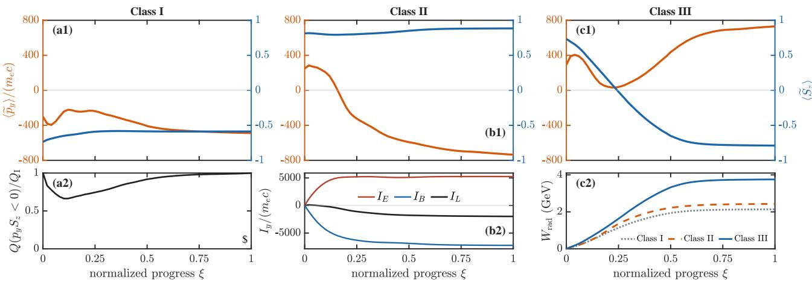
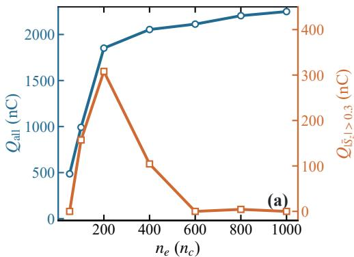
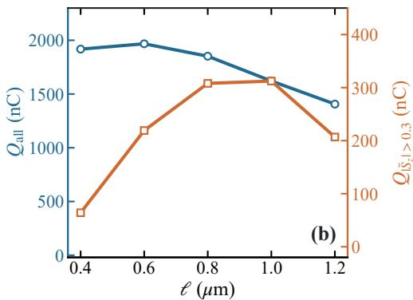

# 激光纳米线阵列产生高电荷偏振正电子束笔记

## 0. 论文信息

- 英文标题：High-charge, highly polarized positron beams generated from a laser-driven nanowire-array target
- 作者：De-Sheng Zhang；Cui-Wen Zhang；Kun Xue；Feng Wan；Xue-Ren Hong；Jian-Xing Li；Bai-Song Xie
- 平台：arXiv 预印本
- DOI：[10.48550/arXiv.2609.09908](https://doi.org/10.48550/arXiv.2609.09908)
- arXiv v1 / 稿件日期：2026-09-09
- 来源：[arXiv 摘要页](https://arxiv.org/abs/2609.09908)
- 主题关键词：polarized positron；nanowire array；nonlinear Compton scattering；nonlinear Breit–Wheeler；spin-resolved QED-PIC
- 本地 PDF：`daily/2026-09-11/pdfs/Zhang et al. - 2026 - High-charge polarized positrons from nanowire target.pdf`
- 正文处理：官方 arXiv PDF 9 页，已完成文件、页数、哈希、文本与 MinerU 图件检查

## 1. 摘要与物理目标

高偏振并不等于高可用正电子数。本文用线偏振超强激光照射碳纳米线阵列，让激光加速电子先经 nonlinear Compton scattering（NCS）辐射高能光子，再由 nonlinear Breit–Wheeler（NBW）产生电子–正电子对。纳米线形成的时空场把相反自旋符号的正电子分离到不同出射角，从而减少同一角 bin 内的偏振抵消。

作者的二维 spin-resolved QED-PIC 参考算例报告最大角分辨平均偏振 $|\bar S_z|\simeq0.46$，满足 $|\bar S_z(\theta)|>0.3$ 的正电子电荷约 308 nC。两者都是宏粒子统计得到的模拟 observable，不是实验束流，也不能直接等同于经过准直、传输和诊断后的可用 bunch charge。

## 2. 参考 QED-PIC 设置

模拟使用二维、带自旋和光子 Stokes 参数的 `SLIPs` QED-PIC 代码，并在 locally constant field approximation（LCFA）下 Monte Carlo 采样 NCS 和 NBW。主要设置为：

- 计算域 $x\in[-20,40]~\mu\mathrm m$、$y\in[-20,20]~\mu\mathrm m$，网格 `1800×1200`；
- 激光 $\lambda_0=1~\mu\mathrm m$，$a_0=1500$，峰值强度约 $3.08\times10^{24}\,\mathrm{W\,cm^{-2}}$；
- 焦斑 $w_0=3~\mu\mathrm m$，脉冲中心 $12T_0$、宽度参数 $6T_0$；
- 全电离碳纳米线 $n_e=200n_c$，线宽 0.2 µm、周期 0.8 µm、长度 10 µm，后接 1 µm 固体基底；
- 每格 200 个电子和 40 个碳离子宏粒子。

这些参数处于极端强场区间；二维几何会把真实三维纳米线排列、横向泄漏和总电荷换算压缩为单位外延方向的模型，因此 308 nC 的绝对量级尤其需要三维复核。

## 3. 为什么应按角度而不是能量筛偏振

在 $t=55T_0$，上、下两支正电子具有相反 $\bar S_z$。以

$$
\theta=\arctan(p_y/p_x)
$$

定义出射角，负角一侧以正 $S_z$ 为主，正角一侧以负 $S_z$ 为主，最大 $|\bar S_z|$ 约 0.46。电荷谱的能量峰约在 0.6 GeV，但能量分 bin 后平均偏振大多接近零。因此本文真正可操作的 selector 是 angle–spin correlation，而不是简单截取高能尾部。

作者以 $|\bar S_z(\theta)|>0.3$ 定义高偏振角区，积分得到约 308 nC；与其引用的平箔方案约 30 nC 相比高近一数量级。这里比较的是不同论文/方案的作者模拟，未统一三维体积、宏粒子统计、激光能量和传输接受度。

## 4. 偏振在 NBW 出生时如何建立

对无偏振母光子，作者写出的自旋分辨 NBW 微分率含有

$$
\frac{d^2W}{d\eta\,dt}=C_{\mathrm{pairs}}
\left[D_0-\frac{1}{\eta}K_{1/3}(y)
\left(\mathbf S_+\cdot\mathbf e'_2\right)\right],
$$

其中

$$
D_0=\frac{\eta^2+(1-\eta)^2}{\eta(1-\eta)}K_{2/3}(y)
+\int_y^\infty K_{1/3}(u)\,du,
\qquad
y=\frac{2}{3\chi_\gamma\eta(1-\eta)}.
$$

$\eta=\varepsilon_+/\varepsilon_\gamma$ 是正电子取得的母光子能量份额，$\chi_\gamma$ 是光子量子非线性参数，$K_\nu$ 是第二类修正 Bessel 函数，$\mathbf e'_2$ 是局域自旋量子化轴。超相对论近似下 $\mathbf e'_2$ 与正电子静止系磁场方向相反，所以率中的线性自旋项使出生自旋与局域 $B_z$ 形成统计相关。

作者统计到约 68.5% 的出生正电子满足 $B_zS_z>0$，两侧条件平均 $S_z$ 约为 $\pm0.33$。这是概率偏置而非逐粒子确定性规则；把两个空间支路完全积分后仍会互相抵消。

## 5. 出生相关如何变成末态角偏振

满足末态 $p_{y,f}S_{z,f}<0$ 的目标支路携带约 215.5 nC，占高偏振选择电荷约 70%。作者按出生与末态的符号变化分成三类：

- Class I（43.4%）保留出生时的 spin–angle 关系；
- Class II（30.8%）主要由磁场贡献的横向 impulse 使 $p_y$ 翻号，而 $S_z$ 保持；
- Class III（25.8%）保持 $p_y$ 符号但 $S_z$ 翻号，并经历更强辐射损失。

三类估计的累计辐射损失中位数约为 1.61、2.09 和 3.65 GeV。作者以累计场功减粒子能量变化估计 $W_{\rm rad}$，这能连接强辐射与自旋翻转，但不能逐次识别每次光子发射事件。Class II 的累计磁冲量方向与末态 $p_y$ 反转一致，支持纳米线时空磁场主动整理相空间，而不只是出生率偶然偏置。

## 6. 纳米线为何优于平箔

作者跟踪一组选定正电子，比较纳米线和 flat foil。纳米线中两支的角间隔大致经历 $44^\circ\rightarrow38^\circ\rightarrow43^\circ$，sign-aligned 平均自旋约保持在 0.72，平均自旋模长约 0.81。平箔中支路角间隔可压缩到约 $9^\circ$，sign-aligned 平均自旋降至约 0.43，虽然自旋模长仍约 0.82。

因此优势不是单粒子“更有自旋”，而是相反自旋群体在角空间较少混合。偏振可观测量是相空间相关性；只比较 $\langle|\mathbf S|\rangle$ 会漏掉抵消问题。

## 7. 靶参数扫描

总正电子电荷随 $n_e$ 仍可上升，但 $|\bar S_z|>0.3$ 的电荷在约 $200n_c$ 达峰，之后快速下降。高密度虽增加发射与成对机会，也会改变激光穿透和场结构，破坏角–自旋分离。

周期扫描显示高偏振电荷在约 0.8–1.0 µm 较高，而总电荷的趋势不同。优化目标必须写成 $Q_{|\bar S_z|>0.3}$，不能用 $Q_{\rm all}$ 代替；否则容易找到总产额更高但净角偏振更差的靶。

## 8. 与既有正电子论文的去重边界

仓库已有线性 Breit–Wheeler 后向转向、平箔/通道 NBW、极化级联等条目。本文的新组合是线偏振激光直接驱动纳米线阵列，并用出生时 $B_z$–$S_z$ 相关加后续横向 Lorentz impulse 保持角分离。它研究的是 nonlinear Breit–Wheeler，不应与昨天入库的 real-photon linear Breit–Wheeler 反应通道混写。

## 9. 局限与未验证边界

- 全部定量结论来自二维 spin-resolved QED-PIC，不是实验测量。
- $a_0=1500$、约 $3.08\times10^{24}\,\mathrm{W\,cm^{-2}}$ 是极端理想条件，设施可达性与 shot-to-shot 容差未闭合。
- 目标是理想全电离、规则纳米线；预等离子体、靶膨胀、三维结构和制造误差未系统纳入。
- LCFA、宏粒子数、pair-event statistics、网格与 box-size 的系统收敛证据在本文中有限。
- 308 nC 是模拟角选择积分值，不含束流传输、准直效率、polarimeter 接受度与材料背景。
- 本轮没有运行 SLIPs、复现参数扫描或独立校验 spin-resolved rates。
- 本地 PDF/MinerU 检查只证明资料可读，不构成 QED-PIC 复现。

## 10. 结论与阅读建议

这篇工作的物理价值在于把“高偏振源”重新表述为相空间相关性工程：NBW 在局域磁场中赋予出生自旋偏置，纳米线产生的时空场再让自旋符号与横向 impulse 保持关联，最终使相反偏振停留在不同角区。阅读时应先看图 2 的 angle-resolved observable，再看图 4 的三类路径，最后用图 6 区分总产额与高偏振可用电荷。引用 0.46 和 308 nC 时必须带上“作者二维 QED-PIC 预测”。
