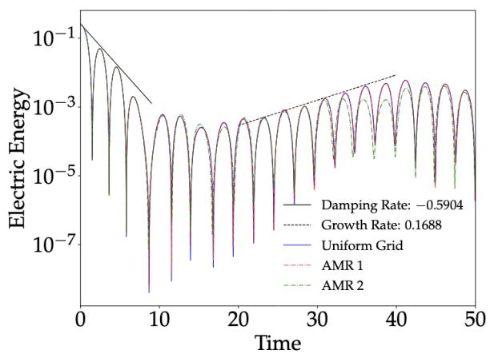
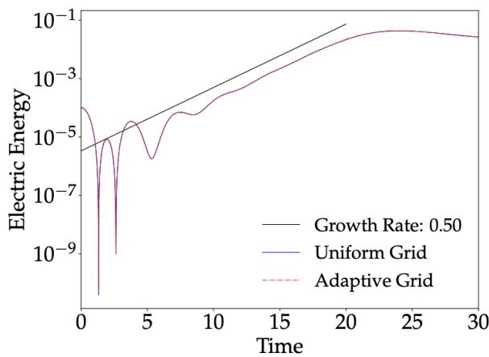
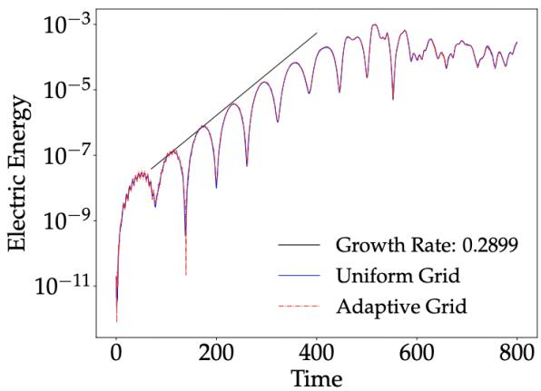
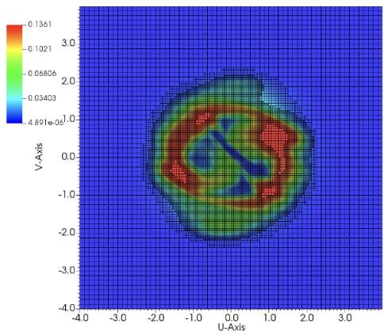
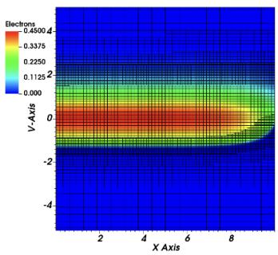
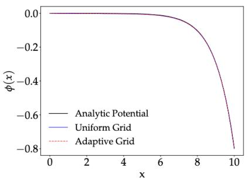

# kobra 自适应网格 Vlasov–Poisson 代码笔记

## 0. 论文信息

- 英文标题：kobra: a new Vlasov code intended for plasma-wall modeling
- 作者：Sebastian Konewko；Nathan Maestracci；Sven Van Loo
- 平台：arXiv 预印本；作者在 arXiv 元数据中注明已被 *Contributions to Plasma Physics* 接收，当前稿件首页仍保留占位日期且未给正式 DOI
- DOI：[10.48550/arXiv.2609.11563](https://doi.org/10.48550/arXiv.2609.11563)
- arXiv v1：2026-09-10
- 来源：[arXiv 摘要页](https://arxiv.org/abs/2609.11563)
- 主题关键词：Vlasov–Poisson；plasma-wall interaction；adaptive mesh refinement；finite volume；kinetic sheath
- 本地 PDF：`daily/2026-09-12/pdfs/Konewko et al. - 2026 - kobra Vlasov code for plasma-wall modeling.pdf`
- 正文处理：官方 arXiv PDF 6 页，已完成文件、页数、哈希、文本与 MinerU 图件检查

## 1. 摘要与代码定位

PIC 在密度梯度大、相空间采样不足时会出现宏粒子统计噪声；Eulerian Vlasov 方法直接推进分布函数，可以消除这种采样噪声，但六维相空间的内存和计算量很高。`kobra` 的核心尝试是在 finite-volume Vlasov–Poisson 求解器中加入 adaptive mesh refinement（AMR），只在截断误差大的相空间区域细化。

论文当前验证的是 1d1v/1d2v 的 Landau damping、two-stream、Dory–Guest–Harris（DGH）不稳定性和 1d1v 静电鞘层。代码“面向 plasma-wall”是开发目标；碰撞、溅射/侵蚀、复合、二次电子发射和真实磁化壁鞘均尚未实现。

## 2. Vlasov–Poisson 方程与离散策略

每个组分的无碰撞分布函数满足

$$
\frac{\partial f_s}{\partial t}
+\mathbf v\cdot\nabla_{\mathbf x}f_s
+\frac{\mathbf F_s}{m_s}\cdot\nabla_{\mathbf v}f_s=0,
$$

$$
\mathbf F_s=q_s(\mathbf E+\mathbf v\times\mathbf B),
\qquad
\nabla^2\phi=-\sum_s q_s n_s,
\qquad
\mathbf E=-\nabla\phi.
$$

**变量说明：**$f_s(\mathbf x,\mathbf v,t)$ 是相空间分布；$q_s,m_s$ 为电荷和质量；$n_s=\int f_s\,d\mathbf v$；$\phi$ 为归一化静电势。长度、速度和时间分别以 Debye length、电子热速度和 $\omega_p^{-1}$ 归一化。

**数值路线：**Vlasov 对流使用二阶 Runge–Kutta、二阶迎风通量和 slope limiter；Poisson 方程在速度积分后的坐标网格上用 Full Approximation Scheme（FAS）multigrid 与 lexicographic Gauss–Seidel 平滑。AMR 网格每层间距减半，但所有层共用同步时间步。多组分仍共享一套相空间网格，同时对各组分独立缩放速度轴。

**物理/数值直觉：**Eulerian Vlasov 没有 PIC 的 sampling noise，却会产生 finite-volume numerical diffusion。AMR 将高分辨率集中在相空间细结构附近，节省资源的同时也可能在粗网格区域增加能量误差，性能数字必须和 refinement tolerance 一起引用。

## 3. Landau damping 与 two-stream benchmark

两组 1d1v 测试均用 $(x,v)\in[0,4\pi]\times[-10,10]$、默认 `256×256` 网格、静态离子和周期位置边界。Landau damping 取较强扰动 $\alpha=0.5$，two-stream 取 $\alpha=0.01$。

Landau 算例先阻尼，再在约 $15<t<40$ 出现能量回流/增长，约 $t=40$ 因俘获饱和；作者曲线复现引用 benchmark 的阻尼和增长率。

two-stream 的电场能指数增长并在约 $t=20$ 饱和，uniform 与 AMR 轨迹基本重合。截断误差阈值 $10^{-3}$ 时，Landau/two-stream 分别快约 1.7/2.3 倍，内存均少约 1.75 倍；阈值放宽到 $5\times10^{-3}$ 后 Landau 可快 2.8 倍，但 $t\approx35$–40 已出现可见精度退化。

作者还指出 uniform 网格本身也不严格守恒，但到 $t=100$ 总能量相对误差仍低于 $10^{-3}$。论文没有给出系统的 tolerance–误差–成本 Pareto 曲线，因此不能仅按最大 speedup 选择 AMR 参数。

## 4. 磁化 DGH benchmark

DGH 使用 1d2v 域 $(x,v_x,v_y)$、分辨率 $(128,256^2)$，取 $j=6$、$\tilde k=4.65$、$\omega_p/\omega_c=20$ 与扰动 $\epsilon=10^{-3}$。

理论增长率 0.2899、振荡频率 1.0361；作者数值得到 0.2635 和 1.030。增长率相差约 9%，频率更接近，但论文把它们总体表述为复现 benchmark 行为。

AMR 只在速度空间环状细结构附近使用最细网格。该算例内存从 11.4 GB 降到 2.7 GB（约 4.2 倍），wall time 从 37 h 降到 9.5 h（约 3.8 倍）。这些是作者特定硬件/参数下的 wall time，并非跨平台基准，也没有与其他 Vlasov/PIC 代码作匹配比较。

## 5. 一维静电鞘层测试

入口电子采用 Maxwellian，冷离子以 $v_0=0.2$ 的 delta 分布注入，满足归一化 Bohm 下限；$x=10$ 端为吸收壁并用 floating-potential 边界。电子先到壁并建立负壁电势，随后形成正空间电荷鞘层。

细网格主要追踪电子截断速度和离子窄分布，说明 AMR 确实对局域速度结构有效。

uniform 与 AMR 电势几乎重合解析曲线。正文写 $\phi_{\rm wall}=0.739$，但所列公式含 $\sqrt{-\phi_{\rm wall}}$ 且图 3b 的壁端约为 $-0.8$；这里很可能缺少负号，引用时应保留这一稿件内部符号疑点而不是直接写成已核实的正电势。

uniform 算例约 3 h、50 MB；AMR 为 22 min，速度约快 8 倍且内存约减半。由于这里只是 1d1v collisionless electrostatic sheath，这一结果不能直接代表 1d3v 磁化鞘、含碰撞 plasma-wall 或整机 SOL 性能。

## 6. 结论与开发边界

本文证明 `finite-volume advection + FAS multigrid + phase-space AMR` 能在几个经典低维 benchmark 上保持主要动力学，并显著减少特定算例的成本。作者计划加入高阶格式、各向异性 AMR、碰撞算子以及更完整的墙面过程，再扩展到磁化鞘层。

尚缺的关键验证包括：更高维强/弱 scaling、跨节点通信成本、质量/能量/熵的系统收敛、复杂几何、真实质量比多组分、碰撞和 material boundary physics。数据只注明可向通讯作者索取，论文没有给出可核查的公开代码仓库或可直接复现的输入包。

## 7. 局限与未验证边界

- “accepted”仅来自 arXiv 作者元数据；本轮未核到正式 DOI 或期刊 version of record。
- 所有结果为作者低维数值 benchmark，没有实验 plasma-wall 数据。
- AMR speedup 与网格容差、硬件和问题维数强相关；不能外推为 3d3v 的确定收益。
- 更粗 AMR 会增加数值扩散，论文未建立统一误差预算。
- 当前求解 Vlasov–Poisson，只含外加磁场；不是自洽电磁 Vlasov–Maxwell。
- 本轮没有获得源码、编译或运行 `kobra`，只检查了论文全文和图件。

## 8. 开放问题与个人理解

这篇论文的真正价值不在“又一个 kinetic code”，而在于把 AMR 放进完整 phase-space finite-volume 链路，并明确展示细化网格追随分布函数的局域结构。下一步最有辨识力的测试应是同一误差容限下，与 uniform Vlasov 和匹配噪声水平的 PIC 比较 wall time、内存和 observable 误差，而不是只在各自默认参数下比较速度。

若面向 tokamak edge，碰撞与壁面二次发射会改变速度空间细结构的位置和尺度，AMR 标准也应从局部截断误差扩展到 sheath observable 误差；否则细化可能在分布函数范数上合理，却对热流或溅射通量不够准确。

## 9. 复习用速记

`kobra` 是带 phase-space AMR 的 finite-volume Vlasov–Poisson 原型，在 1d1v/1d2v 不稳定性和静电鞘层中复现主要理论行为并展示 1.7–8 倍作者算例 speedup；高维、碰撞、真实壁面物理、开源复现和生产性能均尚未验证。
