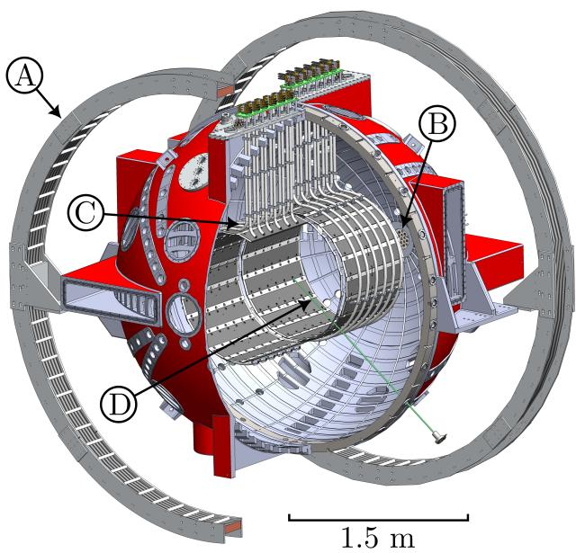
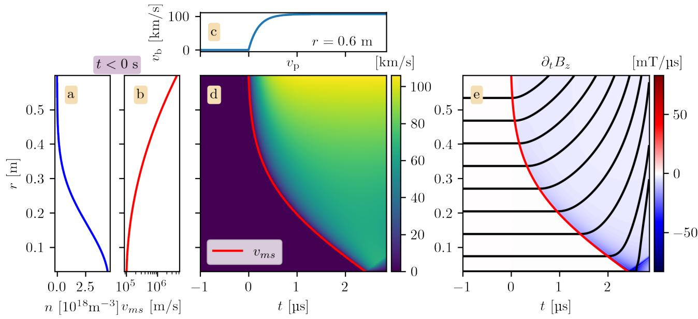
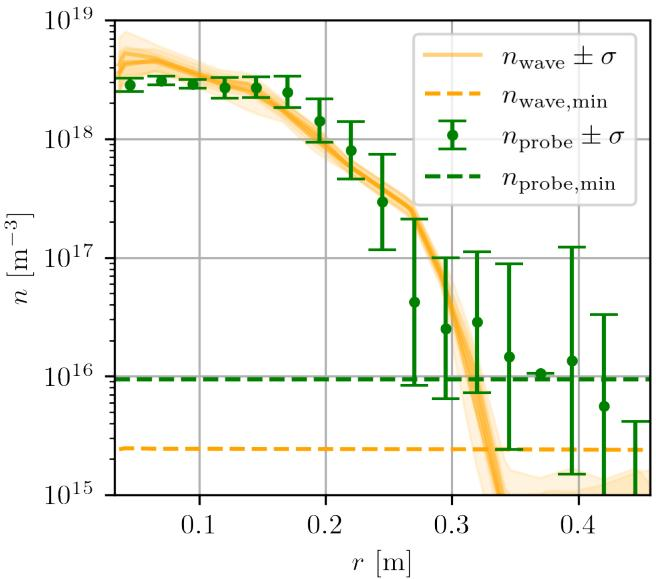
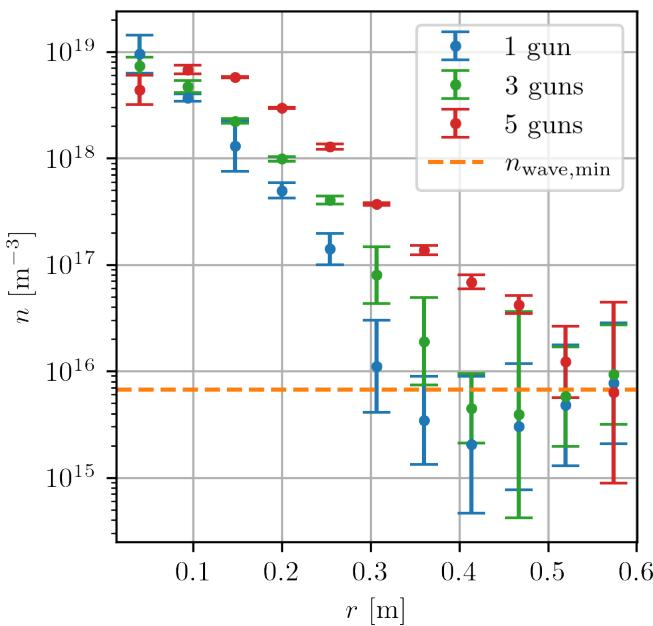

# 用磁声波波速反演等离子体密度剖面笔记

## 0. 论文信息

- 英文标题：Experimental Plasma Density Profiles Determined Through Measurements of the Magnetosonic Wave Speed
- 作者：Cameron Kuchta；Jan Egedal；Abhishek Mhatre；Paul Gradney；Joseph Olson；Xinyu Yu；Cary B. Forest
- 平台：arXiv 预印本；作者注明 2026-09-08 投稿至 *Physics of Plasmas*
- DOI：[10.48550/arXiv.2609.11743](https://doi.org/10.48550/arXiv.2609.11743)
- arXiv v1：2026-09-10；稿件日期：2026-09-09
- 来源：[arXiv 摘要页](https://arxiv.org/abs/2609.11743)
- 主题关键词：magnetosonic wave；plasma density profile；B-dot probe；Langmuir probe；magnetic reconnection；TREX
- 本地 PDF：`daily/2026-09-12/pdfs/Kuchta et al. - 2026 - Magnetosonic-wave plasma density profiles.pdf`
- 正文处理：官方 arXiv PDF 6 页，已完成文件、页数、哈希、文本与 MinerU 图件检查

## 1. 摘要与诊断目标

论文把 TREX 磁重联实验中原本会先于重联层出现的快磁声波，转化为逐炮密度诊断。B-dot 阵列测量扰动前沿在不同半径的到达时刻；在已知均匀背景磁场和低 $\beta$ 色散关系的条件下，前沿速度可反演初始径向数密度剖面。

这是一项真实装置实验，不是纯模拟方案。作者还以可移动 Langmuir probe 作交叉比较，并用一维线性化 MHD 解释为何被跟踪的早期扰动以快磁声速度传播。它测的是后续 shock/reconnection 尚未形成前的初始密度，而不是重联层内部的瞬时密度演化。

## 2. BRB/TREX 实验平台

Big Red Ball（BRB）是直径约 3 m 的球形 multicusp 等离子体装置。Helmholtz 线圈提供最高约 15 mT 的轴向背景场，极区等离子体枪可注入最高约 $10^{19}\,\mathrm{m^{-3}}$、约 4 eV 的等离子体；drive cylinder 突然加压后在 $r\simeq0.6\,\mathrm m$ 处启动磁扰动。

作者只分析 $t\simeq0$ 后、约 $3\,\mu\mathrm s$ 的 shock layer 与 reconnection layer 出现之前的橙色早期波前。每个径向 B-dot 线圈记录 $\partial B_z/\partial t$，相邻探针首次越过阈值的时间差给出局部传播速度。

## 3. 从 Alfvén/磁声速度到密度

在低 $\beta$ 近似下，波前近似以 Alfvén 速度传播，最简单的密度反演式为

$$
n_0=\frac{B_H^2}{\mu_0 m_i v_{\rm meas}^2}.
$$

**变量说明：**$n_0$ 是初始离子/电子数密度，单位 $\mathrm{m^{-3}}$；$B_H$ 是 Helmholtz 背景场，单位 T；$\mu_0$ 是真空磁导率；$m_i$ 是离子质量；$v_{\rm meas}$ 是实测波前速度，单位 $\mathrm{m\,s^{-1}}$。

**推导：**Alfvén 速度满足 $v_A=B_H/\sqrt{\mu_0\rho}$，对单离子组分取 $\rho\simeq m_i n_0$；平方并移项即可得到上式。物理上，已知磁张力相同时，更高密度具有更大惯性，所以波前更慢。

有限声速修正采用

$$
v_{ms}=\sqrt{v_A^2+c_s^2},
$$

并与径向 force balance 组合得到

$$
n_0=\frac{B_H^2}{2\mu_0}
\left[\frac{1}{2}m_i v_{\rm meas}^2+
\left(1-\frac{\gamma}{2}\right)T_e\right]^{-1}.
$$

这里 $T_e$ 以能量单位写入，作者取 $T_e=4\,\mathrm{eV}$，$\gamma$ 为绝热指数。因为该装置 $\beta\approx0.1$，即便径向温度变化可达两倍，作者估算常温度假设给密度带来的误差最高约 2%；这一数值不能外推到高 $\beta$ 装置。

## 4. 一维线性 MHD 对波前身份的检查

作者从平衡态 MHD 位移方程出发，在圆柱对称、$\partial_\phi=\partial_z=0$ 条件下只保留径向位移 $\xi_r$。初始密度取峰值 $5\times10^{18}\,\mathrm{m^{-3}}$ 的 Gaussian，边界由 drive cylinder 的 loop voltage 确定：

$$
v_r(r_1)=-\frac{V_{\rm loop}}{2\pi r_1 B_{z0}(r_1)},
$$

并用约 $10^5\,\mathrm{m\,s^{-1}}$ 的速度幅度和约 $2\times10^{-7}\,\mathrm s$ 的上升时间驱动。

图 4 显示模拟波前轨迹与局部 $v_{ms}$ streamline 一致，合成 $\partial_t B_z$ 的时空结构也与实验相似。这证明的是早期前沿的传播解释在所用线性、轴对称、低 $\beta$ 条件下自洽；它不是对后续非线性 shock 和 reconnection 的完整模拟。

## 5. 数据处理与误差来源

对每一炮，作者对 $\partial_t B_z$ 选择一组均匀采样的阈值，计算各探针的 crossing time，再以中心差分得到速度。不同阈值用于覆盖噪声与非线性波前形状造成的到达时刻不确定性，最终误差条还合并探针位置、采样时序、电子温度估计和背景磁场误差。

图 5 中，中心高密度区的波前反演与 Langmuir probe 大体一致，而且波前法能在单炮给出整条径向剖面。橙色曲线在低密度端更早到达其速度/采样分辨率限制，绿色探针也受 Debye length 与探针间距限制；因此论文没有在任意低密度上验证该方法。

## 6. 多等离子体枪扫描

将枪数从 1 增到 3、5 后，反演剖面的总密度和径向展宽增加，而中心峰值保持相近。这个趋势符合更多源向装置注入粒子的预期，也说明 B-dot 阵列能够比较不同初始条件；它不是独立的绝对粒子数守恒校准。

## 7. 与现有诊断的互补关系

Langmuir probe 需要多偏压、通常单点逐炮扫描，而且作者所在装置缺少其绝对标定。B-dot 信号到磁场的转换更直接，且 TREX 本来就为磁重联布置了多点阵列，所以波前法可在不增加逐点机械扫描的情况下给出初始剖面。

可迁移性需要同时满足：有清晰可跟踪的早期快磁声前沿、已知背景场、足够时空采样、几何近似成立，且在波前通过前等离子体仍接近未扰动状态。作者提出 LAPD 或 MRX 可能适用，但没有在这些装置上验证。

## 8. 局限与未验证边界

- 方法只针对重联驱动早期的初始剖面，后续 shock、current sheet 与场反转区不在反演范围内。
- 模拟是一维线性化 MHD；有限 $z$ 边缘、三维非对称和强非线性效应未全面量化。
- $T_e=4\,\mathrm{eV}$ 和低 $\beta$ 使声速修正很小；高温或高 $\beta$ 场景需要重新评估色散与温度误差。
- Langmuir 交叉比较主要支持中心和足够高密度区域；两种方法在低密度端都失去分辨能力。
- 本文没有给出跨装置、跨气体组分或磁场强度的大范围标定。
- 本轮没有复算阈值采样、误差传播或 MHD 模拟；PDF/图件校验不等于诊断复现。

## 9. 开放问题与个人理解

该方法最漂亮的地方是把“实验启动瞬态”变成了诊断载波：波前将局部惯性信息编码进到达时间，B-dot 阵列再将一次放电转化为径向 profile。真正决定精度的不是公式本身，而是波前是否单值、阈值 crossing 是否能代表相同相位、以及 $B_H$、组分和 $T_e$ 是否已知。

下一步应比较不同阈值选择、探针间距和采样频率下的 bias，并用独立 interferometry 给出绝对密度基准；只有这样才能把“与未绝对标定 Langmuir profile 大体一致”升级为可转移的定量密度诊断。

## 10. 复习用速记

TREX 用早期快磁声波的 B-dot 到达时间逐炮反演初始密度剖面，并与 Langmuir probe 和线性 MHD 交叉核对；证据来自真实 BRB 实验，但适用范围受低 $\beta$、轴对称、早期未扰动波前和有限采样分辨率约束。
