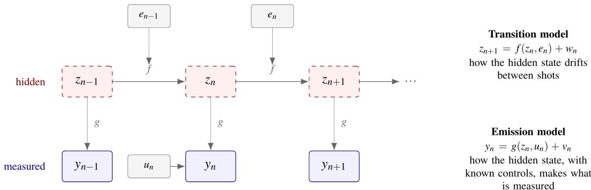
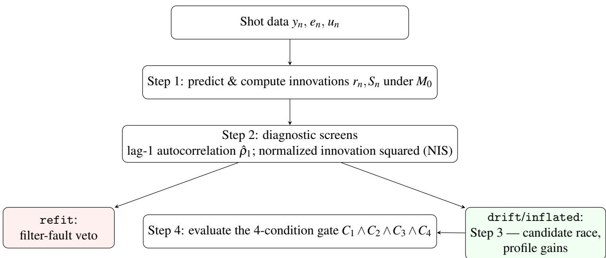
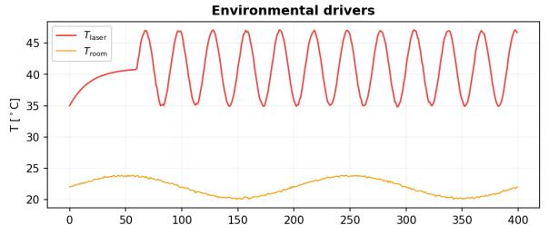
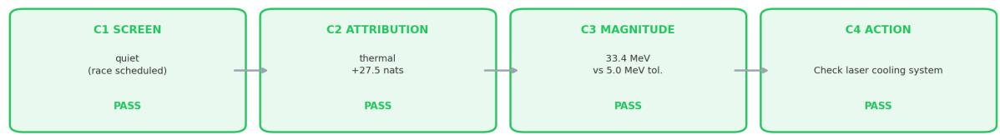

# 激光等离子体加速器的物理约束漂移诊断笔记

## 0. 论文信息

- 英文标题：Physics-Informed Drift Diagnosis for Laser-Plasma Accelerator Operations
- 作者：Ou Labun；Calin Hojbota；Mara Klebonas；Mike Downer；Rafal Zgadzaj；Phil Franke；Lance Labun
- 平台：arXiv 预印本
- DOI：[10.48550/arXiv.2609.11874](https://doi.org/10.48550/arXiv.2609.11874)
- arXiv v1：2026-09-10（论文首页日期为 2026-09-11）
- 来源：[arXiv 摘要页](https://arxiv.org/abs/2609.11874)
- 主题关键词：laser-plasma accelerator；latent state-space model；extended Kalman filter；drift diagnosis；physics-informed inference
- 本地 PDF：`daily/2026-09-12/pdfs/Labun et al. - 2026 - Physics-informed drift diagnosis for laser-plasma accelerator operations.pdf`
- 正文处理：官方 arXiv PDF 28 页，已完成文件、页数、哈希、文本与 MinerU 图件检查

## 1. 摘要与问题定义

论文关心的不是怎样把 LPA 调到更高能量，而是怎样在一次运行班次中判断性能为何漂移。作者把难以逐发测量的焦点归一化场强 $a_0$、电子密度 $\tilde n_e$ 和残余啁啾 $\mathcal C$ 作为隐状态，用常规电子束观测量——中心能量 $E$、相对能散 $\Delta E/E$ 和电荷 $Q_b$——反演它们，再用环境记录区分激光头升温、室温致密度变化和湿度致压缩器漂移。

作者的主要结论是“能否归因首先受可控激励限制，而不是简单受炮数限制”。但全文没有使用真实 LPA 数据：所有定量结果来自与推断模型共享同一函数族的合成会话，因此是结构一致性测试，不是装置验证或已部署的闭环控制。

## 2. 为什么黑箱优化不足以回答维护问题

LPA 的交互点状态既非完全可控，也非逐发可测。Bayesian optimization 可以在少量炮次中寻找较优设定，却通常把未测得的焦点质量、真实密度和啁啾吸收到噪声项；环境漂移后重新优化能够恢复性能，但不会说明应该检查冷却器、压缩器还是供气系统。

作者将变量分为四类：可设定控制 $u_n$、逐发测得的束流 $y_n$、交互点隐状态 $z_n$ 与环境驱动 $e_n$。这一分层的价值在于把“哪个物理量移动了”和“是什么硬件路径使它移动”拆成两个可检验问题。

## 3. 隐状态与发射模型

图 1 将逐发演化写成

$$
y_n=g(z_n,u_n)+\nu_n,
\qquad
z_{n+1}=f(z_n,e_n)+w_n.
$$

其中 $z_n=[a_0,\tilde n_e,\mathcal C]$，$y_n=[E,\Delta E/E,Q_b]$；$\nu_n$ 是观测噪声，$w_n$ 是逐发状态抖动。发射模型 $g$ 决定隐状态如何投影到束流，转移模型 $f$ 决定环境怎样推动隐状态。

作者把参考密度取为 $n_{\rm ref}=3.0\times10^{18}\,\mathrm{cm^{-3}}$，定义 $\tilde n_e=n_e/n_{\rm ref}$；啁啾以 $\tau_\ell=\tau_0(1+\mathcal C^2)$ 表示脉宽展宽。三维 blowout 标度与简化自聚焦关系组合后，中心能量模型为

$$
E=\mathcal E_0 a_0^{2/3}\tilde n_e^{-2/3}
\left(1+\mathcal C^2\right)^{-1/3},
\qquad \mathcal E_0=459.8\,\mathrm{MeV}.
$$

**变量说明：**$a_0$ 无量纲；$\tilde n_e$ 无量纲；$\mathcal C$ 是残余谱啁啾；$\mathcal E_0$ 是由参考工作点 $E=680.4\,\mathrm{MeV}$ 标定的能量常数。

**推导脉络：**有效功率比满足 $F\propto a_0^2/[\tilde n_e(1+\mathcal C^2)]$；简化匹配解取自聚焦后振幅 $a_{\rm lat}\propto F^{1/3}$；代入 dephasing-limited blowout 能量标度后得到 $E\propto a_0^{2/3}\tilde n_e^{-2/3}(1+\mathcal C^2)^{-1/3}$。

**物理直觉：**更强激光提高能量，更高密度缩短去相位长度而降低能量；在 $\mathcal C=0$ 附近，能量对啁啾的一阶导数为零，所以仅靠能量很难识别小湿度漂移。

能散模型由固定注入能宽下限和随加速场变化的项组成；电荷模型取 $Q_b\propto\tilde n_e[1+h(\mathcal C,\tilde n_e)]$，其中 $h=0.75\mathcal C\tilde n_e^{3/2}$。正啁啾在模型中使能散下降、电荷上升，形成一阶可见的符号特征。这里的 $h$ 是 toy-model 近似，会把 shock position、注入相位和 beam loading 的变化混入 $\mathcal C$ 或 $\tilde n_e$。

## 4. 转移假设与噪声分离

作者比较五个候选：无环境驱动的随机游走 $M_0$，以及激光热漂移 $M_1$、湿度—啁啾 $M_2$、室温—气体密度 $M_3$ 和包含全部路径的 $M_4$。物理候选按当炮环境“从属”到新的均值而不积累历史；只有 $M_0$ 保留随机游走记忆。

逐发白噪声 $Q_w$ 和持久漂移 $Q_\delta$ 被分开。前者只应进入当前炮的预测观测协方差，不能被递推累积；后者才表示模型未解释的慢变偏移。作者也承认两者的幅度目前按经验设为相同，尚未由装置数据标定。

硬件耦合系数取为 $\beta_{aT}=-0.008\,{}^\circ\mathrm C^{-1}$、$\beta_{nT}=-0.015\,{}^\circ\mathrm C^{-1}$、$\beta_{\mathcal C H}=3\times10^{-4}\,\%\mathrm{RH}^{-1}$，另加啁啾到焦点振幅的对准耦合 $\gamma_{a\mathcal C}=-0.02$。这些值不是本论文从真实 LPA 运行记录拟合所得。

## 5. EKF 递推与四条件诊断门

扩展 Kalman filter 在每炮重新线性化发射模型。创新量和协方差为

$$
r_n=y_n-g(\hat z_{n|n-1},u_n),
\qquad
S_n=H_n(P_{n|n-1}+Q_w)H_n^{\mathsf T}+R,
$$

其中 $H_n=\partial g/\partial z$ 是发射 Jacobian，$P$ 是隐状态估计协方差，$R$ 是观测噪声。$r_n$ 同时用于更新隐状态和计算每个候选模型的逐发预测似然。

第一层筛查用 40 炮不重叠窗口的 lag-1 autocorrelation 与 normalized innovation squared（NIS）。持续负相关被解释为滤波器过度校正，触发 `refit` 并否决后续归因；持续正相关或 NIS 偏大才进入漂移归因。作者用 2 万个 400 炮 null trials 报告：加入三窗口 run-length 条件后，会话级误报警率由简单 first-crossing 的 85.0% 降到 0.01%；这仍是作者合成噪声下的校准结果。

最终只有同时满足下式才建议硬件操作：

$$
C_1\wedge C_2\wedge C_3\wedge C_4,
$$

其中 $C_1$ 要求无 filter fault 且允许竞赛，$C_2$ 要求候选 family 的 BIC margin 超过 10 nats，$C_3$ 要求预测能量漂移超过 $5\,\mathrm{MeV}$ 容差，$C_4$ 要求存在可执行的维护动作。10 nats 和 5 MeV 均是当前人为阈值，并非由真实 false-work-order 成本导出。

## 6. 两组合成会话与“激励优先”结论

参考会话和受激会话均有 400 炮、相同 seed 42，并从第 250 炮加入每炮 $6\times10^{-4}$ 的啁啾斜坡；区别只在激光头温度摆幅：参考会话 $0.9\,{}^\circ\mathrm C/140$ 炮，受激会话 $6.0\,{}^\circ\mathrm C/30$ 炮。

参考会话的 20 炮平均中心能量全程下降 10.3 MeV，但所有候选均输给随机游走，最终为 `UNATTRIBUTED`，不能据此下维护工单。受激会话全程下降 11.6 MeV，$M_4$ 经过惩罚后以 $+27.5$ nats 超过 null，预测会话峰—峰能量漂移 33.4 MeV，并给出约 16.8 MeV 的恢复量估计，其中恢复激光头温度贡献约 14.2 MeV。

这里还有一个重要实现缺陷：$M_4$ 同时属于三个机制 family，三个 family margin 完全相等；代码按枚举顺序把平局标成 thermal。受激会话确实由 thermal dither 生成，但“thermal family 被证据唯一识别”并未被证明，只能说至少一种环境机制显著优于 null。

## 7. 机制、噪声与激励扫描

- 单机制 8 次、每次 300 炮的合成集合中，thermal-only 与 gas-density-only 均为 `8/8` 精确识别；all-combined 也为 `8/8`。
- humidity-only 只有 `1/8` 识别正确，因为工作点附近 $\partial E/\partial\mathcal C=0$，且电荷变化远小于噪声；更多同类炮数不能弥补不可观测性。
- 将全部观测噪声放大到基线的两倍（能量噪声 $11\,\mathrm{MeV}$）时，8 次会话的平均 family margin 仍为 $+14.1$ nats；三倍时降至 $+4.5$ nats，不再达到作者的 decisive 阈值。
- thermal dither 为 $3\,{}^\circ\mathrm C/30$ 炮时结果混合，$6\,{}^\circ\mathrm C/30$ 炮时 8 次均 decisive，平均 margin $40.7\pm12.9$ nats。这个阈值只适用于设定的合成噪声和 gas-density 背景。

## 8. 局限、验证路径与应用边界

- 全文没有输入真实 LPA 炮次；合成生成器与推断模型共享同一函数族，所得 margin 是理想上限。
- 三个隐变量不能表示横向相空间、pointing、emittance、beam loading、shock position 与注入相位；不可表示的漂移可能被高置信度错归因。
- 发射模型含多个人工标定常数和简化 chirp/downramp 项；模型偏差不会随增加炮数自动消失。
- 真实验证应先在 BELLA-HTU 历史约 $5\times10^4$ 炮数据上做 generator/model mismatch 测试，再在受控 chiller 或 compressor step 中制造已知 ground truth。
- 本文没有设计或运行闭环反馈，也没有证明对 VHEE/FLASH、ICS、FEL 或工业检查的长期剂量/光子稳定性。
- 本轮只验证了 PDF、MinerU 文本与图件可读，没有运行作者代码或复算 EKF/BIC 数值。

## 9. 开放问题与个人理解

最有价值的思想是把优化和诊断分开：优化回答“下一炮怎么调”，诊断回答“哪个物理状态变了、哪条硬件链导致它”。真正落地的关键并非更复杂的滤波器，而是让 $H=\partial g/\partial z$ 在实际工作点具有足够秩，并主动设计不会损伤装置的可辨识 dither。

最危险的环节则是 model closure。只要真实漂移落在三维隐空间之外，Bayes factor 仍可能非常大，却只是在三个错误解释中选出最像的一项。因此部署界面应同时显示 posterior predictive residual、未建模通道告警和平局，而不能只显示一个“建议检查冷却器”的标签。

## 10. 复习用速记

论文提出 `physical latent state + reduced emission map + competing hardware transitions` 的 LPA 漂移诊断框架；合成测试表明主动激励比继续收集安静炮次更能提供归因证据，但尚未经过真实 LPA 数据、模型失配或闭环维护验证。
