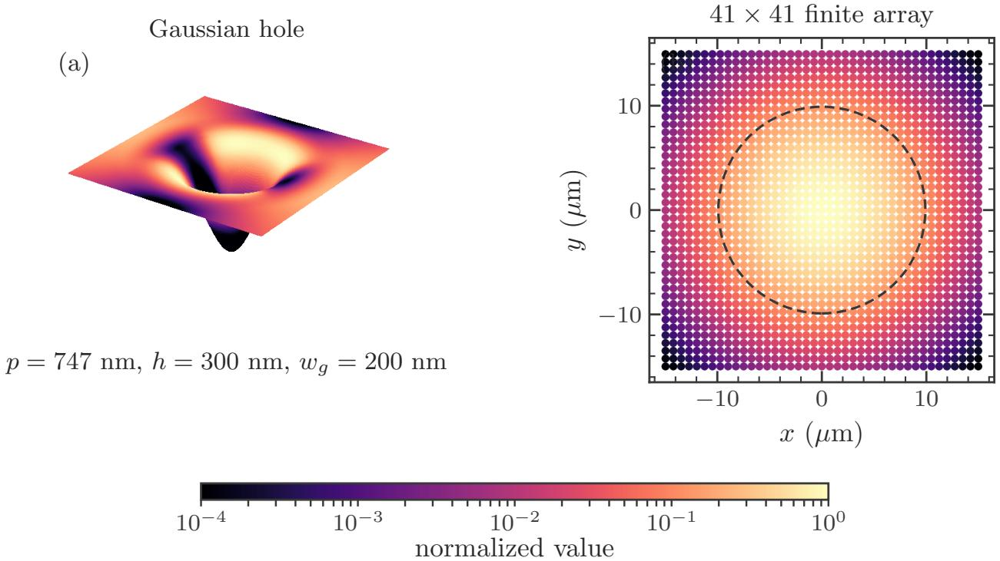
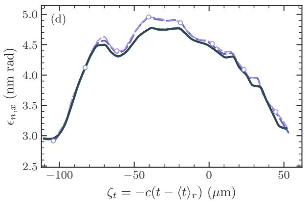
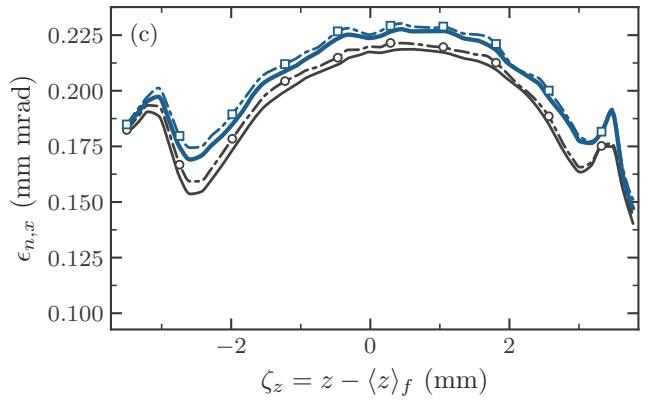

# 结构化光阴极的周期单胞—有限束团多尺度耦合

> 原文：A. Bazyl and I. Zagorodnov, “Coupling periodic-cell and finite-bunch dynamics for structured photocathodes,” arXiv:2609.11844 (2026).
>
> 来源：[arXiv 摘要页](https://arxiv.org/abs/2609.11844) · [DOI](https://doi.org/10.48550/arXiv.2609.11844) · [本地 PDF](../pdfs/Bazyl%20and%20Zagorodnov%20-%202026%20-%20Structured%20photocathode%20multiscale%20coupling.pdf)

## 一句话结论

作者用高分辨率周期 WarpX 单胞计算结构表面对相空间的局部修正，再把该修正叠加到有限平坦阴极的自洽“载体束团”上；在 41×41 孔阵列的同一 WarpX 模型内，组合结果把多个一维分布的 total-variation 距离显著压低，并将切片能散轮廓误差从 30.7% 降至 2.0%，但 52 万孔、100 pC 注入器算例没有全分辨率真值，只能视为经局部验证的工程近似。

## 1. 为什么需要多尺度方法

纳米或亚微米结构光阴极可以利用局域光场改变发射分布，但它同时引入两个相差很大的尺度：

- 单孔附近需要纳米网格解析表面几何、局域空间电荷和早期轨道；
- 实际束团可能横跨几十万单胞，并在厘米到米尺度的电子枪和束线上演化。

若整个束团都按单胞分辨率做有限阵列 PIC，三维网格和宏粒子数会迅速不可承受；若只用平坦阴极模型，又会遗漏结构引起的局部相空间扰动。论文把这两个问题拆开计算，再在一个近阴极交接面 $H$ 组合。

## 2. 结构、发射与计算对象

验证结构是高斯形孔：深度 $h=300$ nm、横向 FWHM $w_g=200$ nm、晶格周期 $p=747$ nm。发射按三光子过程建模，因此电荷密度与局域激光强度的三次方成正比。

验证用有限阵列包含 $41\times41=1681$ 个单胞，总电荷约 7.38 fC。交接面设在阴极上方 $H=800$ nm：它需要足够高，使局域结构作用已基本形成；又要足够低，使宏观束团尚未经历很长的电子枪演化。

## 3. 核心组合公式

对每个单胞电荷 $q_a$，作者分别计算：

- 结构化周期单胞在 $H$ 的粒子状态 $X_{\mathrm{structured}}(q_a,H)$；
- 对应平坦周期单胞的状态 $X_{\mathrm{flat}}(q_a,H)$。

两者的差

$$
\Delta X_{ca}(H)=X_{\mathrm{structured},ca}(H)-X_{\mathrm{flat},ca}(H)
$$

被解释为结构造成的局部相空间修正。对有限束团中的载体粒子，再按其所在单胞电荷插值得到 $\Delta X$，形成

$$
X_{\mathrm{comp},ca}(H)=X_{\mathrm{car},ca}(H)+\Delta X_{ca}(H).
$$

这里 $c$ 标记单胞，$a$ 标记单胞内采样记录；$X$ 包含位置、动量与到达时间等相空间变量。

物理直觉是把有限平坦计算当作“宏观自洽场载体”，把周期结构计算当作“局部响应表”。只要宏观包络在一个晶格周期内变化缓慢，单胞响应就可随局部电荷查表并叠加。

## 4. 近阴极有限阵列验证

### 4.1 高分辨率基准

全分辨率 WarpX 有限阵列使用约 $2880\times2880\times192$ 网格，横向步长约 11.7 nm、时间步长 1 fs，演化至 1.4 ps；外加场 35 MV/m，采用嵌入边界静电多重网格。每个单胞保存 8192 条局部记录，完整阵列约有 1380 万宏粒子。

周期响应则对八个归一化单胞电荷分别计算：$1,0.8,0.6,0.4,0.2,0.05,0.01,5\times10^{-5}$，中间电荷线性插值。

### 4.2 验证结果

全分辨率与组合束团在 $H$ 处均给出约 7.36 fC。全局量中：

- rms 能散差约 1.3%；
- $x,y$ 投影归一化发射度差均低于 0.1%；
- $x$ 相空间的 total-variation 距离由 0.16 降到 0.01；
- $y$ 相空间由 0.30 降到 0.01；
- 纵向分布由 0.41 降到 0.06；
- 切片 rms 能散轮廓误差由有限平坦模型的 30.7% 降到组合模型的 2.0%。

这些数字证明局部修正能在作者设定的几何、电荷和交接面下恢复同一 WarpX 模型的有限阵列结果。最大的残余仍在纵向分布，说明简单加法对发射时序和能量—时间相关的逼近最弱。

## 5. WarpX 与 IMPACT-T 之间的载体差异

为把方法推进到注入器尺度，作者让 WarpX 周期单胞响应与 IMPACT-T 有限平坦束团组合。这里存在一个容易被“组合精度”掩盖的误差源：在加结构修正以前，IMPACT-T 与有限平坦 WarpX 在 $H$ 处已经不同。

相对于全粒子有限平坦 WarpX，IMPACT-T 的平均动能相差 0.28 eV、rms 能散相差 9.4%，$x/y$ 投影发射度相差 2.5%/6.0%。这些差异混合了边界条件、网格、粒子推进和穿越面插值，论文没有把各项单独分离。

在 IMPACT-T 内部，把载体粒子数减少 16 倍并同时加粗网格，组合后的全局矩最多变化 1.9%，最大的切片轮廓差为 2.3%。这是对载体离散的敏感性检查，而非对结构物理的独立验证。

## 6. 100 pC 注入器尺度应用

### 6.1 设置

大尺度例子采用代表性的 European XFEL 类 1.3 GHz、1.6 单元 CW 枪：

- 阴极处规定 100 pC 总电荷；
- 结构仍使用 747 nm 周期和同样的高斯孔；
- 宏观横向尺度参数约 $\sigma_r=304\,\mu\mathrm m$，在 $R=\sigma_r$ 截断，对应单轴 rms 尺寸约 146 µm；
- 总共有 521,197 个发射孔；
- 时间分布约为 21.8 ps 平顶加两侧 2 ps 边沿；
- 峰值射频场 55 MV/m，螺线管峰值约 0.188 T；
- 周期 WarpX 对 8 个单胞电荷计算，载体束团使用约 105 万或 52.4 万粒子。

在 $H$ 处，致密组合束团剩余 99.3 pC，约 0.685 pC 被归为回撞阴极。相对有限平坦载体，结构修正使 $x$ 投影发射度增加 4.9%，$y$ 增加 28.6%，此时 $\epsilon_{n,y}/\epsilon_{n,x}=1.225$。

### 6.2 下游演化

经过射频加速、螺线管聚焦和空间电荷演化到 $z=1.52$ m，组合束团的 $x/y$ 投影发射度为 0.392/0.395 mm·mrad；相对有限平坦束团只差 0.85%/1.6%，比交接面处的差异小得多。中心切片差仍约为 $x$ 方向 3%、$y$ 方向 5%。平均能量差低于 0.001%，rms 能散差约 0.13%，束长差约 0.20%。

这表明线性光学和集体演化可以部分混合、旋转或补偿近阴极的横向各向异性；它并不意味着结构效应在所有可观测量上消失。

把载体粒子数减半时，最终投影发射度变化约 0.33%/0.45%，切片发射度轮廓变化约 1.6%/1.5%。这给出了作者模型内的数值敏感性，但没有全分辨率 52 万孔 PIC 作为真值。

## 7. 成本数据应该怎样读

论文报告的代表性执行成本包括：

- 全分辨率有限阵列 WarpX：87.1 node-hour；
- 有限平坦 WarpX：70.8 node-hour；
- 一组周期结构/平坦响应：1.24 node-hour；
- 致密 IMPACT-T 载体：5.27 node-hour；
- 缩减粒子、粗网格 IMPACT-T：0.17 node-hour。

这些任务承担的角色、网格规模、节点类型和物理模型不同，不能直接把 87.1/0.17 当作完整工作流加速比。更稳妥的结论是：局部高分辨率响应可复用，使大束团不必在每个孔上重复同等分辨率。

## 8. 适用条件

组合成立依赖以下尺度分离：

- 宏观电荷包络和有限束团自场在一个 747 nm 单胞内缓慢变化；
- 结构引起的局部运动对 $H$ 以下的自洽场反馈可以忽略；
- 穿过 $H$ 后，已离开粒子的结构修正不再显著改变阴极附近响应；
- 结构发射规律可以预先规定，未随局域电场和表面状态自洽改变；
- 周期表覆盖实际遇到的单胞电荷范围，插值不会跨越新的动力学分支。

若结构周期接近宏观包络尺度、相邻单胞强耦合、局域发射受场增强反向调制，或交接面以上仍有显著结构近场，简单加法可能失效。

## 9. 局限与证据边界

- **近阴极验证是同一数值模型内的验证。** 有限阵列真值和周期响应都来自 WarpX，证明算法一致性，不是实验验证。
- **注入器尺度没有全分辨率真值。** 52 万孔算例无法声称已验证到真实完整 PIC 精度。
- **跨代码载体有基线偏差。** WarpX 与 IMPACT-T 在加修正前已有 2.5%–9.4% 的量差，误差来源未逐项分离。
- **当前是近阴极静电处理。** 全电磁扩展尚未验证。
- **发射是规定的。** 没有把局域表面场、材料响应或实验测得的量子效率反馈到发射模型。
- **没有本地运行。** 本笔记只审阅作者 PDF、公式、表和图；没有取得输入、重新编译 WarpX/IMPACT-T 或复现 node-hour。

## 10. 对 PIC/束流建模的启发

方法可推广为“高分辨率局部 Green-function/response library + 低分辨率全局载体”的思路。对激光等离子体加速后的复杂微结构束流、等离子体透镜微扰或诊断器响应，也可考虑先验证局部相空间映射，再嵌入长尺度束线。但必须保留：

1. 平坦载体自身的误差预算；
2. 局部响应的覆盖区；
3. 组合交接面的守恒检查；
4. 至少一个可负担的全分辨率交叉验证算例。

## 11. 建议精读顺序

1. 先读组合公式，明确什么被相加、什么仍由载体自洽求解；
2. 再看 41×41 WarpX 验证，重点比较 total variation 与切片量；
3. 接着读跨代码基线偏差，避免把所有误差归给结构修正；
4. 最后看注入器算例，并把它标记为经局部验证的尺度扩展，而非全分辨率确认。
