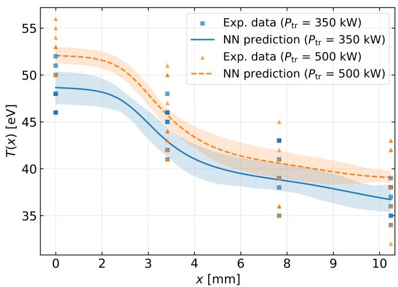
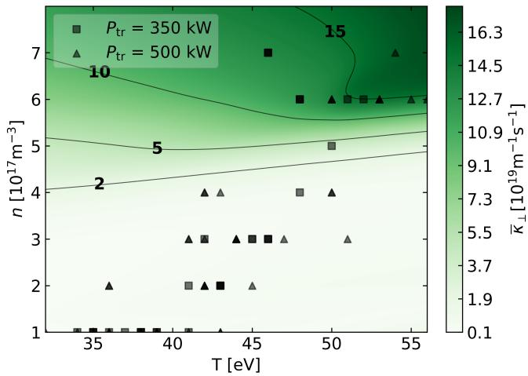

# 用 PINN 从 TJ-II 边界等离子体稀疏剖面反演垂直能量电导率

> 原文：J. Gallego, P. Protopapas, A. Bustos, A. Alonso, S. Barquero, A. Baciero, I. Rivera, J. A. Moríñigo, R. Mayo-García, and the TJ-II Team, “Physics-Informed Neural Networks to Infer the Perpendicular Energy Conductivity in the Scrape-Off Layer of Stellarator Devices,” arXiv:2609.11628 (2026).
>
> 来源：[arXiv 摘要页](https://arxiv.org/abs/2609.11628) · [DOI](https://doi.org/10.48550/arXiv.2609.11628) · [本地 PDF](../pdfs/Gallego%20et%20al.%20-%202026%20-%20PINN%20inference%20of%20SOL%20perpendicular%20conductivity.pdf)

## 一句话结论

作者把 TJ-II 刮削层的稀疏电子温度、密度剖面与一维稳态能量方程一起放进 inverse PINN，得到一个随局部 $T,n$ 变化的“有效”垂直电导率；合成数据上模型在有数据约束区通常能恢复到约 10% 内，但真实放电的物理残差明显更大，因此实验结果应理解为受简化模型约束的探索性反演，而不是直接测得的材料式输运系数。

## 1. 问题与动机

聚变装置的刮削层（scrape-off layer, SOL）需要把核心逸出的能量输运到偏滤器或第一壁。沿磁场方向的输运很快，而跨磁面的输运受湍流等过程控制，常被压缩成一个有效垂直系数。困难在于：

- SOL 内可用的温度和密度测点稀少；
- 对剖面做数值微分会放大噪声；
- 经验扩散系数容易与几何、平行损失和未建模辐射混在一起；
- 只拟合观测数据可以平滑插值，却未必满足能量守恒。

论文的目标不是替代第一性原理湍流模拟，而是在稀疏实验剖面和简化输运方程之间构造一个可微、可反演的闭环。

## 2. 约化物理模型

### 2.1 从能量平衡到一维方程

作者假设 sheath-limited SOL、$T_i=T_e=T$、稳态、沿径向 $x$ 的一维输运，并忽略辐射、荷交换和沿磁力线的导热。约化方程写成

$$
\frac{\mathrm d}{\mathrm dx}\left(\kappa_\perp\frac{\mathrm dT}{\mathrm dx}\right)
=\frac{5nT^{3/2}}{2\sqrt{m_i}L_c}.
$$

其中：

- $x$ 是从最后闭合磁面（LCFS）向外的径向坐标，实验部分以 mm 表示；
- $T$ 为电子/离子共同温度，论文以 eV 表示；
- $n$ 为等离子体密度，单位为 $\mathrm{m^{-3}}$；
- $m_i$ 为离子质量；
- $L_c$ 为连接长度；
- $\kappa_\perp$ 是待反演的垂直能量电导率，在论文归一化下以 $\mathrm{m^{-1}\,s^{-1}}$ 表示。

左端是垂直热流 $q_\perp=-\kappa_\perp\,\mathrm dT/\mathrm dx$ 的散度；右端代表能量沿磁力线流向鞘层的体损失。物理直觉是：某一径向位置若有更强的平行损失，就必须由相邻位置更大的垂直热流差来补偿。

LCFS 处再施加输入功率边界条件

$$
-\left.\kappa_\perp\frac{\mathrm dT}{\mathrm dx}\right|_{x=0}
=\frac{P_{\mathrm{tr}}}{S_{\mathrm{LCFS}}},
$$

其中 $P_{\mathrm{tr}}$ 是进入 SOL 的功率，$S_{\mathrm{LCFS}}$ 是对应表面积。这个边界条件给反问题提供绝对尺度，否则 $T$ 梯度和 $\kappa_\perp$ 容易互相补偿。

### 2.2 这些假设意味着什么

反演出的 $\kappa_\perp$ 是“使这套一维方程尽量解释数据”的有效参数。若真实装置存在三维磁几何、显著辐射、荷交换、非局域平行输运或 $T_i\ne T_e$，这些遗漏项都可能被 $\kappa_\perp$ 吸收。因此它不能不加校准地外推成跨装置普适定律。

## 3. inverse PINN 架构

作者使用三个残差网络：

1. $\mathrm{NN}_T$ 以 $(x,P_{\mathrm{tr}})$ 为输入，预测 $\hat T$；
2. $\mathrm{NN}_n$ 以同样输入预测 $\hat n$；
3. $\mathrm{NN}_\kappa$ 以 $(\hat T,\hat n)$ 为输入，预测 $\hat\kappa_\perp$。

自动微分从 $\hat T$ 与 $\hat\kappa_\perp$ 得到方程残差。总损失同时包含：温度数据误差、密度数据误差、能量方程残差和 LCFS 热流边界误差。各损失权重按梯度范数自适应调整，以减少某一项在训练早期支配全部更新的问题。

这种拆分有两点值得注意：

- $T$ 和 $n$ 网络负责对稀疏剖面做连续重建，避免直接差分原始数据；
- $\kappa_\perp(T,n)$ 只依赖局部状态，而非显式依赖位置或加热功率，这相当于预设了“相同局部状态对应相同闭合关系”。

## 4. 合成数据验证

### 4.1 数据生成

合成算例采用 $n_0=10^{18}\,\mathrm{m^{-3}}$、特征宽度 $W=14\,\mathrm{mm}$，并设真实闭合关系 $\kappa_\perp=k_0nT$，其中 $k_0=1\,\mathrm{m^2\,s^{-1}\,eV^{-1}}$。径向域为 0–140 mm、网格间距 0.14 mm，传输功率覆盖 100–300 kW。

为模拟诊断误差，作者对剖面加入约 1 eV 的温度噪声和 $10^{17}\,\mathrm{m^{-3}}$ 的密度噪声，重复生成 200 组；训练约 $5\times10^5$ 个 epoch，一张 NVIDIA H100 的一次代表性训练约 3 小时。

### 4.2 恢复精度与数据覆盖

在训练样本真正覆盖的 $(T,n)$ 区域，$\kappa_\perp$ 的误差通常低于约 10%，物理一致性分数 $S_f=0.998$。离开数据云后，网络仍会输出平滑曲面，但 bootstrap 不确定度迅速增大；这正是反问题中的外推警告，而非额外物理信息。

作者还扫描功率剖面数 $N_P$ 和每条剖面的径向测点数 $N_x$：

在这套合成噪声和真实函数下，约 5 条功率剖面、每条 6 个径向位置后收益开始饱和。这个数字是本算例的经验结果，不应直接变成 TJ-II 或其他装置的诊断设计定额。

## 5. TJ-II 实验应用

### 5.1 数据与边界条件

实验数据来自 TJ-II 2026 年春季的 13 个 ECRH 放电：5 个约 350 kW、8 个约 500 kW，线平均密度约 $5\times10^{18}\,\mathrm{m^{-3}}$。作者认为辐射功率约为加热功率的 1%，于是近似 $P_{\mathrm{tr}}\simeq P_h$。

氦束诊断的时间分辨率约 50 ms，每炮取得两个时间样本；空间分辨率约 3.5 mm，实际使用四个径向位置。LCFS 位置存在约 5–10 mm 的不确定性，并通过启发式准则选择，这会直接影响边界梯度和 $\kappa_\perp$ 的绝对值。

温度重建如下。散点是真实实验输入，曲线及阴影是网络预测和 bootstrap 区间：

典型置信区间约为温度 $\pm2$ eV、密度 $\pm0.5\times10^{17}\,\mathrm{m^{-3}}$。LCFS 边界估算得到两档功率下的 $\kappa_\perp$ 分别约为 $(12.5\pm0.8)\times10^{19}$ 和 $(16.1\pm0.7)\times10^{19}\,\mathrm{m^{-1}\,s^{-1}}$。

### 5.2 反演曲面

反演曲面大致覆盖 $10^{18}$–$10^{20}\,\mathrm{m^{-1}\,s^{-1}}$，在高密度、高温区域最大。低密度区中温度依赖变弱，但那里数据较少、不确定度较高，也最容易受遗漏物理影响，因而不能据此宣布新的输运标度律。

作者给出的实验物理一致性分数约为 $S_f=0.81$–0.82，明显低于合成数据的 0.998。这一差距比“网络拟合得很平滑”更重要：它提示真实 TJ-II 数据无法被当前约化方程完全解释。

论文还将归一化电导率量级与 W7-X 的约 100 作比较，TJ-II 推断值约为 800，即约 8 倍。但两者的几何、归一化、运行区间和闭合假设并未在同一实验框架下校准，所以这里只能视为量级提示。

## 6. 方法学价值

这项工作的价值主要在三点：

- 将稀疏实验剖面、边界输入和能量守恒放进同一个可审计目标函数；
- 用 bootstrap 和数据覆盖图明确标出“插值区”与“网络仍能给数但没有证据的外推区”；
- 让物理残差本身成为模型充分性的诊断，而不是只报告数据拟合误差。

对激光等离子体实验也有可迁移性：若能写出可信的低维演化或守恒约束，可用相似的 inverse PINN 同时平滑诊断数据和反演难以直接测量的有效系数。但必须先证明约化方程在目标时空尺度上成立。

## 7. 局限与证据边界

- **实验输入是真的，系数不是直接测量量。** $T,n$ 来自 TJ-II 诊断，$\kappa_\perp$ 是模型条件下的反演量。
- **几何被强烈约化。** 一维直化 SOL 不能完整表达 stellarator 的三维连接长度和磁面结构。
- **遗漏过程会进入有效系数。** 辐射、荷交换、平行导热、$T_i\ne T_e$ 与时间依赖均未显式求解。
- **LCFS 定位是主要系统学。** 5–10 mm 的位置不确定度相对四个测点的覆盖不可忽略。
- **合成验证存在同族优势。** 合成数据由与训练残差一致的方程生成，证明的是求解链能恢复设定真值，不等于真实模型正确。
- **没有本地复现。** 本笔记基于作者 PDF、公式、图和报告的运行条件；没有取得数据/代码，也没有重新训练网络。

## 8. 建议精读顺序

1. 先看一维能量方程和 LCFS 边界，判断哪些遗漏项可能被 $\kappa_\perp$ 吸收；
2. 再看三网络架构与损失权重，理解数据拟合和物理残差怎样竞争；
3. 用合成数据覆盖图确认“精度”只在训练状态空间内成立；
4. 最后读 TJ-II 结果时，把 $S_f\approx0.82$、LCFS 不确定度和稀疏测点放在电导率曲面之前。

## 9. 可继续验证的方向

- 用独立放电做真正的留出验证，而不仅是同一批数据 bootstrap；
- 显式加入辐射、平行导热或三维几何，比较物理残差是否实质下降；
- 对 LCFS 位置做层次贝叶斯边缘化，避免把启发式位置选择固定为真值；
- 与独立输运代码或扰动实验比较 $\kappa_\perp$ 的可辨识区，而不仅比较网络重建曲线。
