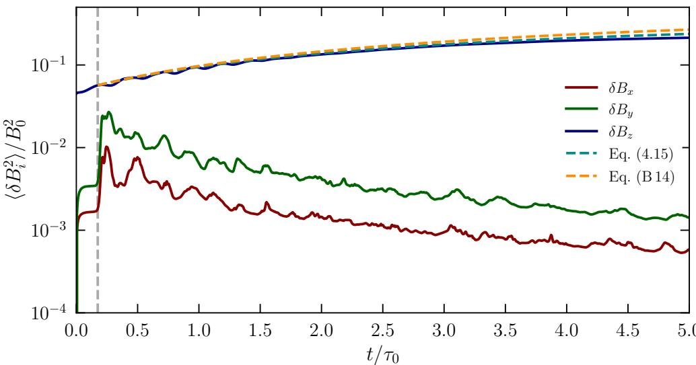
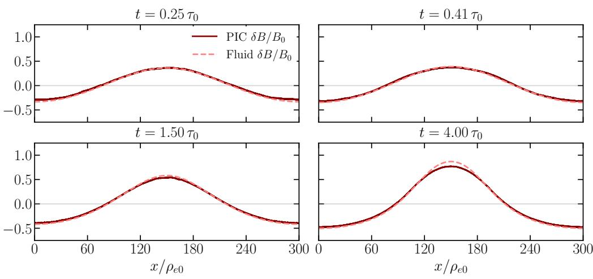
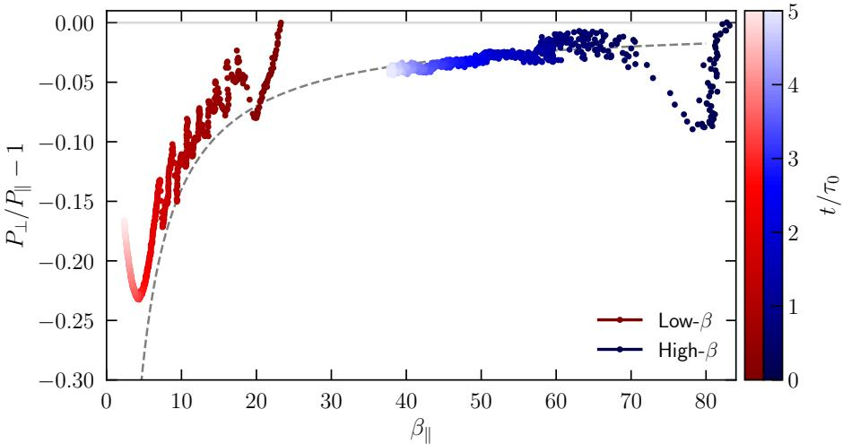
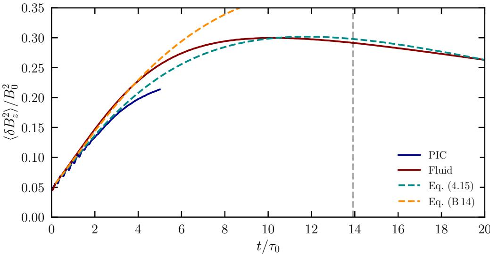
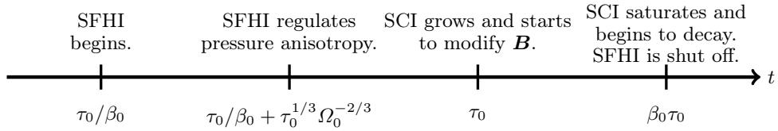

# 相对论等离子体的同步辐射冷却不稳定性与两相演化

> 原文：M. Wierzchucka et al., “Two-Phase Structure of Synchrotron-Cooling-Unstable Relativistic Plasma,” arXiv:2609.07793 (2026).
>
> 来源：[arXiv 摘要页](https://arxiv.org/abs/2609.07793) · [DOI](https://doi.org/10.48550/arXiv.2609.07793) · [本地 PDF](../pdfs/Wierzchucka%20et%20al.%20-%202026%20-%20Two-phase%20synchrotron-cooling-unstable%20relativistic%20plasma.pdf)

## 一句话结论

论文提出并用解析理论、二维三速度 OSIRIS 辐射 PIC 与一维两相流体模型交叉检验：同步辐射先产生负压强各向异性并触发 firehose，随后磁场增强区因冷却更快而压缩、继续增强磁场，形成 synchrotron cooling instability（SCI）；早期 PIC 与流体/线性理论在约 7% 内一致，但 $t\gtrsim2.2\tau_0$ 后主 PIC 的低温区受数值碰撞污染，因此长期饱和结论来自流体延拓而非可靠的晚期 PIC 真值。

## 1. 物理场景

研究对象是均匀、碰撞可忽略、超相对论高 $\beta$ 的电子—正电子等离子体，背景磁场为 $B_0\hat z$。粒子通过经典同步辐射损失能量，垂直于磁场的动量比平行分量冷却得更快，于是产生

$$
\Delta\equiv\frac{P_\perp}{P_\parallel}-1<0.
$$

这里 $P_\perp$、$P_\parallel$ 是相对背景磁场的垂直和平行压强。负各向异性会触发 synchrotron firehose instability（SFHI）；与此同时，空间上稍强的磁场让局部同步辐射更强，压强下降后周围等离子体压缩该区域，在冻结磁通条件下进一步抬高 $B$ 和密度，这构成 SCI 的正反馈。

论文的重要点是把两个不稳定性分时标处理：快速 kinetic firehose 调节压强各向异性，慢速辐射冷却驱动宏观磁场—密度分离。

## 2. 同步辐射冷却与 firehose 阈值

作者用 $\tau_0$ 表示初始同步辐射冷却时标、$\Omega_0$ 表示初始回旋频率，$\beta_0$ 表示初始热压与磁压之比。在高 $\beta$、缓慢冷却极限，firehose 阈值近似为

$$
\Delta<-\frac{C_{\mathrm{th}}}{\beta_\parallel},
$$

PIC 中拟合得到 $C_{\mathrm{th}}\simeq1.4$。结合早期辐射导致的各向异性增长，预测触发时间

$$
t_{\mathrm{onset}}=\frac{15C_{\mathrm{th}}}{8\beta_0}\tau_0.
$$

对主算例 $\beta_0=40$，理论给出 $t_{\mathrm{onset}}\simeq0.066\tau_0$。其物理含义是：初始 $\beta$ 越高，稳定阈值所允许的负各向异性越小，因此 firehose 越早启动。

SFHI 产生横向磁扰动并散射粒子，将 $\Delta$ 拉回阈值附近。继续辐射又把系统推过阈值，于是形成反复的“各向异性积累—firehose 增长—散射回阈值”循环。

## 3. SCI 的正反馈与线性增长

考虑一个正的磁场扰动。冻结磁通使压缩区 $B$ 与 $n$ 同向增长；同步辐射功率随磁场增强，局部温度和压强下降；为维持总压强平衡，更多等离子体流入该区，再次提高 $B$。若热压足够高，这个反馈超过磁压恢复力。

忽略有限 firehose 阈值时，理论临界值为 $\beta_0>4$；取 $C_{\mathrm{th}}=1.4$ 后，论文给出的有效临界值约为 3.33。高波数极限下的最大瞬时增长率写成

$$
\chi_{\max}=\frac{\alpha(\beta_0-4)}{\Gamma\beta_0+2},
$$

其中 $\alpha$ 汇总垂直/平行辐射冷却系数，$\Gamma$ 是有效绝热指数。高 $\beta$ 时 $\chi_{\max}\to2/3$。实际背景在持续冷却，所以扰动不是恒定指数增长，而是随时间变化的代数增长并最终饱和。

线性估算给出

$$
t_{\mathrm{sat}}\sim\frac{\beta_0\tau_0}{4\alpha},
\qquad
\frac{\delta B}{B_0}\text{ 的最大放大量级}\sim\beta_0^{1/\Gamma}.
$$

这组标度说明 SCI 是冷却时标上的宏观过程，明显慢于 $\tau_0/\beta_0$ 量级的 firehose 启动。

## 4. OSIRIS 辐射 PIC 设置

主 PIC 使用 OSIRIS 的 2D3V 周期盒：

- 电子—正电子对等离子体；
- 初始温度 $T_0=100m_ec^2$；
- 总 $\beta_0=40$，每个物种贡献 20；
- $\tau_0\Omega_0=2000$，确保冷却慢于回旋；
- 量子参数 $\chi_{\mathrm{QED}}\simeq7\times10^{-4}$，因此采用经典 Landau–Lifshitz 辐射反作用；
- 区域 $300\rho_{e0}\times37.5\rho_{e0}$，网格 $13328\times1673$；
- $\Delta x\simeq\Delta z=0.0225\rho_{e0}$，$\Delta t=0.01\Omega_0^{-1}$；
- 每格每物种 400 个宏粒子，三次粒子形状，运行到 $5\tau_0$；
- 初始磁场调制振幅 $a=0.3$，用于在可计算域内观察宏观 SCI。

初始扰动并非严格无穷小，因此晚期与线性理论的偏离同时包含非线性增长和数值效应，不能只归结为理论失效。

## 5. PIC 中的早期动力学

PIC 在 $t_{\mathrm{PIC}}\simeq0.17\tau_0$ 观察到 $\delta B_x,\delta B_y$ 快速增长，晚于理论 $0.066\tau_0$。作者把差异主要归因于有限的 $\tau_0\Omega_0$：冷却和 firehose 的时标分离不够无限大；附录的小盒扫描显示增大该参数会让触发时间靠近理论。

firehose 主要产生垂直于平均场的短尺度扰动；代表 SCI 的 $\delta B_z$ 则在 $\tau_0$ 量级增长。图中两条线性模型在约 $t\lesssim2.2\tau_0$ 能跟随 PIC 的 $\delta B_z$。

## 6. 两相流体模型

SCI 把系统分成：

- **高 $\beta$、firehose 湍动相**：各向异性被钉在 $\Delta=-C_{\mathrm{th}}/\beta_\parallel$；
- **低 $\beta$、层流相**：SFHI 关断，垂直/平行压强按无碰撞双绝热方程演化。

作者用一维流体方程演化密度、速度、磁场和两方向压强，并在两相间切换闭合关系。PIC 实测高 $\beta$ 区辐射系数约为 $\alpha_\perp=0.9$、$\alpha_\parallel=0.48$，用于流体和线性模型。

在 $t\lesssim2.2\tau_0$ 的线性阶段，PIC 与流体场剖面约在 7% 内一致；到 $t=4\tau_0$，盒子中央流体磁场比 PIC 高约 14%。这不是一个可以直接解释成“流体过强”的纯物理差异，因为此时 PIC 已出现人工各向同性化。

## 7. 必须单独标出的 PIC 数值碰撞

有限宏粒子数导致人工粒子散射。附录给出的估算为

$$
\nu_e\tau_e\sim
\sqrt{\frac{3\beta_e}{2}}
\frac{\tau_e\Omega_e}{2\pi N_D},
$$

其中 $N_D$ 是每个 Debye 面积内的计算粒子数。等离子体冷却后 Debye 尺度减小，固定网格和粒子数对应的 $N_D$ 变差，因此人工碰撞越来越强。

主 PIC 初始 $\nu_e\tau_e\simeq0.20$，到末期升至高 $\beta$ 区约 3.3、低 $\beta$ 区约 9.5。于是低温中央区在 $t\approx2.2\tau_0$ 后逐渐被人工散射支配，并在约 $3.3\tau_0$ 把 $\Delta$ 拉回零附近。

因此，主 PIC 中部 firehose 的晚期消失不是论文理论所预测的物理关断。作者明确从 $2.2\tau_0$ 后主要依赖流体模型研究长期 SCI。

论文报告主 PIC 约消耗 160 万 CPU-hour；若仅把粒子数提高到维持晚期 Debye 尺度解析，估计至少还需约 4 倍成本。附录使用较小均匀盒、最高 1936 ppc 做局部收敛扫描，支持 $\alpha_\perp\sim0.82$、$\alpha_\parallel\sim0.51$ 的趋稳趋势，但它没有重做完整宏观 SCI 的晚期收敛。

## 8. 长期流体演化与饱和

两相流体模型中，中央低 $\beta$ 区在约 $3.5\tau_0$ 发生物理 SFHI 关断，此时 $\Delta\simeq-0.35$、$\beta_\perp\simeq2.6$、$\beta_\parallel\simeq4.0$。它不同于均匀估算的 $\Delta\simeq-0.47$，因为 SCI 产生的压缩流改变了压强演化。

SCI 约在 $10\tau_0$ 饱和，中央 $\delta B/B_0\simeq0.9$，$\beta_\perp\simeq0.7$、$\beta_\parallel\simeq1.9$。线性估算则给 $t_{\mathrm{sat}}\simeq13.7\tau_0$、临界 $\beta\simeq3.29$；差异反映大振幅下非线性压缩和时变闭合。

图中 PIC 曲线只到 $5\tau_0$ 且后段受数值碰撞影响；红色流体曲线承担了饱和和衰减的长期预测。约 $20\tau_0$ 后，$T_\perp$ 已降到约 $2m_ec^2$，超相对论闭合本身也不再可靠，论文没有把更晚的回归均匀过程宣称为完整终态。

## 9. 这篇论文的证据链

论文最扎实的部分是早期三角互证：

1. 解析理论给出 firehose 阈值、SCI 临界 $\beta$ 和增长标度；
2. 辐射 PIC 显式产生压力各向异性、firehose 扰动和宏观 $B/n$ 共增；
3. 两相流体用 PIC 测得的辐射系数，在未被数值碰撞污染的区间重现剖面和增长。

长期结论的证据较弱：它是由在早期校验过的流体模型延伸到 $10$–$20\tau_0$，而不是由收敛的全尺度 PIC 直接测得。两种证据应明确分层。

## 10. 与强场 QED、实验和天体应用的边界

- 主算例 $\chi_{\mathrm{QED}}\simeq7\times10^{-4}\ll1$，使用经典连续辐射反作用；这不是量子辐射、Breit–Wheeler 级联或强场 QED 验证。
- 等离子体是超相对论电子—正电子对等离子体，不可直接等同于离子占主导的实验室激光等离子体。
- 论文没有实验观测；对脉冲星风、吸积环境等天体系统的关联是机制建议。
- 模型为 2D PIC + 1D 流体，没有验证三维 firehose 模谱和跨场热流。
- 碰撞、外部加热、热传导和显式平行热流被忽略；这些过程可能改写两相界面和饱和。
- 本笔记没有本地运行 OSIRIS，也没有重现 160 万 CPU-hour 主算例。

## 11. 对辐射 PIC 研究的直接提醒

本论文最可复用的并非某个最终放大量，而是数值误差诊断：带辐射冷却的 PIC 会随着温度下降而失去 Debye 尺度上的有效粒子数，早期通过的收敛度并不保证晚期仍物理。做类似计算时至少应随时间记录：

- 每 Debye 面积/体积的宏粒子数；
- 人工碰撞率与真实冷却率的比值；
- 压强各向异性相对理论不稳定阈值的位置；
- 增粒子、改网格和改变 $\tau\Omega$ 后的局部收敛；
- PIC 与独立流体/动理学极限在未污染时间窗内的交叉验证。

## 12. 建议精读顺序

1. 先读同步辐射如何产生 $P_\perp<P_\parallel$ 和 firehose 阈值；
2. 再读 SCI 的压强平衡—磁通冻结正反馈和临界 $\beta$；
3. 对照 Figure 2/5 看理论、PIC、流体在哪个时间窗一致；
4. 在接受长期饱和前，必须读 Appendix C 的数值碰撞估算；
5. 最后把天体含义视为待验证推论，而不是本论文已观测事实。
