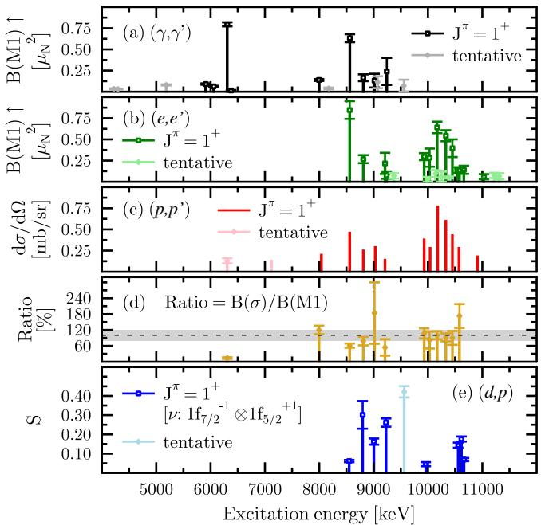
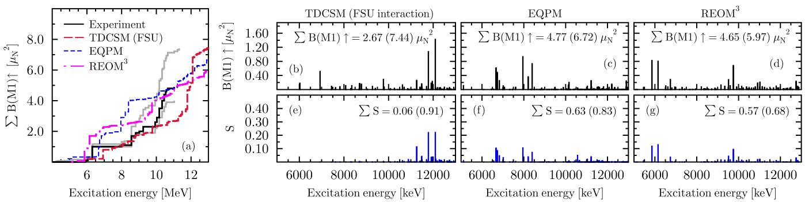
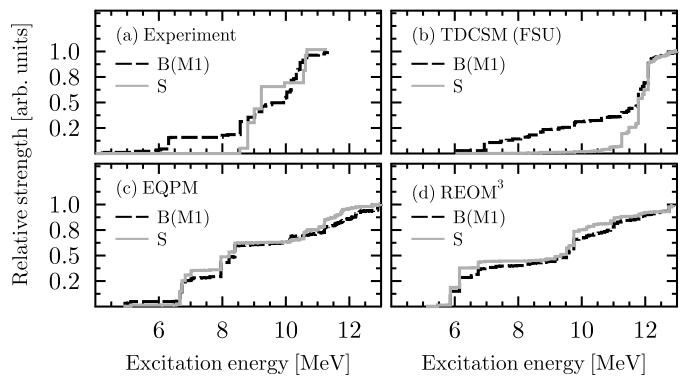

# 多探针拆解半幻数 $^{50}$Ti 的磁偶极强度

> 原文：B. Kelly et al., “A detailed view at magnetic dipole strengths: The case of semi-magic $^{50}$Ti,” Physical Review Letters (2026), DOI: 10.1103/82y9-svrd；开放全文为 arXiv:2609.10843。
>
> 来源：[arXiv 摘要页](https://arxiv.org/abs/2609.10843) · [DOI](https://doi.org/10.1103/82y9-svrd) · [本地 PDF](../pdfs/Kelly%20et%20al.%20-%202026%20-%20Magnetic%20dipole%20strengths%20in%2050Ti.pdf)

## 一句话结论

新做的 $^{50}$Ti$(\gamma,\gamma')$ 与 $^{49}$Ti$(d,p)^{50}$Ti 实验结合既有 $(e,e')$、$(p,p')$ 数据后显示：具有较大中子 $(1f_{7/2})^{-1}(1f_{5/2})^{+1}$ 谱因子的 $1^+$ 态，并不是 $B(M1)$ 最大的那些态；三个先进结构模型经常规淬灭后能拟合总强度，却都没有复现实验揭示的微观态对应关系。

## 1. 为什么需要多种探针

磁偶极 M1 算符同时含轨道 $\ell$ 和自旋翻转 $\sigma$ 分量，又可分为等标量与等矢量通道。对 $N=28$ 同位素，标准图像预期大部分自旋翻转 M1 强度来自中子从 $1f_{7/2}$ 到 $1f_{5/2}$ 的 1p–1h 激发。然而单独测一个 $B(M1)$ 数值，无法直接确认该跃迁的微观组态。

论文利用探针选择性的互补性：

- $(\gamma,\gamma')$ 和极后角 $(e,e')$ 对完整 M1 强度敏感；
- 210 MeV 极前角 $(p,p')$ 主要对自旋翻转部分敏感；
- $^{49}$Ti$(d,p)$ 的 $\ell=3$ 单中子转移直接约束把中子加入 $1f_{5/2}$ 轨道的谱因子 $S$。

真正的判别量不是任一探针单独的峰，而是相同激发态在四类观测量间的对应关系。

## 2. 新实验

### 2.1 实光子散射

作者在 Darmstadt High Intensity Photon Source 使用制动辐射端点 7.5 和 9.7 MeV，并在 HI$\gamma$S 使用线偏振、准单能激光 Compton 背散射光束。后者配合 $\gamma^3$ 阵列用角分布和分析本领判定 $J=1$ 及宇称。

靶为富集度 67.62(30)% 的 $^{50}$TiO$_2$，主要污染是 24.06(30)% 的 $^{48}$Ti；另测 99.81(3)% 的 $^{48}$Ti 靶来识别污染线。这个交叉检查是把峰归属为 $^{50}$Ti 的关键，而不是可忽略的靶纯度细节。

### 2.2 单中子转移

$^{49}$Ti$(d,p)^{50}$Ti 在 FSU Super-Enge Split-Pole Spectrograph 上完成：16 MeV 氘束打到面密度 413 $\mu\mathrm{g\,cm^{-2}}$ 的自支撑金属靶，实验室角覆盖 $15^\circ$–$60^\circ$，平均能量分辨率 50 keV（FWHM）。

谱因子由测量角分布与 FRESCO/ADWA 反应计算的缩放得到：

$$
S=\frac{(\mathrm d\sigma/\mathrm d\Omega)_{\mathrm{exp}}}
{(\mathrm d\sigma/\mathrm d\Omega)_{\mathrm{ADWA}}}.
$$

$S$ 无量纲；分子是实验微分截面，分母依赖绝热扭曲波近似和全局光学势。它是模型依赖的结构提取量，不是直接可观测量。

### 2.3 态匹配标准

作者要求激发能在误差内吻合、$(d,p)$ 的 $\ell$ 转移允许相应宇称、光子角分布确定 $J=1$，并尽量用分析本领确定宇称；再引入既有电子和质子散射。严格的态级匹配使“强度”和“组态”可以逐态关联。

## 3. 多探针实验图像

6.307 MeV 态被无歧义确定为 $1^+$，其

$$
B(M1;0_1^+\rightarrow1_i^+)=0.80(2)\,\mu_N^2,
$$

是实光子散射中最强的两个态之一；另一个 8.563 MeV 态为 $0.63(5)\,\mu_N^2$，与既有电子散射的 $0.85(11)\,\mu_N^2$ 在 $2\sigma$ 内相容。$\mu_N$ 是核磁子，$B(M1)$ 的单位为 $\mu_N^2$。

论文用归一到 10.17 MeV 参考态的质子散射截面与总 M1 强度比值构造自旋份额代理 $R$。大多数 8 MeV 以上态的 $R\gtrsim100\%$，而 6.307 MeV 态只有 $R=14(3)\%$，提示显著轨道分量。与 $^{46,48}$Ti 的类比给出该态轨道强度估计 $B(\ell)=0.16$–$0.33\,\mu_N^2$。

不过，这个 $R$ 不是严格的算符分解：旧 $(p,p')$ 数据没有逐点报告误差，6.307 MeV 截面 $0.13(3)$ mb/sr 还是作者从旧文灰度谱图重新标定和提取得到。因而“轨道分量显著”有多探针支持，但其精确百分比仍带有代理模型和历史数据数字化系统学。

## 4. 最关键的反常：谱因子与 M1 强度脱钩

作者在分辨态中收集到 63(6)% 的 $1f_{5/2}$ 中子添加强度；八个被 $(d,p)$ 看见且由其他探针牢固确认为 $1^+$ 的态，其总谱因子为 $S=1.2(2)$。在作者采用的初态组态和反应模型下，这支持相关 $1f_{5/2}$ 添加强度已基本收集完整。

但态级对应关系与预期相反：

- 6.307 MeV 的强 M1 态在 $(d,p)$ 中没有相应 $1f_{5/2}$ 中子粒子分量；
- 8.563 MeV 的强 M1 态在 $(d,p)$ 中也只弱激发；
- 具有大 $S$ 的态没有同时携带大的 $B(M1)$。

牢固指认的 $1^+$ 态总强度为 $4.9(9)\,\mu_N^2$，重心为 9074(52) keV；若加入暂定态，上限为 $7.4\,\mu_N^2$。八个 $(d,p)$ 牢固态合计只有 $1.9(5)\,\mu_N^2$，即截至 11.3 MeV 所观测总 M1 强度的 $38_{-19}^{+21}\%$。

所以冲突不在“总 M1 是否被测到”，而在“最大 M1 是否属于标准中子自旋翻转组态”。

## 5. 三种结构模型的检验

论文比较：使用跨壳 FSU 相互作用的时变连续壳模型 TDCSM、含至三声子组态的能量密度泛函加准粒子声子模型 EQPM、以及含两准粒子耦合至两声子的相对论运动方程 REOM$^3$。TDCSM 和 REOM$^3$ 的 M1 强度乘典型 $q^2=(0.75)^2$ 淬灭，EQPM 还把等矢量自旋—偶极耦合常数调到约 9 MeV 的实验重心并使用 $g_s=0.75$。

三个模型的累积强度都可与实验大致相容，TDCSM 的累积曲线形状最好但整体约高移 1.5 MeV；各模型给出的细致碎裂位置明显不同。

更重要的是，三个模型都预言大 $S$ 与大 $B(M1)$ 应同时出现，而实验图 3(a) 没有这种同步增长。这说明只校准总强度或统一淬灭因子可以掩盖错误的微观态结构：积分量“对”，不代表逐态波函数“对”。

TDCSM 在 6.73 MeV 预言一个以耦合的质子/中子四极声子组态为主（54%）的 $1^+$ 态，给出 $R=15\%$ 和 $B(M1)=0.59\,\mu_N^2$，与 6.307 MeV 实验态的部分特征接近。但作者明确不主张一一对应。

## 6. 物理含义

结果挑战的是 $fp$ 壳中“中子 $1f_{7/2}\rightarrow1f_{5/2}$ 1p–1h 组态生成主体自旋翻转 M1 强度”的简单图像。缺失机制可能包括当前 TDCSM 空间之外的 $1g$、$3s2d$ 或更低 $2s1d$ 壳贡献、EQPM/REOM$^3$ 尚未包含的基态关联，或更高阶二体流；论文没有在这些选项之间作定论。

与核天体和光核诊断相关的启示是：M1 强度影响恒星弱过程和核反应率，但不能仅凭总 $B(M1)$ 倒推出唯一微观组态。需要把不同探针的选择规则和态级信息一起放入模型检验。

## 7. 局限与证据边界

- **直接实验与再分析混合：** 新 $(\gamma,\gamma')$、$(d,p)$ 是直接实验；$(e,e')$、$(p,p')$ 来自旧数据，其中 6.307 MeV 的质子截面由论文作者重新数字化旧图。
- **谱因子依赖反应模型：** $S$ 使用 ADWA、全局光学势和对 $^{49}$Ti 基态主组态的假设；它不是无模型结构概率。
- **总强度有上下界：** 暂定 $1^+$ 态使总量从 $4.9(9)$ 扩展到上限 $7.4\,\mu_N^2$，不能把上限写成精确总和。
- **理论作了校准/淬灭：** 三个模型的“总强度相符”是在典型有效 $g_s$ 或拟合耦合常数下得到；这不构成从头算的逐态成功。
- **数据未公开下载：** PDF 声明数据可向作者合理请求，但不是公开仓库；本笔记没有重做谱拟合、FRESCO/ADWA 或核结构计算。
- **与激光加速束的边界：** HI$\gamma$S 的准单能光束由激光 Compton 背散射产生，这是一项正式核结构/光子诊断实验，但不是激光尾场电子束打转换靶或激光加速束应用的端到端验证。

## 8. 建议精读与后续验证

1. 先看图 1，把四种探针各自敏感的物理量对应起来；
2. 再看 6.307 和 8.563 MeV 两个强态的 $R$ 与 $S$；
3. 用图 2 区分“累计强度拟合”与“碎裂位置/谱因子关联”；
4. 最后看图 3，理解论文真正挑战的是态级相关性而非单个总和。

后续最有价值的是公开新实验逐态数据及协方差，用统一反应理论重分析 $(d,p)$ 和 $(p,p')$，并在扩大的跨壳空间、显式基态关联和二体流模型中同时拟合 $B(M1)$、谱因子、宇称和分支比，而不是只调一个全局淬灭因子。
