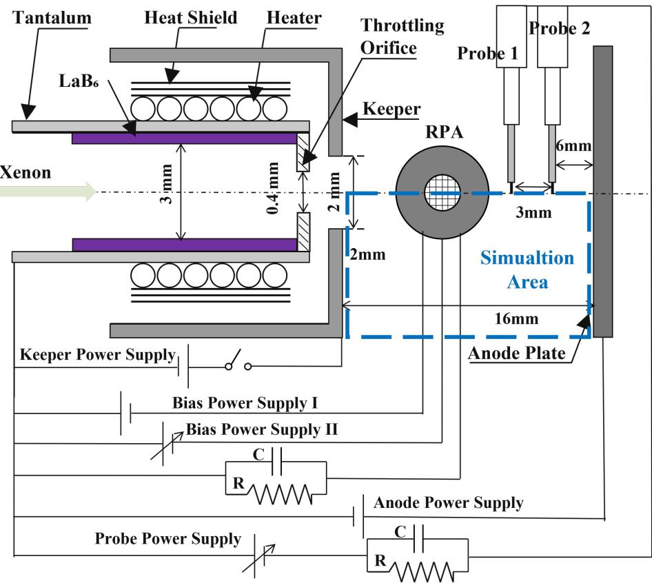
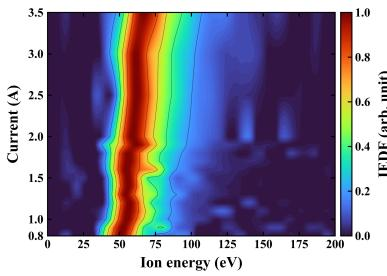
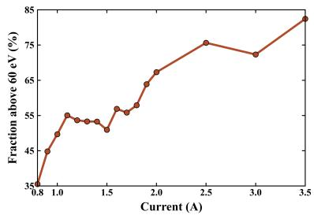
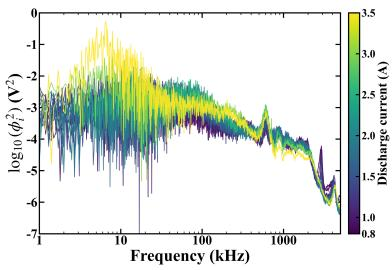
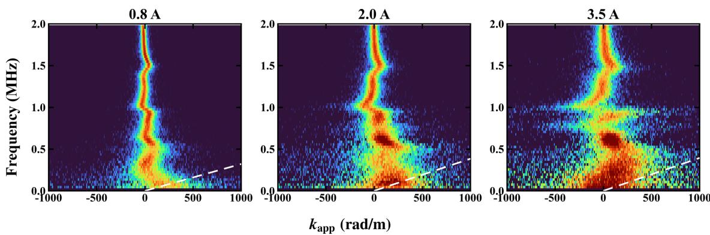
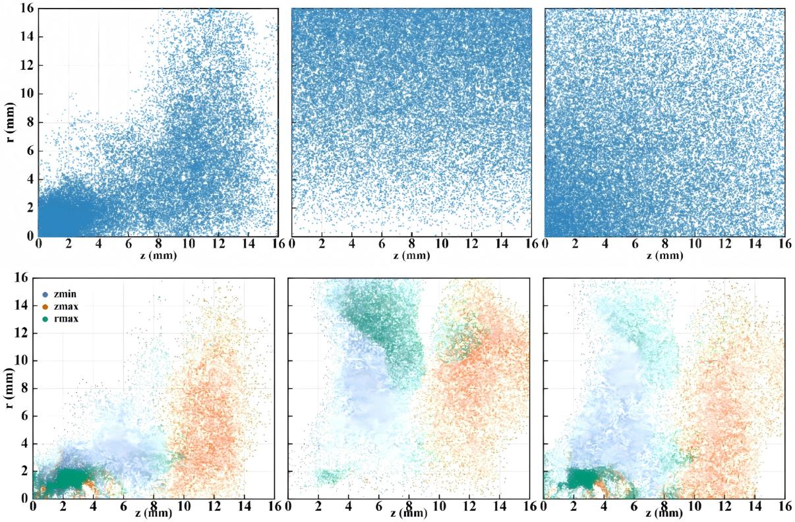
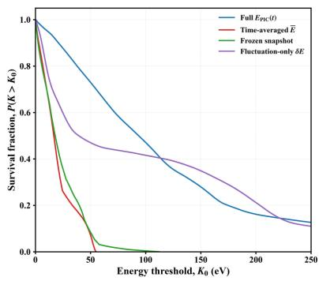
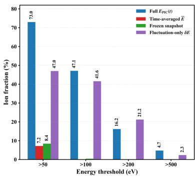
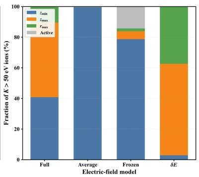
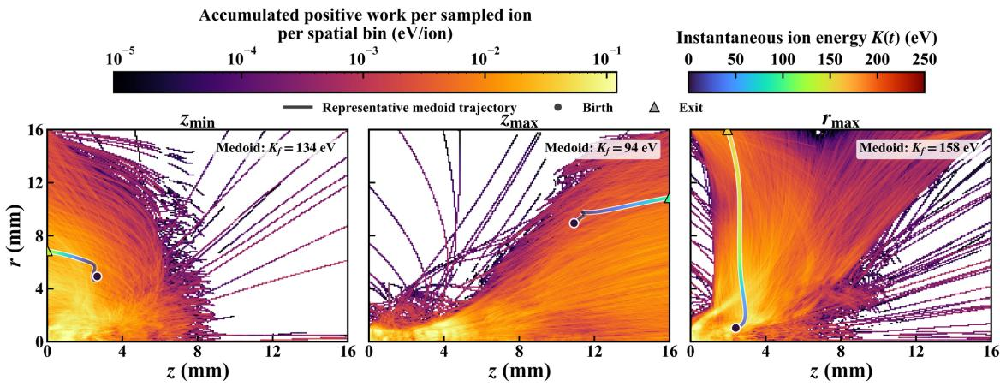

# 空心阴极羽流中高能离子的“源—轨迹—场—功”路径

> 原文：Baisheng Wang, Zilong Peng, Yinjian Zhao, and Zhongxi Ning, “Particle-resolved pathways to energetic-ion formation in a fluctuating low-current hollow-cathode plume,” arXiv:2609.10958 (2026).
>
> 来源：[arXiv 摘要页](https://arxiv.org/abs/2609.10958) · [DOI](https://doi.org/10.48550/arXiv.2609.10958) · [本地 PDF](../pdfs/Wang%20et%20al.%20-%202026%20-%20Energetic%20ions%20in%20fluctuating%20hollow-cathode%20plume.pdf)

## 一句话结论

实验确认 0.8–3.5 A 低电流空心阴极羽流里存在随电流增强的高能 Xe 离子和宽带涨落；一个代表性的二维轴对称静电 WarpX 算例进一步显示，分类到的高能流出离子主要在羽流内部电离产生，且完整时变场比平均场或冻结场更容易让指定出生队列进入高能轨迹，但该 PIC 不是具体实验工况的逐点重建，双探针也不足以把能量来源唯一归因于离子声模。

## 1. 问题与证据链

空心阴极为电推进系统提供电子并中和离子束。羽流中的高能离子会增强 keeper、阴极孔和邻近结构的溅射，但仅靠末态能谱无法回答四个粒子级问题：离子在哪里产生、哪些轨迹可达、沿途经历了怎样的时变电场、能量在何处由哪个场分量转移。

论文依次组织四层证据：

1. RPA 测能量/电荷分布，两支 Langmuir 探针测宽带密度涨落；
2. 双探针交叉相位给出受混叠限制的表观 $f-k$ 图；
3. 二维轴对称静电 WarpX 生成自洽粒子和场历史；
4. 在保存场上做源分类、被动粒子、匹配场对照和轨迹积分功分析。

这条链能讨论“给定时变场后粒子怎样增能”，但不能自动回答“是哪一种等离子体模产生了该场”。

## 2. 实验装置与诊断

### 2.1 工况与几何

阴极采用 LaB$_6$ 发射体、钽管和钨 keeper；发射体直径 3 mm，keeper 节流孔直径 0.4 mm，阴极到阳极板轴向距离 16 mm。氙流量固定为 1.5 sccm，放电电流扫描 0.8–3.5 A；点火后 keeper 电源断开并处于浮置状态。管内压力约 500–700 Pa，腔体背景压力为 $1.9\times10^{-2}$ Pa。

图中 RPA 沿径向接收离子，两探针沿轴向相隔 3 mm；蓝框是 16 mm × 16 mm 的 WarpX $r-z$ 域。实验与模拟共享的是特征尺度，而不是完全相同的边界和采样响应。

### 2.2 探针密度和电势代理

薄鞘圆柱探针近似给出

$$
n_i=\frac{i_{\mathrm{sat}}}{0.61eA_p\sqrt{eT_e/m_i}},
$$

其中 $n_i$ 单位为 $\mathrm{m^{-3}}$，$i_{\mathrm{sat}}$ 是离子饱和电流，$A_p$ 是收集面积，$T_e$ 以 eV 表示，$e$ 为元电荷，$m_i$ 为 Xe 离子质量。若相对温度涨落远小于相对密度涨落，则

$$
\frac{\widetilde i_{\mathrm{sat}}}{\overline i_{\mathrm{sat}}}
\simeq \frac{\widetilde n}{n_0},\qquad
\widetilde\phi_{\mathrm{proxy}}
\simeq T_e\frac{\widetilde i_{\mathrm{sat}}}{\overline i_{\mathrm{sat}}}.
$$

第二式中 $T_e$ 取 eV 时，$\widetilde\phi_{\mathrm{proxy}}$ 以 V 表示。这里将 MinerU 误识别的分母校正为平均饱和电流 $\overline i_{\mathrm{sat}}$。它只是相对电势涨落代理，不是瞬时绝对等离子体电势的直接测量；若 $T_e$ 也显著涨落，该近似会进一步失效。

### 2.3 RPA 能谱

四栅 RPA 的第三栅扫描 0–250 V，收集电流的负导数给出进入接收孔径的能量/电荷分布：

$$
F(E/q_i)\propto-\frac{\mathrm dI_c}{\mathrm dV_r}.
$$

论文用三次平滑样条后再求导，并将负值截为零、各条分布按自身最大值归一化。由于 RPA 不分辨电荷态，而 PIC 只有 Xe$^+$，实验横轴只按 Xe$^+$ 等效能量 $E=eV_r$ 报告。因此“60 eV 以上占比”是经过接受度、平滑、截断和归一化处理后的条件量，不是全部羽流离子的绝对能量份额。

主能量特征从低电流时约 50–60 eV 移向高电流时约 70 eV；处理后 60 eV 以上份额从约 40% 增到近 80%。同时存在数十 kHz 至 MHz 的宽带涨落，但共存本身不证明因果。

## 3. 双探针 $f-k$ 分析及其不可辨识性

令两探针间距 $\Delta x=3.0$ mm，交叉谱为 $P_{21}=X_2X_1^*$，主值相位 $\Delta\varphi=\arg P_{21}\in(-\pi,\pi]$，则

$$
k_{\mathrm{app}}=\frac{\Delta\varphi}{\Delta x},\qquad
k_{\mathrm{true}}=k_{\mathrm{app}}+\frac{2\pi n}{\Delta x},\quad n\in\mathbb Z.
$$

$k$ 的单位为 $\mathrm{rad\,m^{-1}}$。3 mm 间距给出主区间边界 $\pi/\Delta x=1.047\times10^3\,\mathrm{rad\,m^{-1}}$；因此 $k_{\mathrm{app}}\simeq0$ 只说明两信号相位模 $2\pi$ 接近，既可能是真正长波，也可能是短波混叠、空间相干成分或多模叠加。

图中虚线是冷离子、零漂移参考

$$
f_0=\frac{|k_{\mathrm{app}}|}{2\pi}\sqrt{\frac{eT_e}{m_i}},
$$

而不是完整的实验室系离子声色散关系。离子漂移没有独立测量，有限间距也无法做唯一相位展开。

没有一条连续脊线在有限 $f-k_{\mathrm{app}}$ 区间内稳定跟随声速参考。正确结论是“当前几何没有无歧义分辨出连续离子声支”，而不是“实验排除了离子声活动”。

## 4. 代表性 WarpX PIC

### 4.1 模型设置

模拟为二维轴对称、静电、动理学 WarpX：

- 域为 $16\times16$ mm，网格 $\Delta r=\Delta z=10\,\mu$m；给定 Debye 长度 $16.6\,\mu$m；
- 阴极侧/阳极 Dirichlet 电势分别 15 V/45 V，外径向边界为 Neumann，三处粒子均吸收；
- 电子参考密度 $10^{18}\,\mathrm{m^{-3}}$、温度 5 eV、1 A 规定电流对应漂移速度 $1.98\times10^6\,\mathrm{m\,s^{-1}}$；
- Xe$^+$ 温度 0.5 eV、漂移速度单独规定为 $10^3\,\mathrm{m\,s^{-1}}$；每步每种粒子注入 400 个宏粒子，权重约 $5.5\times10^4$；
- 电子—中性碰撞含弹性、激发和电离；没有 Xe$^+$–Xe 荷交换；中性氙只取固定剖面

$$
n_a(r,z)=n_{a0}\left(1+\frac{\sqrt{r^2+z^2}}{L_0}\right)^{-2},
$$

其中 $n_{a0}=10^{19}\,\mathrm{m^{-3}}$、$L_0=1.6$ cm；模拟总时长 17.7259 $\mu$s，步长 3.55 ps。

网格约为 $0.60\lambda_D$，说明作者至少按给定参考 Debye 长度解析网格；这不等于对不同时间、不同位置的最短屏蔽尺度都已做收敛证明。

### 4.2 两个不同的“高能份额”

自洽瞬时份额

$$
f_{\mathrm{SC}}(t)=\frac{N_{\mathrm{SC}}(K_i(t)>50\,\mathrm{eV})}{N_{\mathrm{SC}}(t)}
$$

与被动出生队列的条件响应

$$
f_{\mathrm{passive}}^{(s,m)}=
\frac{N_{\mathrm{passive},>50}^{(s,m)}}{N_{\mathrm{passive},0}^{(s)}}
$$

分母不同，不能直接比较。前者描述某时刻域内全部自洽离子，后者描述规定源模型 $s$、规定场模型 $m$ 下一个人为出生队列最终超过阈值的比例。论文在 $t=5.32\,\mu$s 得到 $f_{\mathrm{SC}}=11.87\%$，不应与后文 73.0% 条件份额并列当作同一物理量。

## 5. 粒子分辨结果

### 5.1 源与轨迹可达性

在 11,599 个以 $K>50$ eV 穿过下游或外径向边界的自洽离子中，11,243 个（96.93%）带有域内电离源标记，入口源仅 356 个（3.07%）。另行投放的 $5\times10^6$ 个入口分布被动离子中，只有 19 个能从下游或径向外出，支持“本算例高能外流主要由内部电离出生”的判断。

三种规定出生分布——PIC 电离事件 KDE、体积均匀、按中性密度的 $r-z$ 采样——都能进入高能轨迹，但最终超过 50 eV 的条件份额分别为 72.94%、43.79% 和 59.79%。

这证明出生位置改变不同轨迹家族的统计可达性，而不是确定每个粒子的唯一结局。第三种采样还没有乘轴对称体积权重 $2\pi r$，它是有意设置的敏感性模型，不能解释成真实三维中性气体体积源。

### 5.2 匹配场对照

作者让同一批 $10^6$ 个 KDE 初始粒子分别经历完整时变场、141 帧时间平均场、6.2395 $\mu$s 冻结场和仅涨落场。超过 50 eV 的条件份额依次为 73.0%、7.2%、8.4% 和 47.0%；完整场和仅涨落场超过 100 eV 的份额分别为 47.1% 和 41.6%。

同一初始队列消除了源分布变化，但替换场会同时改变轨迹。因此四条曲线是机制敏感性对照，不是可以相加的四种独立加速通道；仅涨落场也不是另一套自洽等离子体解。

### 5.3 轨迹积分功

无碰撞被动离子满足

$$
m_i\frac{\mathrm d\mathbf v}{\mathrm dt}=q_i\mathbf E,
\qquad
\frac{\mathrm dK_i}{\mathrm dt}=q_i\mathbf E\cdot\mathbf v
=q_i(E_rv_r+E_zv_z),
$$

积分后

$$
K_f-K_0=W_r+W_z
=\int q_iE_rv_r\,\mathrm dt+\int q_iE_zv_z\,\mathrm dt.
$$

$K,W$ 均可用 eV 表示。公式来自运动方程与速度点乘：$m\mathbf v\cdot\mathrm d\mathbf v/\mathrm dt=\mathrm d(mv^2/2)/\mathrm dt$。它既是能量账本，也是场插值和轨迹积分的一项数值一致性检查。

50–250 eV 范围内，向 $z_{\min}$ 和 $z_{\max}$ 逃逸的离子分别有 69.99% 和 88.60% 属于轴向功主导；向 $r_{\max}$ 逃逸的离子有 79.28% 属于径向功主导。图中的轨迹是各族算法选出的代表性 medoid，只能说明典型路径；总体方向性来自另做的全体 $W_r,W_z$ 统计。末态能量与净功吻合，而与停留时间不呈单调关系。

## 6. 物理解释

这项工作的核心不是给涨落命名，而是把粒子能量形成过程拆成可核查的条件链：

- **源：** 内部电离在分类到的高能外流中占主导；
- **轨迹：** 出生位置决定不同逃逸通道的可达概率；
- **场：** 时变场改变粒子经历的空间区域和相位；
- **功：** 沿实际轨迹的 $q\mathbf E\cdot\mathbf v$ 积分直接核算动能变化。

这种表述允许离子声活动、较大尺度电势结构、离化动力学和非线性耦合并存，而不会把未分辨的模式强行选成唯一原因。

## 7. 局限与证据边界

- **实验结论：** RPA 和探针确实测到高能离子与宽带涨落，但 RPA 是接收度受限的能量/电荷分布，双探针也只有一个间距。
- **模态结论：** 没有无歧义分辨连续离子声支，不等于排除离子声活动；空间混叠、漂移、离轴和间歇结构仍可能存在。
- **模拟结论：** WarpX 是代表性二维轴对称静电算例，不是 0.8–3.5 A 中某一实验点的定量复现；实验代理量与 PIC 直接电势也只按各自最大值归一化比较。
- **遗漏物理：** 自洽 PIC 没有离子—中性荷交换，中性背景不演化；三维、电磁和更长时间行为未验证。
- **被动粒子：** 只单向响应保存场，不反馈电荷，也不发生碰撞；使用 3.7259–8.7259 $\mu$s 的单一时间窗。
- **复现边界：** 本笔记验证了作者 PDF、公式、图和报告参数；没有运行 WarpX、没有重做 RPA 信号处理，也没有取得作者原始数据。

## 8. 建议精读与后续验证

1. 先读 Eqs. 5–8，建立双探针相位折叠边界；
2. 再核对 $f_{\mathrm{SC}}$ 与 $f_{\mathrm{passive}}$ 的不同分母；
3. 用图 10 与图 11 分开判断源敏感性和场敏感性；
4. 最后用功—能关系检查“停留更久所以更高能”这一朴素解释为何不成立。

更强的后续证据应包括多间距或阵列探针的相位展开、LIF/电势的空间分辨测量、含荷交换和动态中性的三维 PIC/MCC，以及按具体实验点校准边界、接受度和绝对幅值的定量闭环。
