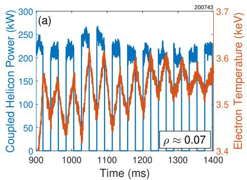
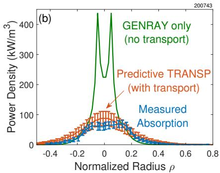
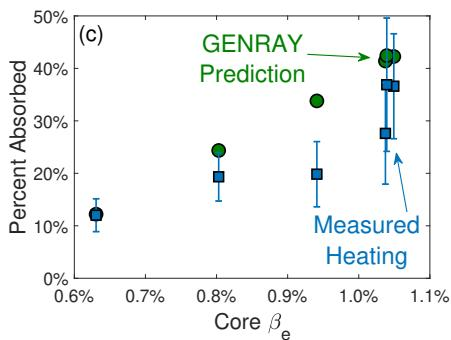
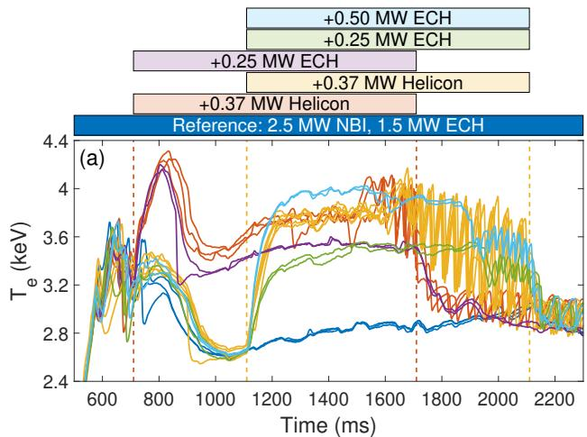
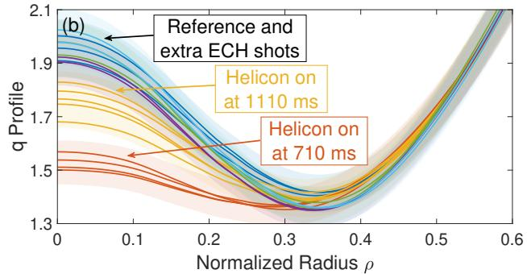
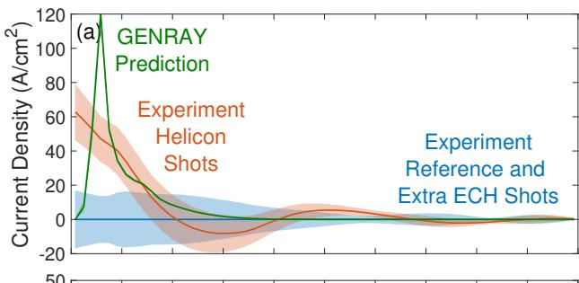
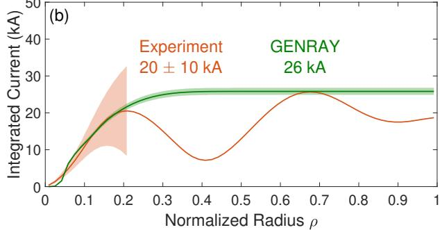

# First Experimental Evidence of Helicon Current Drive

> J. B. Lestz *et al.*，*Physical Review Letters* 接收稿，DOI: `10.1103/mbn4-fd4v`。本地全文为 2026-09-14 发布的 arXiv:2609.12474 作者稿；正文标注日期 2026-09-14。以下按论文行文顺序解释，图来自作者稿。

## 一句话结论

DIII-D 的 476 MHz 行波天线实验首次给出螺旋波电流驱动的成套实验证据：调制电子回旋辐射测得的沉积随电子比压增强，MSE 约束平衡反演得到中心电流增量 `20 ± 10 kA`，且仅加热对照不能复现相同的 q 剖面展平和锯齿提前；但电流是“总电流变化减去模型化已知电流”的残差，不是直接电流传感器读数，单侧天线也未完成传播方向反转检验。

## 1. 为什么需要 helicon current drive

稳态托卡马克必须在尽量少消耗循环功率的条件下维持等离子体电流。传统低杂波电流驱动在高密度、强磁场反应堆参数下会受到可达性和阻尼位置限制；论文所说的 helicon 是高频快波分支，可由较小的平行折射率进入等离子体，并通过电子朗道阻尼把平行动量交给电子。

共振条件写成

$$
v_{\parallel,\mathrm{res}}=\frac{\omega}{k_\parallel}
=\frac{c}{n_\parallel},
$$

其中 $\omega$ 是射频角频率，$k_\parallel$ 是沿磁场方向的波数，$n_\parallel=k_\parallel c/\omega$。本实验发射的 $n_\parallel\simeq 3$，对应相速度约为 $c/3$。电子分布在这一速度附近的斜率决定吸收和净动量传递：共振电子被波加速，碰撞再把速度空间中的非对称性转成宏观电流。

反应堆尺度计算通常预期电子比压足够高时有更强的单程吸收。论文采用的量为

$$
\langle\beta_e\rangle=2\mu_0\left\langle\frac{n_eT_e}{B^2}\right\rangle,
$$

其中 $n_e$、$T_e$ 分别为电子密度和温度，$B$ 是磁场，$\mu_0$ 是真空磁导率，尖括号表示体积平均。物理上，$\beta_e$ 把电子热压和磁压比较；更高温电子使 $v_\parallel\sim c/3$ 附近有更多粒子可共振。作者强调，面向反应堆的预测多位于 $\langle\beta_e\rangle\gtrsim2\%$，而本实验是在低比压 L 模放电上完成的原理验证。

## 2. DIII-D 天线、放电和“排除低杂波”的设计

系统使用 476 MHz、1.2 MW 速调管驱动 30 模块 comb-line traveling-wave antenna。天线约 `1.5 m`（环向）× `0.2 m`（极向），安装在中平面上方约 `35°`，模块相对磁力线倾斜约 `14°`，以减弱直接激发慢波。实际最多约 `700 kW` 耦合进装置。

目标放电为 L 模：等离子体电流 `0.85–1.1 MA`，环向磁场 `1.9–2.0 T`，线平均电子密度约 $2\times10^{19}\,\mathrm{m^{-3}}$，轴上电子温度约 `3–4 keV`；辅助加热包括 `2.3 MW` 中性束和 `0.2–1.5 MW` 电子回旋加热。

这个密度选择同时构成一项机制排除：476 MHz 的慢波在 $\rho<0.6$ 区域倏逝，因此不能用核心低杂波电流驱动解释后续观测。这里 $\rho$ 是归一化环向磁通半径，$\rho=0$ 在磁轴，$\rho=1$ 近似对应边界。

## 3. 调制加热怎样定位功率沉积

作者把 helicon 功率以 `23 Hz` 方波调制，再用多通道电子回旋辐射（ECE）测量局部 $T_e$ 对调制的相干响应。相对直接比较“开波/关波”温度，调制方法能把缓慢漂移和不相干涨落压低。

复响应振幅由功率与温度的交叉谱估计：

$$
\widehat{\delta T_e}
=\operatorname{Im}\!\left[\langle \widehat P^{\,*}\widehat T_e\rangle\right]
\frac{|\widehat P|}{\langle\widehat P^{\,*}\widehat P\rangle}.
$$

$\widehat P$ 和 $\widehat T_e$ 是调制频率处的傅里叶分量，星号表示复共轭，角括号表示多周期平均。取正交分量可减小与方波开关同步但不代表局部热响应的成分。正文只保留超过 `95%` 显著性阈值的相干信号。

在“零输运”近似下，调制能量方程给出局部沉积功率密度

$$
S(\rho)\simeq\frac{3\pi}{4}\,\omega_m n_e(\rho)
\widehat{\delta T_e}(\rho),
$$

其中 $\omega_m=2\pi\times23\,\mathrm{s^{-1}}$ 是调制角频率。因电子内能密度约为 $3n_eT_e/2$，方波基频和相位关系带来 $3\pi/4$ 系数。直觉上，局部温度摆幅越大、密度越高、调制越快，为维持这一摆幅所需的局部功率越大。

这一反演故意忽略径向热输运，所以它不是严格的吸收功率计。热扩散会把峰值摊宽并改变相位，零输运公式可低估或错置真实沉积。

GENRAY 给出较集中的射线沉积；把同一射频源项送入预测型 TRANSP，并分别使用 MMM、TGLFNN SAT1/SAT3 等输运模型后，预测温度响应明显变宽，包围了多数实验点。这说明图 1a/b 的宽剖面不能直接解读成“波本身在很宽区域吸收”，输运卷积不可忽略。

## 4. 比压扫描：吸收趋势与绝对效率不是一回事

作者改变电子回旋加热，使核心 $\beta_e$ 约从 `0.6%` 增至 `1.1%`。GENRAY 的首程吸收随之大约从 `10%` 增至 `45%`；ECE 调制推断的沉积也同向增强。

这张图建立的是“随比压增强”的趋势证据，不是已标定的总耦合效率。实验值受 ECE 标定、调制相位、密度剖面和忽略输运影响；论文示例中测得的吸收功率量级约 `100 kW`，不能据此把 `370–700 kW` 天线功率直接换算成普适效率。

## 5. 用加热匹配对照分离电流驱动效应

电流驱动实验比较三类放电：helicon 沿等离子体电流方向发射、无 helicon 的参考放电、以及用额外 ECH 匹配电子加热但不注入相同平行动量的对照放电。helicon 和加热对照都能使中心 $T_e$ 上升约 `1 keV`，因此若只有 helicon 放电改变 q 剖面，解释就不能只停留在“电子变热、电阻下降”。

helicon 放电在约 `1500–1600 ms` 出现锯齿；对照放电在所比较时窗内没有，或到约 `1900–2000 ms` 才出现。锯齿本身不是电流计，但它对核心磁剪切与 $q=1$ 面敏感，因此为中心电流重分布提供独立的定性线索。

Motional Stark Effect（MSE）偏振角约束磁场方向，EFIT 再把磁测量、压力和 MSE 共同反演为平衡及 q 剖面。helicon 放电的核心 q 剖面比加热匹配对照更平，和提前出现锯齿相互印证。

## 6. `20 ± 10 kA` 是怎样得到的

实验不能直接把总平行电流中的 helicon 分量单独测出来。作者构造差分残差：

$$
J_H=\Delta J_\parallel-\Delta J_{\mathrm{Ohm}}
-\Delta\!\left(J_{\mathrm{BS}}+J_{\mathrm{NB}}+J_{\mathrm{EC}}\right).
$$

$\Delta J_\parallel$ 来自 MSE 约束 EFIT 的总平行电流差；$J_{\mathrm{Ohm}}$、$J_{\mathrm{BS}}$、$J_{\mathrm{NB}}$、$J_{\mathrm{EC}}$ 分别是欧姆、bootstrap、中性束和电子回旋驱动电流。TRANSP 使用 Sauter bootstrap、NUBEAM 和 TORAY-GA 计算后三项。

欧姆项的核心关系为

$$
J_{\mathrm{Ohm}}=\sigma E_\parallel,
\qquad \sigma\propto\frac{T_e^{3/2}}{Z_{\mathrm{eff}}},
\qquad E_\parallel\propto\frac{\partial\psi}{\partial t}.
$$

电子变热会提高电导率 $\sigma$，因此必须从总电流差中扣掉加热造成的欧姆电流变化。$Z_{\mathrm{eff}}$ 取近似平坦的 `2–2.4`，给总 helicon 电流约 `1 kA` 的不确定度，远小于最终 `±10 kA` 误差带；更主要的不确定度来自平衡反演和各已知电流模型。

作者只把积分推进到 $\rho\simeq0.2$，因为更外侧 EFIT 差分开始出现非物理振荡。该区域内实验得到

$$
I_H=20\pm10\ \mathrm{kA}.
$$

GENRAY 给出同一区域约 `21 kA`、首程总电流约 `26 kA`；若理想化地让未吸收功率多程完全吸收，上限约 `50 kA`（对应 `370 kW` 发射功率）。实验与首程预测的一致性支持 helicon 解释，但数据不能区分“功率没有完全吸收”和“单位吸收功率的驱动效率较低”。

## 7. 证据链、适用边界与可复现线索

这篇论文的证据链是：慢波核心截止排除常规低杂波解释 → 调制 ECE 看到与 helicon 功率相干的局部加热 → 比压扫描符合朗道阻尼增强趋势 → 加热匹配对照仍不能复现 q 剖面变化 → MSE/EFIT 总电流差扣除已知项后与 GENRAY 量级相符。多种可观测量相互支持，比只比较一条电流曲线更可信。

仍需保留以下边界：

- 电流是平衡重建和模型扣除后的残差，不是直接测量；系统误差可能相关。
- 当时只有天线一侧工作，无法通过反转 $k_\parallel$ 检查电流符号是否随波传播方向反转。
- 比压远低于反应堆设想，且是 L 模 proof-of-principle；反应堆效率仍是理论外推。
- GENRAY、TRANSP、EFIT、NUBEAM 与 TORAY-GA 均未在本仓库本地重跑，本笔记只解释作者报告的实验和建模链。
- 论文没有给出可脱离装置、频率、$n_\parallel$、温度与密度剖面的通用 `A/W` 电流驱动效率。

对后续实验，最有判别力的升级是恢复双向天线并做 $k_\parallel$ 反转、提高 $\beta_e$ 接近反应堆相关区间、联合输运反演而非零输运近似，并把射频耦合、单程/多程吸收和电流驱动效率分别标定。
