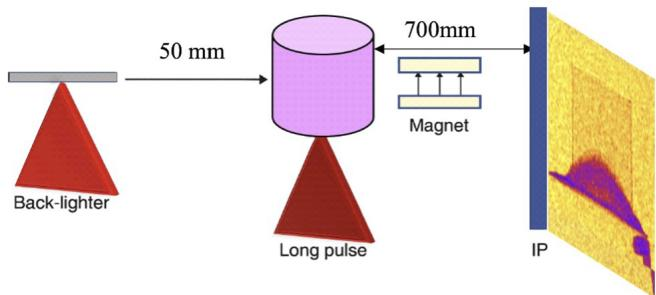
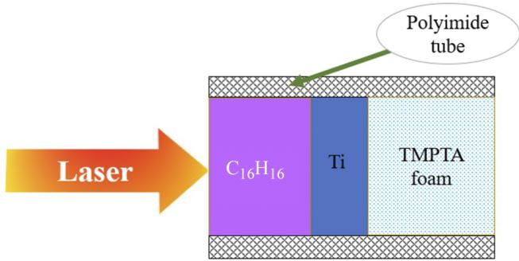
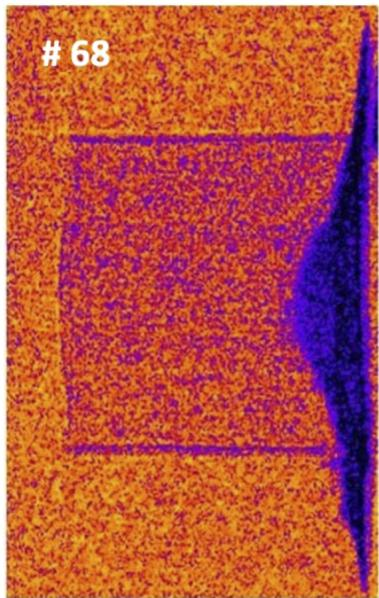
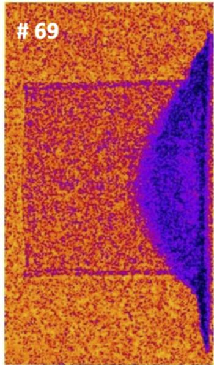
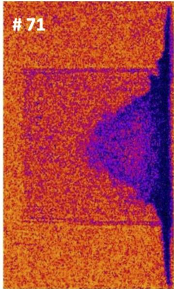
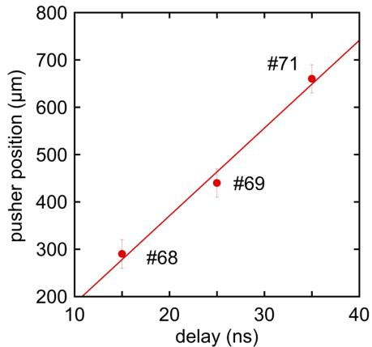
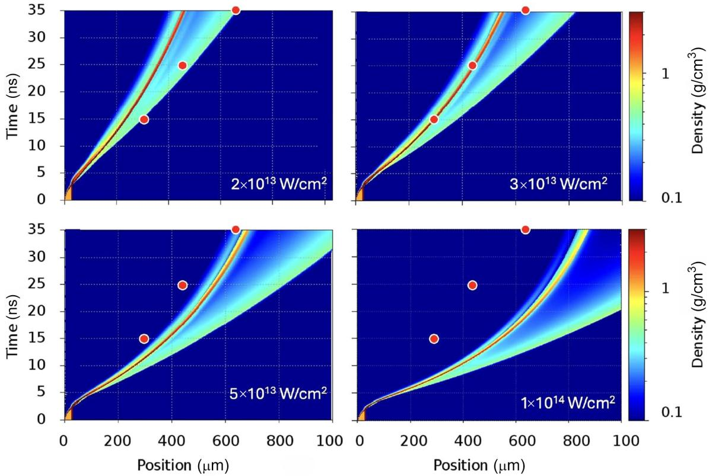
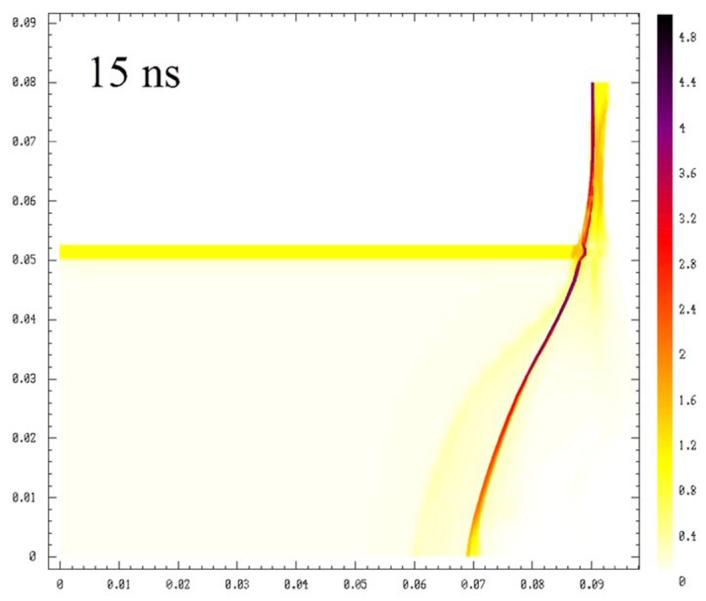
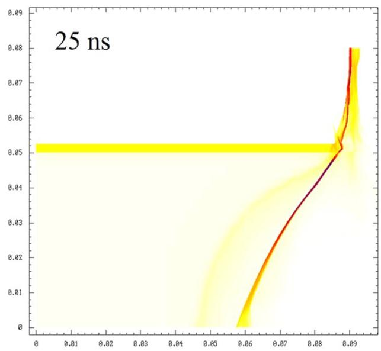
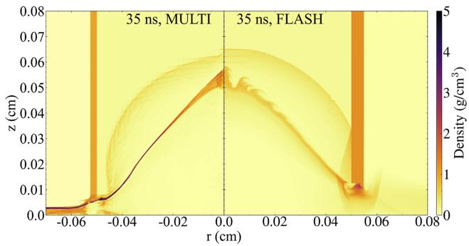

# Laser-driven shock wave propagation in low-density foam targets investigated by time-resolved X-ray radiography and hydrodynamic simulations

> Olena Turianska *et al.*，*High Power Laser Science and Engineering* 14, e77 (2026)，2026-09-11 在线发表，DOI: `10.1017/hpl.2026.10174`。以下按论文顺序解释实验、MULTI/FLASH 模拟与合成照相；图来自正式开放获取 PDF。

## 一句话结论

Vulcan 长脉冲激光驱动 Ti 推动层进入 `0.1 g/cm³` TMPTA 泡沫，8 keV 附近的时间分辨 X 射线照相在 `15/25/35 ns` 跟踪到推动层和冲击波，推动层平均速度为 `18.5 ± 2 km/s`；一维/二维 MULTI 与二维 FLASH 能在有效强度 `(3–5)×10¹³ W/cm²` 下复现实验量级，并支持“此条件下纵向动力学近似准一维”，但有效强度是用推动层轨迹反推的模型参数，不是独立测得的激光—靶耦合效率，均匀介质近似也不能外推到直接照射的欠临界泡沫。

## 1. 研究问题：泡沫中的冲击为何需要直接看见

低密度泡沫可用于惯性约束聚变、冲击整形、辐射输运和实验室天体物理。其宏观响应同时受平均密度、孔径、推动层、壁面约束和能量沉积方式控制。只测靶后速度难以判断冲击和推动层是否分离；时间分辨 X 射线照相可以在靶内直接定位二者，为流体模拟提供时空约束。

作者关注的是一种被推动层隔开的过临界泡沫：激光先烧蚀 parylene，Ti 层作为 piston 压缩泡沫。它和激光直接进入、在孔隙尺度沉积能量的欠临界泡沫不是同一物理问题。

## 2. Vulcan 实验、背光和成像标定

实验在 Vulcan Nd 激光设施进行。长脉冲束使用二倍频 `527 nm`，脉宽 `2 ns`，典型总能量约 `550 J`。随机相位板把焦斑整形成近高斯分布，强度半高全宽约 `400 μm`，由能量与焦斑估算的名义峰值强度为 $10^{14}\,\mathrm{W/cm^2}$ 量级。

短脉冲背光束为约 `1 ps`、`50 J`，聚焦到约 `50 μm` 的 `10 μm` Cu 丝，强度约 $10^{18}\,\mathrm{W/cm^2}$，产生约 `8 keV` 的 Cu Kα 线和更硬的轫致辐射。背光源到靶约 `50 mm`，靶到成像板约 `700 mm`，几何放大约 `14`。磁铁偏转高能电子，减少成像板上的非 X 射线背景。

用 `50 μm` 周期 Cu 网格标定后，靶平面的采样约为 `3.9 μm/pixel`；边缘扩展函数的 `10%–90%` 宽度给出约 `15 μm` 有效空间分辨率。BAS-MS 成像板在曝光后 `15–35 min` 扫描，作者没有额外进行 fading 修正，因此不同发次的绝对灰度不宜被解读成高精度透射率标定。

## 3. 靶结构与推动层的作用

靶是直径 `1.05 mm`、高 `1 mm`、壁厚 `5 μm` 的聚酰亚胺圆管，内部填充密度 `0.1 g/cm³`、孔径约 `1–4 μm` 的 TMPTA 泡沫。入射端依次为 `25 μm` parylene 烧蚀层和 `5 μm` Ti 推动层。

Ti 层有两个作用：一是把激光烧蚀压力转换为较平整的机械冲击；二是屏蔽泡沫免受激光、软 X 射线和热电子的直接预热。因此，后续把泡沫视作均匀低密度材料的近似比直接激光照射场景更合理。

## 4. 时间分辨照相直接看到了什么

三幅图展示推动层向泡沫内部移动，冲击前沿位于其前方。Ti 的面密度高、吸收边界清晰，因此推动层位置比冲击前沿更稳健；冲击只造成泡沫密度的有限改变，定位更受背光非均匀、散粒噪声和管壁结构影响。

作者把推动层位置的不确定度估为约 `30 μm`。关键发次在 `15/25/35 ns` 提供时间序列，其中 35 ns 发次的推动层位置约为 `660 ± 30 μm`。

对位置—时间关系做线性拟合得到推动层速度

$$
u_p=18.5\pm2\ \mathrm{km/s}.
$$

这是一段有限时间窗内的平均传播速度。它不是未受扰动 Ti 箔的自由面速度，也不是冲击前沿速度；后两者在稀疏波、泡沫压缩和界面混合存在时并不相同。

## 5. 一维 MULTI：为什么模拟需要更低的“有效强度”

MULTI 一维辐射流体模拟采用 `2 ns` 高斯时间脉冲、SESAME 状态方程和输运表。TMPTA 没有专用表时，作者用降密度聚苯乙烯 SESAME 7590 表表示均匀泡沫，并把激光强度作为扫描参数。

实验推动层轨迹与 `(3–5)×10¹³ W/cm²` 的模拟最接近，比由入射能量和焦斑估算的名义峰值低约 `4–6` 倍。这个差异可能综合包含反射、非理想焦斑、入射几何、横向损失和一维模型简化；因为没有独立测量到达靶面的时空强度与吸收份额，不能直接称为 `1/4–1/6` 的耦合效率。

驱动脉冲结束后，烧蚀面发出的稀疏波逐渐追上推动层，使 Ti 密度从冷态约 `4.5 g/cm³` 降到 `2–3 g/cm³`。在后期，模拟推动层速度约 `18 km/s`；冲击前沿压力约 `1 Mbar`，推动层后方泡沫压力低于约 `0.5 Mbar`。

## 6. 高斯焦斑为何产生更宽的速度分布

横向强度近似为

$$
I(r)=I_0\exp\!\left(-\frac{4\ln2\,r^2}{D^2}\right),
$$

其中 $I_0$ 是轴上峰值，$r$ 是离轴半径，$D$ 是强度 FWHM。激光烧蚀标度给出 $P_a\propto I^{2/3}$，而活塞速度量级 $u\propto\sqrt{P_a}$，所以

$$
u(r)\propto I(r)^{1/3}
=u_0\exp\!\left(-\frac{4\ln2\,r^2}{3D^2}\right).
$$

指数分母多出一个 3，故速度分布的 FWHM 约为强度焦斑的 $\sqrt3$ 倍。物理直觉是：压力和速度对强度都是次线性响应，因此焦斑边缘的速度下降没有光强那么快，推动层会比光斑显得更宽和平坦。

## 7. 二维 MULTI：什么时候可以说“准一维”

二维 MULTI 使用 `400 μm` 高斯焦斑。模拟出现横向膨胀和弯曲，但中心区域推动层与冲击的纵向位置仍接近对应一维结果。这里的“准一维”只表示所测中心轴纵向动力学在当前管径、焦斑、推动层和时间范围内对横向效应不太敏感；它不表示整个流场是一维，也不排除管壁附近的二维结构。

## 8. 合成 X 射线照相：从密度场到灰度图

轴对称近似下，穿过靶的透射可写成 Abel 型线积分：

$$
I(y,r)=I_0\exp\!\left[
-2\int_0^a \mu\rho(r',y)
\frac{r'\,dr'}{\sqrt{r'^2-y^2}}
\right],
\qquad a=\sqrt{R^2-y^2}.
$$

$I_0$ 是入射强度，$\rho$ 是模拟密度，$\mu$ 是 NIST 衰减系数，$R$ 是靶的外部尺度；根号分母来自圆柱几何的弦长投影。指数就是沿视线积分的光学厚度，密度或质量衰减系数增大都会降低透射。

作者分别用有效单能 `8/40/50 keV` 生成图像，并人为加入与实验观感相近的噪声。高能光子更容易穿透 Ti，推动层与泡沫结构的相对对比更接近实验。这说明真实背光不仅有 Cu Kα，也含较硬轫致辐射；但单能扫描加经验噪声并不是背光谱反演，也没有形成带统计似然的探测器响应标定。

## 9. FLASH 交叉比较说明了什么

作者还用二维 Eulerian FLASH 在 `5×10¹³ W/cm²` 下计算 35 ns 状态。FLASH 与 Lagrangian MULTI 对中心轴的推动层和冲击位置给出相近结果，但 FLASH 在管壁附近显示更强横向膨胀和小尺度结构。差异部分来自网格表述、界面处理和数值扩散。

两套代码对主要纵向尺度的一致性提高了结论稳健性，却不等同于对真实孔隙微结构的验证：二者都把泡沫当连续均匀介质，也共享若干材料与输运近似。

## 10. 阻抗匹配的数量级直觉

论文用弱冲击、相同比热比的阻抗匹配关系估算从 Ti 到泡沫的压力传递：

$$
P_{\mathrm{foam}}\simeq
\frac{4\rho_{\mathrm{foam}}P_{\mathrm{Ti}}}
{\left(\sqrt{\rho_{\mathrm{foam}}}+\sqrt{\rho_{\mathrm{Ti}}}\right)^2}
.
$$

当 $\rho_{\mathrm{foam}}\ll\rho_{\mathrm{Ti}}$ 时，前面的系数远小于 1，说明高密度推动层的压力只有一部分传入低密度泡沫；这解释了 Ti 后方和泡沫冲击区压力差的量级。实际冲击并不严格满足弱冲击与相同 $\gamma$，所以该式应作为物理直觉和数量级估算，而不是精密状态方程替代品。

## 11. 证据边界与复现实验时最该保留的量

本文最坚实的实验量是成像几何标定、推动层位置及其速度；冲击位置和压力更依赖图像识别与流体模型。`(3–5)×10¹³ W/cm²` 是通过匹配轨迹得到的有效强度，`~1 Mbar` 则来自模拟，不是独立压力计读数。

均匀泡沫近似适用于这套“推动层隔离、过临界、孔径远小于整体冲击尺度”的条件。对激光直接进入欠临界泡沫、孔隙引发局部热斑、辐射热波或非局域电子输运的情形，不能直接沿用本文结论。

本仓库没有重跑 MULTI、FLASH、SESAME 状态方程或原始成像板数据，也没有重新拟合 X 射线谱。若要复现，应至少记录逐发激光时空分布、背光谱、成像板响应与 fading、靶密度/孔径统计、推动层厚度，以及图像定位算法；随后分别报告实验测量、合成诊断和模拟反演，避免把三者合并成单一“测得压力”。
