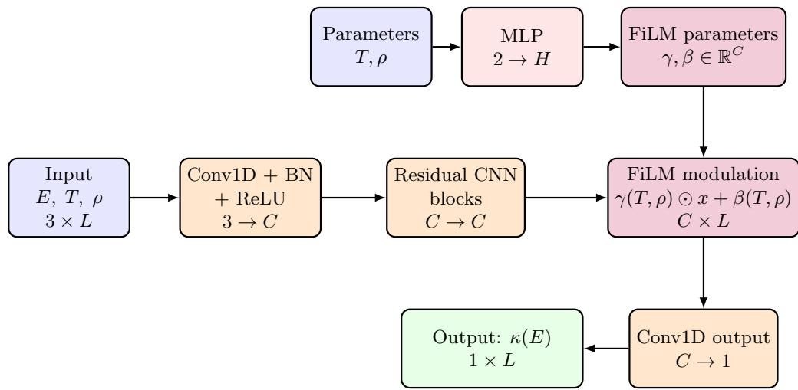
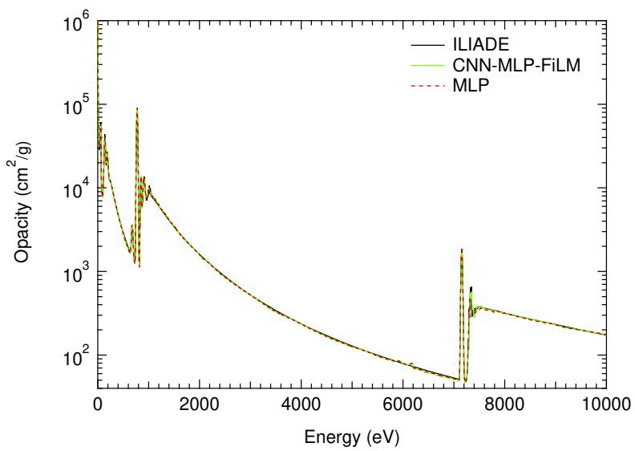
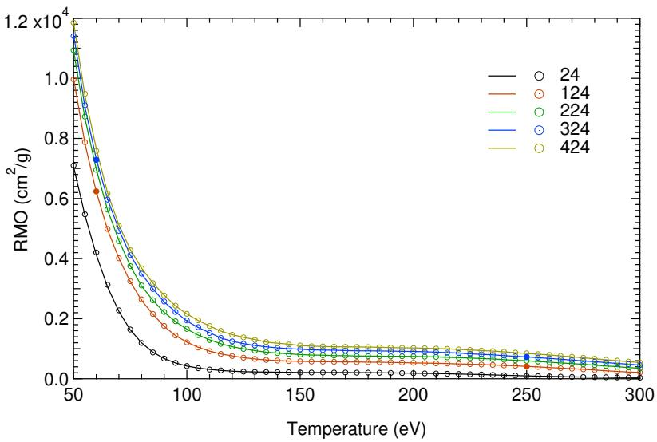
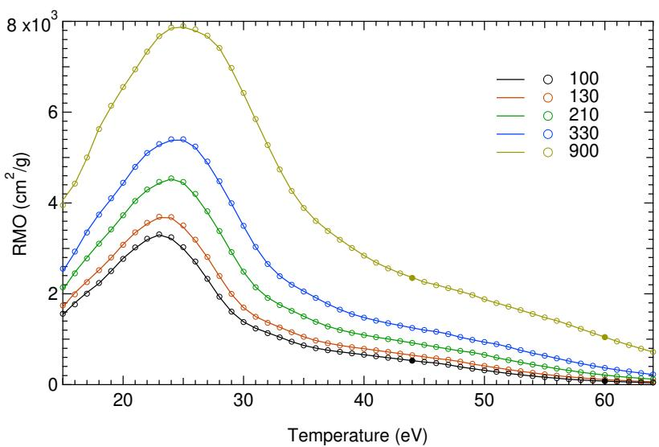

# Opacity predictions in plasmas under stellar conditions using deep learning

> Djamel Benredjem 与 Jean-Christophe Pain，*Physical Review E* **114**, 015204，DOI `10.1103/f237-bqz2`，正式发表 2026-07-06；本地全文为 arXiv:2609.13252 v1 作者稿（2026-09-05 提交，并在 2026-09-15 的目标等离子体分类中交叉列出）。以下按正文顺序解释；图来自本次 MinerU 转换。它不是 9 月新发表论文，而是本仓库此前未入库、此次由交叉列表发现的正式论文。

## 一句话结论

论文以原子物理代码 ILIade 生成的 Fe/Ni LTE 不透明度为监督数据，训练 MLP 和一维 CNN–MLP–FiLM 模型预测 `0–10000 eV` 光谱及 Rosseland/Planck 平均不透明度。模型在训练/测试参数域内大体复现同一代码族输出，平均不透明度的报告 MARE 多在 $10^{-3}$ 量级；但 Ni 高温 L/M 壳层因跃迁数迅速增加而明显更难，论文也没有跨原子代码、实验或 OOD 验证，更没有包含训练数据生成和训练成本的端到端加速基准。

## 1. 不透明度问题与证据目标

辐射不透明度连接原子结构、辐射输运和流体能量方程。在恒星内部、惯性约束聚变和高能量密度等离子体中，需要在温度 $T$、质量密度 $\rho$ 和光子能量 $E$ 的大网格上重复计算。高保真原子模型在壳层跃迁密集时成本很高，作者希望用神经网络代理 ILIade 输出。

总质量吸收系数写为

$$
\kappa(E;T,\rho)=
\kappa_{\mathrm{bb}}+
\kappa_{\mathrm{bf}}+
\kappa_{\mathrm{ff}}+
\kappa_{\mathrm{scat}},
$$

四项分别是束缚—束缚、束缚—自由、自由—自由与散射贡献，单位为 $\mathrm{cm^2\,g^{-1}}$。神经网络并不重新求解这些微观过程，而是学习 ILIade 已计算好的映射 $(E,T,\rho)\mapsto\kappa$。

## 2. ILIade 数据的物理近似

ILIade 使用平均原子、超组态和统计跃迁阵列等模型处理大量能级与跃迁，并在 Wigner–Seitz 球中求有限温、相对论 Pauli 方程和交换—相关势。论文的训练目标继承这些近似；代理即使与 ILIade 完全一致，也只说明“数值仿真器仿真”成功，不会自动修正原子模型缺失，也不构成对 Z-pinch 或激光等离子体实验的验证。

数据范围为：

- Ni：`2000` 条光谱，$T=15\text{--}64\,\mathrm{eV}$，$\rho=1\text{--}1000\,\mu\mathrm{g\,cm^{-3}}$；
- Fe：`1275` 条光谱，$T=50\text{--}300\,\mathrm{eV}$，$\rho=4\text{--}484\,\mathrm{mg\,cm^{-3}}$；
- 每条光谱约含 $10^4$ 个 `0–10000 eV` 能点。

Fe 与 Ni 的密度范围和典型等离子体状态并不相同，不能直接把两个数据集的误差作元素难度的无条件横向排名。

## 3. 为什么同时看光谱和平均不透明度

Planck 平均是按黑体谱加权的算术平均：

$$
\kappa_P(T)=
\frac{\int_0^\infty \kappa_\nu B_\nu(T)\,\mathrm d\nu}
{\int_0^\infty B_\nu(T)\,\mathrm d\nu}.
$$

Rosseland 平均是按温度导数加权的调和平均：

$$
\frac{1}{\kappa_R(T)}=
\frac{\int_0^\infty \kappa_\nu^{-1}
\frac{\partial B_\nu}{\partial T}\,\mathrm d\nu}
{\int_0^\infty \frac{\partial B_\nu}{\partial T}\,\mathrm d\nu}.
$$

$B_\nu$ 是 Planck 函数。$\kappa_P$ 更受强吸收峰影响；$\kappa_R$ 因为对 $1/\kappa_\nu$ 加权，对透明窗口和谷底特别敏感。因此一条光谱在峰顶看似很接近，仍可能在 Rosseland 平均上产生偏差。论文分别训练光谱代理和平均量代理，没有声称平均量一定由预测光谱积分得到。

## 4. MLP 基线与壳层分区

最简单的 MLP 输入归一化后的 $E$、$T$、$\rho$，输出对数或缩放后的不透明度。对 Fe，低能 L/M 壳层区域较容易拟合，但 K 壳层约 `7300–8300 eV` 的窄峰更难；单一 MLP 会平滑或错置局部结构。

作者因此把低能 L/M 区与高能 K 区分开处理，并引入一维卷积，让模型沿能量轴提取局部峰形。分区是一种利用已知原子结构尺度的归纳偏置，不是纯黑箱自动发现所有壳层。

## 5. CNN–MLP–FiLM 怎样加入温度与密度条件

主干一维 CNN 接收能量网格和条件特征，MLP 则从 $(T,\rho)$ 生成 FiLM 参数。对中间特征 $h$，调制为

$$
\widetilde h_c(E)=
\gamma_c(T,\rho)h_c(E)+\beta_c(T,\rho),
$$

$c$ 是通道索引。直觉上，卷积负责识别“峰和边在哪里”，$\gamma$、$\beta$ 负责根据等离子体状态改变各类特征的强弱与基线。相比把 $T$、$\rho$ 只在输入层拼接，FiLM 能在深层反复注入条件信息。

## 6. 光谱结果：Fe 较稳，Ni 高温区是难点

Fe 测试例中，两类网络能跨越多个数量级追踪连续背景，混合模型对 K 壳层峰的保持更好。图线在对数坐标上重合不代表每个峰位和峰面积都精确，尤其是窄线结构。

Ni 在 `44–60 eV` 的 L/M 壳层更困难。温度上升时可访问的电离态和跃迁迅速增多，光谱细结构的组合复杂度增加。论文明确报告，`60 eV` 附近两种模型都出现更明显偏差。因此“ML 对所有温密度都高精度”不成立；高温 Ni 是作者自己展示的失败窗口。

## 7. 平均不透明度结果与误差口径

作者为平均量训练独立的一维 CNN。报告表格中的平均相对绝对误差（MARE）大多约为 $1.5\times10^{-3}$ 到 $3.5\times10^{-3}$；在完整 Ni 网格上，Rosseland 平均的最大相对误差可达约 $8.98\times10^{-2}$。训练损失量级约 $2.6\times10^{-6}$ 到 $6.2\times10^{-6}$。

若 $y_i$ 是 ILIade 参考、$\hat y_i$ 是预测，MARE 可理解为

$$
\mathrm{MARE}=
\frac{1}{N}\sum_{i=1}^N
\left|\frac{\hat y_i-y_i}{y_i}\right|.
$$

均值很小并不能排除局部最坏点接近 `9%`。而且这些误差衡量的是对同一生成器数据的插值，不包含 ILIade 对真实等离子体的模型误差、实验误差或不同原子代码间系统差异。

## 8. 速度结论应怎样读

正文强调训练后的推理比逐次原子计算快，生成单条训练光谱最多需数十分钟，而平均量样本约数分钟。这个方向合理，但论文没有给出足够完整的统一硬件 wall-clock 表，也没有把

$$
T_{\mathrm{total}}
=T_{\mathrm{table}}+T_{\mathrm{training}}
+N_{\mathrm{query}}T_{\mathrm{inference}}
$$

与直接计算在相同硬件上系统比较。因此不能从单次推理速度直接推出端到端“节省多少”。只有当查询次数 $N_{\mathrm{query}}$ 足够大，离线制表和训练成本才能被摊薄。

对辐射流体代码，真正有价值的指标还包括内存、批量吞吐、误差对辐射能流/冲击位置的传播，以及模型在时间步访问到训练域边缘时的稳定性；这些本文尚未闭合。

## 9. 证据边界与后续复现

- **正式性**：论文已于 2026-07-06 正式发表于 PRE；本地保存的是对应 arXiv 作者稿，不是出版社排版 PDF。
- **数据来源**：全部监督标签来自 ILIade，没有新的不透明度实验，也没有跨代码盲测。
- **物理范围**：聚焦 LTE 条件；摘要提到 NLTE 计算成本，但不能把本结果写成已验证的 NLTE 代理。
- **泛化范围**：结果主要是指定 Fe/Ni 温密度网格内插值；没有证明外推到其他元素、不同能量网格或训练域外。
- **速度边界**：作者报告快速推理，但缺少完整硬件与端到端成本表，不能给出可审计的统一加速倍数。
- **本地验证**：本仓库未获得训练数据、权重或代码，没有复训、推理或误差复算。

可复现工作的最低清单应包括：公开 ILIade 输入与版本、数据划分、归一化、网络层数/通道数、损失权重、随机种子和完整训练配置；随后用不同原子代码或公开实验谱做盲测，并在辐射输运或辐射流体方程中检查 surrogate 误差如何传播到可观测量。只有做到这一步，才能从“复现教师模型”推进到“可用于物理预测”。
