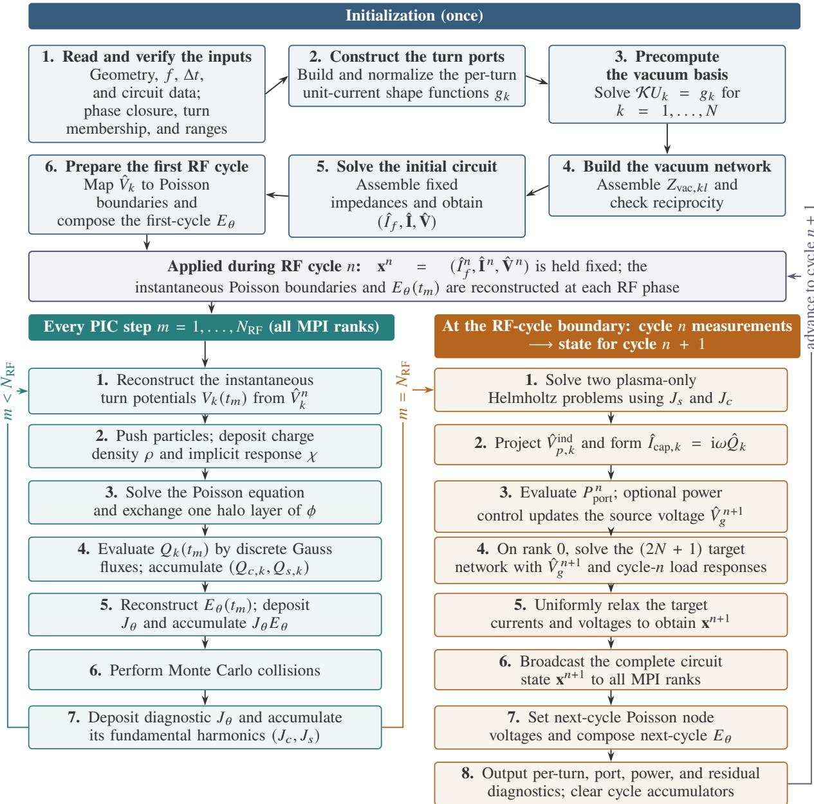
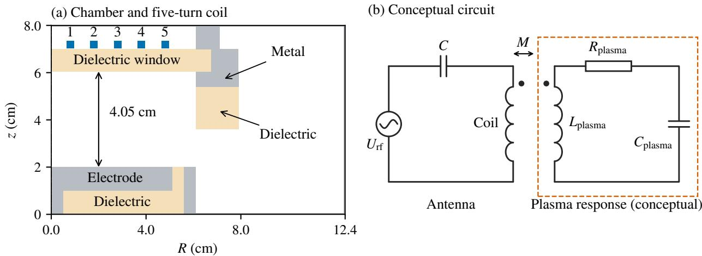
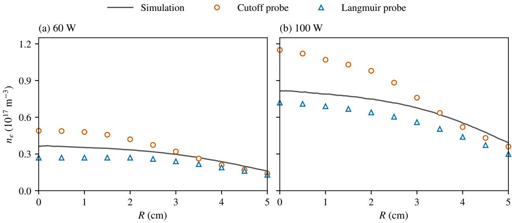
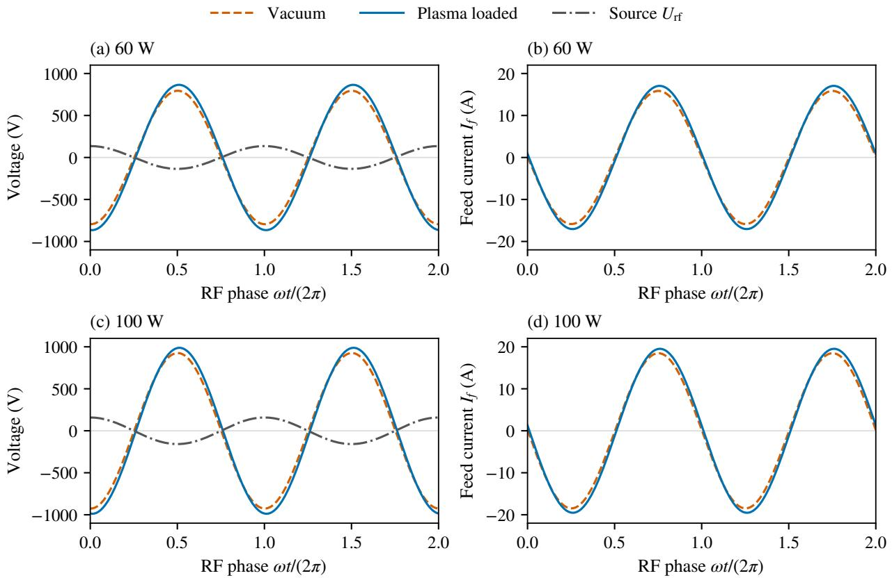

# A self-consistent phasor–PIC algorithm for bidirectional inductive–capacitive coupling in ICPs

> Zhaoyu Chen *et al.*，arXiv:2609.15043 v1，2026-09-14。本文是 39 页预印本，提出低温感应耦合等离子体（ICP）的 PIC/MCC—分布式射频电路耦合算法。以下按正文顺序解释；图来自本次 MinerU 转换。本仓库没有作者代码，未本地运行算法或复算基准。

## 一句话结论

论文把二维轴对称、direct-implicit PIC/MCC 与包含每匝线圈电流和电位的复数网络联立：真空单位电流场预计算成互阻抗矩阵，等离子体感应场投影为反电动势；导体表面电荷由同一个 Poisson 离散通量计算，其基频给出位移电流。算法在无粒子线性基准中达到约二阶收敛，并在 GEC 反应器算例中得到 `0.4–0.5%` 功率平衡残差；但更新仅每个 RF 周期一次、只保留基频、使用轴对称和局部集肤电阻，GEC 比较也主要是作者模拟与历史密度数据，不等于三维硬件闭环验证。

## 1. 为什么固定线圈电流或单一负载阻抗不够

ICP 中同时存在两条耦合通道：

- 线圈电流产生方位电场 $E_\theta$，驱动电子形成感应加热；等离子体电流又反过来改变线圈电压和端口阻抗。
- 各匝线圈和介质窗口之间存在电位差，表面电荷产生静电场；位移电流也会改变电路状态。

若 PIC 中预先指定线圈电流，等离子体不能反馈到电源；若把整个负载压成一个标量阻抗，又丢失匝间互感、每匝电位和空间分布。作者因此对 $N$ 匝线圈同时求解馈电电流、$N$ 个匝电流与 $N$ 个匝电位，总计 `2N+1` 个复数未知量。

## 2. 算法总流程：一次预计算，逐步推进，逐周期反馈

初始化阶段建立每匝单位电流源形状 $g_k$，并为每一匝解一次真空 Helmholtz 问题。每个 PIC 时间步推进粒子、沉积电荷与隐式响应、解 Poisson 方程、统计表面电荷和功率；在完整 RF 周期末，提取等离子体响应的基频相量，解一次复数电路，再松弛到下一周期。

RF 周期必须和时间步严格闭合：

$$
N_{\mathrm{RF}}=operatorname{nint}\!\left(\frac{1}{f\Delta t}\right),
\qquad
\left|f\Delta tN_{\mathrm{RF}}-1\right|<10^{-10},
$$

其中 $f$ 是驱动频率，$\Delta t$ 是 PIC 步长。这样每周期的离散傅里叶和功率积分不会因相位缓慢漂移而污染。物理反馈有一个周期的显式延迟，再通过松弛抑制振荡；若等离子体状态在单个周期内强烈变化，这一近似可能失效。

## 3. 感应通道：真空基底与等离子体反电动势

在轴对称磁准静态近似下，方位电场相量满足

$$
\mathcal K\widehat E_\theta=i\omega\mu_0\widehat J_\theta,
$$

$\omega=2\pi f$，$\widehat J_\theta$ 包含线圈源和等离子体电流。对第 $k$ 匝单位电流，先解

$$
\mathcal K U_k=g_k.
$$

由于线性叠加，任意线圈电流产生的真空场可以由 $U_k$ 组合。采用相同的源和测试函数投影，真空阻抗矩阵写为

$$
Z^{\mathrm{vac}}_{k\ell}
=-i\int_\Omega g_k U_\ell\,\mathrm dV.
$$

同源—同测试离散使互易性在数值上可检查。等离子体部分单独求解 $\widehat E_{\theta,p}$，再投影成每匝的串联反电动势

$$
\widehat V^{\mathrm{ind}}_{p,k}
=-\int_\Omega g_k\widehat E_{\theta,p}\,\mathrm dV.
$$

关键是只投影“等离子体产生的场”。若把总场再次写进电路，预计算的真空自感与互感会被重复计算。

## 4. 电容通道：由离散 Gauss 通量得到每匝电荷

电势方程包含 direct-implicit 响应：

$$
\nabla\cdot\left[
\epsilon_0\epsilon_r(1+\chi)\nabla\phi
\right]=-\rho,
$$

$\chi$ 是粒子推进产生的隐式易感响应。每个导体表面的电荷不是另写一个连续公式近似，而是用 Poisson 方程中完全相同的面系数求离散 Gauss 通量，从而保证场方程和电路电荷在离散层面一致。

第 $k$ 匝一个周期内的电荷序列 $Q_k(t_m)$ 取基频相量 $\widehat Q_k$，位移电流为

$$
\widehat I_{\mathrm{cap},k}=i\omega\widehat Q_k.
$$

这样避免对噪声较大的 $Q(t)$ 做有限差分。解析区域本身已经通过 Poisson 方程产生电容响应，因此不能再把同一个窗口/腔体电容作为集中元件重复加入；外部匹配网络仍可显式加入。

## 5. 分布式电路与功率闭合

馈电端、每匝电流和每匝电位组成块复数线性系统。作者在每个周期边界把感应反电动势与位移电流送入网络，求目标状态，再用统一松弛系数更新。能量诊断分别计算

$$
P_{\mathrm{ind}}
=\left\langle\int_\Omega J_\theta E_\theta\,\mathrm dV\right\rangle_T,
$$

以及由一个周期电荷—电位回线得到的电容功率

$$
P_{\mathrm{cap}}
=f\sum_k\oint V_k\,\mathrm dQ_k.
$$

前者是场对方位等离子体电流做功，后者等价于每周期电容通道交换能除以周期。把两者与线圈铜损和端口实功率比较，可检查耦合是否双计数或漏计。

## 6. 无粒子基准验证了什么

论文先做真空电感基准：单螺线管与无限长解析近似差 `−1.58%`，参数扫描均小于 `3%`；两螺线管互感差 `−4.38%`，无源次级的电流/电压差不超过 `4.730%`。主要误差被归因于有限计算边界和解析模型的理想化。

五节点制造解基准同时测试 MQS 和 EQS 耦合。在 `h=1 mm` 网格上，电容/互感误差约为 `1.21×10⁻⁴` / `7.44×10⁻⁵`，状态相对连续参考误差 `1.90×10⁻⁵`，相对半离散参考误差 `6.26×10⁻¹²`；网格加密显示约二阶收敛，跨周期历史误差约 `7.4×10⁻¹²`。

这些结果强力验证了矩阵装配、相量符号、互易性和周期更新，却没有验证带粒子噪声、碰撞、非线性鞘层和快瞬变时的所有误差。

## 7. GEC 反应器算例与历史实验比较

应用算例为纯 Ar、`13.56 MHz`、`10 mTorr`，无直流偏压、无 Faraday shield，目标线圈端口功率为 `60 W` 和 `100 W`。作者运行 `2000` 个 RF 周期，最终统计周期 `1901–2000`。

中心电子密度峰值约从 $0.85\times10^{17}$ 增至 $1.35\times10^{17}\,\mathrm{m^{-3}}$。径向剖面与历史 cutoff probe、Langmuir probe 数据处于同一量级和趋势。

这不是作者新做的同步实验。历史实验的标称 RF 功率与模拟的“线圈端口实功率”定义不同，两类探针彼此也有系统差异；因此图 13 支持量级一致性，不能作为严格的逐点验证或参数拟合优度。

## 8. 端口响应与功率表

加载等离子体后，端口实部阻抗从真空约 `0.0962 Ω` 增至 `0.413 Ω`（60 W）和 `0.525 Ω`（100 W）。波形保持近似基频正弦，说明相量模型在该稳态算例中自洽。

功率分解为：

| 目标端口功率 | $P_{\mathrm{ind}}$ | $P_{\mathrm{cap}}$ | 等离子体总吸收 | 铜损 | 端口实功率 | 不平衡 |
|---:|---:|---:|---:|---:|---:|---:|
| 60 W | 32.337 W | 13.434 W | 45.771 W | 14.546 W | 60.071 W | 0.409% |
| 100 W | 65.085 W | 16.347 W | 81.432 W | 19.145 W | 100.071 W | 0.505% |

若只在等离子体吸收中分解，电容通道占 `29.35%` 和 `20.07%`。这个比例高度依赖无屏蔽 GEC 几何、窗口和线圈电位，不能外推为所有 ICP 的通用电容份额。

端口功率进入持续 `1%` 误差带约需 `737` / `1073` 个周期，最终平均误差小于 `0.12%`。这也说明逐周期显式反馈可能需要很长物理时间才能收敛，论文没有给出相对其他全耦合方案的 wall-clock 加速比。

## 9. 适用边界与复现建议

- **基频近似**：只回传基本频率相量；谐波丰富或快速点火/熄灭过程不适用。
- **时间耦合**：网络每周期更新一次且有一周期延迟；等离子体必须在一个 RF 周期内近似准稳态。
- **几何近似**：二维轴对称，不能表示真实馈线、线圈非轴对称、局部鞘和三维电流拥挤。
- **导体模型**：采用局部集肤效应电阻，忽略邻近效应和更完整的导体电磁解。
- **验证层级**：高精度制造解主要是无粒子线性问题；GEC 部分是作者 PIC/MCC 与历史实验剖面比较。
- **可获取性**：论文称代码不公开，数值数据可向作者索取；因此当前只能审计公式和报告结果。

独立复现至少需要网格/边界、粒子数、碰撞截面与采样、隐式参数 $\chi$、松弛系数、网络矩阵、线圈电阻模型和所有初始条件。优先的扩展验证应包括：公开制造解脚本、粒子数/网格/周期松弛收敛、含谐波负载、带 Faraday shield 的三维几何，以及端口波形和局部功率沉积的同步实验。
