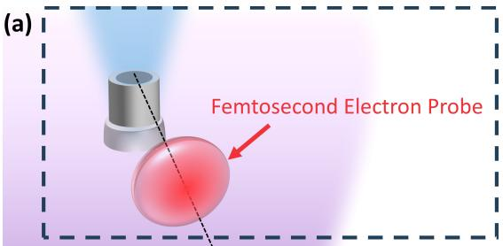
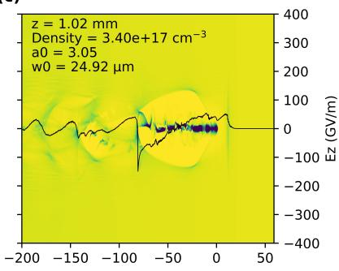
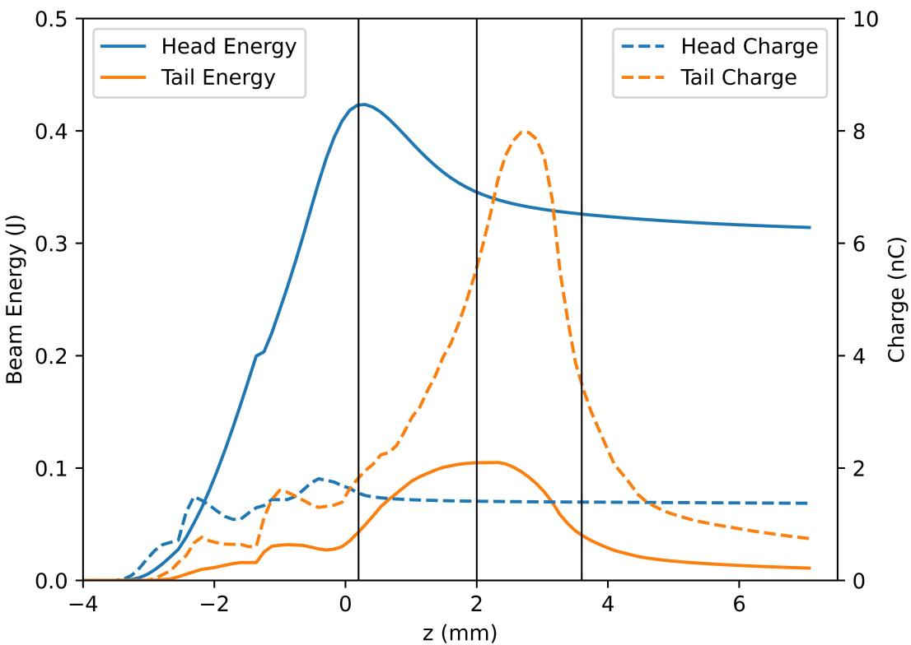
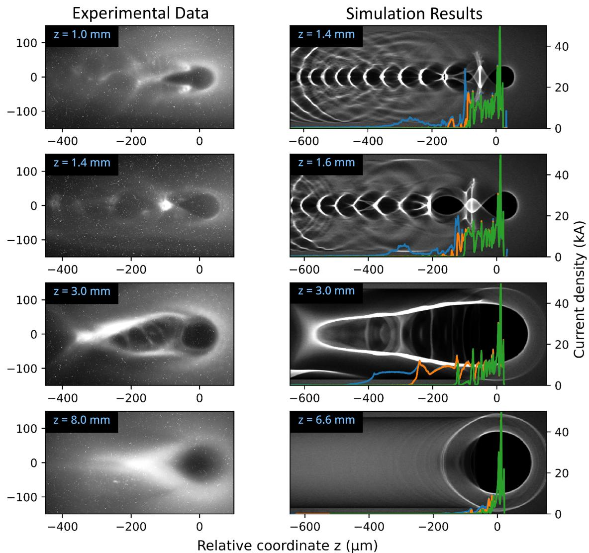

# Direct observation of electron shedding from a laser-plasma accelerator

> Sheroy Tata *et al.*，arXiv:2609.15968 v1，2026-09-14 提交，正文日期 2026-09-15。以下按论文行文顺序解释；图来自本次 MinerU 转换。论文尚为预印本，文中“首次直接观测”是作者的优先权表述。

## 一句话结论

作者用飞秒相对论电子显微镜（FREM）沿激光尾场加速器出口扫描，看到约 `550 pC`、`>100 MeV` 的高电荷电子束在密度下降区被拉长到数百微米并逐步丢失尾部电子；配套 FBPIC 表明，激光失焦使尾场由激光驱动转向束流驱动，头部向尾部转移能量，尾部在弱聚焦区振荡、发散并脱落。实验直接给出的是探针束上的时空电磁场印迹；能量转移、阈值粒子和机制分解主要来自作者模拟，不能写成本地复现或逐电子直接测量。

## 1. 问题：束流离开等离子体后并不一定“冻结”

激光等离子体加速器通常在毫米尺度内形成飞秒、高峰值电流电子束。许多束线设计默认电子束离开主要加速区后，纵向相空间基本保持不变，只需要处理真空漂移和常规光学。本文指出：若高电荷束团继续处于下降的等离子体密度中，它自身驱动的尾场、残余激光尾场和密度梯度仍可重排相空间，甚至使电子从束团尾部持续脱落。

作者把这一过程称为 **electron shedding**。它与瞬时的低能电子背景或单次散射不同：核心特征是束团先被拉长，随后尾部电子在能量和横向约束同时变弱时逐步离开可辨识的主束团。

## 2. FREM 怎样看到飞秒束团的纵向结构

实验用约 `200 MeV` 的超短探针电子束横穿被测加速束。被测束的电磁场给探针一个横向冲量，经过漂移后转成屏上的密度调制。扫描交叉位置，就能得到被测束沿传播方向的场印迹。

对超相对论、轴对称且纵向变化慢于横向穿越的束流，电荷线密度可写为

$$
\lambda(z)=\iint \rho(x,y,z)\,\mathrm dx\,\mathrm dy
\simeq \frac{I(z)}{c},
$$

其中 $\rho$ 是体电荷密度，$I(z)$ 是局部束流电流，$c$ 是光速。近光速电子束的横向电场与磁场对共动测试粒子会部分抵消；FREM 使用横穿探针，保留可测的净横向偏转。于是屏上空洞、亮边和环状结构的位置与宽度可以约束束团的纵向尺度和场强演化。

这不是“直接拍到每个被测电子”：从探针密度到被测束电流仍依赖传播几何、探针初始分布和电磁场反演。本文把实测图样与从 PIC 场重建的合成 FREM 图并列比较，因此应把“直接观测”理解为对 shedding 的时空场特征进行了直接成像，而不是无模型的六维相空间测量。

## 3. 激光、气体靶与高电荷工作点

实验在 HIGGINS 双 `100 TW` 激光系统上进行。驱动脉冲经 `f/35` 聚焦，峰值强度约 $7\times10^{18}\,\mathrm{W\,cm^{-2}}$；气体由 `97% He + 3% N$_2$` 组成，密度约为 $(3\text{--}5)\times10^{18}\,\mathrm{cm^{-3}}$。氮掺杂提供电离注入，使主束团在 `100 MeV` 以上约有 `550 pC` 电荷。

FREM 沿气体喷嘴之后的位置扫描。论文报告，当局部密度下降到约 $10^{17}\,\mathrm{cm^{-3}}$、对应等离子体波长约 `100 μm` 时，束团纵向长度已超过加速区等离子体波长的 `40` 倍并延伸到数百微米。这个数字是 FREM 场印迹与模型共同支持的纵向尺度，不应等同于常规电子谱仪直接给出的逐切片电荷。

## 4. PIC 中的尾场转型

作者用准圆柱 FBPIC 模拟解释机制。代表性设置包括 `778 μm × 270 μm` 计算域、`16384 × 900` 网格、两个方位模、每单元 `2×2×6` 宏粒子、每激光波长 `16` 个纵向网格点，入射激光 $a_0=2$、强度 FWHM 光斑约 `27 μm`。这些参数足以说明模拟分辨率和近似，但本仓库没有获得输入文件，也没有重跑收敛性或改变物理模型。

在密度下降前，激光仍能自聚焦并驱动清晰的泡结构；密度降低后，激光失焦、自导引减弱，尾场经历

$$
\text{laser-driven}\rightarrow
\text{mixed laser/beam-driven}\rightarrow
\text{beam-driven}
$$

的转变。等离子体波长随密度下降而增加：

$$
\lambda_p=\frac{2\pi c}{\omega_p},
\qquad
\omega_p=\sqrt{\frac{n_e e^2}{m_e\epsilon_0}}.
$$

$n_e$ 是电子密度，$e$ 和 $m_e$ 是电子电荷量与质量。密度越低，$\lambda_p$ 越长；相位面相对电子束向后移动，原来处于稳定加速/聚焦相位的电子可能进入减速或弱聚焦区域。

论文还比较降低束团电荷的控制模拟：高电荷束更早接管尾场并产生明显的头—尾能量传递，说明 shedding 不是只由给定密度梯度决定，而与束流负载强度共同决定。

## 5. 头部怎样向尾部转移能量

作者把前 `21 μm` 定义为束团头部，并以能量大于 `5 MeV` 的电子统计主束。沿传播方向，头部先在激光尾场中增能，随后在束流驱动阶段逐步损失能量；尾部则先获得约 `0.1 J`，再进入减速、横向振荡和脱落阶段。

能量交换可用纵向功率的符号理解：

$$
\frac{\mathrm d\mathcal E}{\mathrm dt}
=-e\,\mathbf v\cdot\mathbf E
\simeq -e v_z E_z.
$$

对电子而言，$v_zE_z<0$ 时增能，$v_zE_z>0$ 时失能。束团头部驱动的 $E_z$ 使后方电子先加速；当它们滑入相反相位，又开始减速。与此同时，低密度区的聚焦梯度变弱，较低能电子的横向振荡幅度增大，更容易离开主束。

作者模拟中，可用于高能应用的主束能量最终降低接近 `20%`；被 shed 的电子能量可达约 `30 MeV`。这些是单套作者 PIC 条件下的量，不是实验逐粒子能量账本，也不是所有 LWFA 出口的普适损失率。

## 6. 实验图像与合成诊断怎样闭合

实验和合成诊断都显示：靠近出口时有紧凑环状结构；进入下降沿后结构沿纵向延伸；更远处出现弥散、尾部消失的图样。作者发现，重建实验 FREM 需要包含能量低至约 `2 MeV` 的电子；若只保留 `>5 MeV` 或 `>10 MeV` 电子，无法产生足够长的尾部场印迹。这一阈值说明低能尾部对场图像很重要，但它来自诊断前向建模，不是独立能谱仪的阈值测量。

实验—模拟的一致性支持以下机制链：高电荷注入 → 束流接管下降沿尾场 → 头—尾能量转移和持续注入 → 低能尾部横向失配 → shedding。仍不能由现有图像单独排除所有三维非对称、注入波动或探针初态误差。

## 7. 对束流提取设计的启示

最直接的工程结论是：等离子体出口不能只按“绝热降密度能降低发散”来优化。更缓的下降沿虽然可能改善某些横向匹配，却给束团自驱动尾场和头—尾交换留下更长距离；更陡的下降沿可抑制持续注入与纵向重排，却可能增大失配和发散。实际设计需要同时优化

- 密度下降长度与形状；
- 束团电荷、长度和初始能散；
- 激光在出口的失焦与残余强度；
- 后续真空束线可接受的发散和低能 halo。

本文没有给出对所有工作点都最优的 taper，只证明了“延长下降沿”存在此前容易忽略的纵向代价。

## 8. 证据边界与复现清单

- **实验直接量**：FREM 探针屏的空间图样、扫描位置、电子谱和运行条件。
- **模型辅助量**：被测束的纵向电流分布、低能阈值、头尾分组、能量转移和尾场驱动成分。
- **作者模拟**：准圆柱 FBPIC，不是完整三维笛卡尔 PIC；本地未重跑输入、粒子数/网格收敛和诊断传播。
- **优先权表述**：“first direct observation”来自预印本作者，尚未经过正式期刊版本核验。
- **适用范围**：高电荷、氮掺杂、特定密度下降沿和激光失焦条件；不能把近 `20%` 的模拟能量损失外推到低电荷或不同提取结构。
- **应用边界**：论文讨论束流品质保持，没有完成转换靶、γ/中子/光核产额、剂量或屏蔽实验。

若要独立复现，至少需要作者的完整密度剖面、激光时空分布、注入初态、FBPIC 输入、探针六维分布、探针到屏传播矩阵以及 FREM 图像处理代码。当前公开正文足以审计主要参数和机制，但不足以逐像素复算图 5。
