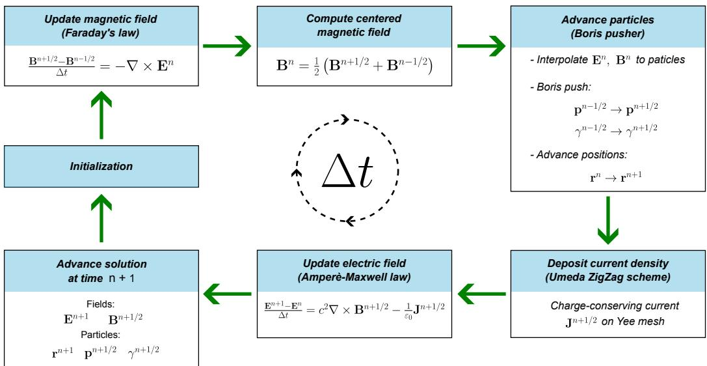
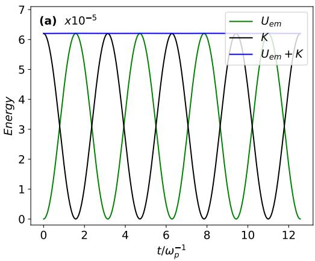
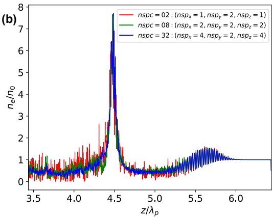

# KEMPIC-3D：透明、可扩展的三维电磁 PIC 框架

> Jesús E. López、Keren C. Vanegas 与 Eduardo A. Orozco-Ospino，arXiv:2609.16575 v1，2026-09-15 提交。以下按正文顺序解释；图来自本次 MinerU 转换。论文是代码与数值验证稿，源码声明为“正式发表后提供”，本轮未发现可立即取得的仓库 URL，也没有在本地编译或运行 KEMPIC-3D。

## 一句话结论

KEMPIC-3D 把 Yee FDTD、相对论 Boris 推进、CIC 插值和 Umeda ZigZag 守恒电流沉积组织成可直接检查的 C/C++ 电磁 PIC 框架；作者用解析轨道、矩形波导、冷等离子体振荡与准二维 LWFA 示范逐层验证。最强证据是标准算法的实现一致性，而不是新物理：LWFA 算例只传播约六个等离子体波长、不含外注入或俘获，并且“3D 代码”在该算例中只用两个横向网格强制平移不变。

## 1. 研究定位：为什么还要写一个 PIC 代码

引言先区分 KEMPIC-3D 与 OSIRIS、EPOCH、Smilei、WarpX、FBPIC 等成熟平台。它不以大规模 HPC 性能为第一目标，而把算法透明、模块可替换和教学/研究可修改性作为卖点。此前版本已用于微波驱动尾场研究；本文的目标则是把数值部件、耦合顺序和验证证据集中写清楚。

这一定义也限定了评价标准：论文需要证明实现是否正确、离散守恒是否闭合、标准基准是否收敛，但没有必要也没有做到证明其性能或物理覆盖面优于成熟生产代码。

## 2. 从 Vlasov–Maxwell 到超粒子

对物种 $\alpha$，连续无碰撞分布满足

$$
\frac{\partial f_\alpha}{\partial t}
+\frac{\mathbf p}{\gamma m_\alpha}\cdot\nabla_{\mathbf r}f_\alpha
+q_\alpha\left(\mathbf E+
\frac{\mathbf p}{\gamma m_\alpha}\times\mathbf B\right)
\cdot\nabla_{\mathbf p}f_\alpha=0.
$$

**变量说明：** $f_\alpha$ 是六维相空间分布；$q_\alpha,m_\alpha$ 是电荷和质量；$\mathbf p$ 是相对论动量；$\gamma=(1-v^2/c^2)^{-1/2}$；$\mathbf E,\mathbf B$ 为自洽电磁场。

**推导过程：** 第一项给出显式时间变化，第二项沿粒子速度搬运分布，第三项把 Lorentz 力写成动量空间中的平流；无碰撞条件意味着相空间密度沿特征线守恒。对 $f_\alpha$ 的动量积分分别给出电荷密度和电流，再进入 Maxwell 方程。

**物理直觉：** 直接存储六维 $f$ 很昂贵；PIC 用有限数量的带权超粒子采样这些特征线，同时把场留在规则网格上。

**关键点/物理意义：** KEMPIC-3D 当前验证的是无碰撞 Vlasov–Maxwell 主干；电离、碰撞和更高阶粒子形状仍被列为未来扩展。

作者采用有限尺寸超粒子而非点电荷。每个超粒子的空间形状由 B-spline 给出，当前位置和动量通过 Lorentz 方程推进。论文采用零阶 B-spline 对应的 CIC 权重；网格到粒子和粒子到网格使用同一形状家族，避免两条映射在离散层面失配。

## 3. 一步 PIC 循环怎样闭合

每一步依次完成：Faraday 更新磁场；把半整数时刻磁场平均到整数时刻；把 $\mathbf E^n,\mathbf B^n$ 插到粒子位置；用 Boris 算法推进动量和位置；沿实际轨迹沉积守恒电流；最后用 Ampère–Maxwell 方程更新电场。这个次序使粒子位置、动量和电磁场保持 leapfrog 错层。

磁场的时间居中为

$$
\mathbf B^n=\frac{\mathbf B^{n+1/2}+\mathbf B^{n-1/2}}{2}.
$$

**变量说明：** 上标是离散时间层；$n\pm1/2$ 是 Yee 场更新自然产生的半步时刻。

**推导过程：** 对 $t^n$ 两侧等距的磁场作中心插值，泰勒展开中的一阶误差互相抵消，因此保留二阶时间精度。

**物理直觉：** Boris 推进需要同一时刻的电场和磁场；时间居中是把错层数据对齐，而不是引入新的物理近似。

**关键点/物理意义：** 若这里使用单侧值，会把整体二阶格式降阶并产生相位误差。

## 4. Yee 场求解器、Gauss 约束与稳定性

Yee 网格只显式推进两个旋度方程。$\nabla\cdot\mathbf B=0$ 由“离散散度作用于离散旋度恒为零”保持；Gauss 定律能否持续成立则取决于电流沉积是否满足

$$
\frac{\partial\rho}{\partial t}+\nabla\cdot\mathbf J=0.
$$

**变量说明：** $\rho$ 为网格电荷密度，$\mathbf J$ 为错位网格电流。

**推导过程：** 对离散 Ampère–Maxwell 方程取散度，旋度项消失；若上式成立，$\nabla\cdot\mathbf E-\rho/\epsilon_0$ 的时间差为零，所以初始满足 Gauss 定律即可在以后保持。

**物理直觉：** 场求解器与沉积器不是两个可以独立替换的模块；电荷连续性是它们之间的“接口契约”。

**关键点/物理意义：** 论文使用 ZigZag 沿粒子路径沉积电流，后续基准测得连续性残差约 $10^{-13}$，比仅看场图平滑更有说服力。

三维显式更新受 CFL 条件约束：

$$
c\Delta t\le
\left[
\frac{1}{(\Delta x)^2}+
\frac{1}{(\Delta y)^2}+
\frac{1}{(\Delta z)^2}
\right]^{-1/2}.
$$

**变量说明：** $\Delta x,\Delta y,\Delta z$ 是网格间距，$\Delta t$ 是时间步，$c$ 是光速。

**推导过程：** 对离散 Maxwell 更新作平面波 von Neumann 分析，要求所有离散波数的放大因子模不超过一；最坏情形由三个方向的最高可分辨波数组合给出上式。

**物理直觉：** 数值信息不能在一步里跨过超过离散光锥允许的距离。

**关键点/物理意义：** 该条件只保证场更新稳定；还不能替代对等离子体频率、Debye 长度、粒子穿格和数值 Cherenkov 的分辨率检查。

## 5. 软件结构与可复现性现状

代码把场推进、粒子推进、插值、沉积、边界、外场、诊断和移动窗口组织为可识别模块，并采用轻量并行。作者明确说它“补充”而非复刻面向超算的大型代码。

可复现性承诺仍有时间边界：摘要和代码可用性章节写的是源码“will be made publicly available”，正文未给出当前仓库地址、许可、提交哈希或可执行输入。因此本文能审计算法说明和报告数值，不能把“计划公开”写成“源码已验证可运行”。

## 6. 分层验证证明了什么

### 6.1 Boris 推进

均匀磁场中的相对论回旋经过 1000 周期后仍与解析轨道重合，Larmor 半径误差对 $\Delta t$ 的拟合斜率为 `1.998`；均匀电场加速的末位置误差斜率为 `2.002`。纯磁场能量变化约 $10^{-15}$，说明实现恢复了 Boris 的二阶与长期保能特征。

### 6.2 Yee 场求解器

矩形波导 `TE10` 基准采用 $a=3\,\mathrm{cm}$、$b=a/2$、$L_z=1\,\mathrm m$，以 `9 GHz` 驱动高于约 `5 GHz` 截止频率。时域、频谱和横向场形均符合解析解，空间—时间联动加密的拟合收敛阶为 `2.136`。这验证了场更新和边界实现，但仍是规则直角网格、理想导体和单模线性问题。

### 6.3 自洽耦合

冷等离子体振荡在有效一维、三维电磁框架中恢复 $\omega/\omega_p=1$。电磁能和粒子动能反相交换，总能量相对变化低于 $7.5\times10^{-4}$。

这里的能量结果与 $10^{-13}$ 量级连续性残差共同说明耦合闭合；但基准是小扰动、周期边界、静离子和 quiet start，不能代表强非线性、开放边界或长时间加热误差。

## 7. 准二维 LWFA 示范

算例参数为 $n_0=3.0\times10^{18}\,\mathrm{cm^{-3}}$、$\lambda_0=0.8\,\mu\mathrm m$、`28 fs`、$w_0=12\,\mu\mathrm m$、$a_0=3$；窗口为 $(3\times1\times3)\lambda_p$，网格 `301×2×1401`，使用移动窗口。虽然代码具备三维坐标，$y$ 向仅两个网格并取周期边界，因此物理上是二维 Cartesian 示范。

图中可见电子空泡、后续密度堆积和强纵场，证明主循环能产生非线性尾场。它没有外注入束、俘获统计、能谱、发射度或长距离能量增益，因此不是加速器性能验证。

粒子数增加 16 倍后主波形保持、噪声降低，且未加显式平滑。这说明该短算例在所测 observable 上对粒子统计相对稳健；但图中峰值仍随离散化变化，作者也没有给出网格、盒宽、边界、传播长度和高阶形状的联合收敛。

## 8. 证据边界与后续验证

- **已验证**：标准 Boris/Yee/CIC/ZigZag 组合在所列解析和线性基准上的二阶行为、能量交换与离散连续性。
- **作者模拟**：LWFA 是短距离准二维示范；`0.169 TV/m` 是该算例的场峰值，不是实验测量或电子束净能量增益。
- **尚未验证**：真实三维 LWFA、离子运动、电离、碰撞、辐射反作用、复杂边界、负载均衡、强/弱缩放和跨代码逐点比较。
- **可用性边界**：源码承诺公开但本文没有仓库 URL；本地没有构建、单元测试或重复作者图。

最值得做的接续验证是：公开仓库后固定 commit，先复现解析轨道、波导、等离子体振荡，再与 WarpX/Smilei 在完全相同的二维 LWFA 输入上比较场能量、Gauss 残差、粒子噪声、wall time 和完整进程时间；最后才扩展到三维注入与束流品质。

## 9. 复习用速记

KEMPIC-3D 的主要贡献是把经典电磁 PIC 数值链做成透明且分层验证的实现。论文已经证明“标准部件在这些基准上接得对”，尚未证明“源码现在可复现”“三维生产问题性能足够”或“LWFA 束流被可靠加速”。
