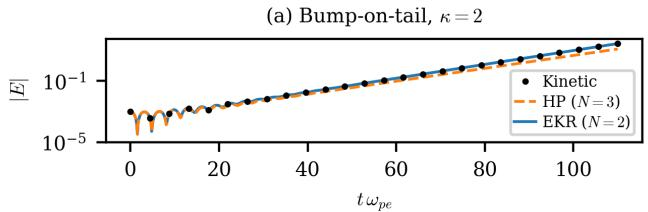
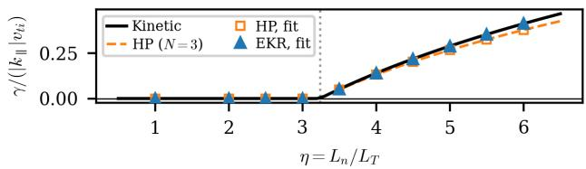
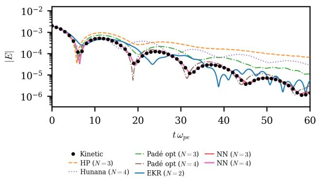
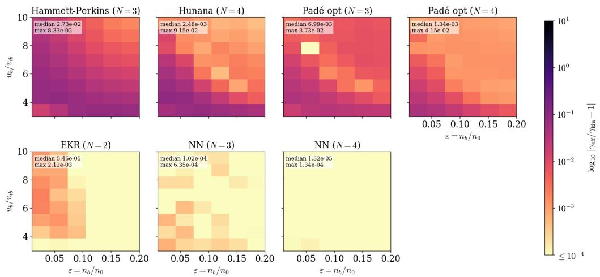

# 线性不稳定性的非线性动理学闭合

> Elizabeth J. Paul、Archis Joglekar 与 Alexey Knyazev，arXiv:2609.17209 v1，2026-09-15 提交，正文日期 2026-09-16。以下按正文顺序解释；图来自本次 MinerU 转换。代码和数据给出 GitHub/版本提交线索，但本轮没有克隆或重跑；文中 Claude Code 仅被作者声明为开发与文字辅助，不属于物理验证。

## 一句话结论

论文放松 Landau-fluid “最高矩线性依赖低阶矩”的假设，构造对单个本征模精确的非线性 exact kinetic response（EKR）闭合，再用解析矩层级训练满足复数缩放等变性的神经网络和学习型 Padé 闭合。对 bump-on-tail 与 slab-ITG 两个线性模型，EKR/四矩神经网络把增长率误差从传统 Hammett–Perkins 的约 `10%` 压到 $10^{-5}$ 量级；但精度建立在解析线性数据、单波数和低维模型上，神经闭合仍没有一般因果性与非线性稳定保证。

## 1. 闭合问题与传统 Landau-fluid 的限制

流体矩方程中，第 $n$ 阶矩的演化依赖第 $n+1$ 阶矩，因此有限矩模型必须给最高矩一个闭合。Landau-fluid 用动理学响应函数的 Padé 近似，把最高矩写成低阶矩的线性组合；它保留叠加原理，且可检查极点是否都在下半复平面来保证因果性，但中间相速度区的误差受矩数限制。

作者的关键问题是：目标方程虽然线性，闭合函数本身是否必须线性？答案是否定的。非线性闭合可以从瞬时矩比值推回本征频率，从而在单一本征模上直接调用精确动理学响应。

## 2. 从 Vlasov 方程得到矩层级

对线性化一维一速度 Vlasov–Poisson 系统，物种 $s$ 满足

$$
\frac{\partial f_{1s}}{\partial t}
+v\frac{\partial f_{1s}}{\partial x}
+\frac{q_sE}{m_s}\frac{\partial f_{0s}}{\partial v}=0.
$$

**变量说明：** $f_{0s}$ 是平衡分布，$f_{1s}$ 是小扰动，$q_s,m_s$ 是电荷和质量，$E$ 是线性电场。

**推导过程：** 从无碰撞 Vlasov 方程写 $f=f_0+f_1$，忽略 $E\,\partial_v f_1$ 这类二阶小量，并假设均匀平衡，得到上式。再令扰动为 $e^{i(kx-\omega t)}$ 并对归一化速度 $w=(v-u_s)/v_{ts}$ 的幂次积分，得到矩递推。

**物理直觉：** 动理学相混合藏在无限矩链中；截断位置越低，越需要闭合替代未解析的速度空间结构。

**关键点/物理意义：** 本文训练数据来自这一线性化矩链而非昂贵 PIC/Vlasov 时间序列，因此“精确”是相对线性动理学模型，不是对真实装置或非线性湍流的实验精确。

归一化矩 $U_{n,s}$ 满足

$$
\zeta U_{n,s}-U_{n+1,s}
=\frac{n\widehat\Phi}{2}M_{n-1,s},
$$

其中 $\zeta=(\omega/k-u_s)/v_{ts}$，$\widehat\Phi=q_s\Phi/T_s$。它既生成训练样本，也给出由低阶矩向高阶矩递推的解析结构。

## 3. EKR：由瞬时矩估计本征频率

从 $n=0$ 矩方程，单一本征模上有

$$
\widehat\zeta=\frac{U_{1,s}}{U_{0,s}}.
$$

**变量说明：** $U_0$ 是密度型扰动矩，$U_1$ 是流速型扰动矩；$\widehat\zeta$ 是从瞬时状态推得的复频率参数。

**推导过程：** 在 $n=0$ 时右端为零，递推式化为 $\zeta U_0-U_1=0$；若状态只有一个本征模，直接相除即可恢复 $\zeta$。

**物理直觉：** 单模的各矩共享同一个复指数时间因子，矩的比值就像模式的“指纹”。

**关键点/物理意义：** 在 $U_0=0$ 的干涉节点或多模叠加时，该比值不再代表任何真实本征频率；这是 EKR 最根本的适用边界。

动理学响应定义为

$$
R_s(\zeta)=-\frac{U_{0,s}}{\widehat\Phi},
$$

由矩递推可得二阶闭合

$$
\frac{U_{2,s}}{U_{0,s}}
=\zeta^2+\frac{1}{2R_s(\zeta)}.
$$

**变量说明：** $R_s$ 是由平衡分布决定的复响应函数；Maxwell 分布时 $R=1+\zeta Z(\zeta)$，$Z$ 是等离子体色散函数。

**推导过程：** 用 $n=0$ 式写 $U_1=\zeta U_0$；再在 $n=1$ 式中代入 $U_0=-R\widehat\Phi$，消去 $\widehat\Phi$，得到 $U_2/U_0$。实际闭合用 $\widehat\zeta$ 替换参数 $\zeta$。

**物理直觉：** 传统 Padé 用一个全局有理函数近似响应；EKR 先定位当前单模，再在那个复频率点取精确响应。

**关键点/物理意义：** 对单模它让流体和动理学色散关系重合；对多模则破坏叠加原理。作者检查了附加多项式因子在上半平面没有零点，因此两个本文 EKR 模型没有额外线性不稳定根。

## 4. 两个模型问题

### 4.1 Bump-on-tail

冷背景电子支撑 Langmuir 波，漂移热束提供动理学驱动。束的 Vlasov 矩与背景场通过 Ampère 定律耦合，扫描束漂移 $u_b/v_{tb}$、相对密度 $\epsilon=n_b/n_0$ 和 κ 分布尾形。

对 Maxwell/κ 分布，EKR 都沿解析响应变化；传统 HP 只见低阶矩，按构造无法区分同密度、同温度但尾形不同的 κ 分布。作者报告 κ 扫描中真实增长率变化约 `16%`。

### 4.2 Slab ITG

离子由线性漂移动理学方程描述，电子取绝热响应。驱动参数 $\eta=L_n/L_T$，闭合响应同时依赖 $\zeta,\zeta_*,\eta$。EKR 与 HP 都给出解析阈值

$$
\eta_{\mathrm{th}}=1+\sqrt5,
$$

但阈值以上 HP 系统性低估增长率。

这些时间推进由速度网格动理学线性系统与 Fourier/RK45 流体系统生成，并非陀螺动理学湍流、真实托卡马克放电或实验剖面验证。

## 5. 多模计数：瞬时闭合能知道多少模式

$M$ 个复本征模的叠加需要 $M$ 个复频率和 $M-1$ 个相对复振幅，总计 $2M-1$ 个复参数。输入向量含 $N$ 个已演化矩和一个势，但整体复振幅无意义，因此提供 $N$ 个独立复约束。可辨识条件是

$$
N\ge2M-1,
\qquad
M\le\frac{N+1}{2}.
$$

**变量说明：** $M$ 是同时存在的本征模数，$N$ 是闭合前保留的瞬时矩数。

**推导过程：** 对模式参数作自由度计数，并把输入状态除去共同复缩放；若约束少于未知参数，任何只读瞬时矩的闭合都不能唯一恢复所有模式。

**物理直觉：** 一张“瞬时照片”包含的信息有限；要区分更多叠加波，要么保留更多矩，要么加入时间历史。

**关键点/物理意义：** 这个上限同样约束从 PIC/Vlasov 数据训练的黑箱闭合；提高网络宽度不能创造输入中没有的信息。

图 2 是论文重要的失败案例：EKR 并非处处比线性闭合好；其单模精确性无法替代叠加结构。它也解释了为什么不稳定算例在长时间仍可得到正确增长率——最快增长模最终占优，把状态重新推向单模流形。

## 6. 等变神经闭合与学习型 Padé

线性物理对任意复常数缩放 $U\mapsto aU$ 不变，因此闭合应满足

$$
U_N(aU)=aU_N(U).
$$

作者让 MLP 只读取归一化 Hermitian Gram 矩阵 $G=UU^\dagger/|U|^2$，其元素对整体复缩放不变；网络输出再乘回各矩并线性组合，从架构上严格满足等变性。

**变量说明：** $U$ 包含低阶矩和势，$G$ 编码它们的相对幅度与相位，$U_N$ 是待预测最高矩。

**推导过程：** 整体缩放后 $G$ 不变，网络系数不变；输出中的矩各乘 $a$，因此最终 $U_N$ 也只乘 $a$。

**物理直觉：** 网络学习“状态形状”而非任意单位和全局相位，减少了不物理自由度。

**关键点/物理意义：** 等变性保证缩放对称，不保证因果性、稳定性或跨非线性状态泛化。

学习型 Padé 则保留线性闭合 $U_N=\sum_{i<N}a_iU_i$，但不再只在 $|\zeta|\to0,\infty$ 渐近匹配，而是在目标复频率区域最小二乘拟合。它精度逊于 NN/EKR，却保留精确叠加，并可直接检查极点是否位于下半平面。

## 7. 误差结果与怎样解读“三个数量级”

传统 HP 的中位误差约 $2.73\times10^{-2}$，Hunana 约 $2.48\times10^{-3}$；学习型 Padé 在 $N=3/4$ 时约 $6.99\times10^{-3}$ 和 $1.34\times10^{-3}$；EKR 与 $N=4$ NN 分别约 $5.45\times10^{-5}$ 与 $1.32\times10^{-5}$。因此“最高三阶改进”在这个扫描和增长率 observable 上成立。

但误差地板已接近有限时间拟合受到次主模污染的水平。论文没有证明同样改进会出现在非线性饱和、宽频耦合、碰撞、实空间边界或多维速度空间，也没有给出嵌入大型流体代码后的稳定 wall time。

## 8. 证据边界与后续验证

- **解析/数值基准**：真值来自线性化 Vlasov/漂移动理学特征系统，不是实验或全非线性 PIC。
- **EKR 边界**：单模精确，多模节点可能使 $U_1/U_0$ 奇异；作者用裁剪处理极端值。
- **NN 边界**：复缩放等变性被严格编码，但因果性没有结构保证，可能出现未见参数区的伪不稳定。
- **Padé 取舍**：误差更大，但叠加和极点检查更清晰，部署风险可能低于黑箱 NN。
- **计算边界**：所有例子按波数独立、线性化且低维；论文没有展示非线性模式耦合、能量守恒或生产级流体求解器中的长期积分。

优先接续应是：固定公开代码提交重跑图 2/3；对未参与训练的复频率域和多模数做稳定性扫描；在可微分流体求解器中 in-the-loop 训练并显式约束因果极点；最后用非线性 Vlasov/PIC 生成留出数据，比较增长、饱和、相空间结构和完整运行成本。

## 9. 复习用速记

EKR 用瞬时矩比值先识别单模频率，再调用精确动理学响应；它把单模增长率做得极准，却不能自动处理叠加。多模能力由 $N\ge2M-1$ 的信息计数限制，等变 NN 可补部分多模误差，学习型 Padé 则以较低精度换取线性叠加与可检查因果性。
