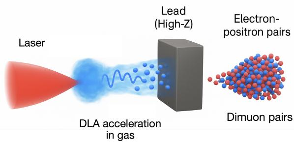
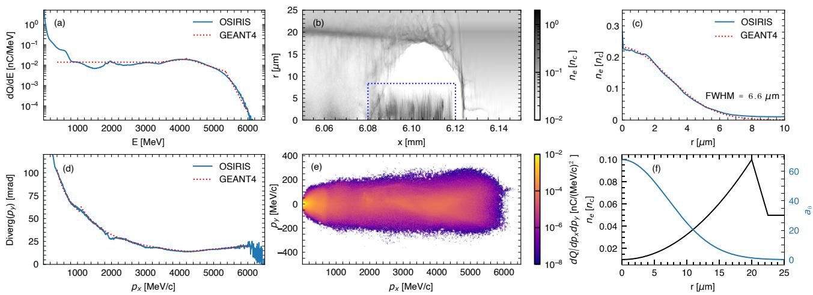
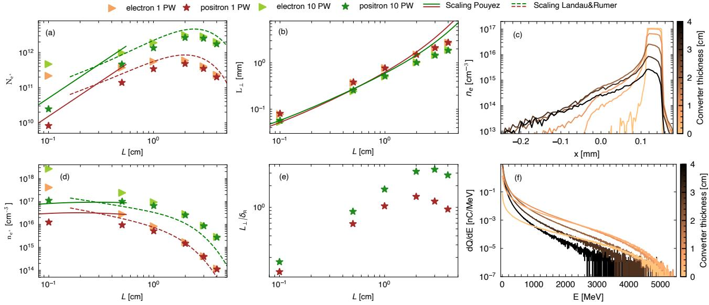
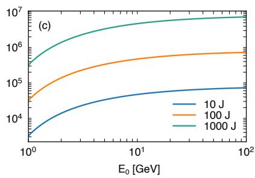
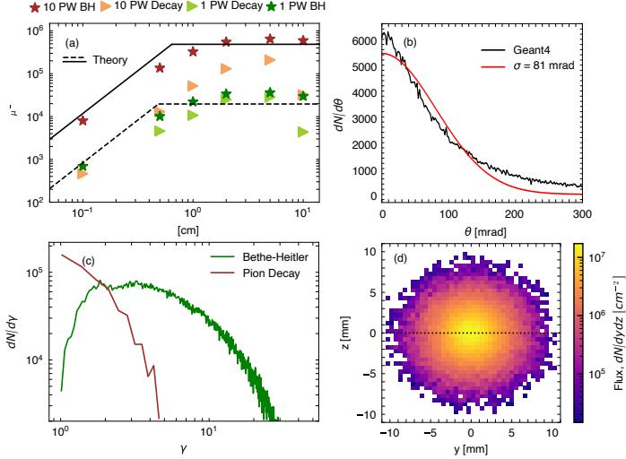
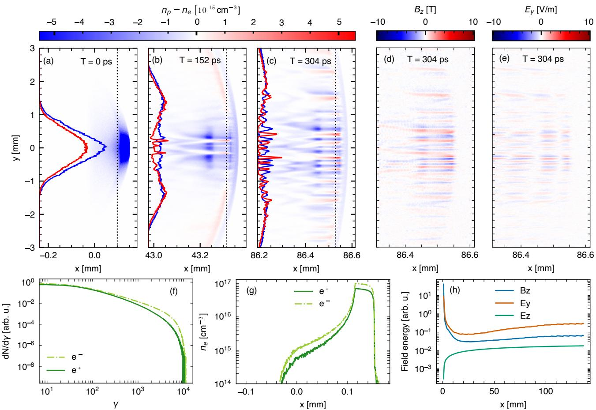

# 千焦级 DLA 驱动电子—正电子与缪子束的高效产生

> R. Babjak、M. Pouyez、C. Badiali、T. Grismayer 与 M. Vranic，arXiv:2609.18775 v1，2026-09-16 提交。以下按正文顺序解释；图来自本次 MinerU 转换并已逐张查看。这是一篇 PIC + GEANT4 + 解析标度的数值方案论文，没有报告实际激光 shot 或实验测量；本轮也没有重跑 OSIRIS/GEANT4。

## 一句话结论

作者用准三维 OSIRIS 得到高电荷 GeV DLA 电子束，再用 GEANT4 研究其穿过 Pb 转换靶产生的正电子和缪子：`1 PW/110 J` 自导引方案给出 `35 nC` 的 `>100 MeV` 电子，`10 PW/1.125 kJ` 外导引方案给出 `74 nC` 的 `>400 MeV` 电子；模拟预言最多约 `3×10¹²` 个正电子、`3.6×10⁴/6.5×10⁵` 个缪子，并在另一个二维 OSIRIS 传播算例中看到电流成丝。结果说明该路线值得实验验证，但“近期开启 pair-plasma 实验”仍是基于理想化数值链的可行性判断。

## 1. 方案结构与科学问题

实验室相对论 pair plasma 的瓶颈不是“能否产生正电子”，而是能否同时得到足够的总粒子数、密度、横向尺寸和低发散，使集体不稳定性在束团稀释前增长。作者把 DLA 的高电荷与高 Z 级联的高多重性结合起来，同时考察三类目标：

1. 横向尺度大于皮肤深度的 pair beam，用于电流成丝等集体效应；
2. GeV 级正电子束，作为未来加速器注入源的候选；
3. Bethe–Heitler 缪子源，用于成像或后续加速。

## 2. 准三维 PIC 产生电子驱动束

作者模拟两种代表性工作点：

- **10 PW 外导引：** 激光能量 `1.125 kJ`，电子最高约 `6 GeV`，`>400 MeV` 电荷 `74 nC`，激光到电子效率 `18%`；加速 `6 mm` 后束长约 `38 μm`、横向直径约 `6.6 μm`、峰值密度约 `2.2×10²⁰ cm⁻³`。
- **1 PW 自导引：** 激光能量 `110 J`，电子最高约 `2 GeV`，`>100 MeV` 电荷 `35 nC`，报告效率 `37%`。

图 2(a,c,d) 的拟合分布直接作为 GEANT4 抽样输入。这能保持能谱、横向密度与能量相关发散的主要相关性，但仍不是完整的带场六维 PIC dump；从 PIC 到 Monte Carlo 的映射本身是一层近似。

## 3. Pb 靶中的电子—光子—pair 级联

电子在核场中发射韧致辐射，光子再经 Bethe–Heitler 过程产生 $e^-e^+$ 或 $\mu^-\mu^+$。中性 Pb 中作者使用的 shower 长度标度为

$$
L_{\rm sh}\simeq 3.60\ln\gamma_0\ \mathrm{mm},
$$

其中 $\gamma_0=E_e/(m_ec^2)$ 是入射电子 Lorentz 因子。靶厚 $L\ll L_{\rm sh}$ 时，产生对数随厚度快速增长；接近或超过 shower 长度后，电离损失、散射与深层粒子无法逃逸使出射产额饱和甚至下降。

图 3 的核心不是单纯“越厚越多”：

- 厚度增加先提高光子与 pair 多重性，随后出射数饱和/下降；
- 多重散射让横向尺寸变大、峰值密度降低；
- 低能成分速度小，形成较长的纵向尾；
- 10 PW 方案横向尺寸最高约 `30` 个实验室皮肤深度，1 PW 约 `10` 个，满足考察横向集体模的必要几何条件。

皮肤深度定义为

$$
\delta_c=\frac{c}{\omega_p},\qquad
\omega_p=\sqrt{\frac{n_be^2}{\epsilon_0m_e}}.
$$

**变量说明：** $n_b$ 为轻子束密度（m⁻³），$e$ 为元电荷，$m_e$ 为电子质量，$\epsilon_0$ 为真空介电常数。

**物理直觉：** 尺寸若小于皮肤深度，电磁集体响应来不及在束内建立；大于皮肤深度只是必要条件，还必须满足发散、传播距离、背景等离子体和非中性场等增长条件。

正电子总数最高约 `3×10¹²`。`1 PW` 工作点也可达到约 `5×10¹¹` 个；但加速器注入关心窄能窗内的电荷，而不是全谱总数。论文指出 `0.5 GeV` 附近约为 `22 pC/5% BW`（`1 mm` 靶）或约 `370 pC/5% BW`（`5 mm` 靶），仍低于 Higgs-factory 量级的 `>1 nC/bunch` 目标。

## 4. 缪子产额的解析标度

作者从电子、正电子、光子、缪子和反缪子的级联动理学方程出发，对短靶和长靶极限求近似，并用 GEANT4 检验。对单能电子、`E₀≤100 GeV`，工程拟合写为

$$
\frac{N_{\mu^+\mu^-}}{N_0}
=A\left[
\log_{10}\left(\frac{E_0[\mathrm{GeV}]}{5.11\times10^{-4}}\right)-B
\right]^C,
$$

其中 $A=1.5\times10^{-6}$、$B=2.8$、$C=4.65$，$N_0$ 是入射电子数。超过约 `100 GeV` 后，标度渐近为 `1.25×10⁻⁶ E₀[GeV]`。

对宽能谱驱动束，卷积为

$$
N_{\mu^+\mu^-}(t)=\int d\gamma_0\,
f_{e^-}^{(0)}(\gamma_0)M_{\mu^+\mu^-}(\gamma_0,t),
$$

其中 $f_{e^-}^{(0)}$ 是入射电子谱，$M$ 是每个入射电子在给定厚度/时间下的 dimuon multiplicity。该式说明总产额既受单电子能量影响，也受电子总数和激光到电子效率影响。

一个直观对照是：`1 GeV/100 nC` 与 `10 GeV/10 nC` 电子束都含约 `100 J`，作者标度分别给出约 `6.8×10⁵` 与 `4.7×10⁵` 个缪子。真正的设计变量是电子束总能量与谱形，而不是只追求最高截止能量。

结果为 `1 PW` 约 `3.6×10⁴` 个缪子/发（`330 muons/J`），`10 PW` 约 `6.5×10⁵` 个/发（`580 muons/J`）。产额最佳厚度为数厘米；10 PW 方案中约 `68%` 的缪子位于 `81 mrad` 内，束斑直径约 `5 mm`。pion decay 通道数量和能量都低于 Bethe–Heitler 通道。

## 5. 电流成丝的二维 PIC 证明

作者把 `10 PW + 1 cm Pb` 后的电子—正电子相空间初始化到二维 OSIRIS，让束团在密度 `4×10¹⁶ cm⁻³` 的电离氢背景中传播。成丝不被角发散抹除的粗略条件为

$$
\Delta\theta<\frac{\Gamma\delta_c}{c},
$$

其中 $\Delta\theta$ 是束发散，$\Gamma$ 是不稳定性增长率。论文用束谱估计该条件满足，随后通过直接 PIC 演化检查。

传播约 `150 ps`、`45 mm` 后出现明显的非线性成丝，`304 ps` 时伴随横向电流丝和 $B_z/E_y$ 结构。束团初始并非严格电中性，已有方位磁场和径向电场，导致场能曲线中线性增长阶段不干净；因此图 6 支持“该初始化会出现 CFI 型成丝”，但没有给出干净的线性增长率、实验诊断可见度或三维饱和规律。

## 6. 证据边界与可复现性

- **准三维 PIC：** DLA 电子源及其效率、束荷、能谱、尺寸和发散均为作者数值结果，不是 ELI-L4 实测。
- **GEANT4：** 正电子/缪子数、转换靶厚度扫描与出射相空间是 Monte Carlo；材料、场、几何和 PIC→GEANT4 拟合都会影响结果。
- **二维 PIC：** CFI 例证使用一个特定 `10 PW + 1 cm Pb` 初始化和均匀背景；它证明数值可发生集体效应，不等同于完整实验设计或三维验证。
- **解析标度：** 缪子公式在论文给定假设和 `≤100 GeV` 拟合区间内与 GEANT4 相符，不能直接外推到任意材料、超厚靶或不同物理表。
- **应用边界：** 全谱 `10¹²` 级正电子不等于满足窄带、发射度、时间结构和俘获效率要求的 collider injector。
- **本轮未验证：** 未获得可执行输入和随机种子，未做网格/粒子数/物理表/二维到三维的独立敏感性扫描。

## 7. 复习用速记

这篇工作的核心设计规律是：高电荷、低发散的 DLA 电子把“pair 数够但密度散掉”和“束够准但电荷不够”之间的矛盾向前推进；对缪子源，总电子束能量与电荷至少和单电子峰值能量同样重要。所有关键结果目前仍是模拟与标度，实验可达性尚待 shot、诊断与捕获链验证。
