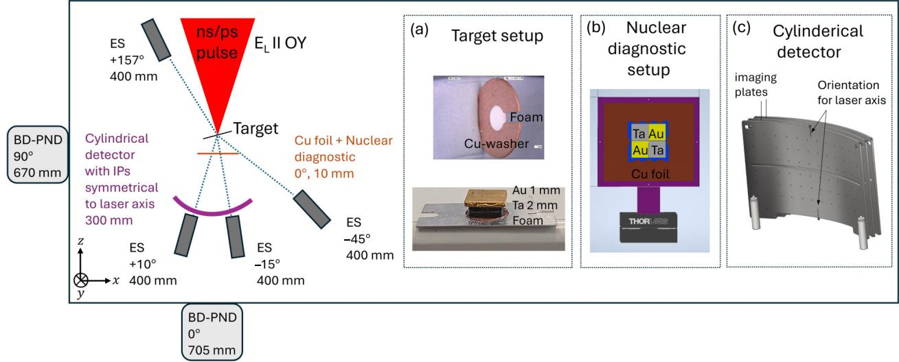
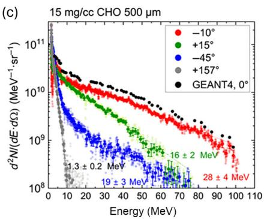
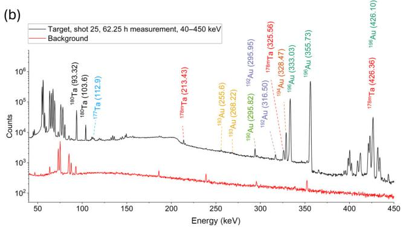
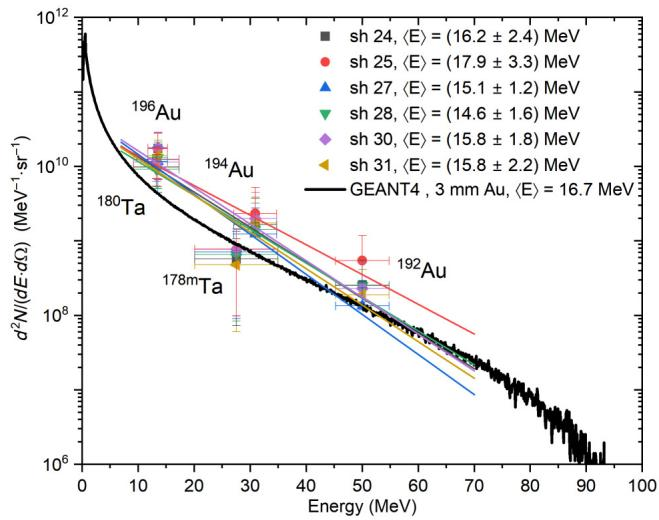
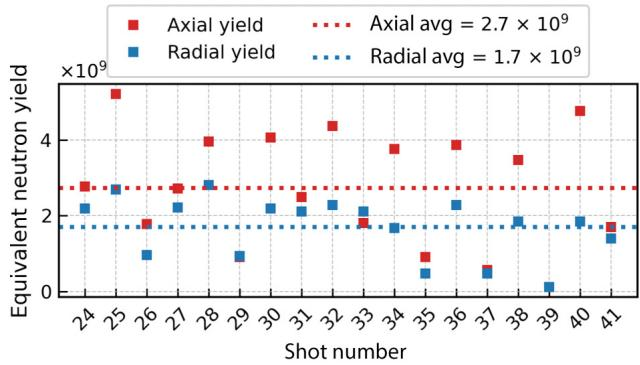

# 过临界聚合物泡沫产生超高通量 DLA 电子、MeV 光子与中子

> Parysatis Tavana 等，*Physical Review Applied* **25**, 034003 (2026)，DOI: `10.1103/5mpy-2jw5`，2026-03-02 正式发表。以下按论文顺序解释；图来自本次 MinerU 转换并已逐张查看。本轮只分析论文与作者给出的数据，没有重跑 GEANT4，也没有处理原始 IP、HPGe 或泡泡探测器数据。

## 一句话结论

PHELIX 的 `60±4 J`、`750±250 fs` 主脉冲打入预电离 `500 μm`、`15 mg/cm³` CHO 泡沫，实验得到约 `300 nC` 的 `>1.5 MeV` 电子，其中约 `20–30 nC` 的 `>7.5 MeV` 电子落在约 `12.7°` 半角锥内；它们进入 `2 mm Ta + 1 mm Au` 转换靶后，产生约 `2.07×10¹¹ sr⁻¹` 的 `>7.5 MeV` 光子、`1.23±0.23%` 的激光到光子效率以及约 `2×10⁹` 个光中子/发。这里的电子、活化产额、光子角分布和中子剂量是实验量，最优靶厚、正电子效率与粒子级级联则来自作者的 GEANT4 模拟。

## 1. 为什么用预电离过临界泡沫

普通固体靶主要在很短的表面尺度上加热电子；近临界或过临界密度泡沫被纳秒脉冲展开后，可给亚皮秒主脉冲提供数百微米长的传播与 DLA 加速区。作者的目标不是只做一个高温电子谱，而是闭合完整应用链：

`泡沫中的 DLA → 高电荷相对论电子 → 高 Z 转换靶 → 韧致辐射 → 光核活化与中子`。

这篇论文的价值正是同一平台上同时约束电子源、MeV 光子谱、光核产额和中子输出，而不是把转换靶结果只建立在未测量的输入束上。

## 2. 实验平台与诊断链

主脉冲波长 `1.053 μm`，到靶能量 `60±4 J`，椭圆焦斑约 `15×12 μm²` FWHM，峰值强度约 `(1–2)×10¹⁹ W/cm²`。泡沫由质量分数 `71% C + 27% O + 2% H` 组成，厚 `500 μm`；`3 ns` 预脉冲能量为主脉冲的 `3%`，提前 `5 ns` 到达。转换靶是 `2 mm Ta + 1 mm Au`。

四台 `0.99 T` 磁谱仪覆盖 `+10°、−15°、−45°、+157°`；圆柱形两层 BAS-MS IP 给出电子角分布，其中第二层阈值约 `7.5 MeV`。铜箔自显影测 `14–21 MeV` 光子空间分布，Au/Ta 活化片经 HPGe 读出不同阈值的光核反应；轴向、径向泡泡探测器测 `0.2–15 MeV` 中子剂量。

**诊断边界：** IP 电荷依赖既有标定，束荷误差约 `20–30%`；四个磁谱方向不能等同于完整三维相空间；峰值通量还使用了脉冲持续时间假设。

## 3. 一次电子束：高电荷与强前向性

预电离泡沫把有效温度提高到 `26–29 MeV`，电子端点超过 `100 MeV`。在 `E>1.5 MeV` 时，`2π` 总电荷约 `300 nC`，其中约 `100 nC` 进入主锥；在与巨偶极共振区韧致辐射更相关的 `E>7.5 MeV` 阈值上，总电荷约 `80–100 nC`，主锥内约 `20–30 nC`。

六发优化 shots 给出 `27.7±1.5 MeV` 的平均有效温度和 `109±25 nC` 的 `>7.5 MeV` 总电荷，对应作者估算的 `18±3%` 激光到高能电子效率。它说明源有一定重复性，但不是长期运行稳定性统计。

## 4. 活化如何约束光子能谱

光核产额可概括为

$$
Y_k=N_{T,k}\int_{E_{\mathrm{th},k}}^{\infty}
\sigma_k(E_\gamma)\,\Phi_\gamma(E_\gamma)\,dE_\gamma .
$$

**变量说明：** $Y_k$ 是第 $k$ 个反应产生的核数；$N_{T,k}$ 是样品中的靶核数；$E_{\mathrm{th},k}$ 为反应阈值，单位 MeV；$\sigma_k$ 是光核截面，单位 barn；$\Phi_\gamma$ 是每单位能量的入射光子注量。

**推导与直觉：** 在薄样品、低反应概率极限下，每个能量 bin 的反应数等于靶核数乘截面与光子数，积分得到总产额。不同核反应的阈值和截面峰不同，因而像一组宽带滤波器；单个活化片不能唯一反演任意光谱，必须对光谱形状作参数化或联合多个反应。

选定 shot 的两块 Au 探针分别给出约 `4.66×10⁷` 个 `¹⁹⁶Au`、`5.35×10⁵` 个 `¹⁹⁴Au` 和 `1.25×10⁵` 个 `¹⁹²Au`；转换靶中还测到 `1.62×10⁴` 个 `¹⁹⁰Au` 和 `5.03×10³` 个 `¹⁷⁴Ta`。后二者需要 `>55 MeV` 光子且截面约在 `65 MeV` 附近峰化，因此能证明高能尾延伸到约 `70 MeV`；它们不意味着每个光子的能量都在 65 MeV。

六发平均重建得到

- `Nγ/Ω = (2.07±1.08)×10¹¹ sr⁻¹`，阈值 `Eγ>7 MeV`；
- 平均光子能量 `15.90±1.13 MeV`；
- 指数谱有效温度 `8.90±1.13 MeV`；
- 光子束 FWHM 立体角 `0.473±0.090 sr`；
- 激光到 MeV 光子效率 `1.23±0.23%`。

效率的核心定义为

$$
\eta_\gamma=\frac{N_\gamma\langle E_\gamma\rangle}{E_{L,\mathrm{FWHM}}}.
$$

分子只计光子束 FWHM 角域和所选能区，分母也采用焦斑 FWHM 内激光能量；比较其他装置时必须保持同一能阈和角域定义。

## 5. 光子角分布与中子输出

19 发铜箔自显影给出 `14–21 MeV` 光子半角 `22.1±2.2°`。作者由电子穿越 `3 mm` 转换靶的时间估算 X 射线脉宽约 `10 ps`，从而得到约 `2×10²² photons sr⁻¹ s⁻¹` 的峰值通量；这里的脉宽与峰值通量是推断量，不是飞行时间或条纹相机的直接测量。

轴向、径向等效总产额分别约 `2.7×10⁹` 与 `1.7×10⁹` 中子/发。两方向接近与巨偶极共振后的蒸发中子图像一致，但只有两个测点，不能视为完整角分布重建。`<10 ps` 中子脉宽同样基于电子输运时间估算，因此 `2×10²⁰ n cm⁻² s⁻¹` 是派生峰值而非直接时间分辨测量。

## 6. GEANT4 给出的转换靶设计窗口

作者用 GEANT4 10.1.2、`QGSP_BERT_HP`，将测得的前向电子谱和 `12.7°` 发散作为输入；实际发射粒子数缩减到 `10⁷` 后再归一化。对 Au 厚度 `0.1–50 mm` 扫描得到：

- `>7 MeV` 光子在 `3–4 mm` 左右达到峰值，`3 mm` 模拟效率约 `1.7%`；
- 逃逸正电子在约 `5 mm` 达到产额/逃逸的折中，激光到正电子效率约 `0.1%`；
- 中子与同位素产额随厚度增加，到约 `20 mm` 后逐渐饱和，模拟中子效率约 `0.001%`。

这些“最优厚度”只适用于本文测得的约 `30 MeV` 有效温度电子谱。模拟只注入前向主锥，所以光子发散小于实验；因此实验与模拟的一致只能理解为同量级支持，不能把它们当成完全相同的相空间采样。

## 7. 证据边界与可复现性

- **直接实验：** 电子能谱/角分布、IP 束荷、Au/Ta 延迟 γ 线、铜箔自显影和两个方向的泡泡探测器读数。
- **诊断反演：** 总束荷、参数化光子谱、光子数与激光到光子效率；都依赖标定、角分布或谱形假设。
- **作者模拟：** GEANT4 的厚度扫描、正电子产额、粒子级级联与部分同位素/中子对照。
- **机制归因：** 泡沫加预脉冲显著增强电子与活化、而直接打转换靶控制发没有相同高能信号，支持 DLA—转换链；但本文没有在同一 shot 内直接测量电子轨迹或相位同步。
- **本轮未完成：** 没有原始数据、输入 deck、随机种子和完整不确定度传播，无法独立复现图 8 的谱反演或图 12 的 Monte Carlo 扫描。

## 8. 复习用速记

这是一篇端到端实验应用论文：`60 J` 级 PHELIX + 预电离过临界泡沫给出高电荷 DLA 电子，再由 `3 mm` 高 Z 靶生成百分比级 MeV 光子和十亿级中子。最应保留的边界是：电子/活化/剂量是实验，谱和峰值通量含反演，正电子与最优靶厚来自 GEANT4。
