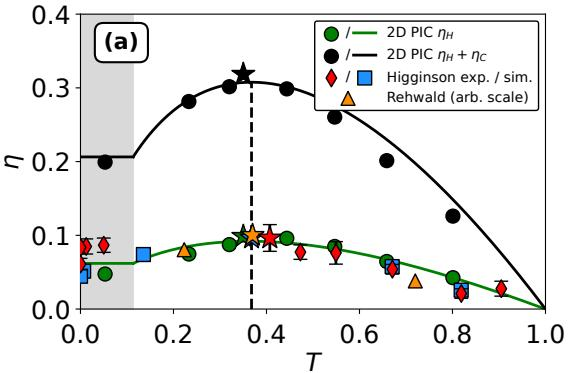

# 皮秒近临界等离子体中的高效率激光离子加速：扩展鞘层加热模型

> Joshua Luoma 等，arXiv:2609.19571，2026-09-17 提交。以下按论文顺序解释；图来自本次 MinerU 转换并已逐张查看。本文的新工作是解析模型与 SMILEI PIC；实验对照来自已发表的 Higginson 和 Rehwald 数据，本轮没有新的离子加速 shots。

## 一句话结论

作者把相对论透明附近的高效率离子加速解释为 extended sheath heating（ESH）：不是让激光全部反射，也不是完全穿透后离开，而是保留适量透射场持续加热正在膨胀的后表面电子鞘。质量受限的一维模型得到 $eta=T\ln(T^{-1})$，在场透射系数 $T=e^{-1}$ 时给出约 `37%` 的理想总离子能量上限；二维有限焦斑、二维/三维周期 PIC 以及既有实验趋势支持中等透射/中等面密度最优，但 `37%` 不是本文新实验测得的质子效率。

## 1. 为什么传统 TNSA 在千焦皮秒装置上不够

厚靶 TNSA 稳健，但典型激光到离子效率约 `1–3%`，少数超过 `5%`。BOA 或 RPA 可以更高效，却常要求几十到数百纳米薄膜和很高对比度；这对 kJ、ps 激光较难。近临界泡沫或膨胀靶允许主脉冲进入靶体，实验上已经观察到更高效率，但过去常把多种机制混在一起解释。

ESH 的物理图像是：

`初始热电子建鞘 → 靶沿纵向膨胀 → 相对论透明通道形成 → 透射激光与离子前沿共传播 → 局域持续加热电子鞘 → 更强鞘场继续加速离子`。

## 2. 核心变量与解析标度

作者把场透射系数定义为

$$
T=\sqrt{I_L/I_{L0}}
=\exp\!\left[-\frac{\Lambda}{C_d\Theta_0}\right],
\qquad
\Lambda=\frac{n_{e0}L_0}{n_c\lambda_L}.
$$

其中 $n_{e0}$ 和 $L_0$ 是初始电子密度与靶长，$n_c$ 和 $\lambda_L$ 是临界密度与激光波长；$\Theta_0$ 是以 $m_ec^2$ 归一化的无衰减电子温度，$C_d$ 吸收时空包络积分。注意 $T$ 是**场**透射，强度透射是 $T^2$。

随机加热模型给出鞘电子温度

$$
\Theta_e=\frac{Ta_0}{2}\sqrt{\frac{c\tau_p}{\pi\lambda_L}},
$$

并由 Boltzmann 电子分布得到

$$
|q_e|E_z=-\Theta_e m_ec^2\,\partial_z\ln(n_e/n_{e0}).
$$

直觉上，适量透射同时提高 $\Theta_e$ 并维持密度梯度，使鞘场不再像普通 TNSA 那样迅速耗散。

## 3. 为什么最优点是 $T=e^{-1}$

对质量受限靶，作者积分自相似离子谱并得到

$$
\eta=\frac{c_st_{acc}}{L_0}T\ln(T^{-1}).
$$

当 $c_st_{acc}=L_0$ 时化为

$$
\eta=T\ln(T^{-1}).
$$

求导得到 $d\eta/dT=-\ln T-1=0$，所以

$$
T^*=e^{-1},\qquad \eta^*=e^{-1}\approx36.8\%.
$$

对应强度透射约 $T^{*2}=e^{-2}\approx13.5\%$。这揭示了设计原则：靶太厚时没有持续加热，太薄时激光把能量直接带走；最优是“透而不空”。但这个上限来自一维、Maxwell–Boltzmann、静电鞘和质量受限假设，不能直接当作真实多维质子束效率。

## 4. 有限焦斑二维算例中的 ESH 演化

完整二维域为 `150 μm × 420 μm`、每波长 50 个网格；高斯焦斑 $w_0=27.4\,\mu m$，总能量 `5.5 kJ`。在 `Λ=250` 情况下，激光先遇到过密靶，随后纵向膨胀和通道挖掘使轴上密度降到相对论临界以下。图 1 中高能质子在鞘内部超过普通准中性边界上的离子；不透明 `Λ=1000` 对照则因电子绝热冷却而较早饱和。

图 2 把 ESH 与瞬时 breakout 区分开：激光不是只在某一时刻穿透，而是在 2–3 ps 之间与离子前沿保持较长的共传播和局域电子加热。该图来自横向平均并用 Savitzky–Golay 滤波后的作者模拟量，不是实验时空诊断。

## 5. 参数扫描是否支持同一标度

扫描覆盖 $a_0=5–40$、$\tau_p=0.5–2\,ps$，对应约 `3×10¹⁹–2×10²¹ W/cm²`。二维周期盒横向约 `10.26 μm`，三维盒仅 `3×3 μm²`，以平面波近似换取大范围参数扫描。因此图 3 主要检验标度，而不是给出完整焦斑、靶边缘、预等离子体和束流发散。

## 6. 与既有实验数据的关系

Higginson 的 Al/CH 薄膜实验给出绝对透射和质子效率，作者用指数衰减拟合得到 $C_d\Theta_0\approx35.2$，而一维估计为 $68_{-27}^{+23}$；差异被归因于一维加热高估和在靶强度不确定。Rehwald 的低温氢射流数据则用影像直径代表面密度，并借助原论文模拟估算透射，效率还按任意尺度归一化。因此两组数据支持“中间最优”的趋势，但不是对 ESH 全部局域场结构的直接测量。

## 7. 证据边界与后续验证

- **新解析结果：** $\eta(T)$、$T^*=e^{-1}$ 和 $\Lambda^*=C_d\Theta_0$。
- **新作者模拟：** SMILEI 的二维有限焦斑算例与二维/三维周期参数扫描。
- **既有实验再对照：** Higginson、Rehwald 的效率/透射或面密度数据；不是本文新 shot。
- **不能升级的结论：** `37%` 是理想总离子上限，不是实测质子效率；二维 `5.5 kJ` 算例也不是 OMEGA-EP 的实际炮次。
- **仍需验证：** 同一实验中同步测量入射/透射光、靶时变密度、质子与碳的绝对全角谱，并扫描面密度穿过 $\Lambda^*$；三维有限焦斑、真实预等离子体、碰撞和辐射输运也应纳入。
- **本轮未完成：** 没有运行 SMILEI、复算既有实验数据或做探测器响应/束流输运分析。

## 8. 复习用速记

ESH 的关键词不是“完全透明”，而是约 `13.5%` 强度透射对应的持续鞘层加热。论文用一维解析给出设计标度，用多维 PIC 检验标度，再把已发表实验映射到同一坐标；证据强于纯模型，但仍不是在一套新实验里直接观察到 ESH 的完整因果链。
